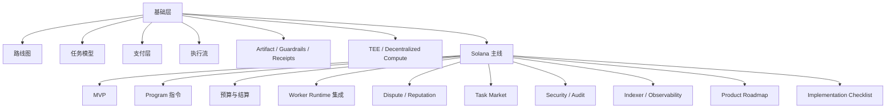

# 区块链专题总览

> 这一页是 `pi-mono × 区块链专题` 的总入口：用最短的篇幅说明这个专题解决什么问题、适合谁读、推荐从哪里开始读。

---

## 1. 这个专题解决什么问题

这个专题关注的是：

> **如何把 `pi-mono` / `pi-worker` 作为链下 Agent Runtime，与 Solana 等区块链上的任务、支付、权限、声誉、结算系统结合起来。**

它讨论的不是“把 Agent 直接塞进链上运行”，而是：
- 链下执行如何与链上状态协同
- 任务系统如何建模
- LLM token 成本如何计费与结算
- result / artifact / manifest / receipt 如何形成可审计链路
- worker 市场、声誉、dispute、guardrails 如何逐步建立

---

## 2. 这个专题不解决什么问题

为了保持聚焦，本专题暂时不重点展开：

- 完整 Sui 平行实现路线
- 完整 EVM 协议草案
- 具体 Rust / Anchor 代码实现
- 具体前端产品 UI 细节
- 完整仲裁网络机制
- 完整 TEE / attestation 工程接入细节

这些内容可以作为未来扩展，但当前主线优先围绕 **Solana-first** 设计展开。

---

## 3. 适合谁读

这套专题最适合以下几类读者：

### 3.1 协议/平台设计者
如果你在思考：
- 如何做链上任务市场
- 如何让 AI worker 与链上预算、结算协同
- 如何把 worker 系统做成一种可运营的协议

这套文档对你最有帮助。

### 3.2 `pi-mono` / `pi-worker` 扩展开发者
如果你在思考：
- 如何让 `pi-worker` 监听任务、生成 artifact、提交结果
- 如何把 runtime 与任务市场、支付层结合

这套文档也很适合。

### 3.3 研究 Agent economy 的工程师
如果你关心：
- x402 / MMP 在 Agent 里的角色
- verifiable artifact / receipt / attestation
- TEE / decentralized compute 与链上 market 的关系

这套专题能给你一个系统化结构。

---

## 4. 推荐阅读顺序

### 如果你只想快速理解全局

按这个顺序看：

1. [01-roadmap.md](./01-roadmap.md)
2. [03-llm-payment-layer.md](./03-llm-payment-layer.md)
3. [solana/09-solana-mvp-design.md](./solana/09-solana-mvp-design.md)
4. [solana/17-solana-product-roadmap.md](./solana/17-solana-product-roadmap.md)
5. [solana/18-solana-implementation-checklist.md](./solana/18-solana-implementation-checklist.md)

### 如果你想从协议角度真正落地

按这个顺序看：

1. [01-roadmap.md](./01-roadmap.md)
2. [02-task-models-solana-sui.md](./02-task-models-solana-sui.md)
3. [solana/10-solana-program-instructions.md](./solana/10-solana-program-instructions.md)
4. [solana/11-solana-budget-and-settlement.md](./solana/11-solana-budget-and-settlement.md)
5. [solana/13-solana-dispute-and-reputation.md](./solana/13-solana-dispute-and-reputation.md)
6. [solana/14-solana-task-market-and-worker-selection.md](./solana/14-solana-task-market-and-worker-selection.md)
7. [solana/15-solana-security-and-audit-checklist.md](./solana/15-solana-security-and-audit-checklist.md)

### 如果你更关注 runtime 和执行层

按这个顺序看：

1. [04-task-execution-flow.md](./04-task-execution-flow.md)
2. [05-verifiable-artifacts.md](./05-verifiable-artifacts.md)
3. [06-policy-and-guardrails.md](./06-policy-and-guardrails.md)
4. [08-verifiable-receipts-and-attestation.md](./08-verifiable-receipts-and-attestation.md)
5. [solana/12-solana-worker-runtime-integration.md](./solana/12-solana-worker-runtime-integration.md)
6. [solana/16-solana-indexer-and-observability.md](./solana/16-solana-indexer-and-observability.md)

---

## 5. 专题结构总览

---

## 6. 当前主线结论

到目前为止，本专题已经明确形成一个判断：

### 6.1 最现实的路径不是“把 Agent 上链”
而是：
- `pi-worker` 保持链下执行
- Solana 负责任务、预算、结算、声誉、争议

### 6.2 最先该做的不是开放市场
而是：
- 最小闭环
- artifact bundle
- cost summary
- settlement 闭合
- observability

### 6.3 支付层是关键分水岭
没有：
- usage receipt
- budget
- settlement
- x402 / MMP 这类 payment rail

系统最终只能停留在任务编排层，而不是完整的 Agent 经济层。

---

## 7. 如何使用这套文档

推荐把这套专题当成：

- 架构白皮书
- 协议讨论底稿
- roadmap 评审材料
- backlog 拆解基础
- 与实现代码并行的设计文档

换句话说：

> 这不是“看完就结束”的文档，而是可以直接拿来指导 issue 拆解、Milestone 设计和实现顺序的专题手册。

---

## 8. 一句话总结

**这套区块链专题的核心，不是把 `pi-mono` 当成一个链上合约系统，而是把它视作“链下 Agent Runtime + 链上任务/预算/结算/声誉系统”的组合；阅读这套文档的最好方式，不是逐篇孤立看，而是沿着“基础层 → Solana 主线 → 产品落地”的顺序，把它当成一套逐步收敛的系统设计集。**
