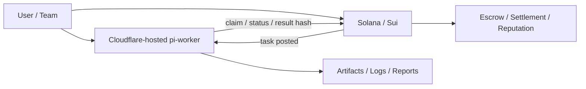
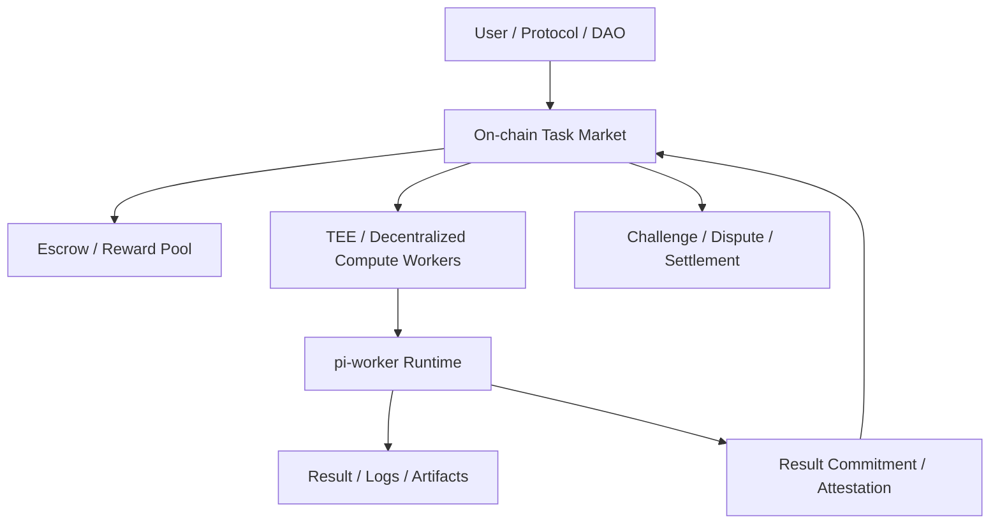
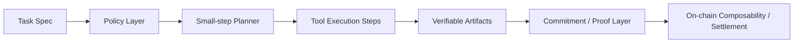

# pi-mono 与区块链结合路线图

> 面向开发者、协议团队、链上自动化系统设计者的实践草案。

本文讨论的不是“把 pi-mono 直接部署到链上运行”，而是：如何把 `pi-mono` / `pi-worker` 作为 **链下 Agent Runtime**，与 Solana、Sui 等区块链的任务、支付、权限、声誉与审计系统结合。

---

## 1. 先澄清：什么能上链，什么不能上链

### 1.1 不能直接上链运行的部分

`pi-mono` / `pi-worker` 这类系统通常依赖：
- 外部 LLM API
- 文件系统
- 工具调用
- 长时间运行的 Agent loop
- 网络 I/O 与外部资源读取

而 Solana / Sui 链上程序强调：
- 确定性执行
- 严格计算限制
- 无自由文件系统
- 无任意外部网络访问

**结论**：
- 区块链不适合直接充当 `pi-worker` 的执行宿主
- 更适合充当 **协调层 / 结算层 / 权限层 / 状态层**

### 1.2 最合理的组合方式

```text
pi-worker / pi-mono runtime    -> 链下执行
Solana / Sui                   -> 任务登记、支付结算、权限控制、声誉状态
对象存储 / 日志 / Artifact      -> 链下存储 + 链上 commitment
```

---

## 2. 路线 1：务实版（Cloudflare / 云执行 + 链上状态）

### 2.1 目标

保留现有 `pi-worker` 在 Cloudflare 或普通云环境运行，优先利用区块链做：
- 任务登记
- 支付结算
- 权限控制
- worker staking / reputation

### 2.2 参考架构



### 2.3 典型任务模型

链上维护：
- `Task`
- `Worker`
- `Escrow`
- `Policy`
- `Reputation`

链下 worker 负责：
- 领取任务
- 运行 Skill / Extension / prompts
- 产出 artifact（报告、代码补丁、摘要、HTML playground）
- 回写结果 hash 或 URL

### 2.4 适合最先落地的场景

1. **文档/代码分析型任务**
   - 审查报告
   - 代码迁移建议
   - 区块链协议阅读摘要

2. **链上操作前的分析型任务**
   - 钱包持仓分析
   - 协议风险提示
   - Swap / Bridge / Lend 路径建议

3. **开发团队 bounty / task board**
   - 用链上任务登记和支付，worker 做执行

### 2.5 优点

- 实现难度最低
- 不需要重写 `pi-worker`
- 能最快验证“链上任务市场 + agent 执行”的可行性

### 2.6 风险与限制

- 结果验证仍然偏人工或脚本验收
- worker 运行环境仍中心化
- 任务结果可信度取决于日志、审查与声誉系统

---

## 3. 路线 2：Web3-native 版（TEE / 去中心化计算层 + 链上协调）

### 3.1 目标

将 `pi-worker` 从普通云环境迁移到：
- TEE 网络
- 去中心化计算网络
- 更接近“开放 worker 网络”的运行平面

同时让 Solana / Sui 负责：
- task market
- escrow
- result commitment
- challenge / dispute

### 3.2 参考架构



### 3.3 这一路线解决什么问题

相比路线 1，这里重点不是“能不能跑”，而是：
- 谁来运行 worker？
- 结果是否可以被证明或挑战？
- 是否可以弱化中心化平台依赖？

### 3.4 更适合的链上角色

#### Solana 更适合
- 高频任务状态更新
- 低成本 escrow / reputation 变更
- bot / automation 生态接入

#### Sui 更适合
- 使用对象模型表达任务生命周期
- `Task Object` / `Claim Object` / `Result Object` / `Policy Object`
- 多角色协作状态更容易建模

### 3.5 链上最小对象 / 账户模型

无论是 Solana 账户模型还是 Sui 对象模型，都建议最少包含：
- `Task`
- `WorkerIdentity`
- `Claim`
- `Escrow`
- `ResultCommitment`
- `Reputation`
- `Dispute`

### 3.6 风险与难点

1. **可信执行问题**
   - 模型版本、prompt、skill、tool 是否一致？
2. **结果验证问题**
   - 文本/代码类任务天然难验证
3. **成本问题**
   - 链上状态变更过多会抬高成本
4. **隐私问题**
   - worker 可能接触私有仓库、密钥、内部文档

### 3.7 适合的任务类型

- 可通过测试脚本验收的代码任务
- 有结构化结果的分析任务
- 风险提示 + 多方审核类任务
- 链上策略执行前的多阶段审查任务

---

## 4. 路线 3：研究版（更接近链上可组合）

### 4.1 目标

研究如何将 `pi-worker` 的执行过程拆解为：
- deterministic small steps
- verifiable artifacts
- policy-checked execution

从而让 agent 系统更接近“链上可组合组件”，而不是一个巨大的黑箱 worker。

### 4.2 为什么这一步最难

`pi-worker` 当前通常是：
- 多轮对话
- 外部模型推理
- 非确定性输出
- 工具调用链动态展开

这与链上可组合系统追求的：
- 可重放
- 可验证
- 可审计
- 可约束状态转移

有天然张力。

### 4.3 可研究的三个拆分方向

#### 方向 A：deterministic small steps

把 agent 执行拆成更小的状态转换：
- 任务读取
- 技能解析
- 工具计划
- 工具执行
- 结果归档

每一步都产生日志与状态摘要。

#### 方向 B：verifiable artifacts

将真正“可被外界校验”的内容抽出来：
- diff / patch hash
- 测试结果
- 构建产物 hash
- 结构化 JSON 结论
- HTML playground / report hash

链上不记录全文，只记录承诺。

#### 方向 C：policy-checked execution

引入严格策略层：
- 哪些工具能调用
- 哪些目录能改
- 哪些链上地址能交互
- 哪些金额上限允许执行
- 哪些结果需要人工签字确认

### 4.4 研究版参考架构



### 4.5 研究版的价值

一旦走到这一步，`pi-worker` 就不再只是“链下帮你干活的 AI worker”，而更像：
- 可嵌入链上工作流的 agent primitive
- 可审计的自动化执行器
- 可组合的策略引擎

### 4.6 研究版的现实限制

- 对现有 `pi-worker` 架构改动最大
- 对 prompt / skill / tool 版本管理要求极高
- 对日志、artifact、验证层设计要求极高
- 需要长期迭代，不适合作为第一阶段商业落地方案

---

## 5. 三条路线的递进关系

| 路线 | 运行面 | 链上职责 | 难度 | 适合阶段 |
|------|--------|----------|------|----------|
| 路线 1：务实版 | Cloudflare / 普通云 | 任务、支付、权限、声誉 | 低 | MVP / 试点 |
| 路线 2：Web3-native | TEE / 去中心化计算层 | market、escrow、commitment、dispute | 中 | 平台化 |
| 路线 3：研究版 | 可拆解的 agent 执行层 | composability、proof、policy | 高 | 长期演进 |

建议按这个顺序推进，而不是一开始就追求“完全链上化”。

---

## 6. 对 Solana / Sui 的具体建议

### 6.1 Solana 更适合的部分

- 高频任务市场
- 快速结算与奖励发放
- DeFi / automation / bot 生态联动
- 主打性能和低费用的任务协调层

### 6.2 Sui 更适合的部分

- 面向对象的任务建模
- 多阶段工作流对象化
- Worker / Task / Claim / Result 的结构化状态表达
- 更清晰的 capability / ownership 设计

### 6.3 如何选型

如果目标是：
- **更偏速度、bot、市场撮合** → 优先 Solana
- **更偏任务对象、权限对象、流程表达** → 优先 Sui

---

## 7. 对 pi-mono 本身的启发

这三条路线说明，`pi-mono` 如果要更好地服务区块链场景，可以重点强化：

1. **Skill 层**
   - 区块链协议知识
   - 钱包/权限/升级/部署 Runbook
   - 风险检查清单

2. **Extension 层**
   - 链上任务领取与状态回写
   - 任务 market SDK 集成
   - 支付与 reputational hooks

3. **Artifact 层**
   - 报告 hash
   - diff / patch hash
   - HTML playground / 架构图 / 流程图产物

4. **审计层**
   - 谁触发任务
   - 使用了哪些模型 / tools / skills
   - 最终产物与结果 commitment

---

## 8. 最终建议

### 如果现在就开始做

先走 **路线 1：务实版**。

理由：
- 最容易验证需求
- 不需要重写 runtime
- 能快速得到真实用户反馈
- 可以逐步为路线 2 / 3 积累任务模型、artifact 结构与 policy 设计

### 中期目标

当任务量、worker 数、激励机制和安全诉求上升后，再进入路线 2。

### 长期研究目标

将 `pi-worker` 逐步拆为更可验证、可承诺、可策略约束的执行单元，为路线 3 做准备。

---

## 9. 一句话总结

**不要试图把 `pi-worker` 直接塞进 Solana / Sui 链上运行；应该把它作为链下 Agent Runtime，让链承担任务、支付、权限、声誉与可验证承诺的职责，并按“务实版 → Web3-native 版 → 研究版”逐步演进。**
