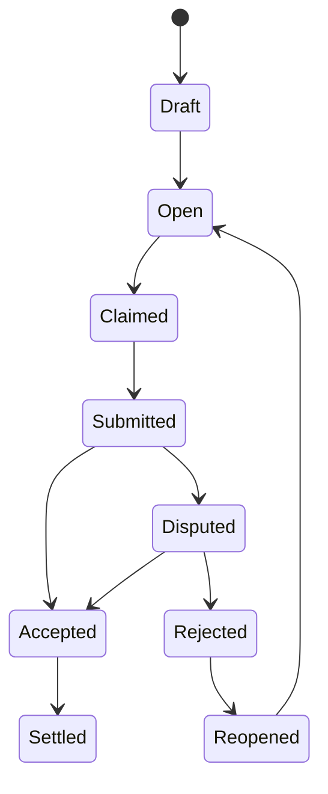

# Solana / Sui 任务模型草案

> 作为《区块链结合路线图》的进一步细化：把 `pi-worker` / `pi-mono` 接入链上任务系统时，任务、认领、结果、支付与争议应该如何建模。

本文不讨论具体合约代码，而讨论一套适合 MVP 到平台化逐步演进的任务模型。

---

## 1. 设计目标

我们希望这套模型满足：

1. **链下执行，链上协调**
   - `pi-worker` 继续在链下运行
   - 链上只保存必要状态与承诺

2. **任务生命周期清晰**
   - 发布
   - 认领
   - 执行
   - 提交结果
   - 验收/争议
   - 结算

3. **支持未来演进**
   - 从人工验收逐步演进到脚本验收、承诺验证、挑战机制

4. **兼容 `pi-mono` 的 artifact 输出**
   - 报告
   - 补丁
   - JSON 结构化结果
   - HTML playground
   - 测试结果摘要

---

## 2. 最小统一任务生命周期

无论 Solana 还是 Sui，都建议先统一抽象出如下状态机：

### 状态说明

- `Draft`：任务尚未公开，创建方可修改
- `Open`：任务已发布，任何符合条件的 worker 可认领
- `Claimed`：某个 worker 正在执行
- `Submitted`：worker 已提交结果，等待验收
- `Accepted`：结果通过验收
- `Disputed`：发起争议或复核
- `Rejected`：结果被拒绝
- `Settled`：奖励结算完成
- `Reopened`：任务重新开放

---

## 3. 统一对象模型（概念层）

建议从 7 类核心对象/账户出发：

1. `Task`
2. `WorkerIdentity`
3. `Claim`
4. `Escrow`
5. `ResultCommitment`
6. `Reputation`
7. `Dispute`

---

## 4. `Task` 结构草案

### 建议字段

| 字段 | 类型 | 说明 |
|------|------|------|
| `taskId` | string / bytes | 唯一任务 ID |
| `creator` | address | 任务创建者 |
| `title` | string | 标题 |
| `category` | enum | 任务类型 |
| `specUri` | string | 任务说明文档或离线描述 |
| `inputCommitment` | bytes32 | 输入内容哈希（可选） |
| `rewardToken` | address / type | 奖励资产 |
| `rewardAmount` | uint / balance | 奖励金额 |
| `requiredStake` | uint | 认领该任务的最小 stake |
| `policyId` | string / object ref | 风险控制策略 |
| `status` | enum | 当前状态 |
| `deadline` | timestamp | 截止时间 |
| `acceptanceMode` | enum | 人工验收 / 脚本验收 / 仲裁 |
| `createdAt` | timestamp | 创建时间 |
| `updatedAt` | timestamp | 更新时间 |

### 建议任务分类

- `analysis`
- `code_patch`
- `report`
- `review`
- `chain_operation_plan`
- `playground_generation`
- `runbook_execution`

这些类型都和 `pi-worker` / `pi-mono` 输出天然兼容。

---

## 5. `WorkerIdentity` 结构草案

### 作用

表示一个可领取任务的 worker 身份，负责承载：
- staking
- version 信息
- 支持能力声明
- reputation 绑定

### 建议字段

| 字段 | 类型 | 说明 |
|------|------|------|
| `workerId` | string | worker 唯一标识 |
| `owner` | address | 控制该 worker 的钱包地址 |
| `runtimeType` | enum | cloudflare / tee / self-hosted / decentralized |
| `runtimeVersion` | string | worker 版本 |
| `piVersion` | string | pi / pi-worker 版本 |
| `supportedTaskTypes` | array | 支持的任务类别 |
| `stakeAmount` | uint | 当前 stake |
| `reputationScore` | uint | 声誉分 |
| `metadataUri` | string | 描述文件 |

---

## 6. `Claim` 结构草案

### 作用

一个任务被认领时，不建议直接把 worker 地址写进 `Task` 就结束，而是单独建 `Claim`，这样后续更容易扩展：
- 超时处理
- 中途放弃
- 多 worker 竞争
- 挑战者机制

### 建议字段

| 字段 | 类型 | 说明 |
|------|------|------|
| `claimId` | string | 唯一 ID |
| `taskId` | string | 对应任务 |
| `workerId` | string | 认领者 |
| `claimedAt` | timestamp | 认领时间 |
| `expireAt` | timestamp | 超时时间 |
| `status` | enum | active / expired / submitted / cancelled |
| `executionManifestUri` | string | 本次执行清单 |

---

## 7. `ResultCommitment` 结构草案

### 作用

链上通常不存完整结果，而是存：
- 哈希
- 结果地址
- 关键结构化摘要

### 建议字段

| 字段 | 类型 | 说明 |
|------|------|------|
| `resultId` | string | 结果唯一标识 |
| `taskId` | string | 对应任务 |
| `claimId` | string | 对应认领 |
| `artifactUri` | string | 外部结果地址 |
| `artifactHash` | bytes32 | 结果哈希 |
| `summaryHash` | bytes32 | 摘要哈希 |
| `resultType` | enum | report / patch / json / html / mixed |
| `submittedAt` | timestamp | 提交时间 |
| `attestationUri` | string | TEE / 签名 / 证明材料 |

### 对应 `pi-worker` 常见 artifact

- Markdown 报告
- Git patch / diff
- JSON 结构化结论
- HTML playground
- 测试结果文件
- 日志摘要

---

## 8. `Escrow` 与结算模型

### 为什么需要 Escrow

如果没有 escrow：
- 创建者可能不给钱
- worker 可能交付后拿不到报酬
- dispute 没有缓冲机制

### 建议最小字段

| 字段 | 类型 | 说明 |
|------|------|------|
| `escrowId` | string | 唯一 ID |
| `taskId` | string | 关联任务 |
| `token` | address / type | 奖励币种 |
| `amount` | uint | 奖励总额 |
| `feeAmount` | uint | 平台/仲裁费 |
| `state` | enum | funded / locked / released / refunded |

### 建议结算流程

1. 创建者发布任务并注资 escrow
2. worker 认领并执行
3. 提交结果
4. 验收通过 → 释放 escrow
5. 若 dispute → 暂停释放，等待裁决

---

## 9. `Reputation` 设计

### 最小目标

MVP 阶段不要把 reputation 做太复杂，先支持：
- 完成数
- 被拒绝数
- dispute 胜率
- 平均响应时间

### 建议字段

| 字段 | 类型 | 说明 |
|------|------|------|
| `workerId` | string | 对应 worker |
| `completedTasks` | uint | 完成任务数 |
| `acceptedResults` | uint | 验收通过数 |
| `rejectedResults` | uint | 验收拒绝数 |
| `disputeWins` | uint | 争议胜出数 |
| `slashCount` | uint | 被惩罚次数 |
| `score` | uint | 聚合声誉分 |

### 不建议一开始就做的事

- 复杂代币加权
- 多维评分系统
- 过度主观的文本评价直接上链

建议先从简单可计算指标开始。

---

## 10. `Dispute` 设计

### 为什么必须预留

只要任务结果不是完全可自动验证，争议就是必然存在的。

### 建议字段

| 字段 | 类型 | 说明 |
|------|------|------|
| `disputeId` | string | 唯一 ID |
| `taskId` | string | 对应任务 |
| `resultId` | string | 对应结果 |
| `openedBy` | address | 发起者 |
| `reasonUri` | string | 争议说明 |
| `status` | enum | open / reviewing / resolved |
| `resolution` | enum | accept / reject / partial |

### 最小 dispute 模式

MVP 可以先走：
- 创建者可 dispute
- 指定 reviewer / multisig 决定
- 结果决定 escrow 释放或退款

---

## 11. Solana 版建议

### 11.1 适合 Solana 的原因

- 状态更新快
- 手续费低
- bot / worker 场景天然匹配
- 适合频繁任务领取与状态同步

### 11.2 Solana 上的推荐设计方式

可使用 PDA / account 做：
- `TaskAccount`
- `WorkerAccount`
- `ClaimAccount`
- `EscrowVault`
- `ResultAccount`
- `ReputationAccount`
- `DisputeAccount`

### 11.3 更适合的使用场景

- 高频 task market
- 自动化任务 / keeper-like worker
- 偏市场撮合与奖励分发的系统

### 11.4 注意点

- account 数量与 rent 成本
- artifact 不能直接塞链上，要放链下存储 + hash
- 复杂 dispute 流程要控制 instruction 数量

---

## 12. Sui 版建议

### 12.1 适合 Sui 的原因

Sui 的对象模型很适合表达任务工作流：
- `Task` 是对象
- `Claim` 是对象
- `Result` 是对象
- `Escrow` 是对象
- `Policy` 是 capability / object reference

### 12.2 推荐对象设计

- `TaskObject`
- `WorkerObject`
- `ClaimObject`
- `ResultObject`
- `EscrowObject`
- `DisputeObject`
- `PolicyObject`

### 12.3 更适合的使用场景

- 流程状态复杂的任务系统
- 面向对象的权限与能力控制
- 多角色协同（creator / worker / reviewer / arbiter）

### 12.4 注意点

- 对象数量管理
- 权限对象设计要清晰
- 不要在早期把对象图做得过度复杂

---

## 13. 与 `pi-worker` / `pi-mono` 的接入点

### 13.1 Worker 领取任务时

建议记录一份 `execution manifest`：
- 使用的模型
- 使用的 skill 名称与版本
- 使用的 extension 名称与版本
- 关键 prompt 模板版本
- 工具权限配置

### 13.2 提交结果时

建议至少提交：
- `artifactUri`
- `artifactHash`
- `summaryHash`
- `resultType`
- `executionManifestUri`

### 13.3 为什么这很重要

这决定了系统能否进一步演进到：
- challenge / dispute
- 结果可审计
- 长期 reputation
- 研究版的可验证 artifact 路线

---

## 14. MVP 建议：先实现哪些字段和状态

### 最小可运行版本

先做：
- `Task`
- `WorkerIdentity`
- `Claim`
- `Escrow`
- `ResultCommitment`

并支持这些状态：
- `Open`
- `Claimed`
- `Submitted`
- `Accepted`
- `Rejected`
- `Settled`

### 暂时不急着做

- 复杂声誉公式
- 多层 dispute 流程
- 证明系统
- fully verifiable execution

---

## 15. 推荐推进顺序

### 第一阶段
- 任务发布
- 任务认领
- 结果提交
- 人工验收
- escrow 结算

### 第二阶段
- reputation
- timeout / reopen
- dispute
- 多 worker 策略

### 第三阶段
- attestation
- verifiable artifacts
- policy-checked execution
- 对接研究版路线

---

## 16. 一句话总结

**无论是 Solana 还是 Sui，最重要的不是“把 agent 塞上链”，而是先把 `Task / Claim / Result / Escrow / Reputation / Dispute` 这组最小任务模型设计清楚，让 `pi-worker` 作为链下执行器稳定接入，并为后续可验证与可组合演进留足空间。**
