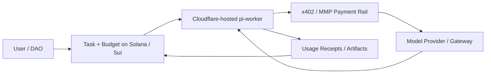
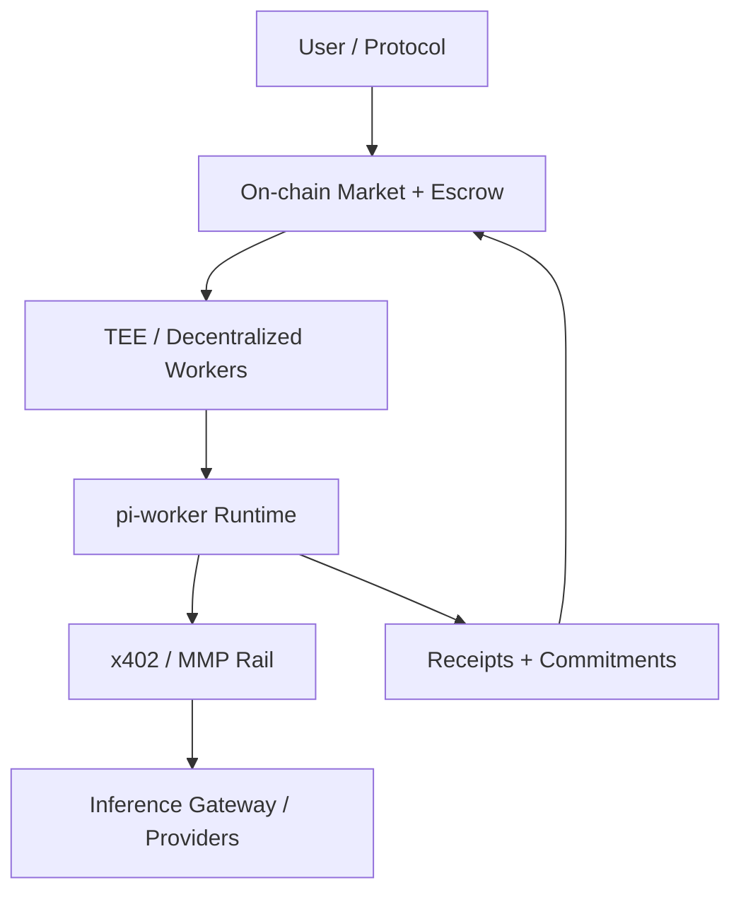
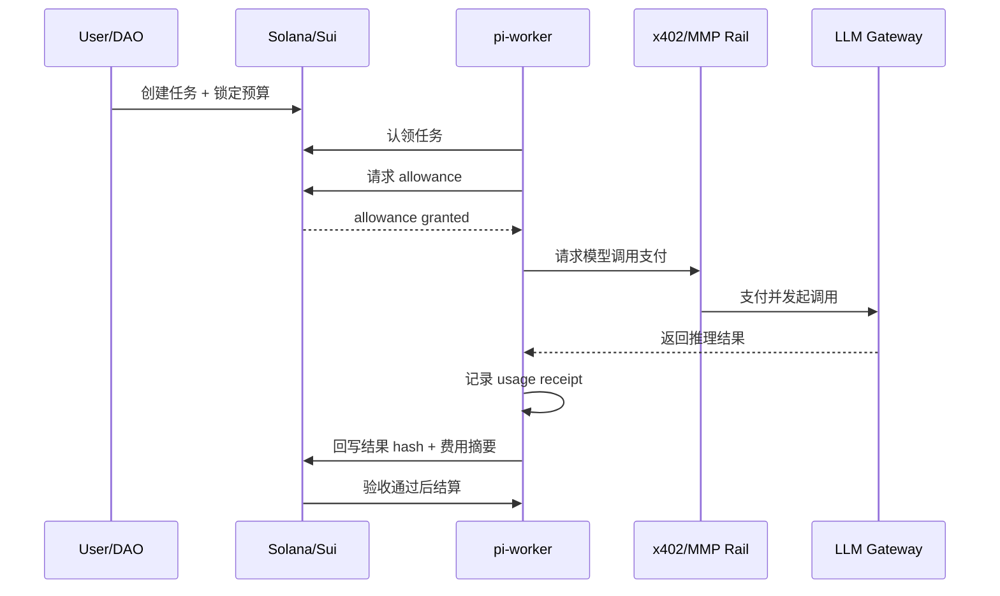

# 区块链 + Agent 的 LLM 支付层设计

> 面向 `pi-worker` / `pi-mono` 与区块链结合场景的支付与清算层草案。

本文讨论的重点不是“任务怎么发”，而是：**当 Agent 真正调用大模型、消耗 token、使用外部工具时，这些成本如何被支付、限额、归因、审计与清算。**

这也是 `pi-worker + blockchain` 能否形成完整经济闭环的关键一层。

---

## 1. 为什么支付层是决定性问题

在链上任务系统里，任务发布和 worker 认领只是开始。真正会持续消耗现实成本的是：
- 输入 token
- 输出 token
- reasoning token
- 工具调用成本
- 外部 API 调用
- 存储 / 带宽 / 日志成本

如果不解决这些成本的支付方式，系统通常会退化为两种不理想模型：

### 模型 A：平台垫付
- 平台先为 Anthropic / OpenAI / Gemini 等模型账单买单
- 再想办法向用户追讨或订阅收费

问题：
- 资金压力大
- 风险高
- 与链上任务市场割裂

### 模型 B：用户自己配 API key
- 用户把 API key 直接交给 worker
- worker 用用户自己的模型额度执行任务

问题：
- onboarding 差
- 体验差
- 难以统一 worker 网络结算
- 不适合共享任务市场和自动化场景

**结论**：
- 任务系统解决的是“谁做事”
- 支付层解决的是“谁为 token 成本买单”

---

## 2. 双层费用模型：必须拆开看

建议把所有费用分成两层：

### 2.1 执行成本层（Execution Cost）

这是 worker 真正执行过程中产生的现实成本：
- LLM token 成本
- reasoning / thinking 成本
- 第三方 API 调用成本
- 工具运行资源成本
- 存储与 artifact 成本

### 2.2 市场激励层（Market Incentive）

这是任务系统的经济激励：
- worker 奖励
- 平台抽成
- 仲裁费用
- staking / slashing
- 声誉与保证金机制

### 2.3 为什么不能混在一起

如果把这两层混在一个“任务金额”里，会导致：
- 无法知道到底是模型贵，还是 worker 奖励高
- dispute 时难以拆分可退金额和不可退成本
- 无法做精细预算与限额控制

**建议**：链上与链下都应显式区分：
- `executionBudget`
- `workerReward`
- `platformFee`
- `refundAmount`

---

## 3. x402 / MMP 这类协议能解决什么

你提到的：
- `x402`
- Tempo 的 `MMP`（Machine-to-Machine Payment）

从架构角度看，它们最重要的作用不是“又一个支付方式”，而是提供：

### 3.1 机器到机器支付（M2M payment rail）

让 runtime / worker 可以直接向：
- 模型网关
- 推理服务
- 外部付费工具
- 子 agent 服务

按调用自动支付，而不需要人类在每次请求前手动确认。

### 3.2 用量驱动的自动结算

支持围绕以下单位计费：
- per request
- per token
- per streamed chunk
- per session allowance
- per task budget

### 3.3 预算与权限控制

与链上 policy 结合后，可以做到：
- 每个任务最大 token 预算
- 每个 worker 每日最大消耗
- 限定允许调用的 provider / model
- 超预算自动中止
- 特定任务只能使用低成本模型

---

## 4. 三条路线里的支付层位置

---

## 4.1 路线 1：务实版支付层

### 结构

- `pi-worker` 继续跑在 Cloudflare / 普通云
- Solana / Sui 管：
  - 任务
  - escrow
  - allowance
  - reputation
- x402 / MMP 管：
  - 模型调用支付
  - receipt
  - usage record

### 参考架构

### 最现实做法

1. 用户发布任务并锁定预算
2. worker 领取任务
3. worker 申请本任务的执行 allowance
4. 调用模型时通过支付协议逐次扣费
5. 任务结束后回写 usage receipts 与结算结果

### 适合 MVP 的原因

- 不需要重写 `pi-worker`
- 只需增加预算与 receipt 管理
- 可先从链上预算 + 链下支付开始

---

## 4.2 路线 2：Web3-native 版支付层

### 结构

- `pi-worker` 迁移到 TEE / 去中心化计算网络
- Solana / Sui 负责：
  - market
  - escrow
  - result commitment
  - challenge / dispute
- x402 / MMP 负责：
  - worker 节点与模型供应商的自动支付
  - 子 worker / 子 agent 间的自动结算

### 参考架构

### 与路线 1 的差异

- 路线 1 更像“云上的 worker + 链上预算”
- 路线 2 更像“开放 worker 网络 + 链上市场 + 自动机器支付”

### 更适合处理的问题

- worker 网络化
- 多 provider 动态调度
- 结果的可信度与审计
- 不同节点之间的结算

---

## 4.3 路线 3：研究版支付层

### 目标

把支付层进一步细化为：
- per-step accounting
- verifiable usage receipts
- policy-driven cost controls
- replayable settlement traces

### 研究问题

1. 每个 step 的 token 成本是否可归因？
2. subagent 花费如何被拆账？
3. 缓存命中是否应单独记账？
4. fallback model 的费用责任如何划分？
5. dispute 时，能否回放 usage trace？

### 研究版图示

这一路线最终追求的是：
- 不是“任务多少钱”
- 而是“每一步花了多少钱、为何合理、如何可验”

---

## 5. 账务对象模型建议

为了让支付层可实现，建议最少定义 5 类账务对象。

---

## 5.1 Budget

表示一个任务可使用的总预算。

### 建议字段

| 字段 | 类型 | 说明 |
|------|------|------|
| `budgetId` | string | 预算 ID |
| `taskId` | string | 所属任务 |
| `currency` | token / stablecoin | 使用的结算币种 |
| `maxExecutionCost` | uint | 最大执行成本 |
| `maxWorkerReward` | uint | 最大 worker 奖励 |
| `maxPlatformFee` | uint | 最大平台费用 |
| `spentExecutionCost` | uint | 已消耗执行成本 |
| `spentWorkerReward` | uint | 已消耗 worker 奖励 |
| `status` | enum | active / exhausted / settled |

---

## 5.2 Allowance

表示某个 worker 或某个任务执行回合可以临时使用的额度。

### 建议字段

| 字段 | 类型 | 说明 |
|------|------|------|
| `allowanceId` | string | allowance ID |
| `budgetId` | string | 对应预算 |
| `workerId` | string | 可使用该额度的 worker |
| `providerScope` | array | 允许调用的 provider / gateway |
| `modelScope` | array | 允许调用的模型 |
| `maxAmount` | uint | 最多可使用金额 |
| `expiresAt` | timestamp | 失效时间 |

---

## 5.3 UsageReceipt

这是支付层最关键的结构之一，用来承载每次模型调用或外部计费动作的账单凭证。

### 建议字段

| 字段 | 类型 | 说明 |
|------|------|------|
| `receiptId` | string | 凭证 ID |
| `taskId` | string | 所属任务 |
| `workerId` | string | 执行 worker |
| `provider` | string | 模型供应商 |
| `model` | string | 模型名 |
| `inputTokens` | uint | 输入 token |
| `outputTokens` | uint | 输出 token |
| `cachedTokens` | uint | 命中缓存的 token |
| `unitPrice` | decimal | 单价 |
| `totalCost` | decimal | 总成本 |
| `requestHash` | bytes32 | 请求承诺 |
| `timestamp` | timestamp | 时间戳 |
| `paymentReceiptUri` | string | 外部支付回执 |

### 为什么 `cachedTokens` 重要

如果未来要做 prompt caching / cost optimization，就必须区分：
- 真正新增成本的 token
- 被缓存复用、成本更低或免重复计算的 token

---

## 5.4 SettlementRecord

任务结束后，需要把 execution cost 和 market incentive 汇总结算。

### 建议字段

| 字段 | 类型 | 说明 |
|------|------|------|
| `settlementId` | string | 结算 ID |
| `taskId` | string | 所属任务 |
| `executionCostTotal` | uint | 执行成本总额 |
| `workerRewardTotal` | uint | worker 奖励 |
| `platformFeeTotal` | uint | 平台费用 |
| `refundAmount` | uint | 退款金额 |
| `status` | enum | pending / final / disputed |

---

## 5.5 Policy

支付层必须受策略约束，否则系统会迅速失控。

### 建议字段

| 字段 | 类型 | 说明 |
|------|------|------|
| `policyId` | string | 策略 ID |
| `allowedProviders` | array | 允许的 provider |
| `allowedModels` | array | 允许的模型 |
| `maxSingleCallCost` | uint | 单次最大费用 |
| `maxTaskCost` | uint | 单任务最大费用 |
| `allowFallbackModel` | bool | 是否允许 fallback |
| `allowHighReasoningMode` | bool | 是否允许高思考级别 |
| `manualApprovalThreshold` | uint | 超过阈值需人工确认 |

---

## 6. `pi-worker` / `pi-mono` 要补哪些能力

为了支持这套支付层，运行时至少要补以下能力：

### 6.1 usage accounting
- 能按 provider / model / request 记录 token 使用量
- 能归因到 task / worker / claim / subagent

### 6.2 budget enforcement
- 发起请求前检查预算
- 超预算立刻中止或降级模型
- fallback 前检查 policy

### 6.3 receipt persistence
- 保存 usage receipts
- 保存支付回执 / settlement trace
- 保存 manifest 与结果 hash 的映射关系

### 6.4 provider abstraction
- 不把支付逻辑写死在某个 provider SDK 里
- 应有统一支付中间层，便于：
  - x402
  - MMP
  - 未来其他 M2M 支付协议

---

## 7. 一个最小支付工作流

---

## 8. 失败与争议时怎么处理费用

这是支付层里最容易被忽略的问题。

### 8.1 失败请求

如果模型调用失败：
- 有些成本可能已产生
- 有些请求可能应部分收费
- 有些请求可重试

建议：
- `UsageReceipt` 中保留状态字段（success / failed / partial）
- settlement 时区分可退与不可退部分

### 8.2 重试成本

重试不能默认免费。

建议策略：
- `maxRetries` 进入 policy
- 记录每次重试的 receipt
- dispute 时可回放“为什么产生这些额外成本”

### 8.3 多模型 fallback

如果高质量模型失败或超预算，是否允许 fallback 到低价模型？

建议：
- fallback 是否允许由 policy 控制
- fallback 发生时记录 reason
- settlement 中单独标记 fallback usage

---

## 9. 推荐推进顺序

### 第一阶段：先把账记清楚

先做：
- Budget
- Allowance
- UsageReceipt
- SettlementRecord
- Policy

即便没有 x402 / MMP 真正落地，也先把账务模型抽象出来。

### 第二阶段：接入支付 rail

把模型调用支付改为：
- allowance 驱动
- receipt 驱动
- 任务结束统一 reconcile

### 第三阶段：接入 challenge / dispute

让争议不只针对“结果是否正确”，也针对：
- 成本是否合理
- 重试是否过多
- fallback 是否违规
- 是否违反 policy

---

## 10. 对三条路线的最终影响

### 路线 1：务实版
- 先用链上预算 + 链下 receipt + 普通支付网关
- 最容易落地

### 路线 2：Web3-native
- 使用 x402 / MMP 作为开放 worker 网络的支付轨道
- 让模型调用也进入机器经济闭环

### 路线 3：研究版
- step-level metering + verifiable receipts + policy-checked settlement
- 向“可审计、可组合的 Agent 经济系统”演进

---

## 11. 一句话总结

**在 `pi-worker + blockchain` 体系里，任务市场解决“谁接活”，而 x402 / MMP 这类支付协议解决“谁为每一个 token 买单、如何自动结算、如何做预算与审计”。没有支付层，链上 Agent 只是在协调任务；有了支付层，才可能形成真正的 Agent 经济系统。**
