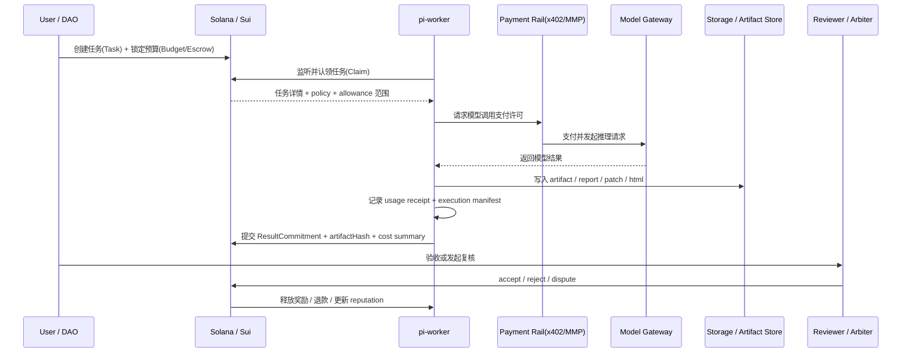

# pi-worker 链上任务执行时序

> 将路线图、任务模型与支付层串起来，描述一次完整链上任务从创建到结算的执行流。

这篇文档回答的问题是：

- 用户如何发任务？
- worker 如何领取并运行 `pi-worker`？
- LLM token 成本如何计费？
- artifact / result hash 如何提交？
- 验收、争议、结算如何闭环？

---

## 1. 全局视角

一次完整任务通常经过 8 个阶段：

1. 任务创建
2. 预算锁定
3. worker 认领
4. 任务执行
5. 模型/工具成本计费
6. 结果提交
7. 验收 / 争议
8. 结算 / 退款 / 声誉更新

---

## 2. 总时序图



---

## 3. 阶段 1：任务创建

### 目标

任务创建方（个人、团队、DAO、协议）把“要做什么”与“最多愿意花多少钱”一起提交。

### 链上写入内容

最小应包含：
- `Task`
- `Budget`
- `Escrow`
- `Policy`

### 关键问题

任务创建时不要只写一句自然语言描述，至少还要附带：
- `specUri`
- `category`
- `deadline`
- `acceptanceMode`
- `maxExecutionCost`
- `workerReward`

### 为什么这一步重要

如果任务说明和预算分离不清，后面就很难判断：
- worker 是否超预算
- 结果是否符合原始目标
- 哪部分费用可退

---

## 4. 阶段 2：预算锁定

### 核心原则

在 worker 认领之前，预算必须已经锁定。

### 原因

否则 worker 会面临：
- 做完了拿不到钱
- 执行过程中没有支付额度
- 争议时没有缓冲资金池

### 预算的最小拆分建议

建议拆为：
- `executionBudget`
- `workerReward`
- `platformFee`
- `refundBuffer`

### 不建议的做法

不要只设置一个总金额，例如：
- “这个任务总共 100 USDC”

因为你无法知道：
- 80 是模型调用费，还是 80 是 worker 奖励
- dispute 时哪些钱该退，哪些成本已不可逆发生

---

## 5. 阶段 3：worker 认领

### 认领时应检查什么

worker 在领取任务前，应先检查：
- `supportedTaskTypes`
- `requiredStake`
- `policyId`
- `deadline`
- 当前预算是否足够

### 认领成功后建议记录

生成一份 `execution manifest`，至少包括：
- worker version
- pi / pi-worker version
- 支持的 task type
- 计划使用的 skill / extension
- 计划使用的 provider / model 范围

### 认领后的状态

链上：
- `Task.status = Claimed`
- 创建 `Claim`
- 设置 `expireAt`

这样就有超时回收和重开任务的空间。

---

## 6. 阶段 4：任务执行

### 执行本质

`pi-worker` 在链下执行，通常会：
- 读取任务 spec
- 加载对应 skill / extension / prompt template
- 进行多轮推理
- 调用工具
- 生成 artifact

### 典型 artifact

- Markdown 报告
- JSON 结构化结果
- Git patch / diff
- HTML playground
- 测试结果摘要
- 审计日志

### 最重要的要求

执行过程中必须做到：
- **可归因**：每次模型调用都能归因到任务与 worker
- **可追踪**：结果与 manifest / receipt 能串起来
- **可限额**：调用前受预算与 policy 约束

---

## 7. 阶段 5：模型 / 工具成本计费

### 为什么单独成阶段

这一步虽然发生在执行过程中，但应当被视为一个独立账务子系统。

### 最小支付循环

1. worker 发起模型请求前检查预算
2. worker 向 x402 / MMP rail 请求支付许可
3. rail 向模型网关支付并完成调用
4. worker 接收结果
5. 记录 `UsageReceipt`

### 每次调用至少要记录

- provider
- model
- inputTokens
- outputTokens
- cachedTokens
- totalCost
- requestHash
- taskId
- workerId
- timestamp

### 如果失败怎么办

失败调用不能悄悄吞掉，必须：
- 记 failed / partial receipt
- 标记是否可重试
- 在 settlement 时区分已发生与未发生费用

---

## 8. 阶段 6：结果提交

### 链上不应该存什么

不应该直接把完整报告或大段 patch 塞进链上。

### 建议提交内容

链上建议只写：
- `ResultCommitment`
- `artifactUri`
- `artifactHash`
- `summaryHash`
- `resultType`
- `executionManifestUri`
- cost summary

### 为什么要有 `summaryHash`

因为未来 dispute / challenge 时：
- 不一定要下载所有大文件
- 可以先验证摘要承诺是否一致

---

## 9. 阶段 7：验收 / 争议

### MVP 版建议

最开始建议走：
- 人工验收
- 多签 reviewer
- dispute 可开启

### 验收路径

#### 成功验收
- `Submitted -> Accepted`
- 触发结算

#### 发起争议
- `Submitted -> Disputed`
- reviewer / arbiter 介入

#### 验收拒绝
- `Submitted -> Rejected`
- 可选择 reopen 或退款

### 争议期最关键的检查对象

- artifact 是否与 hash 一致
- execution manifest 是否符合 policy
- usage receipt 是否异常
- 是否发生违规 fallback / 超预算 / 违规工具调用

---

## 10. 阶段 8：结算 / 退款 / 声誉更新

### 结算时至少要做三件事

1. 结算 execution cost
2. 结算 worker reward
3. 处理 refund / fee / slash / reputation

### 推荐结算顺序

```text
总预算
  -> 扣除真实 execution cost
  -> 扣除 worker reward
  -> 扣除 platform fee / arbitration fee
  -> 剩余金额退款
```

### 声誉更新建议

#### 验收通过
- `completedTasks += 1`
- `acceptedResults += 1`
- score 上升

#### 被拒绝
- `rejectedResults += 1`
- score 下降

#### 争议失败 / 违规执行
- `slashCount += 1`
- score 下降
- stake 可部分惩罚

---

## 11. 适合加入 `pi-worker` 的运行时能力

为了让这个时序真正成立，建议 `pi-worker` 运行时支持：

### 11.1 task-aware execution
- 每次运行知道自己属于哪个 `taskId` / `claimId`

### 11.2 cost-aware routing
- 能根据 budget / policy 选择模型
- 超预算时自动中止或降级

### 11.3 artifact discipline
- 所有输出有统一 artifact 目录与 hash 机制
- `report / patch / json / html` 产物规范化

### 11.4 manifest + receipt persistence
- manifest、usage receipt、result hash 三者可以关联查询

---

## 12. 三种常见失败路径

### 12.1 Worker 执行超时

处理建议：
- Claim 过期
- Task 重新开放
- 可保留部分 usage trace
- 根据 policy 决定是否补偿或惩罚

### 12.2 模型费用耗尽

处理建议：
- 标记 budget exhausted
- 中断执行
- 提交 partial result（如果有价值）
- 由创建者追加预算或终止任务

### 12.3 结果不通过验收

处理建议：
- 进入 Rejected 或 Disputed
- 可允许 reopen
- 声誉扣分
- 按规则返还剩余预算

---

## 13. 从 MVP 到平台化的演进

### MVP
- 人工验收
- 云上 worker
- 链上预算 + escrow
- 链下 receipts

### 平台化
- 多 worker 网络
- reputation
- dispute
- x402 / MMP 自动支付

### 研究版
- step-level metering
- verifiable receipts
- policy-checked execution
- 更强 challenge / attestation

---

## 14. 一句话总结

**一次完整的 `pi-worker` 链上任务，不是“发任务 → 出结果”这么简单，而是“任务 → 预算 → 认领 → 执行 → 计费 → 提交 → 验收/争议 → 结算”的完整状态机；只有把这条时序串清楚，`pi-mono + blockchain` 才能从概念走向可落地系统。**
