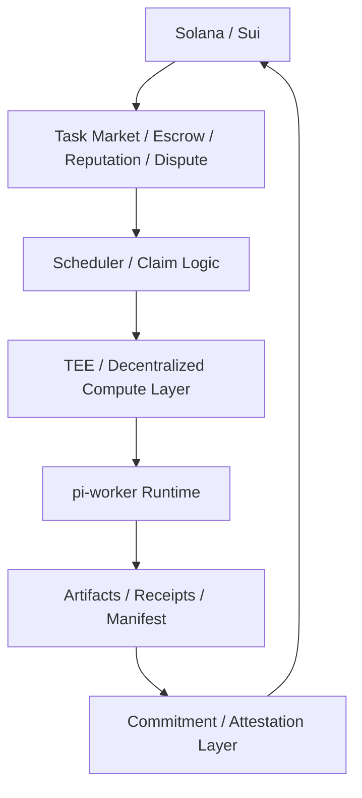

# TEE 与去中心化计算层

> 解释为什么 Solana / Sui 不适合直接托管 `pi-worker`，以及为什么路线 2 需要 TEE 或去中心化计算层来承接执行平面。

本文是区块链专题从“务实版”走向“Web3-native 版”的关键过渡文档。

---

## 1. 为什么链本身不是 worker 运行面

在讨论 `pi-worker + blockchain` 时，最容易出现的误解是：

> 能不能把 `pi-worker` 直接部署到 Solana / Sui 链上运行？

从系统特性上讲，答案是否定的。

### 1.1 `pi-worker` 需要的运行条件

`pi-worker` / `pi-mono` 这类 runtime 往往依赖：
- 长时间运行的 agent loop
- 外部 LLM API
- 文件系统和 artifact 输出
- 工具执行
- 外部网络 I/O
- 多轮上下文管理

### 1.2 Solana / Sui 链上程序的约束

链上程序强调：
- 确定性执行
- 有限计算预算
- 无自由文件系统
- 无任意外部网络访问
- 状态更新优先于通用计算

### 1.3 结论

因此，Solana / Sui 更适合承担：
- 任务协调
- 预算与 escrow
- 权限与 policy
- reputation / staking
- dispute / settlement

而不适合直接承担：
- 通用 agent runtime 执行
- 外部模型调用
- artifact 生产与管理

---

## 2. 为什么需要单独的“执行平面”

如果链上只负责协调与结算，就必须另有一层来真正运行：
- prompts
- skills
- tools
- model requests
- artifacts
- receipts

这层就是：

> **执行平面（execution plane）**

在路线 1 中，这个执行平面通常是：
- Cloudflare Workers
- 普通 VPS / 云容器
- 中心化 serverless

而路线 2 想解决的问题是：
- 如何让执行平面更开放、更可验证、更不依赖单点云平台？

于是就需要考虑：
- TEE
- decentralized compute
- worker network

---

## 3. TEE 能解决什么

TEE（Trusted Execution Environment）最重要的价值不是“更快”，而是：

### 3.1 可信执行边界

可以回答类似问题：
- 这个 worker 真的是在承诺的环境里跑的吗？
- 它是否使用了声明的程序版本？
- 它的执行结果是否来自一个可证明的运行上下文？

### 3.2 敏感数据处理

对于链下 worker 尤其重要，因为它可能接触：
- 私有仓库
- 内部文档
- 模型 API 凭据
- 策略配置
- 支付 allowance

TEE 可以提高这些信息在执行过程中的保护程度。

### 3.3 结果证明 / attestation

TEE 还可以让结果更容易进入：
- attestation
- commitment
- dispute
- stronger trust assumptions

这对路线 2 很关键。

---

## 4. 去中心化计算层能解决什么

去中心化计算层（decentralized compute layer）最重要的作用是：

### 4.1 开放 worker 网络

而不是只靠一个中心化平台跑所有任务。

它允许：
- 多个 worker 节点加入
- 节点按能力和 stake 接单
- 节点之间做任务分发和奖励结算

### 4.2 提供 Web3-native 的执行市场

链上 market 可以定义：
- 任务
- escrow
- reputation
- dispute

而去中心化计算层提供：
- 谁来跑这些任务
- 在什么环境里跑
- 结果如何回写

### 4.3 降低平台锁定

相比 Cloudflare / 中心化 worker hosting：
- 更开放
- 更可替换
- 更容易形成节点经济

当然，也会带来：
- 复杂度更高
- 网络质量参差不齐
- attestation / payment / scheduling 问题更复杂

---

## 5. 路线 1 与路线 2 的本质区别

### 路线 1：务实版

```text
链上：任务 / 预算 / reputation
链下：Cloudflare / 云 worker
```

特点：
- 快速落地
- 中心化执行
- 更像“链上任务市场 + SaaS worker”

### 路线 2：Web3-native 版

```text
链上：market / escrow / dispute / commitment
链下：TEE / decentralized worker network
```

特点：
- 更接近开放网络
- 执行面和经济层都 Web3-native
- 对 attestation / receipts / policy 的要求更高

---

## 6. `pi-worker` 在 TEE / 去中心化计算层里的角色

### 6.1 `pi-worker` 不是链本身的一部分

即使到了路线 2，`pi-worker` 仍然是：
- 链下 runtime
- 执行引擎
- artifact 生产者
- receipt 记录者

只是它不再跑在普通云里，而是跑在：
- 受信执行环境
- 开放节点网络
- 更受约束的执行平面

### 6.2 应当补的能力

如果要走这条路线，`pi-worker` 至少应进一步支持：
- execution manifest versioning
- artifact bundling
- usage receipt persistence
- policy-aware model/tool routing
- attestation metadata export

---

## 7. 推荐的分层结构



### 各层职责

#### 链层
- task
- budget
- escrow
- dispute
- settlement

#### 调度层
- 谁来认领任务
- 哪些 worker 符合要求
- 如何分配 allowance

#### 执行层
- 运行 `pi-worker`
- 提供算力、隔离、稳定性

#### 承诺层
- result commitment
- attestation
- usage summaries

---

## 8. 什么时候值得从路线 1 升级到路线 2

建议只有在以下条件逐渐成立时再升级：

1. worker 数量增加
2. 中心化 worker 成为瓶颈或信任问题
3. 用户开始关心 attestation 与 execution provenance
4. dispute / challenge 需求上升
5. 模型调用与支付已具备 receipt / budget / policy 基础

换句话说：

> 如果连预算、receipt、artifact、policy 都没打稳，就不要急着上 TEE / decentralized compute。

---

## 9. TEE / 去中心化执行层的主要难点

### 9.1 任务调度复杂度
- 哪个节点来接？
- 如何避免抢单与空转？
- 如何处理超时和失联？

### 9.2 结果可信度不等于结果正确性

TEE 可以证明“在某环境中运行过”，但不自动证明：
- prompt 合理
- 结果正确
- patch 无 bug
- 报告无误导

所以它需要与：
- artifact
- receipt
- dispute
- reviewer system

一起工作。

### 9.3 成本更高

相比普通云 worker：
- TEE 环境更贵
- 节点协调更复杂
- attestation / settlement 流程更重

---

## 10. 推荐推进顺序

### 第一阶段
- 继续用 Cloudflare / 普通云
- 完成 task / receipt / artifact / policy 基础层

### 第二阶段
- 选取高价值任务尝试 TEE 执行
- 输出 attestation metadata
- 与 result commitment 关联

### 第三阶段
- 逐步引入开放 worker 网络
- 用 stake / reputation / dispute 约束节点
- 向路线 2 完整形态演进

---

## 11. 一句话总结

**Solana / Sui 适合做 `pi-worker` 的协调、预算、支付、争议与结算层，但不适合直接做执行宿主；如果想走向更 Web3-native 的方向，就需要在链与 `pi-worker` 之间引入 TEE 或去中心化计算层，把它们作为真正的执行平面。**
