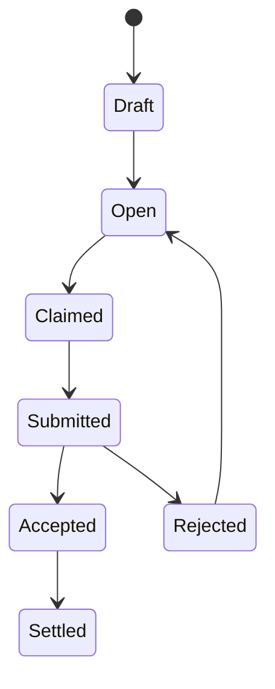

# Solana MVP 草案

> 基于前文路线图、任务模型、支付层与执行流，给出一个面向 Solana 的最小可运行版本（MVP）草案。

目标不是一开始就做成完整的开放 worker 网络，而是先做出：

- 可发布任务
- 可锁定预算
- 可由 `pi-worker` 领取任务
- 可提交结果承诺
- 可人工验收与结算
- 可为后续 reputation / dispute / x402 / MMP 扩展留出结构空间

---

## 1. MVP 目标

Solana 版 MVP 建议只回答 5 个问题：

1. 用户如何发布任务？
2. worker 如何领取任务？
3. 预算如何锁定与使用？
4. 结果如何提交与验收？
5. 结算如何完成？

### MVP 之外暂时不做

第一阶段不强求：
- TEE
- 去中心化 worker 网络
- 自动 dispute 仲裁
- 完整 attestation
- 复杂 reputation 公式
- 完整链上自动计费

这些都属于第二阶段或更后面的增强。

---

## 2. 为什么 MVP 先选 Solana

### 优点

Solana 适合作为第一条链的原因：
- 低费用、状态更新快
- 适合 task market / keeper / bot 场景
- 对高频认领和结算更友好
- 对后续 automation / DeFi / treasury worker 结合更自然

### 适合的任务类型

MVP 最适合支持：
- 分析报告
- 代码/文档 patch 建议
- 链上操作计划
- 风险提示
- HTML playground / 可视化说明产物

---

## 3. MVP 的最小角色模型

建议先有 4 类角色：

### 3.1 Task Creator
- 创建任务
- 提供预算
- 审核结果
- 最终验收 / 拒绝

### 3.2 Worker Operator
- 运行 `pi-worker`
- 领取任务
- 提交结果与 cost summary

### 3.3 Reviewer（可与 Creator 重叠）
- 对结果进行人工 review
- 决定 accept / reject

### 3.4 Protocol / Program
- 负责保存任务状态
- 托管 escrow
- 处理状态迁移与结算

---

## 4. MVP 的最小账户设计

第一版建议只使用 6 类账户 / PDA：

1. `TaskAccount`
2. `WorkerAccount`
3. `ClaimAccount`
4. `EscrowVault`
5. `ResultAccount`
6. `SettlementAccount`

后续再扩展：
- `ReputationAccount`
- `DisputeAccount`
- `PolicyAccount`
- `AllowanceAccount`

---

## 5. `TaskAccount` 设计草案

### 关键字段

| 字段 | 说明 |
|------|------|
| `task_id` | 唯一任务 ID |
| `creator` | 任务创建者钱包 |
| `title` | 标题 |
| `category` | analysis / patch / report / plan |
| `spec_uri` | 任务说明地址 |
| `status` | Draft / Open / Claimed / Submitted / Accepted / Rejected / Settled |
| `reward_amount` | 给 worker 的奖励 |
| `execution_budget` | 可用于模型和工具调用的预算 |
| `deadline_ts` | 截止时间 |
| `acceptance_mode` | manual（MVP 建议） |
| `current_claim` | 当前 claim 引用（可选） |

### MVP 建议

MVP 最好让 `TaskAccount` 保持尽量小：
- 大文本内容不要链上存
- 任务说明放 `spec_uri`
- 只把任务识别、预算和状态写在链上

---

## 6. `WorkerAccount` 设计草案

### 关键字段

| 字段 | 说明 |
|------|------|
| `worker_id` | worker 唯一标识 |
| `owner` | worker 控制地址 |
| `runtime_type` | cloudflare / self-hosted |
| `runtime_version` | worker 版本 |
| `pi_version` | pi / pi-worker 版本 |
| `supported_categories` | 支持的任务类型 |
| `staked_amount` | 质押金额（MVP 可选） |
| `metadata_uri` | worker 描述 |

### MVP 建议

- `staked_amount` 可以先做成可选
- 第一阶段可先只用白名单 worker + 手动 reputation

---

## 7. `ClaimAccount` 设计草案

### 为什么不能只在 Task 上记一个 worker

因为后续需要支持：
- 超时回收
- claim 失效
- 重新开放
- 执行清单与 receipt 关联

### 关键字段

| 字段 | 说明 |
|------|------|
| `claim_id` | 唯一 ID |
| `task_id` | 关联任务 |
| `worker` | 领取者 |
| `claimed_at` | 认领时间 |
| `expires_at` | 过期时间 |
| `status` | Active / Submitted / Expired / Cancelled |
| `execution_manifest_uri` | 执行清单地址 |

---

## 8. `EscrowVault` 设计草案

### 为什么要独立 escrow

MVP 也应该从第一天就有 escrow，否则：
- worker 无法信任任务发布者
- 无法清晰拆分 reward 与 execution budget
- reject / refund 时无从处理

### 最小结构

| 字段 | 说明 |
|------|------|
| `task_id` | 关联任务 |
| `token_mint` | 结算代币（建议稳定币） |
| `reward_amount` | worker 奖励 |
| `execution_budget` | 模型/工具预算 |
| `platform_fee` | 平台费（MVP 可为 0） |
| `state` | Funded / Locked / Released / Refunded |

### 预算拆分建议

MVP 也建议明确区分：
- `reward_amount`
- `execution_budget`

哪怕第一阶段 execution budget 还只是链下对账，这个结构也要先有。

---

## 9. `ResultAccount` 设计草案

### 核心原则

链上只存 commitment，不存全文结果。

### 建议字段

| 字段 | 说明 |
|------|------|
| `result_id` | 结果 ID |
| `task_id` | 所属任务 |
| `claim_id` | 所属 claim |
| `artifact_uri` | artifact bundle 地址 |
| `artifact_hash` | 主结果哈希 |
| `summary_hash` | 摘要哈希 |
| `result_type` | report / patch / json / html |
| `cost_summary_uri` | 费用摘要地址 |
| `submitted_at` | 提交时间 |

### 与 `pi-worker` 的接点

提交结果时，worker 至少需要提供：
- artifact bundle
- execution manifest
- cost summary
- result hash / summary hash

---

## 10. `SettlementAccount` 设计草案

### 作用

记录这次任务最终如何清算。

### 建议字段

| 字段 | 说明 |
|------|------|
| `task_id` | 所属任务 |
| `result_id` | 所属结果 |
| `execution_cost_total` | 执行成本总额 |
| `worker_reward_paid` | worker 奖励 |
| `platform_fee_paid` | 平台费用 |
| `refund_amount` | 退款金额 |
| `status` | Pending / Final |

### MVP 简化

第一阶段可不做复杂 dispute，只在：
- accept 后生成 final settlement
- reject 后记录 refund settlement

---

## 11. MVP 状态迁移

建议先支持这条最小路径：



### 说明

- `Rejected -> Open` 允许重新领取
- MVP 暂时不做独立 `Disputed`
- 等第二阶段再扩展争议流程

---

## 12. Solana Program 最小指令集

MVP 建议只做以下指令：

### 12.1 `create_task`
输入：
- title
- category
- spec_uri
- reward_amount
- execution_budget
- deadline

效果：
- 创建 `TaskAccount`
- 初始化 `EscrowVault`

### 12.2 `fund_task`
输入：
- token transfer

效果：
- 向 escrow 注资
- 任务进入 `Open`

### 12.3 `claim_task`
输入：
- worker account

效果：
- 创建 `ClaimAccount`
- 任务变为 `Claimed`

### 12.4 `submit_result`
输入：
- artifact_uri
- artifact_hash
- summary_hash
- result_type
- cost_summary_uri

效果：
- 创建 `ResultAccount`
- task 进入 `Submitted`

### 12.5 `accept_result`
输入：
- reviewer / creator signature

效果：
- task 变 `Accepted`
- 触发 settlement

### 12.6 `reject_result`
输入：
- reject reason uri

效果：
- task 变 `Rejected`
- 可重开任务或退款

### 12.7 `settle_task`
效果：
- 释放 reward
- 退款剩余预算
- 记录 `SettlementAccount`

---

## 13. `pi-worker` 最小接入流程

### worker 侧流程

1. 监听 Solana 上 `Open` 状态任务
2. 判断任务类别是否支持
3. 调用 `claim_task`
4. 下载 `spec_uri`
5. 执行任务
6. 生成 artifact bundle
7. 生成 cost summary
8. 调用 `submit_result`
9. 等待 accept / reject

### 最小 artifact bundle 建议

```text
bundle/
├── manifest.json
├── result.json / report.md / patch.diff
├── summary.json
└── cost-summary.json
```

---

## 14. MVP 支付层怎么处理

### 推荐现实做法

在第一阶段，链上先锁定：
- reward
- execution budget 上限

但 execution cost 的实际发生，先由链下记录：
- `cost-summary.json`
- usage receipts

然后在 `accept_result` / `settle_task` 阶段：
- 把 execution cost 汇总到 settlement 中
- worker reward 走链上释放
- 剩余 execution budget 退款

### 为什么不一开始就 fully on-chain metering

因为那会显著增加：
- 合约复杂度
- provider 对接复杂度
- receipt 验证复杂度

MVP 更适合先做：
> **链上预算边界 + 链下费用证明 + 链上最终结算**

---

## 15. MVP 风险边界

第一阶段至少要有以下 guardrails：

1. **只支持人工验收**
2. **只允许白名单 worker**（推荐）
3. **主网动作不自动执行**
4. **大文本结果不上链**
5. **每个任务明确 reward 和 execution budget**

这能显著降低系统复杂度。

---

## 16. 第二阶段如何扩展

MVP 跑通后，再扩展：

### 16.1 引入 `ReputationAccount`
- completed / rejected / accepted

### 16.2 引入 `DisputeAccount`
- challenge / arbitration

### 16.3 引入更强 payment rail
- x402 / MMP
- allowance / receipt
- 更细粒度 execution accounting

### 16.4 引入 worker staking
- 为开放 market 做准备

---

## 17. 一句话总结

**Solana MVP 的目标不是一开始就做完整开放网络，而是先用 `Task + Claim + Escrow + Result + Settlement` 这组最小账户模型，跑通“任务发布 → worker 认领 → 结果提交 → 人工验收 → 链上结算”这条最短闭环，让 `pi-worker` 能以最低复杂度稳定接入。**
