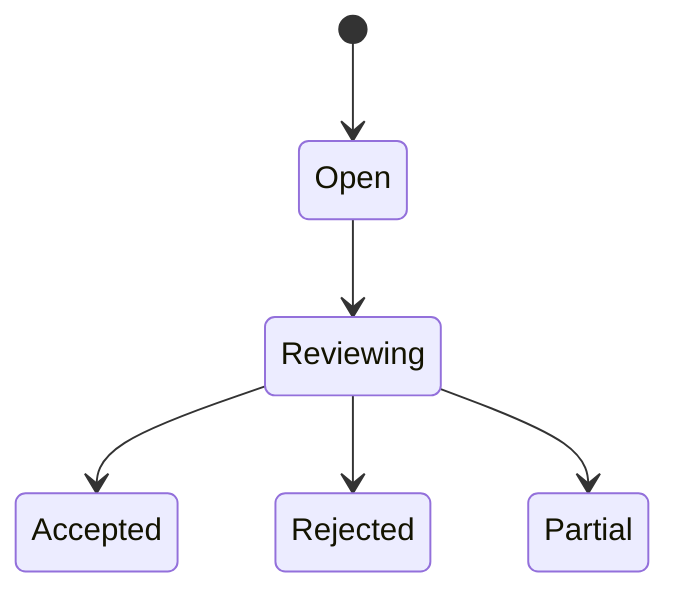

# Solana 争议与声誉设计

> 在 Solana 主线中，任务、结果与结算跑通之后，下一层关键能力就是：当结果不被接受时如何争议，以及系统如何逐步形成对 worker 的声誉判断。

这篇文档的目标是：
- 把 dispute 从“人工备注”提升为结构化状态
- 把 reputation 从“拍脑袋印象”提升为可积累的链上/链下指标
- 为 Solana 主线的第二阶段扩展预留协议空间

---

## 1. 为什么 dispute 与 reputation 必不可少

如果系统只有：
- 发布任务
- worker 提交结果
- 人工 accept / reject
- settle

那么它只能支持非常小规模、强信任关系下的协作。

一旦走向：
- 多 worker
- 更开放的市场
- 更复杂的任务
- 更高金额预算

就会遇到两个现实问题：

### 1.1 结果争议不可避免

因为很多任务不是“自动就能验证对错”的，比如：
- 分析报告
- 风险提示
- patch 设计建议
- HTML playground
- 复杂架构解读

### 1.2 没有声誉就无法规模化筛选 worker

如果系统无法积累历史表现，只能靠：
- 白名单
- 人工记忆
- 线下沟通

这不适合走向开放 task market。

---

## 2. MVP 与第二阶段的边界

### MVP 阶段

建议只支持：
- 人工 reject
- 手动 reopen
- 简单日志

### 第二阶段开始加入

- `DisputeAccount`
- 结构化争议原因
- reviewer / arbiter 角色
- `ReputationAccount`
- 基于 accept / reject / timeout / dispute 的得分模型

### 为什么不一开始就全做

因为 dispute 与 reputation 一旦做得过重，会显著增加：
- Program 复杂度
- worker 端实现复杂度
- 运营与治理复杂度

所以建议：
> 先让 accept / reject / settlement 稳定，再进入 dispute / reputation。

---

## 3. 最小争议模型

### 争议的核心问题

争议并不是简单地说“我不满意”，而是要回答：
- 哪个结果有争议？
- 争议理由是什么？
- 谁来裁决？
- 裁决后如何影响结算和声誉？

### 最小结构建议

引入 `DisputeAccount`，至少包含：

| 字段 | 说明 |
|------|------|
| `dispute_id` | 唯一 ID |
| `task_id` | 所属任务 |
| `claim_id` | 所属 claim |
| `result_id` | 所属结果 |
| `opened_by` | 发起争议者 |
| `reason_uri` | 争议说明 |
| `status` | Open / Reviewing / Resolved |
| `resolution` | Accept / Reject / Partial |
| `reviewer` | 负责裁决的人或多签 |
| `opened_at` | 发起时间 |
| `resolved_at` | 裁决时间 |

---

## 4. 争议触发条件建议

不是所有 reject 都必须进入 dispute，但以下情况特别适合：

### 4.1 结果质量争议
- patch 无法通过测试
- 报告与任务目标明显不匹配
- 结构化输出字段错误

### 4.2 成本争议
- execution cost 过高
- retry 次数异常
- fallback 未声明
- policy 看起来被绕过

### 4.3 边界争议
- worker 使用了未授权工具
- 结果超出任务范围
- artifact 与 manifest / receipts 不一致

---

## 5. Solana 上争议的最小状态机

建议从最小状态开始：



### 与任务主状态机的关系

任务状态建议变成：

```text
Submitted -> Accepted -> Settled
Submitted -> Rejected -> Open / Closed
Submitted -> Disputed -> Resolved -> Accepted / Rejected / Partial
```

也就是说：
- `Disputed` 是任务的中间态
- `resolution` 结果决定后续 settlement 路径

---

## 6. 争议中的 reviewer / arbiter 模型

### MVP 后的第一步建议

不要立刻做复杂 DAO 投票或开放仲裁网络，先支持：
- creator 指定 reviewer
- 多签 reviewer
- 平台官方仲裁者

### 为什么先中心化一点更合理

因为早期最重要的是：
- 把 dispute 数据结构跑起来
- 让 artifact / receipt / manifest 能被 review
- 让 settlement 和 reputation 的分支逻辑稳定

而不是一开始就追求 fully decentralized arbitration。

---

## 7. 争议对 settlement 的影响

争议一旦开启，settlement 就不能立即 final。

### 最小规则建议

#### `DisputeAccount.status == Open / Reviewing`
- `SettlementAccount.status = Pending`
- Escrow 保持锁定

#### resolution = `Accept`
- 正常发放 reward
- 更新 reputation 为正向

#### resolution = `Reject`
- reward 不发放或部分不发放
- 扣除真实 execution cost
- 剩余预算退款
- reputation 负向更新

#### resolution = `Partial`
- 发部分 reward
- 记录 partial settlement
- 允许较细粒度 reputation 变化

---

## 8. 最小声誉模型

MVP 后第一阶段不建议上来就做复杂打分算法，而是先积累可解释指标。

### 推荐的最小指标

| 字段 | 说明 |
|------|------|
| `completed_tasks` | 完成任务数 |
| `accepted_results` | 验收通过数 |
| `rejected_results` | 验收拒绝数 |
| `dispute_opened` | 被发起争议数 |
| `dispute_wins` | 争议胜出数 |
| `dispute_losses` | 争议失败数 |
| `timeouts` | claim 超时数 |
| `slash_count` | 被惩罚次数 |

### 为什么先用计数型指标

因为这些指标：
- 透明
- 易解释
- 可 audit
- 不容易被算法争议拖垮

---

## 9. 声誉分数的最小聚合建议

虽然可以存一个 `score`，但建议这个 `score` 只是派生值，而不是唯一真相。

### 推荐方式

```text
score =
  + accepted_results * A
  - rejected_results * B
  - dispute_losses * C
  - timeouts * D
  - slash_count * E
```

### 关键建议

- 原始指标必须保留
- `score` 可以在链下算，也可以链上更新
- 不要只存一个黑箱分数

---

## 10. 什么时候更新 reputation

建议在以下事件发生时更新：

### 正向更新
- task settled after accept
- dispute resolved in worker favor

### 负向更新
- result rejected
- dispute resolved against worker
- claim timeout
- policy violation confirmed

### 暂不更新的情况
- 任务还在处理中
- dispute 未结束
- result 已提交但未验收

---

## 11. 争议与 artifact / receipt / manifest 的关系

争议处理不应该只看一句 reject reason，而应回放：

- `artifact bundle`
- `execution manifest`
- `usage receipts`
- `cost-summary.json`
- `policy snapshot`

### 为什么这很重要

因为很多 dispute 不是“结果有没有交”，而是：
- 结果与任务不匹配
- 花费过高
- 使用了错误模型
- 进行了未声明 fallback
- 超越了工具或路径边界

这些都必须结合 artifact 与 receipt 来判断。

---

## 12. Solana Program 未来建议加入的 dispute 指令

MVP 之后，可以增加以下 instruction：

### `open_dispute`
输入：
- `reason_uri`
- `result_id`

效果：
- 创建 `DisputeAccount`
- `Task.status -> Disputed`

### `resolve_dispute`
输入：
- `resolution`
- `resolution_uri`

效果：
- dispute 进入 resolved
- 更新 task 状态
- 触发 settlement 分支

### `update_reputation`
输入：
- worker id
- outcome

效果：
- 更新 `ReputationAccount`

### MVP + 1 建议

`resolve_dispute` 与 `update_reputation` 可以一起触发，但实现层建议逻辑上分开，方便审计。

---

## 13. Worker 端要补哪些配合能力

如果 Solana 主线要进入 dispute / reputation 阶段，worker 至少要进一步支持：

### 13.1 attempt versioning
- 每次被 reopen 都保存独立 attempt

### 13.2 replayable bundle
- 所有 artifact / manifest / receipt 都能按 attempt 找回

### 13.3 local dispute metadata
- 记录 reject / dispute 原因
- 记录 reviewer 反馈

### 13.4 reputation export
- worker 端可查看自己历史任务表现，用于策略调整

---

## 14. 推荐推进顺序

### 第一阶段
- 先有 `ReputationAccount`，只记录 accept / reject / timeout

### 第二阶段
- 引入 `DisputeAccount`
- reviewer 手动裁决

### 第三阶段
- 部分自动 challenge
- reputation 与 stake / task priority 更紧密联动

---

## 15. 一句话总结

**Solana 主线要从“能跑的任务系统”走向“可扩展的 worker 市场”，就必须把 dispute 与 reputation 从人工隐性流程变成显性状态机：dispute 负责结构化处理不一致，reputation 负责把历史行为变成未来调度与信任的输入。**
