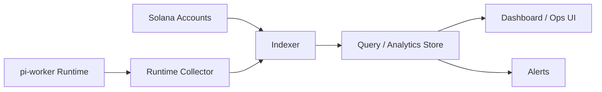

# Solana Indexer 与可观测性

> 当 Solana 主线已经具备任务、claim、result、settlement、runtime、dispute、market 与审计设计后，下一层必须补的是：如何看见系统在发生什么。

如果没有 indexer 与 observability，系统即使协议设计正确，也会很快在运行中失控：
- 不知道有哪些任务卡住
- 不知道哪个 worker 正在失败
- 不知道 execution budget 为什么耗尽
- 不知道 dispute 到底集中在哪些类型任务
- 不知道 settlement 是否经常延迟

因此，这一层不是“运营附属品”，而是整个系统能否维护的前提。

---

## 1. 为什么 Solana 主线特别需要可观测性

相比普通 DApp，`pi-worker + Solana` 这类系统有更多动态过程：
- 任务状态机
- claim 生命周期
- result 提交
- bundle / receipt / manifest 产出
- execution budget 消耗
- accept / reject / dispute / reopen
- reputation 累积
- worker selection 与调度

这些过程如果只留在：
- 链上账户里
- worker 本地日志里

就会造成两个问题：

1. **协议状态难以整体观察**
2. **运行时问题难以快速定位**

所以必须有一层把：
- 链上状态
- worker 状态
- 预算与 receipt
- 结果与 settlement

聚合成可查询、可监控、可告警的视图。

---

## 2. indexer 层到底负责什么

在这个系统里，indexer 不是简单“查链上账户”，而是承担三种聚合工作：

### 2.1 链上状态索引
- Task
- Claim
- Result
- Escrow
- Settlement
- Dispute
- Reputation

### 2.2 链下 artifact / runtime 映射
- artifact uri
- manifest uri
- cost summary uri
- worker attempt 状态
- 本地运行失败 / 恢复信息

### 2.3 业务语义聚合
- 某类任务平均耗时
- 某 worker 的 reject / timeout 比例
- 哪类任务最常 dispute
- 哪些任务最烧预算

也就是说：

> indexer 负责把“原始状态”变成“可理解的运营视图”。

---

## 3. 推荐的可观测性分层

建议把可观测性拆成 4 层：

### 3.1 Protocol Observability
观察链上协议状态：
- task 状态分布
- claim 活跃度
- settlement 速度
- dispute 数量

### 3.2 Runtime Observability
观察 `pi-worker` 运行行为：
- 成功/失败任务数
- 平均执行时长
- artifact 生成情况
- claim 超时率

### 3.3 Cost Observability
观察预算与执行成本：
- execution budget 使用率
- average cost per category
- retry / fallback 成本膨胀
- 退款比例

### 3.4 Market Observability
观察市场健康度：
- worker 分布
- reputation 分布
- task matching 质量
- 抢单与垄断行为

---

## 4. 最小 indexer 输出对象

建议 indexer 层至少形成 6 类查询对象：

1. `TaskView`
2. `WorkerView`
3. `ClaimView`
4. `ResultView`
5. `SettlementView`
6. `SystemMetricsView`

---

## 5. `TaskView` 建议字段

`TaskView` 应该把链上与链下信息拼接起来：

| 字段 | 说明 |
|------|------|
| `taskId` | 任务 ID |
| `title` | 标题 |
| `category` | 任务类别 |
| `status` | 当前状态 |
| `creator` | 创建者 |
| `rewardAmount` | 奖励 |
| `executionBudgetCap` | 执行预算上限 |
| `executionSpent` | 已消耗执行成本 |
| `currentClaimId` | 当前 claim |
| `latestResultId` | 最新结果 |
| `artifactUri` | 最新结果地址 |
| `reopenCount` | 重开次数 |
| `disputeCount` | 争议次数 |

### 为什么这个视图重要

运营或审计通常先问的不是“这个账户长什么样”，而是：
- 这个任务现在在哪一步？
- 花了多少钱？
- 被重开了几次？
- 结果在哪里？

---

## 6. `WorkerView` 建议字段

| 字段 | 说明 |
|------|------|
| `workerId` | worker ID |
| `owner` | 所属地址 |
| `runtimeType` | cloudflare / self-hosted / tee |
| `supportedCategories` | 支持的任务类别 |
| `activeClaims` | 当前活跃任务数 |
| `completedTasks` | 完成任务数 |
| `acceptedResults` | 通过数 |
| `rejectedResults` | 被拒数 |
| `timeouts` | 超时数 |
| `disputeLosses` | 争议失败数 |
| `avgExecutionTime` | 平均执行时长 |
| `avgExecutionCost` | 平均执行成本 |

### 为什么要把链上与链下指标合并

因为单纯链上只能看：
- claim / settlement 结果

而你还需要看：
- 执行时间
- 本地错误率
- 平均成本
- category specialization

---

## 7. 最值得做的系统级指标

### 7.1 Task 指标
- open task 数量
- claimed task 数量
- submitted 但未审核数量
- dispute 中 task 数量
- 平均从创建到结算时长

### 7.2 Worker 指标
- 活跃 worker 数
- 平均 claim 成功率
- timeout 率
- 平均 reject 率
- reputation 分布

### 7.3 成本指标
- 平均 execution cost / task
- 各 category 平均成本
- 平均 refund 比例
- fallback 触发次数
- retry 成本比例

### 7.4 市场指标
- 每类任务的 worker 覆盖率
- 高声誉 worker 集中度
- claim 竞争率
- reopen 比例
- dispute 比例

---

## 8. 最值得做的告警

如果系统开始真实运行，建议至少做以下告警。

### 8.1 协议级告警
- 某类 task 长时间卡在 `Claimed`
- `Submitted` 长时间无人 review
- `Disputed` 长时间未 resolve
- settlement 长时间 pending

### 8.2 成本级告警
- execution budget 使用率异常上升
- 某 worker 平均执行成本突然升高
- fallback / retry 异常频繁
- refund 比例异常降低

### 8.3 Worker 级告警
- 某 worker timeout 激增
- 某 worker reject 激增
- 某 worker 连续 dispute 失败

### 8.4 市场级告警
- 某类任务长期无人认领
- 某个 worker 占据过高份额
- 某类任务 dispute 比例持续过高

---

## 9. indexer 与 worker runtime 的对接点

要把可观测性做实，worker runtime 不应只写随意日志，而应稳定输出：

### 9.1 结构化事件
例如：
- `task_discovered`
- `task_evaluated`
- `task_claimed`
- `execution_started`
- `artifact_bundle_created`
- `result_submitted`
- `task_accepted`
- `task_rejected`
- `task_reopened`
- `task_settled`

### 9.2 稳定的本地运行目录
这样 indexer / collector 才能把：
- manifest
- receipts
- artifacts
- local metadata

稳定采集起来。

### 9.3 cost summary 与 attempt metadata
尤其要保证：
- 每个 attempt 有独立目录
- 每个 attempt 有独立 cost summary
- reject / reopen 不覆盖旧数据

---

## 10. 一个推荐的数据流

### 各层职责

- `Indexer`：拉取链上状态
- `Runtime Collector`：收集 worker 结构化事件与 bundle 元数据
- `DB`：统一查询层
- `Dashboard`：运营与审计视图
- `Alerts`：异常提醒

---

## 11. Dashboard 最小页面建议

### 11.1 Task Dashboard
- 各状态任务数量
- 任务明细列表
- 卡住任务列表

### 11.2 Worker Dashboard
- 每个 worker 的接受率 / 超时率 / 平均成本
- 当前 active claims
- 近期异常行为

### 11.3 Cost Dashboard
- execution cost 总览
- 按 category 的成本分布
- refund / fee / reward 比例

### 11.4 Market Health Dashboard
- task 覆盖率
- reputation 分布
- dispute / reopen 热点类别

---

## 12. 推荐推进顺序

### 第一阶段
- 先做链上 indexer
- 先做 TaskView / WorkerView
- 先做卡住任务与超时告警

### 第二阶段
- 接 worker 结构化事件
- 接 cost summary 与 attempt 元数据
- 做 cost / runtime dashboard

### 第三阶段
- 做 market health 指标
- 做 dispute / reputation / worker selection 分析面板

---

## 13. 一句话总结

**对 `pi-worker + Solana` 这样的系统来说，可观测性不是锦上添花，而是维持系统可调试、可运营、可审计的必要条件；链上账户只能告诉你“状态是什么”，而 indexer 与 observability 才能告诉你“系统为什么会变成这样”。**
