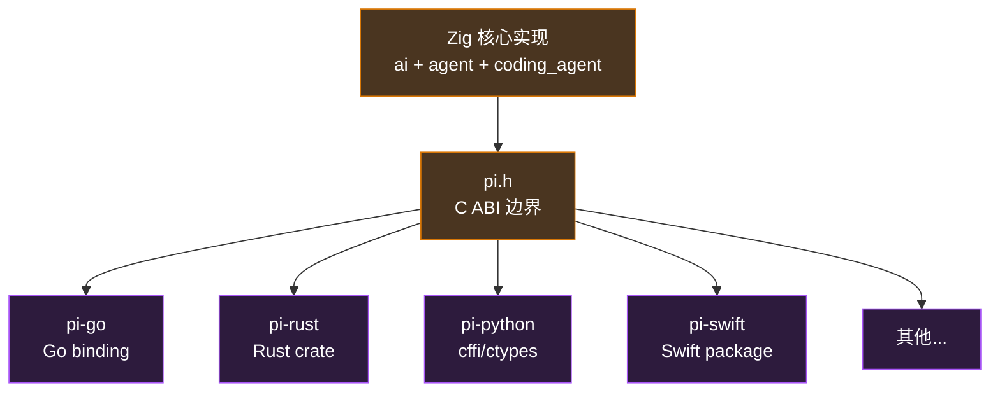

# 附录 A · C ABI v0.1

> 这份附录介绍 `zig/include/pi.h`——pi-mono-zig 暴露给跨语言绑定（Go / Rust / Python / Swift）的 C 接口草案。

::: warning v0.1 草案
**这是 draft，不是 frozen ABI**。在某个真实绑定（很可能是 Go）落地之前，所有名字、签名、错误码都可能变。一旦发 v1.0，这套接口将变成只增不删（append-only）。
:::

## A.1 为什么要做这个

整个 `pi-mono-zig` 项目的"终局形态"是一个跨语言 SDK：



C ABI 是这个生态的"原子层"——Zig 和 C 兼容，C 又是几乎所有主流语言 FFI 的最小公分母。**把核心做好一次，绑定在每种语言里只是几百行薄壳。**

## A.2 设计原则

读 `pi.h` 之前先记住这五条，看代码会顺很多：

### A.2.1 不透明句柄（Opaque Handles）

所有有状态的对象都是**前向声明的指针**，调用方看不到内部布局：

```c
typedef struct pi_session_s   pi_session_t;
typedef struct pi_agent_s     pi_agent_t;
typedef struct pi_stream_s    pi_stream_t;
// ...
```

为什么不暴露字段？因为：
1. **ABI 稳定性**：内部 struct 加字段不破坏调用方
2. **语言无关**：调用方不需要知道 Zig 内存布局
3. **生命周期清晰**：必须用 `pi_*_new` / `pi_*_free` 配对

### A.2.2 错误是值，不是异常

每个可能失败的函数都返回 `pi_status_t`：

```c
pi_status_t status = pi_session_new(&session);
if (status != PI_OK) {
    fprintf(stderr, "init failed: %s\n", pi_status_string(status));
    return 1;
}
```

没有 longjmp，没有 setjmp，没有 panic，没有 throw。所有错误都通过返回值传递，输出参数填具体结果。这是 SQLite、libcurl、Vulkan 等成熟 C 库的标配。

### A.2.3 字符串永远是 (ptr + len) 对

```c
pi_agent_prompt_text(agent, "你好世界", strlen("你好世界"));
```

**不依赖 NUL 结尾**。这意味着：

- 二进制安全（如 base64 图片数据）
- 不受不同语言对 "string" 的定义影响（Go 字符串、Rust `&str`、Python bytes）
- 调用方传完即可释放，pi 内部会拷贝

### A.2.4 回调 = 函数指针 + `void* user_data`

```c
typedef int (*pi_agent_event_fn)(void* user_data, const pi_agent_event_t* event);

pi_agent_subscribe(agent, my_handler, &my_state);
```

C 没有闭包，所以**所有回调都需要带一个 user_data 字段**作为"环境"。这是 Linux callback、Win32 API、libuv 等公认的模式。

### A.2.5 借用 vs 拥有的规则简单

| 谁返回 | 谁拥有 | 调用方要做什么 |
| --- | --- | --- |
| `pi_*_new(...)` | 调用方 | 用完调 `pi_*_free` |
| `const char*` 通过 out 参数 | 库内部 | 在下一次同句柄操作之前用完，**不要 free** |
| 函数返回 `const char*` | 库内部，静态生命周期 | 一直有效，**不要 free** |
| 传入参数（数据/字符串） | 调用方 | 库内部立刻拷贝；调用返回后调用方可释放 |

## A.3 整体结构

`pi.h` 分成 14 节，按使用顺序排列：

```
1. Versioning              -- pi_version_string() / pi_abi_version()
2. Error codes             -- pi_status_t + pi_status_string
3. Enums                   -- 事件、角色、能力、运行时种类
4. Opaque handles          -- 全部前向声明
5. Session                 -- 顶层句柄，HTTP/registry 共享
6. Workspace               -- cwd 锚点
7. Principal               -- 能力身份（D-3）
8. Tool invocation         -- 8 个内置工具的统一入口（D-4）
9. Tool result inspection  -- content blocks getter
10. Stream options builder -- 替代 50+ 字段 struct
11. Streaming LLM call     -- 低层流式接口
12. Agent                  -- 高层会话句柄
13. Extensions             -- 加载 + 调用扩展
14. Convenience            -- pi_run_once() 一锤子
```

## A.4 五个设计决议在 ABI 里的体现

设计决议清单（D-1 ~ D-5）全部反映在头文件里：

### D-1 · `AgentEvent` 不透明 + getter

Zig 内部把 `AgentEvent` 改成 tagged union；C 这边只看到不透明：

```c
typedef struct pi_agent_event_s pi_agent_event_t;

pi_event_type_t pi_event_type(const pi_agent_event_t* e);
const char*     pi_event_tool_name(const pi_agent_event_t* e, size_t* out_len);
const char*     pi_event_args_json(const pi_agent_event_t* e, size_t* out_len);
// ... 6 个 getter
```

调用方先看 type，再调对应 getter。**新增字段不破坏 ABI**——加一个新 getter 函数即可。

### D-2 · Prompt 拆成多个具体函数

Zig 端 `prompt(anytype)` 在 C 端拆成四个：

```c
pi_agent_prompt_text(...)
pi_agent_prompt_text_with_image(...)
pi_agent_prompt_message_json(...)
pi_agent_prompt_messages_json(...)
```

每个签名清晰、IDE 友好、文档可写。

### D-3 · 内置工具走 enforcement

每次 `pi_tool_invoke` 都**必须传 principal**：

```c
pi_status_t pi_tool_invoke(
    pi_workspace_t*  ws,
    pi_principal_t*  principal,    // ← 必填
    const char*      tool_name, size_t tool_name_len,
    const char*      args_json,  size_t args_json_len,
    const volatile int* abort_flag,
    pi_tool_result_t** out_result
);
```

最常用的"全权信任"场景一行就够：

```c
pi_principal_t* p;
pi_principal_new_trusted_built_in("my-app", strlen("my-app"), &p);
```

但需要收紧时也是一行：

```c
pi_principal_revoke(p, PI_CAP_SHELL_RUN);  // 禁掉 bash
```

### D-4 · 8 个工具统一入口

C 端只有一个 `pi_tool_invoke`——通过 `tool_name` 字符串分发，args 用 JSON 传。Zig 内部还是 8 个独立 struct（D-4 决议），dispatcher 只在 FFI 层。

### D-5 · file_mutation_queue 加 cwd 维度

C ABI 看不见这个内部细节，但**因为 workspace 是显式 handle**（`pi_workspace_t*`），cwd 自然成为锁的一部分——多个 workspace 互不干扰。

## A.5 一个 Hello World 程序

要看完整 ABI 的"形状"，下面这段 C 代码涵盖了 80% 的实际用例：

```c
#include "pi.h"
#include <stdio.h>
#include <string.h>

static int handle_event(void* user_data, const pi_agent_event_t* e) {
    (void)user_data;
    if (pi_event_type(e) == PI_EVENT_MESSAGE_END) {
        size_t len;
        const char* json = pi_event_message_json(e, &len);
        if (json) printf("=== final message: %.*s\n", (int)len, json);
    }
    return 0;
}

int main(void) {
    pi_session_t* session = NULL;
    pi_workspace_t* ws = NULL;
    pi_principal_t* p = NULL;
    pi_agent_t* agent = NULL;

    if (pi_session_new(&session) != PI_OK) return 1;
    pi_workspace_new(session, ".", 1, &ws);
    pi_principal_new_trusted_built_in("my-app", 6, &p);
    pi_principal_revoke(p, PI_CAP_SHELL_RUN);  // 禁 shell

    pi_agent_config_t config = {
        .system_prompt = "You are a helpful coding assistant.",
        .system_prompt_len = strlen("You are a helpful coding assistant."),
        .api = "anthropic-messages", .api_len = 18,
        .model = "claude-sonnet-4", .model_len = 15,
        .api_key = NULL, .api_key_len = 0,  // 从环境变量取
        .thinking = PI_THINKING_OFF,
        .tool_exec = PI_EXEC_PARALLEL,
    };

    pi_agent_new(session, ws, p, &config, &agent);
    pi_agent_subscribe(agent, handle_event, NULL);

    const char* prompt = "What's in the current directory?";
    pi_agent_prompt_text(agent, prompt, strlen(prompt));

    pi_agent_free(agent);
    pi_principal_free(p);
    pi_workspace_free(ws);
    pi_session_free(session);
    return 0;
}
```

40 行 C 代码 = 一个完整能工作的 agent + 安全收紧（禁 shell）+ 事件订阅。**这是 SDK 化的目标"手感"。**

## A.6 v0.1 留白的部分

**为什么 v0.1 不包含 sessions / modes / interactive_mode / packages**？

| 子系统 | 为什么不进 v0.1 |
| --- | --- |
| `sessions/` 持久化 | 多数 SDK 用户会用自己的存储；可以 v0.2 加可选模块 |
| `modes/` 4 种 RPC | 这些是"前端"——SDK 用户自己决定 transport |
| `interactive_mode/` TUI | TUI 是终端特化前端，不属于核心 |
| `packages/` 扩展包管理 | 是运营层 CLI，不需要嵌入 |

**v0.1 的三个目标**：能调 LLM、能跑工具、能跑完整 agent loop。其他都是延伸。

## A.7 版本演进策略

```
v0.x  实验阶段：自由变更，无兼容承诺
v1.0  ABI 冻结：append-only，删/改 = major bump
v1.x  新增 enum 值、新增函数、新增结构体字段（按尾部）
v2.0  破坏性变更（极少），需要双版本并存
```

C ABI 一旦冻结，**承诺的代价是巨大的**——每个 v1.x 都不能破坏 v1.0 的行为。所以 v0.1 阶段我们慢一点、想清楚再冻。

## A.8 头文件去哪里看

```
zig/include/pi.h     ← 完整头文件 (~500 行 + 大量注释)
```

**编译产物**（未来）：

```
zig-out/
├── lib/
│   ├── libpi.a       静态库
│   └── libpi.so      共享库
└── include/
    └── pi.h          (拷贝/symlink)
```

`zig build` 添加目标 `install-c-headers` 把 `pi.h` 放到 zig-out。

## A.9 下一步

C ABI v0.1 草案是**整本书前 5 章和 3 份卷宗的产物**——每一个决议都来自具体的源代码阅读和设计讨论。

**接下来要做的事**（不在本附录范围）：

1. **实现 `pi.h`**：在 `zig/src/c_abi/` 下写 export 层，把 Zig 内部 API 包装成 C 函数。
2. **写第一个绑定**：建议 Go——cgo 友好、生态需求大、能反向验证 ABI 设计。
3. **实测 + 迭代**：第一个绑定会暴露 v0.1 的所有问题；改完发 v0.2。
4. **迭代到 v1.0**：通常需要 2-3 个真实绑定全部跑通才敢冻结。

::: tip
**ABI 设计是一种"事先共情"的练习**——你要想象未来会有多少种语言、多少种调用模式、多少种内存模型，然后做一个**对所有人都可用**的最小公分母。`pi.h` 的草案是我们目前能给出的最好答案，但只有真实使用才能证明它够好。
:::

## A.10 给读者的话

如果你读到这里，你已经走完了：

- **8 章学习指南的前半段**：从概念到代码
- **3 份模块卷宗**：从源代码到设计图纸
- **一份 C ABI 草案**：从设计图纸到跨语言契约

整本书的"骨架"已经搭起来了。剩下的章节（Provider 抽象、Coding Agent 实战、扩展机制、TUI 工程）是这个骨架的具体展开。

如果你来到这本书的目的是**理解一个 AI Agent 怎么从零设计**——你已经有完整答案。

如果你想**贡献代码或基于 pi-mono-zig 做 SDK**——头文件 `pi.h` 是入口；模块卷宗是地图；设计决议（D-1 ~ D-5）是边界条件。

::: info 文档状态
- 创建：2026-05-08
- 状态：v0.1 草案，未实现
- 关联文件：`zig/include/pi.h`
:::
