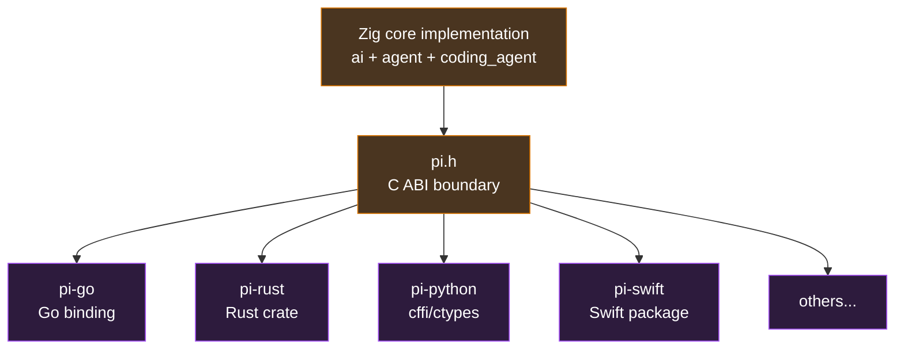

# Appendix A · C ABI v0.1

> This appendix introduces `zig/include/pi.h` — the C interface that pi-mono-zig exposes to cross-language bindings (Go / Rust / Python / Swift).

::: warning v0.1 draft
**This is a draft, not a frozen ABI.** Until a real binding (likely Go) lands, names, signatures, and error codes may change. Once we ship v1.0, this surface becomes append-only.
:::

## A.1 Why this exists

The endgame of pi-mono-zig is a cross-language SDK:



The C ABI is the "atomic layer" of this ecosystem — Zig is C-compatible, and C is the lowest common denominator for FFI in nearly every mainstream language. **Build the core well once, and bindings in each language are just a few hundred lines of thin wrapper.**

## A.2 Design principles

Five things to remember before reading `pi.h`:

### A.2.1 Opaque handles

All stateful objects are **forward-declared pointers** — callers never see internal layout:

```c
typedef struct pi_session_s   pi_session_t;
typedef struct pi_agent_s     pi_agent_t;
typedef struct pi_stream_s    pi_stream_t;
// ...
```

Why? Because:
1. **ABI stability**: adding fields internally doesn't break callers
2. **Language independence**: callers don't need Zig memory layout knowledge
3. **Lifecycle clarity**: must use matching `pi_*_new` / `pi_*_free` pairs

### A.2.2 Errors are values, not exceptions

Every fallible function returns `pi_status_t`:

```c
pi_status_t status = pi_session_new(&session);
if (status != PI_OK) {
    fprintf(stderr, "init failed: %s\n", pi_status_string(status));
    return 1;
}
```

No longjmp, no setjmp, no panic, no throw. All errors flow through return values; outputs come via output parameters. Standard practice for SQLite, libcurl, Vulkan.

### A.2.3 Strings are always (ptr + len) pairs

```c
pi_agent_prompt_text(agent, "hello world", strlen("hello world"));
```

**Never NUL-terminated-required**. This means:

- Binary safety (e.g. base64 image data)
- No assumption about how each language defines "string" (Go strings, Rust `&str`, Python bytes)
- Caller can free immediately after the call returns; pi copies internally

### A.2.4 Callbacks = function pointer + `void* user_data`

```c
typedef int (*pi_agent_event_fn)(void* user_data, const pi_agent_event_t* event);

pi_agent_subscribe(agent, my_handler, &my_state);
```

C has no closures, so **every callback needs a user_data field** to carry "environment." Standard pattern from Linux callbacks, Win32 API, libuv.

### A.2.5 Borrow vs own — simple rules

| Who returned it | Owner | Caller does what |
| --- | --- | --- |
| `pi_*_new(...)` | Caller | Call `pi_*_free` when done |
| `const char*` via out param | Library internal | Use before next op on same handle; **don't free** |
| Function returns `const char*` | Library internal, static lifetime | Always valid; **don't free** |
| Inputs (data / strings) | Caller | Library copies immediately; caller may free after return |

## A.3 Overall structure

`pi.h` is organized into 14 sections in the order you'd use them:

```
1.  Versioning              -- pi_version_string() / pi_abi_version()
2.  Error codes             -- pi_status_t + pi_status_string
3.  Enums                   -- events, roles, capabilities, runtime kinds
4.  Opaque handles          -- all forward declarations
5.  Session                 -- top-level handle, shared HTTP/registry
6.  Workspace               -- cwd anchor
7.  Principal               -- capability identity (D-3)
8.  Tool invocation         -- unified entry for 8 built-in tools (D-4)
9.  Tool result inspection  -- content blocks getter
10. Stream options builder  -- replaces 50+ field struct
11. Streaming LLM call      -- low-level streaming
12. Agent                   -- high-level session handle
13. Extensions              -- load + invoke extensions
14. Convenience             -- pi_run_once() one-shot
```

## A.4 The five design decisions, encoded

The design decisions log (D-1 through D-5) is reflected throughout the header:

### D-1 · `AgentEvent` opaque + getters

The Zig `AgentEvent` becomes a tagged union internally; the C side sees it opaque:

```c
typedef struct pi_agent_event_s pi_agent_event_t;

pi_event_type_t pi_event_type(const pi_agent_event_t* e);
const char*     pi_event_tool_name(const pi_agent_event_t* e, size_t* out_len);
const char*     pi_event_args_json(const pi_agent_event_t* e, size_t* out_len);
// ... 6 getters
```

Caller checks type, then calls the appropriate getter. **New fields don't break the ABI** — just add a new getter.

### D-2 · Prompt split into specific functions

Zig's `prompt(anytype)` becomes four C functions:

```c
pi_agent_prompt_text(...)
pi_agent_prompt_text_with_image(...)
pi_agent_prompt_message_json(...)
pi_agent_prompt_messages_json(...)
```

Each signature is clear, IDE-friendly, and individually documented.

### D-3 · Built-in tools go through enforcement

Every `pi_tool_invoke` **must** carry a principal:

```c
pi_status_t pi_tool_invoke(
    pi_workspace_t*  ws,
    pi_principal_t*  principal,    // ← required
    const char*      tool_name, size_t tool_name_len,
    const char*      args_json,  size_t args_json_len,
    const volatile int* abort_flag,
    pi_tool_result_t** out_result
);
```

The most common "trust everything" case is one line:

```c
pi_principal_t* p;
pi_principal_new_trusted_built_in("my-app", strlen("my-app"), &p);
```

But narrowing is also one line:

```c
pi_principal_revoke(p, PI_CAP_SHELL_RUN);  // disable bash
```

### D-4 · Eight tools, one entry

The C side has only `pi_tool_invoke` — dispatched via the `tool_name` string, with args carried as JSON. Internally, Zig still has 8 independent structs (D-4). The dispatcher lives only in the FFI layer.

### D-5 · file_mutation_queue keyed on cwd

The C ABI doesn't see this internal detail, but **because workspace is an explicit handle** (`pi_workspace_t*`), cwd naturally becomes part of the lock key — distinct workspaces don't contend.

## A.5 A hello-world program

To see the "shape" of the ABI, here's a C program covering 80% of real use cases:

```c
#include "pi.h"
#include <stdio.h>
#include <string.h>

static int handle_event(void* user_data, const pi_agent_event_t* e) {
    (void)user_data;
    if (pi_event_type(e) == PI_EVENT_MESSAGE_END) {
        size_t len;
        const char* json = pi_event_message_json(e, &len);
        if (json) printf("=== final message: %.*s\n", (int)len, json);
    }
    return 0;
}

int main(void) {
    pi_session_t* session = NULL;
    pi_workspace_t* ws = NULL;
    pi_principal_t* p = NULL;
    pi_agent_t* agent = NULL;

    if (pi_session_new(&session) != PI_OK) return 1;
    pi_workspace_new(session, ".", 1, &ws);
    pi_principal_new_trusted_built_in("my-app", 6, &p);
    pi_principal_revoke(p, PI_CAP_SHELL_RUN);  // disable shell

    pi_agent_config_t config = {
        .system_prompt = "You are a helpful coding assistant.",
        .system_prompt_len = strlen("You are a helpful coding assistant."),
        .api = "anthropic-messages", .api_len = 18,
        .model = "claude-sonnet-4", .model_len = 15,
        .api_key = NULL, .api_key_len = 0,  // pulled from env
        .thinking = PI_THINKING_OFF,
        .tool_exec = PI_EXEC_PARALLEL,
    };

    pi_agent_new(session, ws, p, &config, &agent);
    pi_agent_subscribe(agent, handle_event, NULL);

    const char* prompt = "What's in the current directory?";
    pi_agent_prompt_text(agent, prompt, strlen(prompt));

    pi_agent_free(agent);
    pi_principal_free(p);
    pi_workspace_free(ws);
    pi_session_free(session);
    return 0;
}
```

40 lines of C = a complete working agent + tightened security (no shell) + event subscription. **This is the target SDK feel.**

## A.6 What v0.1 deliberately omits

**Why v0.1 doesn't include sessions / modes / interactive_mode / packages**:

| Subsystem | Why not in v0.1 |
| --- | --- |
| `sessions/` persistence | Most SDK users will use their own storage; can ship as optional module in v0.2 |
| `modes/` 4 RPC protocols | These are frontends — SDK users pick their own transport |
| `interactive_mode/` TUI | TUI is terminal-specific frontend, not core |
| `packages/` extension package mgmt | Operational CLI, not embeddable |

**v0.1's three goals**: call an LLM, run tools, run a complete agent loop. Everything else is extension.

## A.7 Versioning policy

```
v0.x  experimental: free to change, no compatibility promise
v1.0  ABI freeze: append-only, breaking change = major bump
v1.x  add enum values, add functions, add struct fields (at end only)
v2.0  breaking changes (rare); requires dual-version coexistence
```

Once a C ABI is frozen, **the cost of the promise is huge** — every v1.x must preserve v1.0 behavior. So we go slow in v0.x and freeze only when sure.

## A.8 Where the header lives

```
zig/include/pi.h     ← full header (~500 lines + heavy doc comments)
```

**Build artifacts** (future):

```
zig-out/
├── lib/
│   ├── libpi.a       static library
│   └── libpi.so      shared library
└── include/
    └── pi.h          (copied/symlinked)
```

A `zig build` step `install-c-headers` will place `pi.h` into zig-out.

## A.9 Next steps

The v0.1 ABI draft is the **product of the first 5 chapters and the 3 dossiers** — every decision traces back to specific source reading and design discussion.

**Future work** (out of scope for this appendix):

1. **Implement `pi.h`**: write an export layer in `zig/src/c_abi/` wrapping Zig internals as C functions.
2. **First binding**: start with Go — cgo-friendly, demand exists, will reverse-validate the ABI.
3. **Test + iterate**: the first binding will surface every v0.1 issue; ship v0.2 with fixes.
4. **Iterate to v1.0**: usually takes 2–3 real bindings to feel safe freezing.

::: tip
**ABI design is an exercise in advance empathy** — you imagine future languages, calling patterns, memory models, and design a least common denominator that works for all of them. `pi.h` is our best current answer, but only real use can prove it good enough.
:::

## A.10 To the reader

If you've read this far, you've completed:

- **The first half of an 8-chapter learning guide**: from concepts to code
- **3 module dossiers**: from source code to design blueprints
- **One C ABI draft**: from blueprint to cross-language contract

The book's skeleton is in place. Remaining chapters (provider abstraction, coding agent in practice, extensions, TUI engineering) are concrete fleshings-out.

If you came here to **understand how an AI agent is designed from scratch** — you have the full answer.

If you want to **contribute or build an SDK on pi-mono-zig** — `pi.h` is your entry point; the dossiers are your map; the design decisions (D-1 through D-5) are your boundary conditions.

::: info Doc status
- Created: 2026-05-08
- Status: v0.1 draft, unimplemented
- Linked file: `zig/include/pi.h`
:::
