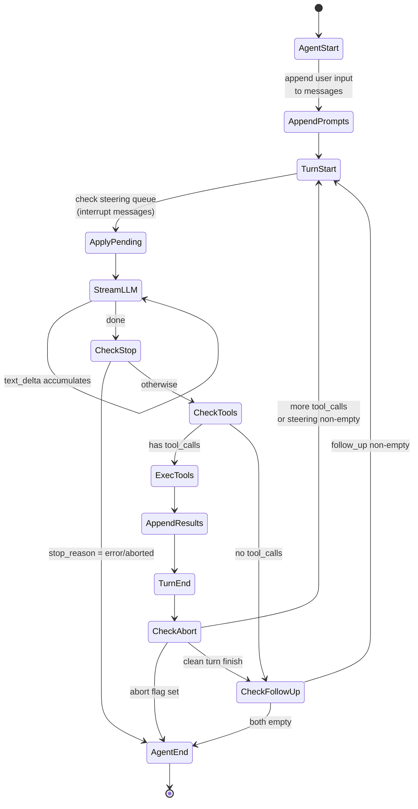
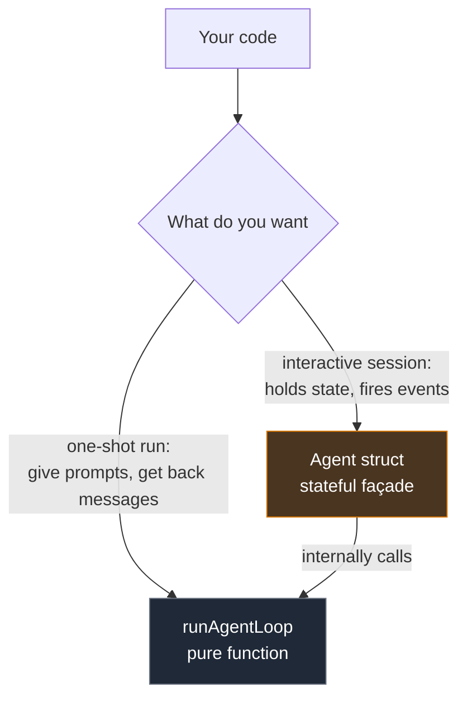
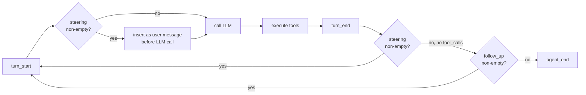
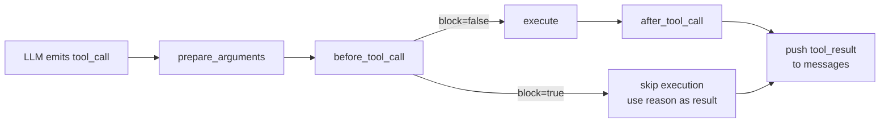
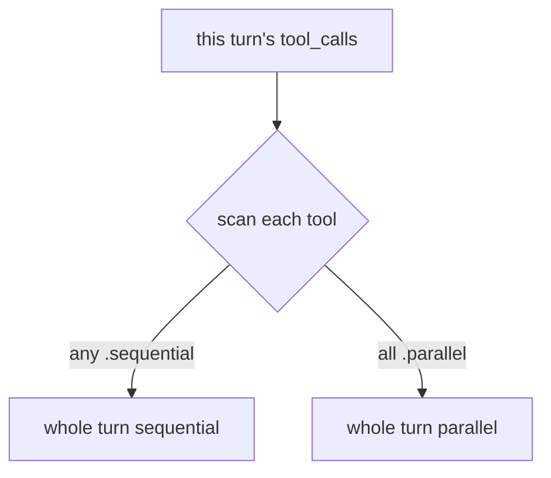
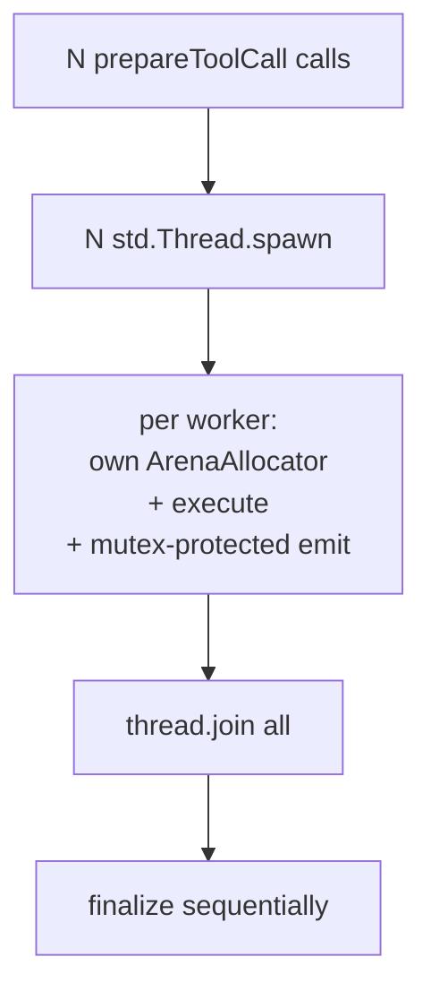
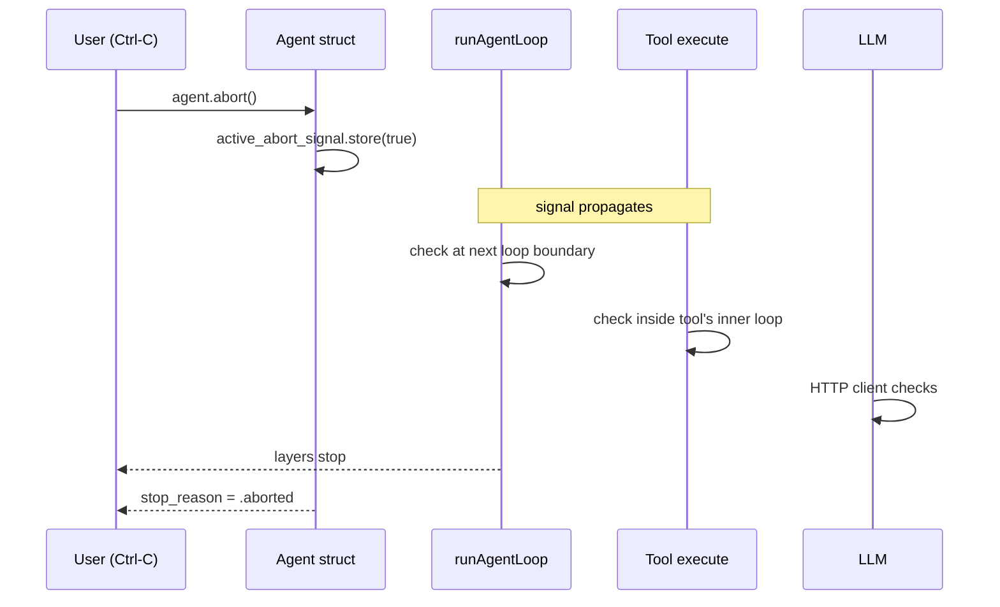
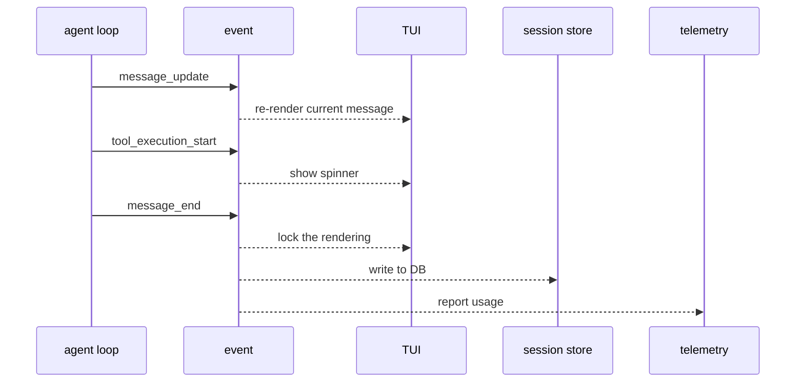

# Chapter 5 · The Agent Loop

> Chapter 1 said "Agent = LLM + Tools + Loop." Chapter 2 dissected the L. This chapter dissects the loop.

::: warning Chapter ordering
We're skipping Chapter 3 (Tool Calling wire format) and Chapter 4 (Provider abstraction) for now to write this one while the agent module is fresh in mind. Those chapters will be filled in later.

If you've never seen tool calling, treat it as a black box: **the LLM's output sometimes contains a request like "I want to call `read_file('foo.txt')`."** That's all you need to know.
:::

## 5.1 The naive pseudocode

The agent loop fits in 10 lines:

```zig
while (!done) {
    const assistant = try llm.next(state);          // 1. ask LLM
    state.append(assistant);

    if (assistant.tool_calls.len == 0) {            // 2. LLM is done
        break;
    }
                                                    // 3. LLM wants tools
    for (assistant.tool_calls) |call| {
        const result = try tools.execute(call);     //    execute
        state.append(.{ .tool_result = result });   //    feed back
    }
                                                    // 4. back to step 1
}
```

The whole "complexity" of AI agent engineering is making these 10 lines **correct, cancellable, observable, and extensible**.

## 5.2 The state machine view

The pseudocode as a state machine:



::: tip This diagram IS the agent
**This state machine is `pi-mono-zig`'s `runAgentLoop` function.** It's implemented as two nested loops in `zig/src/agent/agent_loop.zig`, but the **logic** is exactly this diagram. Internalize the diagram and reading the code becomes mechanical.
:::

## 5.3 Two-layer API: pure function + stateful façade

The agent module gives you two entry points:



### 5.3.1 Low-level: `runAgentLoop` (pure function)

```zig
const new_messages = try runAgentLoop(
    allocator,
    io,
    prompts,         // new user input
    context,         // current dialog state
    config,          // model, API key, callbacks
    emit_context,    // your *anyopaque
    emit_callback,   // fn(ctx, AgentEvent)
    abort_signal,    // ?*atomic.Value(bool)
    stream_fn,       // optional: custom LLM call
);
```

**No internal state** — everything in via parameters, new messages out via return value. This makes it **testable, comprehensible, portable**. When we build the C ABI, this is the function being wrapped.

### 5.3.2 High-level: `Agent` struct (stateful)

```zig
var agent = try Agent.init(allocator, .{
    .system_prompt = "You are a coding assistant",
    .model = my_model,
    .tools = my_tools,
    .io = my_io,
});
defer agent.deinit();

try agent.subscribe(.{ .callback = onEvent });
try agent.promptText("Remove every console.log");  // blocks until done
```

`Agent` holds: dialog history, subscribers, abort signal, three message queues. It internally calls `runAgentLoop`, dispatches events, and appends new messages to its own history.

::: info Linux-style two-layer abstraction
**Core mechanism is stateless and testable; the convenience layer manages lifecycle.** This is the same pattern as Linux syscalls vs glibc, SQLite C API vs ORMs. Both layers are public; **users pick by use case**. This is good engineering.
:::

## 5.4 Three message containers

If the agent loop had only one message list, you could only do "user says one thing, agent replies." `pi-mono-zig`'s design **partitions messages by when they're consumed** — into three containers. This is the most distinctive thing about the module.

### 5.4.1 Three semantics

| Container | When consumed | Mental model |
| --- | --- | --- |
| `messages` | Sent in full to LLM each call | "Dialog history" — what the LLM sees |
| `steering_queue` | Injected as user message at the start of next iteration | "Interrupt" — slip in a new instruction mid-work |
| `follow_up_queue` | Starts a new turn after the current task fully ends | "Queue next task" — do this after that |

### 5.4.2 Where they sit in the loop



### 5.4.3 Use cases

**Steering**: in a TUI, the user sees the agent reading the wrong file, hits Esc, types "wait, look in src not lib." That message goes into `steering_queue`, and **the very next iteration injects it as a user message** — agent sees it immediately and adjusts.

**Follow-up**: in a script, you queue multiple tasks: "remove console.log" + "run lint." The first finishes with `stop_reason = stop`, agent would have exited — but follow_up isn't empty, so it starts a new turn for the second task.

```zig
try agent.steer(.{ .user = .{ .content = &.{.{ .text = .{ .text = "look in src" } }} } });
try agent.followUp(.{ .user = .{ .content = &.{.{ .text = .{ .text = "now run lint" } }} } });
```

### 5.4.4 `QueueMode`: one-at-a-time vs all

```zig
pub const QueueMode = enum {
    all,
    one_at_a_time,
};
```

Default is `one_at_a_time` — to avoid "5 steering messages dumped at once, model gets confused."

::: tip Why this design is elegant
LangChain / LangGraph handle interrupts with a global flag, complex and prone to deadlocks. `pi-mono-zig` unifies "interrupt" and "queue next" into **the same mechanism** (a message queue), differing only in **when it's drained** — one inside-turn, one between-turns. **Two orthogonal concepts, one unified mechanism.**
:::

## 5.5 The four tool-call hooks

After the LLM emits "I want to call `read_file('foo')`" and before the call really completes, there are 4 interceptable points:



| Hook | Input | What you can do |
| --- | --- | --- |
| `prepare_arguments` | raw args | Validate, fill in, transform (e.g. expand relative paths) |
| `before_tool_call` | args + current assistant msg | Intercept (block=true skips, result is your reason) |
| `execute` | call_id, params, signal, on_update | Do the actual work |
| `after_tool_call` | result, is_error | Rewrite result (sanitize, append metadata) |

### 5.5.1 A subtle detail: `execute` gets `signal` and `on_update`

```zig
pub const ExecuteToolFn = *const fn (
    allocator: std.mem.Allocator,
    tool_call_id: []const u8,
    params: std.json.Value,
    tool_context: ?*anyopaque,
    signal: ?*const std.atomic.Value(bool),       // ← check abort mid-work
    on_update_context: ?*anyopaque,
    on_update: ?AgentToolUpdateCallback,           // ← report progress mid-work
) anyerror!AgentToolResult;
```

This means **long-running tools** (compile, run tests) can:

1. Stream compile errors live (via `on_update` → `tool_execution_update` event → TUI updates in real time).
2. Check `signal.load(.seq_cst)` in their inner loop — if user hit Ctrl-C, exit immediately.

Without these two, the "agent hangs for 5 minutes" UX is impossible to fix.

## 5.6 Parallel vs sequential tool execution

The LLM may emit multiple tool_calls in one turn: "read this file, read that file, grep over there." Three independent operations — parallel is 3× faster.

### 5.6.1 The decision rule



Each `AgentTool` can mark `execution_mode`:

```zig
pub const ToolExecutionMode = enum {
    sequential,    // must run sequentially (e.g. file edits)
    parallel,      // safe to parallelize
};
```

**The rule is extremely conservative**: if **any** tool in a turn is `.sequential`, the whole turn runs sequentially. This avoids "read file" and "write same file" racing in parallel. The cost is a performance hit — 9 parallelizable tools dragged sequential by 1 sequential one.

::: warning Trade-off
The rule is simple, safe, easy to reason about. But **performance has room** — e.g. group-by-mode and parallelize within groups. Chapter 7's `coding_agent` dossier returns to this.
:::

### 5.6.2 How parallel works

`pi-mono-zig`'s parallel implementation **uses OS threads, not coroutines**:



Two key decisions:

1. **One ArenaAllocator per parallel task**: arena is dropped when the task finishes — **no shared memory between threads**, no races.
2. **`std.Io.Mutex` serializes all emit calls**: even with multi-threaded workers, your subscriber **doesn't see concurrency**.

Very Unix-flavored: **make the user's emit callback look single-threaded** — all locks live inside the agent.

### 5.6.3 Why not coroutines

LLM tools are usually IO/CPU heavy real work — file I/O, shell, external APIs. OS threads beat Zig's `std.Io.async` here — **no fine-grained scheduling win, only complexity cost**.

## 5.7 Cancellation (abort)

The agent might run for 5 minutes silently, get into a corner, burn money. Users must be able to **stop it instantly**.

### 5.7.1 The abort path



Abort is **cooperative** — every potentially-blocking site must actively check `signal.load(.seq_cst)`:

- Each loop boundary (in `runLoop`)
- Each LLM chunk boundary (in the `ai` module)
- Inside tool execution (the tool implements its own check, the framework provides the signal)

::: warning A real trap
**`std.atomic.Value(bool)` is not a plain bool.** Multi-threaded reads/writes need atomics; a plain bool can be optimized away in release builds. This is *the* reason the abort flag must be atomic.
:::

## 5.8 "Events are the only output"

The agent loop **doesn't print stdout, doesn't write logs, doesn't draw the TUI**. It only emits **events**:

```zig
pub const AgentEventType = enum {
    agent_start,       agent_end,
    turn_start,        turn_end,
    message_start,     message_update,    message_end,
    tool_execution_start, tool_execution_update, tool_execution_end,
};
```

Subscribers consume them:

| Subscriber | What it does with events |
| --- | --- |
| TUI | Re-render streaming message_update; show tool execution spinners |
| Session persistence | Write message_end to SQLite |
| Telemetry | Report token usage |
| Unit tests | Mock subscriber asserts the event sequence |



This is the textbook mechanism / policy split: **the mechanism (agent loop) only emits events; policies (how to display, store, report) live in subscribers**. Linux syscalls are exactly this — they only signal state changes, no built-in UI.

## 5.9 Code in the repo

| Concept | File |
| --- | --- |
| State machine | `zig/src/agent/agent_loop.zig` (`runLoop`) |
| Agent struct | `zig/src/agent/agent.zig` |
| Three queues | `zig/src/agent/agent.zig` (`messages`, `steering_queue`, `follow_up_queue`) |
| 4 tool hooks | `zig/src/agent/types.zig` (`Prepare/Before/Execute/AfterToolCallFn`) |
| Parallel execution | `zig/src/agent/agent_loop.zig` (`executeToolCallsParallel`) |
| Event types | `zig/src/agent/types.zig` (`AgentEventType`, `AgentEvent`) |

::: info Want to go deeper
Full architectural walkthrough — exact callback signatures, C ABI assessment, design smells: **[agent module dossier](/internals/agent)**. This chapter is its teaching translation.
:::

## 5.10 Up next

We have the full picture of the "LLM + Tools + Loop" trio. The remaining chapters are **specializations of this core**:

- Chapter 3 (TBD) — Tool Calling wire format (JSON for function schema, tool_use, tool_result)
- Chapter 4 (TBD) — Provider abstraction (reconciling tool-call shapes across OpenAI / Anthropic / Google)
- Chapter 6 — Coding Agent (concrete read/edit/bash tools + safety boundaries)
- Chapter 7 — Extensions (WASM, sub-agents, capability boundaries)
- Chapter 8 — TUI and sessions (streaming render, replay, cancellation engineering)

[**← Back to introduction**](./)

---

::: info Glossary

| Term | One-line definition |
| --- | --- |
| Agent loop | "call LLM → execute its tools → feed results back → call LLM again" |
| turn | One full "LLM call + tool execution" iteration |
| steering | Insert user messages between iterations ("interrupt") |
| follow-up | A new task to start after the current one ends |
| Cooperative abort | Atomic flag; every blocking site checks actively |
| Event subscription | Agent only emits events; UI/storage/telemetry subscribe |
:::
