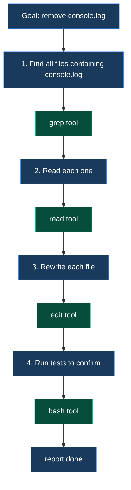

# Chapter 6 · The Coding Agent in Practice

> The first 5 chapters covered the agent's "general skeleton." This chapter dresses the skeleton in concrete clothing — **how to make an agent that actually edits code**.

## 6.1 What does a coding agent actually need

Recall Chapter 1's example: "**remove every console.log in this project**." Decompose to atoms:



Minimum: **search, read, edit, run** — 4 tools. Add "list directory contents" and "atomic write," and a real coding agent needs **6–8 tools**. pi-mono-zig provides 8:

| Tool | Job | Used in this example |
| --- | --- | --- |
| `grep` | Repo-wide regex search | Step 1 |
| `find` | Glob list files | (not used here, often paired) |
| `ls` | Directory listing with metadata | (not used here, often paired) |
| `read` | Read a file | Step 2 |
| `edit` | String replacement in a file | Step 3 |
| `write` | Whole-file rewrite | Step 3 alternative |
| `bash` | Run shell commands | Step 4 |
| `truncate` | Shared helper: line/byte truncation | (internal use) |

## 6.2 The 8 tools at a glance

::: tip Full schemas live in code
This section gives the "what each tool wants to do," not the full JSON Schema. Full schemas are generated from code (each `tools/*.zig` exports `pub fn schema(allocator)`) and accessible from C ABI via `pi_tool_schema_json()`.
:::

### `read`

```
Args:
  path: string         required, relative or absolute
  offset: integer      optional, starting line (0-based)
  limit: integer       optional, max lines to read
Returns:
  content: string + truncation flag
Defaults: truncate to 2000 lines / 50KB
Image files: returns ImageContent (base64)
```

### `write`

```
Args:
  path: string
  content: string      complete new file contents
Behavior:
  Atomic write (write tmp, then rename)
  Serialized via file_mutation_queue (per path)
```

### `edit`

```
Args:
  path: string
  old_string: string   substring to replace
  new_string: string   replacement
  replace_all: bool    optional, default false (replace first occurrence only)
Failure modes:
  - old_string not in file
  - replace_all=false but old_string occurs multiple times
```

::: warning edit is safer than write
A failed `edit` call (string not found) only doesn't change anything — it doesn't "rewrite incorrectly." **So for small edits, the LLM almost always uses edit, not write.** This is a great example of tool design shaping LLM behavior.
:::

### `bash`

```
Args:
  command: string
  description: string  required — one-line explanation of intent
  timeout_ms: integer  default 120000
Behavior:
  Execute in cwd; kill process group on timeout
  Truncated stdout/stderr merged
  Capability check: shell_run
```

::: tip Why description is required
**Forces the LLM to explain itself** — adds observability, lets the user see "running: tests" in the TUI rather than the raw command. Simple but effective prompt engineering.
:::

### `grep`

```
Args:
  pattern: string      regex
  path: string         optional, search root
  glob: string         optional, filename filter
  output_mode: enum    'content' | 'files_with_matches' | 'count'
Implementation:
  Shells out to ripgrep (rg)
```

### `find`

```
Args:
  pattern: string      glob
  path: string         optional
Implementation:
  Shells out to fd
```

### `ls`

```
Args:
  path: string
Returns:
  Array of {name, size, mtime, is_dir}
Implementation:
  Pure Zig, no shell out
```

### `truncate`

Not LLM-callable; an internal helper used by `read` and `bash`:

- Truncates by line / byte
- Detects partial lines (avoids cutting mid-line)
- Adds `[truncated]` marker at the end

## 6.3 Tool descriptions ARE prompt engineering

Recall Chapter 3 §3.2: **the `description` field decides when the LLM thinks of using this tool.** Look at pi-mono's actual edit description:

```zig
// from zig/src/coding_agent/tools/edit.zig
pub const description =
    \\Performs exact string replacements in files.
    \\
    \\Usage:
    \\- You must use your `Read` tool at least once before editing.
    \\  This tool will error if you attempt an edit without reading the file.
    \\- When editing text from Read tool output, ensure you preserve the
    \\  exact indentation (tabs/spaces) as it appears AFTER the line number prefix.
    \\- ALWAYS prefer editing existing files. NEVER write new files unless required.
    \\- The edit will FAIL if `old_string` is not unique in the file.
    \\  Either provide a larger string with more context, or use `replace_all`.
    \\- Use `replace_all` for renaming variables across the file.
;
```

This description carries an **entire behavior spec**:

| Description sentence | Resulting LLM behavior |
| --- | --- |
| "must use Read first" | LLM learns to read before editing, no blind changes |
| "preserve exact indentation" | LLM keeps indentation when copy-pasting |
| "prefer editing existing" | LLM doesn't randomly create new files |
| "FAIL if old_string is not unique" | LLM expands context to ensure uniqueness |

**These rules don't need to be hardcoded in agent logic** — the LLM reads the description and follows them. **This is the highest-leverage form of prompt engineering**: hide instructions in tool docs.

## 6.4 Anatomy of one edit call

Stitch all the concepts together. The LLM wants to edit `src/main.zig`, from emitting `tool_use` to result returning:

```mermaid
sequenceDiagram
    autonumber
    participant LLM
    participant Loop as agent_loop
    participant Hook as tool.call hook<br/>(optional extension)
    participant Cap as enforcement
    participant Queue as file_mutation_queue
    participant Edit as edit tool
    participant FS as filesystem

    LLM-->>Loop: tool_use {name:"edit", input:{path, old, new}}
    Loop->>Hook: fire tool.call (Phase 1 hook)
    Hook-->>Loop: pass / cancel / modify args
    Loop->>Cap: principal has file_write?
    Cap-->>Loop: yes
    Loop->>Queue: acquire('src/main.zig')
    Queue-->>Loop: guard
    Loop->>Edit: execute(args)
    Edit->>FS: read('src/main.zig')
    FS-->>Edit: current content
    Edit->>Edit: replace(old, new)
    Edit->>FS: atomic write tmp + rename
    FS-->>Edit: ok
    Edit-->>Loop: ExecutionResult { content, is_error: false }
    Loop->>Queue: release('src/main.zig')
    Loop->>Hook: fire tool.result (Phase 1 hook)
    Hook-->>Loop: pass / rewrite result
    Loop->>LLM: tool_result {tool_use_id, content, is_error: false}
    LLM-->>LLM: sees result, decides next move
```

**This single chain traverses every core concept in the book**:

- Chapter 3's tool_use → tool_result protocol
- Chapter 5's agent loop + 4 hook positions
- Chapter 7's tool.call / tool.result interception
- This chapter's file_mutation_queue + capability check

## 6.5 The "three-layer defense"

An agent that runs shell commands and modifies your disk is **a security-critical system**. pi-mono-zig defends in three layers:

```mermaid
flowchart TB
    classDef l1 fill:#1a3a5c,stroke:#3b82f6,color:#fff
    classDef l2 fill:#4a3520,stroke:#d97706,color:#fff
    classDef l3 fill:#7f1d1d,stroke:#dc2626,color:#fff

    L1[Layer 1: capability check]:::l1
    L1 --> L1d["Principal lacks shell_run grant?<br/>Deny immediately, never reach the bash tool"]

    L2[Layer 2: extension interception<br/>(tool.call hook)]:::l2
    L2 --> L2d["Extensions inspect args:<br/>'rm -rf /' commands cancel directly"]

    L3[Layer 3: tool internals]:::l3
    L3 --> L3d["bash has timeout / process group isolation<br/>edit goes through file_mutation_queue serialization"]

    L1 --> L2 --> L3
```

**The three layers are independent — if any layer fails, the next still holds**. This is the Linux user-mode / kernel-mode / file-system-permissions "defense in depth" applied to AI agents.

### 6.5.1 A real scenario: lock down shell

An SDK user wants the agent to **read code but never run commands**:

```c
// pi.h, one line
pi_principal_revoke(p, PI_CAP_SHELL_RUN);
```

After that, even if the LLM tries to call bash, the framework denies at layer 1 — **the bash tool's code never runs**.

### 6.5.2 Current security gaps

::: warning Known issues
[coding_agent dossier §3.3](/internals/coding-agent#3-3-tools-common-zig-的三个共同关注点) notes:

- `resolvePath` **does not verify the result stays under cwd** — absolute paths or `../../../` traversal pass through
- Built-in tools **currently bypass enforcement** (D-3 decision says fix this; code change pending)

These mean today's Zig implementation **isn't yet ready as a production SDK**. Decision (D-3) signed off; implementation pending.
:::

## 6.6 Adding a new built-in tool — 5 steps

Same pattern as adding a provider:

1. Create `tools/<name>.zig`, export `<Name>Tool` struct + `Args` / `ExecutionResult` types
2. Implement `init(cwd, io)` / `schema(allocator)` / `execute(allocator, args, signal)`
3. Add import + type aliases in `tools/root.zig`
4. Declare required capabilities in `coding_agent/extensions/enforcement.zig` (or in the tool schema)
5. Write an integration test

::: tip Why exactly 8 tools?
Why not 4 or 16? **This is the minimum complete set hammered out by real usage**:

- read / write / edit cover file IO's "read / overwrite / patch" trio
- grep / find / ls cover "search content / search filenames / inspect dirs"
- bash covers "anything a script can do"
- truncate is the support utility

Drop any one and the LLM substitutes (e.g. uses sed without edit), with worse results. Add more and you get redundancy (grep does 90% of find's job). **8 is empirical.**
:::

## 6.7 An interesting side effect: grep and find aren't Zig

```zig
// zig/src/coding_agent/tools/grep.zig (simplified)
pub fn execute(...) !ExecutionResult {
    var argv = [_][]const u8{ "rg", "--json", pattern, search_path };
    var child = try std.process.Child.init(&argv, allocator);
    // ... collect stdout
}
```

The `grep` tool **shells out to ripgrep (`rg`)**. The `find` tool likewise shells to `fd`.

Why not Zig-native?

| Dimension | Zig native | Shell out to rg/fd |
| --- | --- | --- |
| Performance | Medium | Extreme (rg is Rust at peak optimization) |
| Binary size | +hundreds of KB | 0 |
| Maintenance | High (regex edge cases) | Low (someone else's job) |
| Deployment | Single binary | User must preinstall rg/fd |

**pi-mono-zig picks the second** — `zig build` checks for `rg` and `fd` in PATH at startup, fails fast if missing. This is the Unix philosophy of "compose existing commands."

## 6.8 Code in the repo

| Concept | File |
| --- | --- |
| 8 tool implementations | `zig/src/coding_agent/tools/*.zig` |
| Common helpers | `zig/src/coding_agent/tools/common.zig` |
| File mutation queue | `zig/src/coding_agent/tools/file_mutation_queue.zig` |
| Truncation logic | `zig/src/coding_agent/tools/truncate.zig` |
| 12 capabilities + Principal | `zig/src/coding_agent/extensions/enforcement.zig` |
| Tool invocation in loop | `zig/src/agent/agent_loop.zig` |

::: info Want to go deeper
- [coding_agent dossier](/internals/coding-agent) — full SDK-core assessment, 8-tool deep dive, security model
- §3 + §4 + §6 of the dossier are this chapter's "system blueprint version"
:::

## 6.9 Up next

One chapter remaining:

- Chapter 8 — TUI and sessions (streaming render, session persistence, replay, cancellation)

[**← Back to introduction**](./)

---

::: info Glossary

| Term | One-line definition |
| --- | --- |
| 8 built-in tools | read / write / edit / bash / grep / find / ls / truncate |
| Tool description = prompt engineering | The description field directly shapes LLM behavior |
| file_mutation_queue | Process-level mutex preventing parallel writes to same file |
| Three-layer defense | capability + extension interception + tool internals |
| Shell-out design | grep/find call rg/fd binaries; not reimplemented in Zig |

:::
