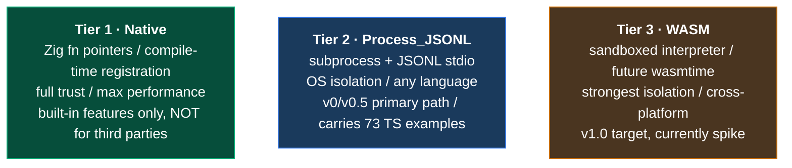
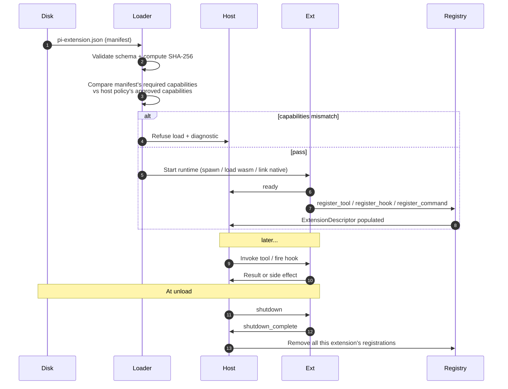
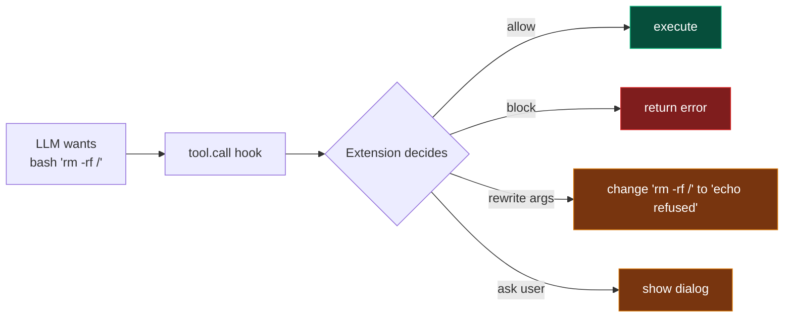
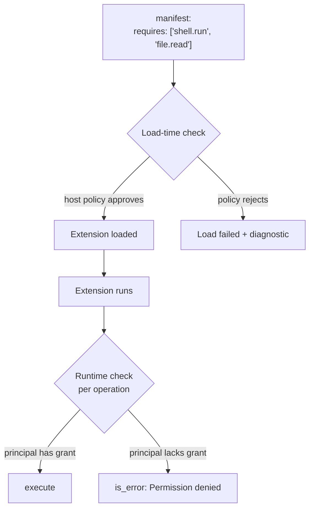

# Chapter 7 · Extensions

> The first six chapters covered the agent's core — LLM, tools, loop, safety. This chapter covers **how to let others safely add things**.

::: tip This is the most important chapter
Why? Because **all upper-layer features are extensions** — plan mode, sub-agent delegation, custom providers, terminal games (yes, TS-side has snake as an extension). An agent that can't be extended is dead; one that can is a platform.
:::

## 7.1 Why an extension system

When you write an AI agent, you're tempted to build every feature into the core: auto-commit, token tracking, dangerous-command guard, custom themes... down that road lies:


The point of an extension system is: "**Keep the core small. Make every feature a plugin. Users load on demand.**" That's the philosophy of Linux kernel modules, VS Code extensions, neovim plugins.

## 7.2 What extensions can do — 13 capability classes

```mermaid
flowchart TB
    classDef tool fill:#064e3b,stroke:#10b981,color:#fff
    classDef hook fill:#1a3a5c,stroke:#3b82f6,color:#fff
    classDef ui fill:#7c2d12,stroke:#ea580c,color:#fff
    classDef sys fill:#4a3520,stroke:#d97706,color:#fff
    classDef comm fill:#2d1b3d,stroke:#a855f7,color:#fff

    Ext[Extension]
    Ext --> T1[Register custom tools]:::tool
    Ext --> T2[Intercept built-in tool calls]:::tool
    Ext --> T3[Replace built-in tools]:::tool

    Ext --> H1[Subscribe to 35+ lifecycle hooks]:::hook
    Ext --> H2[Mutate dialog context]:::hook
    Ext --> H3[Intercept LLM request/response]:::hook

    Ext --> U1[Pop dialogs / list selectors]:::ui
    Ext --> U2[Custom header/footer]:::ui
    Ext --> U3[Render custom message types]:::ui

    Ext --> S1[Add slash commands]:::sys
    Ext --> S2[Add keybindings]:::sys
    Ext --> S3[Register LLM providers]:::sys
    Ext --> S4[Persist custom state]:::sys

    Ext --> C1[Inter-extension event bus]:::comm
    Ext --> C2[Spawn sub-agents]:::comm
```



13 classes, every one a real demand. Full list: **[extension system design study](/internals/extension-system)** §1.

::: info 73 real examples
The TS-side `packages/coding-agent/examples/extensions/` has **73 examples** spanning 18 categories — including 4 complete TUI games (`snake`, `space-invaders`, `tic-tac-toe`, `doom-overlay`). "The extension system can run games" is the strongest evidence of generality.
:::

## 7.3 Three-tier extension model

Not every extension needs the same isolation level. pi-mono-zig provides **three runtimes** along a "trust vs performance" spectrum:



### 7.3.1 Quick comparison

| Dimension | Tier 1 (native) | Tier 2 (process_jsonl) | Tier 3 (wasm) |
| --- | --- | --- | --- |
| Isolation | none (shared mem) | OS process | WASM sandbox |
| Startup | 0ms | 50-200ms | 5-50ms |
| Per-call latency | nanoseconds | ms (IPC) | ms (interpreter) |
| Languages | Zig only | any | wasm-targetable |
| Use case | built-in plan mode | existing TS extensions / Python tools | cross-platform sandbox tools |

### 7.3.2 Shared skeleton

The three runtimes differ, but **they fill the same data structure**:

```zig
pub const ExtensionDescriptor = struct {
    id: []const u8,
    runtime_kind: RuntimeKind,
    declared_capabilities: u32,    // 12-bit grant bitmask
    registered_tools: []const ToolDef,
    registered_commands: []const CommandDef,
    registered_hooks: []const HookSubscription,
    // ...
};
```

Each runtime parses its own artifact — native links a Zig module, jsonl parses JSON registration frames, wasm parses WIT — into the **same** descriptor. **The agent loop above doesn't care about runtime kind, only about descriptors.**

::: tip This is the hallmark of a good abstraction
"Three mechanisms, one model." This is Linux's VFS philosophy — the layer above doesn't care if you're ext4, NFS, or FUSE; they all answer to `read()` / `write()`.
:::

## 7.4 An extension's lifecycle



5 key steps:

1. **Discover**: scan `~/.pi/extensions/` + `./.pi/extensions/` + explicit `--extension` flags
2. **Validate**: parse manifest, check schema, compute SHA-256 (defends against "post-install tampering" supply chain attack)
3. **Load**: start the runtime appropriate to the kind
4. **Register**: extension tells host what it offers via the protocol
5. **Run**: host invokes the extension at appropriate moments

::: warning Loading is a contract
**"What I want" = negotiated at load time**. Manifest declares `requires: ['shell.run']` — if host policy doesn't approve, the extension is rejected outright. **This avoids the complexity of "loaded then realized I have no permission" error handling.**
:::

## 7.5 The 35 lifecycle hooks

Hooks are the event queue between extension and host. pi-mono partitions 35 hooks into 7 groups:

| Group | Count | Representative | Purpose |
| --- | --- | --- | --- |
| `session.*` | 8 | `session.start`, `session.before_compact` | Session switch / fork / compact lifecycle |
| `agent.*` | 5 | `agent.start`, `agent.end`, `agent.model_select` | Agent overall lifecycle |
| `turn.*` | 5 | `turn.start`, `turn.end`, `message.update` | Single-turn lifecycle |
| `tool.*` | 7 | `tool.call`, `tool.result`, `tool.execution_*` | Tool execution |
| `input.*` | 2 | `input.user_text`, `input.user_bash` | User input interception |
| `provider.*` | 3 | `provider.before_request`, `context` | LLM request/response |
| `resources.*` | 1 | `resources.discover` | Startup resource contribution |

### 7.5.1 Two kinds of hooks

**Notify** (`X.Y`): handler observes, **cannot change the result**.

```c
// e.g. turn.end - notifies a turn finished, extension records token count
int handle(void* ud, pi_hook_event_type_t t, const pi_hook_event_t* e, ...) {
    if (t == PI_HOOK_TURN_END) {
        my_telemetry.record_tokens(...);
    }
    return 0;
}
```

**Intercept** (`X.before_Y`): handler can **cancel the operation or modify args**.

```c
// e.g. tool.call - intercept before tool executes
int handle(void* ud, pi_hook_event_type_t t, const pi_hook_event_t* e,
            pi_hook_result_t* out) {
    if (t == PI_HOOK_TOOL_CALL) {
        if (is_dangerous_command(e)) {
            out->cancel = true;
            out->reason = "Blocked by guard policy";
        }
    }
    return 0;
}
```

### 7.5.2 Hook calling rules

`pi-mono-zig` follows the TS semantics; the **Zig implementation must match exactly**:

1. **Order**: handlers fire in extension load order, sequentially
2. **Async**: each handler awaited before the next
3. **Error isolation**: a handler's exception doesn't affect others; logged only
4. **Result chaining**: for `context` / `tool.call`-class hooks, later handlers see modifications from earlier handlers

## 7.6 Tool interception — the killer feature

If you could keep only two hooks, **`tool.call` and `tool.result` must stay**. They give extensions the **governance** capability — the watershed where the system goes from "toy" to "product."

### 7.6.1 What interception can do



### 7.6.2 Real example: dangerous command guard

```typescript
// permission-gate.ts (simplified)
export default (api) => {
  api.on('tool.call', async (event) => {
    if (event.tool_name === 'bash' && containsDangerous(event.args)) {
      const ok = await api.ui.confirm({
        title: 'Dangerous command detected',
        message: `Are you sure you want to run: ${event.args.cmd}?`,
      });
      if (!ok) {
        return { cancel: true, reason: 'User declined' };
      }
    }
  });
};
```

20 lines of TypeScript = a complete "dangerous command guard." The Zig equivalent will be similarly short. **This is the power of the extension system** — the core doesn't need to know "what commands are dangerous"; that business rule is plugged in, stackable, and toggleable.

### 7.6.3 Interception chains: stacking extensions

If 5 extensions all subscribe to `tool.call`, they fire in load order — any returning `cancel: true` short-circuits:


This gives users a **composable security model** — stack independent extensions to assemble a custom governance policy.

## 7.7 Capability boundaries and load-time checks

Recall [coding_agent dossier](/internals/coding-agent#6-enforcement-12-个-capability-的能力边界): 12 capabilities (`file.read` / `shell.run` / `network.request` / ...). The extension system checks them at **two** moments:



**Why two checks**:

1. **Load-time rejection** lets the extension know upfront what permission is missing — it can prompt the user or gracefully degrade.
2. **Runtime rejection** is **defense in depth** — even after passing load, dynamic policy changes (e.g. user says "this turn, no shell at all") still hold.

## 7.8 Cross-language ecosystem: the process_jsonl protocol

`process_jsonl` is the current primary path. The protocol fits in 30 lines:

```
Host spawns subprocess, connects stdin/stdout pipes
Extension sends via stdout:
  {"method":"ready"}
  {"method":"register_tool","name":"my_tool","label":"...","description":"...","parameters":{...}}
  {"method":"register_command","name":"slash_foo","handler_id":"h1"}
  {"method":"subscribe_hook","hook":"tool.call","handler_id":"h2"}

Host sends via stdin:
  {"method":"invoke_tool","name":"my_tool","args":{...},"id":42}
Extension replies:
  {"method":"tool_result","id":42,"content":[...],"is_error":false}

Host fires a hook:
  {"method":"hook","handler_id":"h2","event":{"type":"tool.call","args":{...}},"id":43}
Extension replies:
  {"method":"hook_result","id":43,"cancel":false}

At end:
  host: {"method":"shutdown"}
  ext:  {"method":"shutdown_complete"}
```

### 7.8.1 Why JSONL not JSON-RPC 2.0

JSON-RPC is more standardized but adds id tracking, batching, notifications — **overkill for an extension protocol**. One JSON per line is enough; debugging is just `cat stdin`.

### 7.8.2 Performance characteristics

| Operation | Latency |
| --- | --- |
| Subprocess spawn | 50-200ms |
| Single JSONL frame read/write | < 1ms |
| Tool call round trip (IPC) | 1-5ms |

This means **extensions start slow but call fast** — so the extension process is **long-lived** (until session ends), not spawned per call.

## 7.9 Inter-extension communication: the event bus

The 73 examples include `event-bus.ts` — multiple extensions need to talk. pi-mono offers a lightweight pub/sub:

```javascript
// Extension A
api.events.emit('my-app.user-action', { kind: 'click', x: 10 });

// Extension B
api.events.on('my-app.user-action', (data) => {
  console.log('B saw click at', data.x);
});
```

::: tip Naming convention
Event names live in the extension's own namespace (`my-app.X`) to avoid collisions. Same convention as Linux signals or Web Components custom events.
:::

The event bus is **soft coupling** — extension A doesn't know B exists; if B isn't installed, A's emit is a no-op.

## 7.10 Code in the repo

| Concept | File |
| --- | --- |
| Three runtimes | `zig/src/coding_agent/extensions/extension_runtime.zig` |
| Extension registry | `zig/src/coding_agent/extensions/extension_registry.zig` |
| process_jsonl impl | `zig/src/coding_agent/extensions/extension_host.zig` |
| WASM v0 spike | `zig/src/coding_agent/extensions/wasm/wasm_host_spike.zig` |
| WASM manifest parser | `zig/src/coding_agent/extensions/wasm/wasm_manifest.zig` |
| 12 caps + enforcement | `zig/src/coding_agent/extensions/enforcement.zig` |
| 73 TS examples | `packages/coding-agent/examples/extensions/` |

::: info Want to go deeper
- [coding_agent dossier §5](/internals/coding-agent#5-extensions-子系统) — code-level details of the three runtimes
- **[Extension system design study](/internals/extension-system)** — full TS↔Zig comparison + three-tier model + five-phase roadmap

The design study is this chapter's "system blueprint"; this chapter is its "teaching translation."
:::

## 7.11 Up next

We now have the full picture of "an agent that can be extended." One chapter remains:

- Chapter 8 — TUI and sessions (streaming render, replay, cancellation engineering)

Chapter 4 (provider abstraction) and Chapter 6 (coding agent in practice) will be backfilled later.

[**← Back to introduction**](./)

---

::: info Glossary

| Term | One-line definition |
| --- | --- |
| Three-tier model | Native / Process_JSONL / WASM runtimes |
| Lifecycle hooks | 35 event subscription points across 7 groups |
| Intercept hook | `X.before_Y`-named, can cancel or modify args |
| Notify hook | `X.Y`-named, observes only |
| Capability | 12 permission items, checked at load and run time |
| process_jsonl | Subprocess + JSONL stdio protocol; cross-language primary path |
| Event bus | Soft-coupled pub/sub for inter-extension communication |

:::
