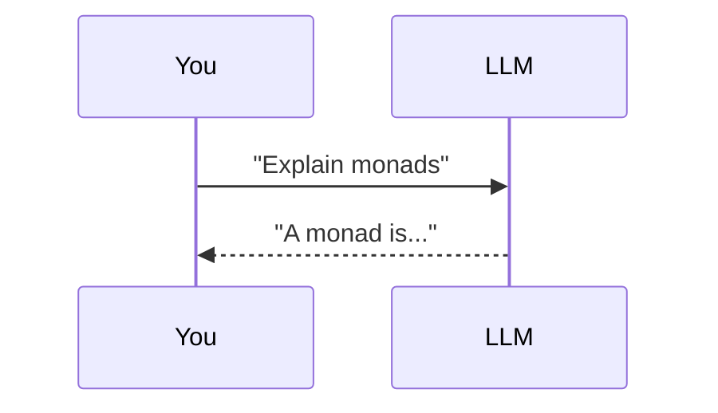
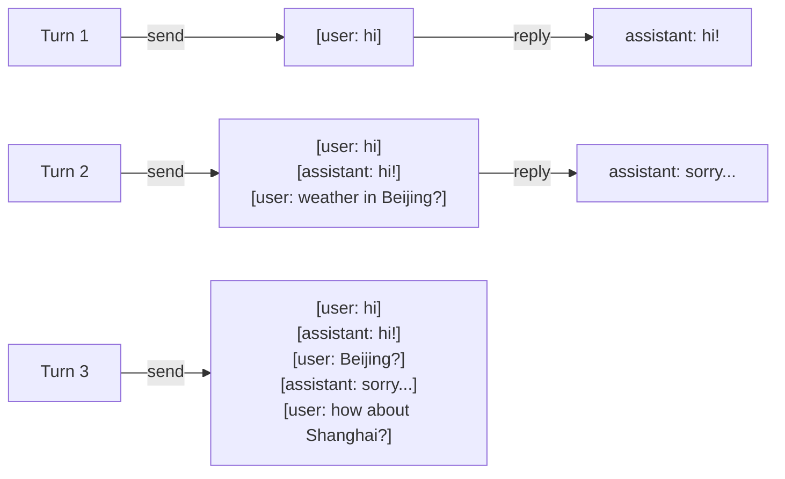
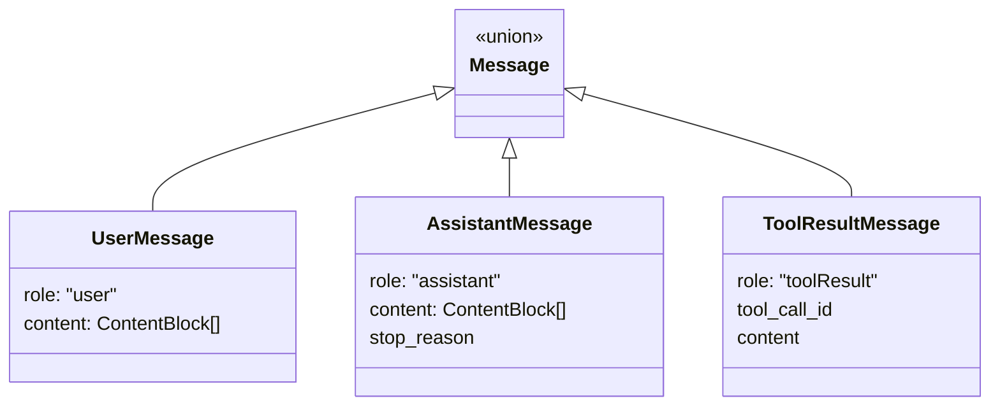
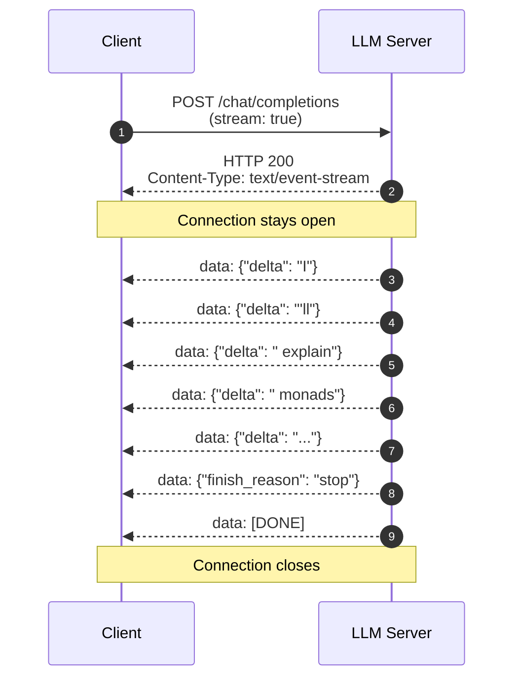
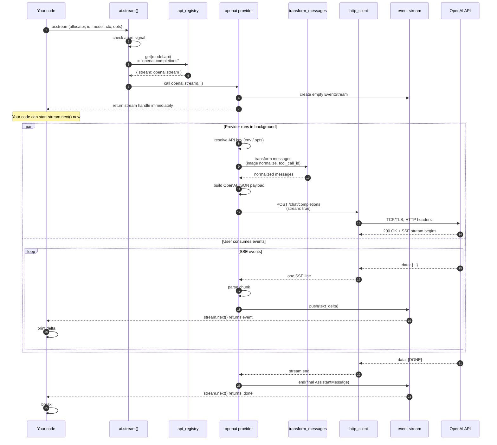

# Chapter 2 · The Shape of an LLM API

> One call, from the moment you press enter to characters streaming on screen. What actually happens in between.

Chapter 1 said "Agent = LLM + Tools + Loop." This chapter dissects the **L** in the middle. When you write `ai.stream(...)` in your code, the bytes travel through 10 layers of abstraction before reaching your eyes. Those 10 layers are the primitives of AI agent engineering.

## 2.1 What you think an LLM API is

If you've only used ChatGPT, your mental model probably looks like this:



One HTTP POST, one JSON response, done.

**That model has three holes**, which this chapter fills:

1. You're not sending "a string" — you're sending a **`messages` array**, the entire dialog history.
2. You're not getting back "a string" — you're getting a **stream of events**, generated token by token.
3. The wire is not normal HTTP — it's **SSE (Server-Sent Events)**, which turns one HTTP response into a long sequence of small frames.

## 2.2 First primitive: the `messages` array

### 2.2.1 LLMs have no memory

Newcomers' #1 trap. Chatting in ChatGPT *feels* like it remembers what you said. **It doesn't.** **Every request re-sends the entire dialog history.**



In `pi-mono-zig`, this array is `Context.messages`:

```zig
// zig/src/ai/types.zig
pub const Context = struct {
    system_prompt: ?[]const u8,
    messages: []const Message,
    tools: ?[]const Tool,
};
```

### 2.2.2 Four roles



Plus a fourth role tucked into `Context.system_prompt`: the **system message** — the model's "persona setup," always at the front, not part of the dialog history.

| Role | Author | Purpose |
| --- | --- | --- |
| `system` | You (the developer) | Set behavior: "You are a coding assistant" |
| `user` | End user | The actual question |
| `assistant` | The model | Model output (may include `tool_call`) |
| `toolResult` | Your agent framework | Tool execution results sent back to the model |

**Why this design?** LLMs are stateless — only by sending the whole history can the model "see" context. Roles let the model distinguish "me" from "the user."

::: tip Foreshadowing Chapter 5
The `toolResult` role is how the agent loop hands a tool's output back to the model. Remember the name; we'll come back to it.
:::

## 2.3 Second primitive: tokens

### 2.3.1 Tokens are not characters or words

LLMs don't see text. They see **integer sequences**. Your string is split into tokens, each mapped to a numeric ID.

```
"Hello, world!"
       ↓ tokenize
[15496, 11, 1917, 0]
```

Every model uses a different tokenizer (BPE, WordPiece, SentencePiece) but rules of thumb:

| Text | Approx tokens |
| --- | --- |
| 1 common English word | 1 token |
| 1 rare or compound English word | 2-4 tokens |
| 1 Chinese character | 1-3 tokens |
| 1 emoji | 1-3 tokens |
| 1 line of code | 5-20 tokens |

::: warning
**Chinese costs more tokens than English.** Same meaning, Chinese consumes ~2× the tokens. This dominates costs in long system prompts and multilingual context.
:::

### 2.3.2 Why bill by tokens

The compute cost of one inference scales with **token count, not character count**. So providers bill by tokens — it reflects physics, not pricing strategy.

`pi-mono-zig` tracks usage:

```zig
// zig/src/ai/types.zig
pub const Usage = struct {
    input: u32 = 0,
    output: u32 = 0,
    cache_read: u32 = 0,
    cache_write: u32 = 0,
    total_tokens: u32 = 0,
    cost: UsageCost = .{},
};
```

Note `cache_read` and `cache_write`: this is **prompt caching** (offered by Anthropic and others). Long system prompts are written once (slightly costlier) and read cheaply on subsequent requests. A good agent framework actively exploits this.

### 2.3.3 The context window

The maximum tokens a model can "see" at once is the **context window**:

| Model | Context window |
| --- | --- |
| GPT-4 classic | 8K / 32K |
| GPT-4 Turbo / 4o | 128K |
| Claude 3.5 / 4 | 200K |
| Claude with 1M context | 1M |
| Gemini 1.5 / 2 | 1M+ |

**This is the wall agents hit most often.** Long sessions + repo-wide search dumps + accumulated tool outputs fill the window fast. Chapter 5 covers how the agent loop handles "context is about to overflow."

## 2.4 Third primitive: streaming

### 2.4.1 Why not a single response

Technically the API could "wait until generation is done, then return the full string." But every provider streams by default, for three reasons:

1. **Latency feel**: 500-token responses take 5-10 seconds. One-shot = user stares at blank screen for 5s; streaming = first character arrives in 200ms.
2. **Cancellation**: when a user sees the model going off the rails, they can Ctrl-C and stop burning tokens.
3. **Observability**: you can stream tokens to a database / TUI as they arrive, instead of buffering everything in memory.

### 2.4.2 Shape of a stream



Each `data: {...}` is one **event**. These aren't normal HTTP responses — they're SSE-formatted frames.

## 2.5 Fourth primitive: SSE

### 2.5.1 What is SSE

SSE is part of the HTML5 standard. The body of an HTTP response is split into events using a tiny text format.

```
HTTP/1.1 200 OK
Content-Type: text/event-stream
Cache-Control: no-cache
Connection: keep-alive

data: {"id":"1","delta":"hello"}

data: {"id":"2","delta":" world"}

event: done
data: {"finish_reason":"stop"}

```

**Format rules are minimal**:
- Each event is a few lines
- Each line is `field: value`
- Events are separated by blank lines
- `data:` is the default field, repeatable (multiple `data:` lines concatenate)
- `event:` is optional, sets a type name

### 2.5.2 Why SSE not WebSocket

LLM API streams are **one-way** (server→client). WebSocket is bidirectional — overkill.

| Feature | SSE | WebSocket |
| --- | --- | --- |
| Protocol | Plain HTTP | Upgrade handshake |
| Direction | One-way | Bidirectional |
| Firewall traversal | ✅ It's HTTP | ⚠️ Needs explicit allow |
| Reconnect | Auto (built-in) | DIY |
| Format | Text (debuggable) | Binary optional |

### 2.5.3 SSE parsing in pi-mono-zig

```zig
// simplified from zig/src/ai/providers/openai_chat_sse.zig
while (try reader.readUntilDelimiterOrEof(buf, '\n')) |line| {
    if (line.len == 0) {
        // blank line = event boundary
        try emitEvent(current_event);
        current_event = .{};
        continue;
    }
    if (std.mem.startsWith(u8, line, "data: ")) {
        const payload = line[6..];
        if (std.mem.eql(u8, payload, "[DONE]")) {
            return;
        }
        try parseAndAccumulate(&current_event, payload);
    }
    // other prefixes (event:, id:)...
}
```

::: info First time reading Zig?
- `[]const u8` is a string slice (pointer + length).
- `try` re-throws errors upward, like Rust's `?`.
- `std.mem.startsWith` checks a prefix; `std.mem.eql` checks equality.
- `[6..]` slices from index 6 to the end.

Reading Zig is approachable — fewer keywords than Rust, slightly more than Go.
:::

## 2.6 Anatomy of a complete call

::: tip
This is the climax of the chapter. Internalize this and you understand 60% of "how AI moves" in this codebase.
:::

We trace the simplest call:

```zig
const stream = try ai.stream(allocator, io, model, .{
    .system_prompt = "You are a brief assistant.",
    .messages = &.{
        .{ .user = .{ .content = &.{.{ .text = .{ .text = "What is a monad?" } }} } },
    },
}, .{ .api_key = "sk-..." });
defer stream.deinit();

while (stream.next()) |event| {
    defer event.deinitTransient(allocator);
    switch (event.event_type) {
        .text_delta => std.debug.print("{s}", .{event.delta.?}),
        .done => break,
        else => {},
    }
}
```

### 2.6.1 The full byte path



### 2.6.2 The 10 layers on this path

| # | Layer | File | Job |
| --- | --- | --- | --- |
| 1 | Entry | `stream.zig` | Check abort, look up registry |
| 2 | Routing | `api_registry.zig` | String → function pointer |
| 3 | Provider shell | `providers/openai.zig` | Setup + error handling |
| 4 | Error template | `shared/provider_stream.zig` | "setup-or-emit" unified error path |
| 5 | Credentials | `env_api_keys.zig` | Resolve API key |
| 6 | Message normalize | `shared/transform_messages.zig` | Image, tool_call_id translation |
| 7 | Payload | `providers/openai_chat_payload.zig` | JSON serialization |
| 8 | HTTP | `http_client.zig` | Send request, read stream |
| 9 | SSE parse | `providers/openai_chat_sse.zig` | Lines → events |
| 10 | Event stream | `event_stream.zig` | Mutex queue + condvar |

::: warning This is not over-engineering
A newcomer sees 10 layers and thinks "way too much." But try removing any one:
- Remove 6 (message normalize) → image formats differ across providers, every provider repeats the logic 14 times.
- Remove 7 (shared payload) → every new OpenAI-compatible provider (Kimi, DeepSeek) re-copies 800 lines.
- Remove 4 (error template) → setup-time failures and runtime failures take different code paths, hard to maintain.
- Remove 10 (event stream) → providers call user callbacks directly, user code becomes coupled to provider internals, killing language bindings.

Every layer solves a real problem. This is what good engineering looks like.
:::

### 2.6.3 Key design point: errors are events

Notice layer 4's "setup-or-emit." It's a deeply Unix-flavored design:

```mermaid
flowchart LR
    Start[begin setup] --> Try{try}
    Try -->|missing API key| Emit1[push error_event<br/>to stream]
    Try -->|network failure| Emit2[push error_event<br/>to stream]
    Try -->|success| Run[run streaming generation]
    Run -->|generation fails| Emit3[push error_event<br/>to stream]
    Run -->|generation succeeds| Done[push done event]

    Emit1 --> User[user's next() sees error]
    Emit2 --> User
    Emit3 --> User
    Done --> User
```

**Benefit**: user code only needs one `while (stream.next())` loop. **All errors** — bad params, network, parsing, generation — become `error_event` in the same stream. This is the Linux "everything is a file" philosophy translated to AI: **everything is an event**.

## 2.7 Invisible but mandatory concerns

### 2.7.1 Cancellation (abort)

User hits Ctrl-C — the half-generated request must stop, not keep burning tokens.

```zig
// pi-mono-zig's abort pattern
var abort = std.atomic.Value(bool).init(false);

const stream = try ai.stream(allocator, io, model, ctx, .{
    .signal = &abort,
});

// from another thread:
abort.store(true, .seq_cst);
// stream checks the flag at every chunk boundary
```

Note `std.atomic.Value(bool)`, not a plain bool — concurrent reads/writes need atomics.

### 2.7.2 Retry

LLM APIs occasionally 429 (rate limit), 500 (server), or time out. Production agents must retry, but watch out:

- **Exponential backoff**: 1s → 2s → 4s → 8s, to avoid thundering herd.
- **Total deadline**: per-attempt retries can stack — bound the total wait.
- **Idempotency**: streaming generation is *not* idempotent — retry produces *different* output. This matters in the agent loop (Chapter 5).

`StreamOptions.max_retry_delay_ms` caps the per-attempt backoff.

### 2.7.3 Timeouts

| Type | Meaning | Typical |
| --- | --- | --- |
| **Connect** | TCP/TLS handshake limit | ~30s |
| **First-byte** | After headers, until first SSE event | ~60s |
| **Idle** | Max gap between events | ~30-90s |
| **Total** | Whole request | ~5-10min |

**Trap**: thinking-mode models (Claude thinking, o1) often go silent for tens of seconds. A naive idle timeout will kill them. `pi-mono-zig` raises this for thinking models.

## 2.8 Code in the repo for this chapter

| Concept | File |
| --- | --- |
| `messages` array | `zig/src/ai/types.zig` (`Message`, `Context`) |
| Token usage | `zig/src/ai/types.zig` (`Usage`, `UsageCost`) |
| Streaming events | `zig/src/ai/types.zig` (`AssistantMessageEvent`, `EventType`) |
| SSE parsing | `zig/src/ai/providers/openai_chat_sse.zig` |
| Top-level entry | `zig/src/ai/stream.zig` |
| Provider abstraction | `zig/src/ai/api_registry.zig` |
| Full OpenAI implementation | `zig/src/ai/providers/openai.zig` |

::: info Want to go deeper
Full architectural dossier — internal layout, C ABI assessment, design smells — at **[ai module dossier](/internals/ai)**. This chapter is its teaching translation.
:::

## 2.9 Up next

We have the complete picture of the first agent ingredient: **LLM APIs are messages-based, streaming, SSE-protocol, cancellable, and errors-are-events.**

Chapter 3 covers the second ingredient: **tool calling**. We'll answer:

- How does the LLM "know" what tools are available?
- How does it "decide" which tool to call and with what arguments?
- How do you feed the tool's output back to the model?
- What if the LLM hallucinates a tool that doesn't exist?

[**Continue to Chapter 3: Tool Calling →**](./) <!-- TODO -->

---

::: info Glossary

| Term | One-line definition |
| --- | --- |
| `messages` array | The full dialog history, re-sent every request |
| system prompt | Persona setup, always at the front |
| token | Integer unit the model sees; billing unit |
| context window | Max tokens the model can see at once |
| streaming | Generating + returning simultaneously |
| SSE | Plain-text server→client event protocol |
| prompt caching | Cache long system prompts on the server side |

:::
