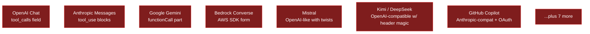
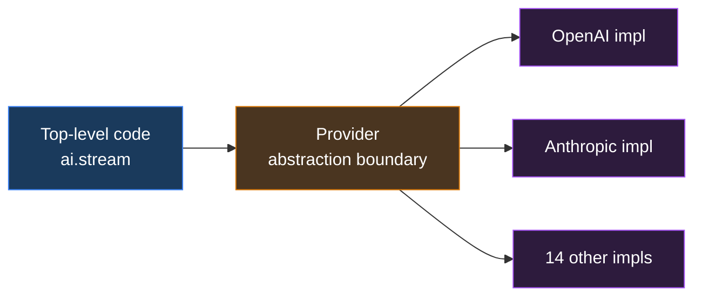
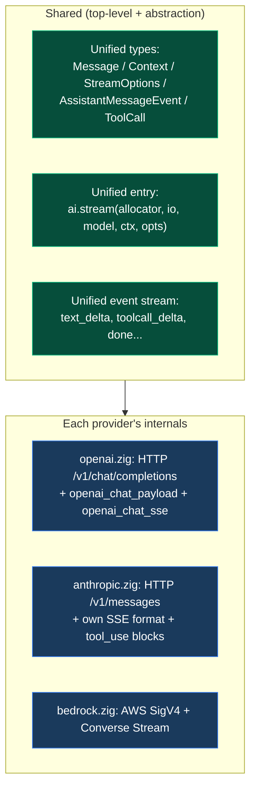
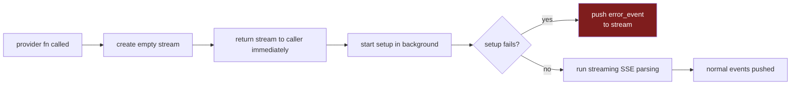
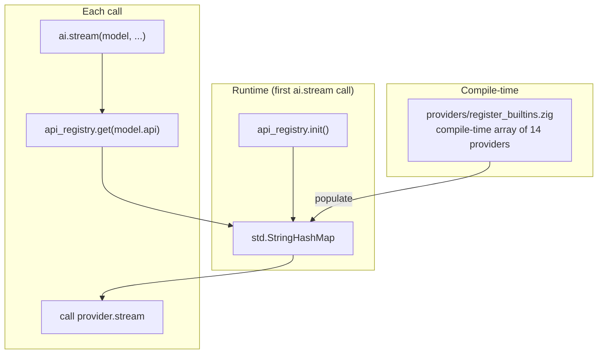

# Chapter 4 · The Provider Abstraction

> Chapter 2 showed the LLM API wire format; Chapter 3 showed three providers' tool-calling shapes are mutually incompatible. This chapter solves a concrete engineering problem: **14 LLM providers each have a different API. How do we call all of them with one codebase?**

## 4.1 The problem: API shapes diverge

OpenAI, Anthropic, and Google alone have completely different wire formats ([Chapter 3 §3.6](./tool-calling#36-three-providers-differ)). Add Bedrock, Mistral, Kimi, DeepSeek, xAI, Groq, Cerebras, OpenRouter, Vercel AI Gateway, Cloudflare AI Gateway, Azure OpenAI, Google Vertex, GitHub Copilot...



Per-provider differences:

| Dimension | Examples |
| --- | --- |
| **HTTP path** | `/v1/chat/completions` vs `/v1/messages` vs `/models/X:streamGenerateContent` |
| **Auth method** | `Authorization: Bearer` / `x-api-key` / AWS SigV4 / OAuth |
| **Request body** | `messages` array / `system + messages` / `contents.parts` |
| **Streaming framing** | SSE `data:` / custom newline / chunked binary |
| **stop_reason** | "stop" / "end_turn" / "STOP" / "tool_use" |
| **Tool-call format** | Three completely different shapes (Chapter 3) |
| **Error shape** | HTTP body / JSON error field / custom wrapper |

Without abstraction, top-level code becomes `if openai then ... else if anthropic ...` — **shredded by 14 branches**.

## 4.2 What the abstraction layer aims for



Ideally: **top-level code doesn't know there are 14 providers, only one interface.** Differences are sealed inside provider implementations.

But perfect abstraction doesn't exist — some differences (thinking mode, prompt cache) are **fundamentally different semantics** and can't be flattened. So real-world abstractions are **"managing how much difference is exposed, not eliminating it all."**

## 4.3 pi-mono-zig's abstraction shape

Recall [ai dossier §5](/internals/ai#5-provider-抽象怎么实现): the abstraction is the Linux-kernel `struct file_operations` pattern — **a set of function pointers wrapped in a struct**:

```zig
// from zig/src/ai/api_registry.zig
pub const StreamFunction = *const fn (
    allocator: std.mem.Allocator,
    io: std.Io,
    model: types.Model,
    context: types.Context,
    options: ?types.StreamOptions,
) anyerror!event_stream.AssistantMessageEventStream;

pub const ApiProvider = struct {
    api: types.Api,                // "openai-completions"
    stream: StreamFunction,
    stream_simple: StreamFunction,
};
```

Each provider = **one Zig file + two function pointers**. Registered into a global `StringHashMap`.

### 4.3.1 The shape of the abstraction boundary



### 4.3.2 What differences the abstraction "exposes"

Perfect abstraction doesn't exist. pi-mono-zig **deliberately exposes 30+ provider-specific fields** in `StreamOptions`:

```zig
pub const StreamOptions = struct {
    // Generic
    temperature: ?f32 = null,
    max_tokens: ?u32 = null,
    api_key: ?[]const u8 = null,
    headers: ?std.StringHashMap = null,
    signal: ?*std.atomic.Value(bool) = null,

    // Anthropic-specific
    anthropic_thinking_enabled: bool = false,
    anthropic_thinking_budget: ?u32 = null,
    anthropic_cache_retention: CacheRetention = .unset,

    // OpenAI-specific
    openai_reasoning_effort: ?[]const u8 = null,

    // Google-specific
    google_thinking: ?GoogleThinkingMode = null,

    // Bedrock-specific
    bedrock_region: ?[]const u8 = null,

    // Mistral / Kimi / Azure / ...
    // (~20 more provider-specific fields)
};
```

::: warning A "mature imperfection"
30+ provider-specific fields is a **known design smell** ([ai dossier §7](/internals/ai#7-设计气味) item 1), but it's a **known acceptable compromise**:

- **Hide them**: top-level code can't use provider features (thinking, prompt cache)
- **Fully flatten**: every new feature requires a `StreamOptions` change
- **Current middle ground**: core fields in `SimpleStreamOptions`, specific fields in `StreamOptions`

The C ABI ([Appendix A](/appendix/c-abi-v0)) takes a third path: expose `pi_options_set_provider_json(opts, "{\"thinking_enabled\": true}")` — pass provider-specific settings as JSON.
:::

## 4.4 Tour of the 14 providers

| Provider | File | LOC | Notes |
| --- | --- | --- | --- |
| `openai` | `openai.zig` | 2.3k | OpenAI Chat Completions (the original) |
| `openai_responses` | `openai_responses.zig` | 3.7k | OpenAI Responses API (new gen, with reasoning) |
| `openai_codex_responses` | `openai_codex_responses.zig` | 2.2k | Codex-specific variant |
| `azure_openai_responses` | `azure_openai_responses.zig` | 1.9k | Azure-hosted with own auth |
| `anthropic` | `anthropic.zig` | 4.0k | Largest impl; thinking + cache |
| `google` | `google.zig` | 1.9k | Generative AI Studio |
| `google_vertex` | `google_vertex.zig` | 2.1k | Vertex AI (IAM auth) |
| `google_gemini_cli` | `google_gemini_cli.zig` | 1.4k | Credentials via `gcloud` CLI |
| `bedrock` | `bedrock.zig` | 3.7k | AWS Converse Stream + SigV4 |
| `mistral` | `mistral.zig` | 1.8k | OpenAI-like but `prompt_mode` differs |
| `kimi` | `kimi.zig` | 1.5k | OpenAI-compat + Chinese provider |
| `cloudflare` | `cloudflare.zig` | 0.2k | Just routing to AI Gateway |
| `faux` | `faux.zig` | 1.4k | **Test fake provider**, scriptable locally |
| Helper | `openai_chat_payload.zig` | 1.1k | Shared request builder for OpenAI-compat |
| Helper | `openai_chat_sse.zig` | 0.9k | Shared SSE parser for OpenAI-compat |

::: tip The faux provider's value
`faux` calls no real LLM; it pretends to generate based on a script. **This is critical for testing the agent loop** — unit tests need no API key, no money, fully replayable.
:::

## 4.5 Anatomy of one provider

Simplified skeleton of `openai.zig`:

```zig
pub fn stream(
    allocator: std.mem.Allocator,
    io: std.Io,
    model: types.Model,
    context: types.Context,
    options: ?types.StreamOptions,
) !event_stream.AssistantMessageEventStream {
    // 1. Create empty event stream (return immediately to caller)
    var stream_handle = createAssistantMessageEventStream(allocator, io);

    // 2. Hand production logic to the setup-or-emit template
    return runSetupOrEmit(stream_handle, struct {
        fn run(stream: *AssistantMessageEventStream, ...) !void {
            // 2.1 Resolve API key
            const api_key = try resolveApiKey(options, "OPENAI_API_KEY");

            // 2.2 Normalize messages (images, tool_call_id)
            const transformed = try transform_messages.transform(...);

            // 2.3 Build request payload
            const payload = try openai_chat_payload.build(...);

            // 2.4 Fire HTTP
            var http_stream = try http_client.requestStreaming(payload, ...);
            defer http_stream.deinit();

            // 2.5 Parse SSE chunks, push events into stream
            try openai_chat_sse.parseStream(http_stream, stream);
        }
    }.run);
}
```

**The whole file is 2300 lines** — most handle edge cases (retries, timeouts, reasoning fields, tool_call accumulation). But the skeleton is these 5 steps.

### 4.5.1 setup-or-emit is the core template

Recall [ai dossier §1.2](/internals/ai#1-2-内部依赖图): every provider runs through `shared/provider_stream.zig::runSetupOrEmit`. This template does one thing:



**All errors become `error_event` events**. The caller's `while (stream.next())` loop handles them uniformly. This is the concrete realization of "errors are events" from Chapter 2 §2.6.3.

## 4.6 Registration and lookup



`model.api` is a string (e.g. `"openai-completions"`), `registry.get(api)` returns the `ApiProvider` struct holding two function pointers.

::: info Why this design works
**String keys, not enum keys** — third parties can register new providers without touching core. **Providers don't know about the registry** — they just export functions matching `StreamFunction`; registration is centralized in `register_builtins.zig`. This is the Linux kernel `module_init()` pattern.
:::

## 4.7 Adding a new provider — 5 steps

1. Create `providers/<name>.zig`, export `pub fn stream(...)` and `pub fn streamSimple(...)`.
2. Add a metadata entry in `providers/register_builtins.zig`.
3. Add an import in `root.zig`'s `providers` namespace (optional).
4. Write a smoke test.
5. Update `KnownApi` / `KnownProvider` enums (documentation only).

**Only step 1 has real informational content.** Steps 2–5 are mechanical registration — the hallmark of good abstraction: **adding extensions doesn't change the core**.

::: tip OpenAI-compat shortcut
If the new provider is OpenAI-compatible (DeepSeek, xAI, Groq, Cerebras, OpenRouter all are), you can **directly reuse `openai_chat_payload.zig` + `openai_chat_sse.zig`**. The new provider file only needs 200–500 lines (auth headers + model name mapping). 6 of pi-mono-zig's 14 providers are implemented this way.
:::

## 4.8 Where the abstraction is heading

The 30+ field `StreamOptions` design smell is a known issue. [ai dossier §10](/internals/ai#10-待讨论的设计抉择) item 2 proposes an **"extension slot"** mechanism:

```zig
pub const StreamOptions = struct {
    // Generic core fields (~10)
    ...

    // Extension slot: provider parses its own
    provider_options: ?*anyopaque = null,
};
```

Each provider defines its own `OpenAIOptions` / `AnthropicOptions` types, callers pass typed builders that yield `*anyopaque`. This stops `StreamOptions` from growing forever, at the cost of slight caller-side complexity.

The C ABI (pi.h) already moves in this direction — `pi_options_set_provider_json` carries provider-specific settings as JSON.

## 4.9 Code in the repo

| Concept | File |
| --- | --- |
| Abstraction entry | `zig/src/ai/stream.zig` (5 functions + dispatcher) |
| Provider registry | `zig/src/ai/api_registry.zig` |
| Built-in provider list | `zig/src/ai/providers/register_builtins.zig` |
| 14 provider impls | `zig/src/ai/providers/*.zig` |
| OpenAI-compat shared | `zig/src/ai/providers/openai_chat_payload.zig` + `openai_chat_sse.zig` |
| setup-or-emit template | `zig/src/ai/shared/provider_stream.zig` |
| Message normalization | `zig/src/ai/shared/transform_messages.zig` |
| Test fake provider | `zig/src/ai/providers/faux.zig` |

::: info Want to go deeper
- [ai module dossier](/internals/ai) — full architecture + abstraction code structure + C ABI assessment
- §5 of the dossier ("How is the provider abstraction implemented") is the system view; this chapter is the reader view
:::

## 4.10 Up next

We've now covered the book's full conceptual core:

- Chapter 1 — What is an AI Agent
- Chapter 2 — The Shape of an LLM API
- Chapter 3 — Tool Calling
- **Chapter 4 — Provider Abstraction** (you are here)
- Chapter 5 — The Agent Loop
- Chapter 7 — Extensions
- Appendix A — C ABI v0.1

The remaining chapters are **applied** — putting the core concepts into specific contexts:

- Chapter 6 — Coding Agent (the 8 concrete tools + safety in practice)
- Chapter 8 — TUI and sessions (streaming render + replay + engineering practice)

[**← Back to introduction**](./)

---

::: info Glossary

| Term | One-line definition |
| --- | --- |
| Provider abstraction | Contains the 14 LLM API differences within a set of function pointers |
| `StreamFunction` | Function signature each provider must export |
| `ApiProvider` | Struct = api string + two function pointers |
| setup-or-emit | Template that turns setup-time errors into events too |
| OpenAI-compat family | DeepSeek/xAI/Groq etc., share OpenAI request/SSE impl |
| faux provider | Fake test impl, no real API calls |

:::
