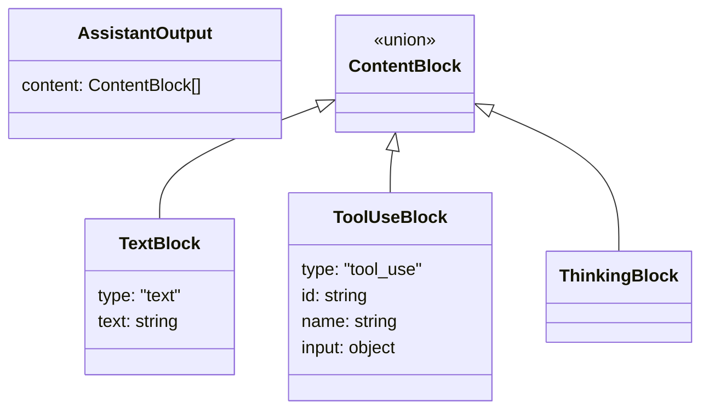
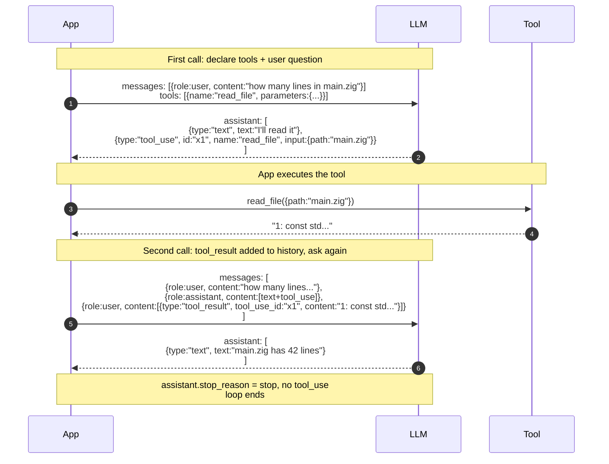
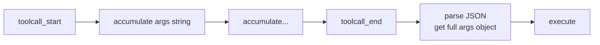

# Chapter 3 · Tool Calling

> Chapter 2 showed how LLM APIs talk. Chapter 5 showed how the agent loop runs. This chapter is the bridge between them — **how the LLM "calls" a tool**.

::: tip Chapter ordering
This chapter would normally come right after Chapter 2, but we wrote Chapter 5 first while the agent module was fresh. So this is a back-fill. **If you're reading in order, continue down. If you've already read Chapter 5, this will be easier — you already know what the loop looks like; this fills in the "tool call" cell of it.**
:::

## 3.1 The two ends of the bridge

```mermaid
flowchart LR
    L[LLM<br/>"I want to read foo.txt"] -.tool_use.-> A
    A[Agent] -.execute.-> T[Tool<br/>actually reads file]
    T -.result.-> A
    A -.tool_result.-> L

    style L fill:#1a3a5c,color:#fff
    style A fill:#4a3520,color:#fff
    style T fill:#064e3b,color:#fff
```

Both ends speak "languages." The LLM only knows JSON; the tool is real code. This chapter is about **how those two ends translate to each other**.

The whole tool-calling protocol reduces to a three-step pattern:

1. **Declare**: tell the LLM "you have these tools, each shaped like this."
2. **Request**: the LLM emits "I want to call tool X with args Y" — that thing is `tool_use`.
3. **Reply**: you execute, wrap the result into `tool_result`, and include it in the next round of dialog history.

## 3.2 Step 1: Declare the tool (Function Schema)

LLMs don't "read code." They only see a JSON description. That description is called a **function schema**, essentially a subset of [JSON Schema](https://json-schema.org/).

### 3.2.1 The simplest declaration

```json
{
  "name": "read_file",
  "description": "Read the contents of a file at the given path.",
  "parameters": {
    "type": "object",
    "properties": {
      "path": {
        "type": "string",
        "description": "Absolute or relative file path"
      },
      "offset": {
        "type": "integer",
        "description": "Line number to start at (0-based)",
        "default": 0
      }
    },
    "required": ["path"]
  }
}
```

Three fields the LLM sees:

| Field | What it is | Why it matters |
| --- | --- | --- |
| `name` | The tool's identifier | The LLM uses it to refer to the tool |
| `description` | Natural-language explanation | **Determines when the LLM thinks of using this tool** — writing this well matters more than the code itself |
| `parameters` | JSON Schema | Tells the LLM what arguments look like and which are required |

::: warning Tool descriptions ARE prompt engineering
The LLM reads every word in `description`. **"Read a file"** vs **"Read the contents of a file at the given path, returning text up to a default of 2000 lines"** — the latter makes the LLM use it more proactively and incorrectly less often. This is not documentation; it's an instruction to the LLM.
:::

### 3.2.2 In pi-mono-zig

Each tool's schema is **generated in code**, not stored as a JSON file:

```zig
// simplified from zig/src/coding_agent/tools/read.zig
pub fn schema(allocator: std.mem.Allocator) !std.json.Value {
    var properties = std.json.ObjectMap.init(allocator);
    try properties.put("path", .{ .object = ... });
    try properties.put("offset", .{ .object = ... });

    var schema_obj = std.json.ObjectMap.init(allocator);
    try schema_obj.put("type", .{ .string = "object" });
    try schema_obj.put("properties", .{ .object = properties });
    try schema_obj.put("required", .{ .array = ... });
    return .{ .object = schema_obj };
}
```

::: info Why not JSON files
- Type consistency: the parameter definition stays in sync with the Zig struct fields, the compiler can check.
- I18n: descriptions can be generated dynamically from user locale.
- Performance: no runtime disk read / parse.

Cost: changing the schema requires changing code, no "configuration" approach. Classic built-in vs configurable trade-off.
:::

## 3.3 Step 2: The LLM's tool_use request

When the LLM decides to call a tool, its output is **not normal text** but a special "tool_use block." The shape varies across providers, but the semantics are uniform:



Anthropic's actual JSON:

```json
{
  "role": "assistant",
  "content": [
    { "type": "text", "text": "Let me read that file for you." },
    {
      "type": "tool_use",
      "id": "toolu_01ABC",
      "name": "read_file",
      "input": { "path": "src/main.zig", "offset": 0 }
    }
  ]
}
```

Four key fields:

| Field | Purpose |
| --- | --- |
| `type: "tool_use"` | Distinguishes this block from plain text |
| `id` | Unique identifier — **the tool_result MUST carry this id back** |
| `name` | The `name` from your declaration |
| `input` | Parsed JSON object matching your declared parameters schema |

## 3.4 Step 3: Your tool_result reply

After executing the tool, you wrap the result into a "tool_result block" and **drop it into the next message in the dialog history**:

```json
{
  "role": "user",
  "content": [
    {
      "type": "tool_result",
      "tool_use_id": "toolu_01ABC",
      "content": "1: const std = @import(\"std\");\n2: ...",
      "is_error": false
    }
  ]
}
```

Three things to notice:

1. **role is `user`** — even though you're not literally a user. From the LLM's view, "tool feedback" is equivalent to "feedback from the environment," which lives in the user role.
2. **`tool_use_id` must equal the id the LLM gave you** — otherwise the model can't match the result to the call.
3. **`is_error: true` is special** — it tells the LLM "this call failed; what you see is the error." The LLM decides to retry, switch tools, or give up.

## 3.5 The full round trip

Stitching the three steps together: a complete wire trace of "the agent reads a file for you":



::: tip This is the actual data flow inside the agent loop
Recall the 10-line pseudocode from Chapter 5 §5.1 — every `state.append(.{.tool_result = result})` is appending this JSON to the messages array. **The whole agent loop, fundamentally, just keeps reassembling this messages array each iteration.**
:::

## 3.6 The three providers differ

OpenAI, Anthropic, and Google have **different** wire formats. The pi-mono-zig `transform_messages` and provider modules (see [ai dossier](/internals/ai)) exist to flatten these differences.

### 3.6.1 Comparison table

| Dimension | Anthropic | OpenAI Chat Completions | Google Gemini |
| --- | --- | --- | --- |
| **assistant output shape** | `content: [{type:"tool_use", ...}]` | `tool_calls: [{id, type:"function", function:{name, arguments:string}}]` | `content.parts: [{functionCall:{name, args}}]` |
| **arguments format** | Parsed object | **JSON string** (parse again!) | Parsed object |
| **tool_result role** | `user` + `content: [{type:"tool_result"}]` | A separate `role: "tool"` | `function_response` part |
| **id field name** | `id` | `tool_call_id` | No explicit id (positional) |

### 3.6.2 OpenAI's "double JSON" trap

```json
// OpenAI tool call
{
  "id": "call_abc",
  "type": "function",
  "function": {
    "name": "read_file",
    "arguments": "{\"path\":\"main.zig\"}"  // ← yes, a string!
  }
}
```

`arguments` is a **JSON string**, not a JSON object. This is historical baggage — OpenAI's early function calling was designed with strings, and they couldn't change it later.

::: warning This means streaming requires double accumulation
1. First, accumulate all `arguments` delta strings.
2. After the full string is in, `JSON.parse` it once more.

This is why [agent dossier](/internals/agent)'s `PartialToolCallBlock.arguments` is a `std.ArrayList(u8)` not `std.json.Value` — it stores the **un-parsed string**.
:::

## 3.7 Streaming tool calls: arguments are also deltas

Easiest trap: **when streaming, tool call arguments also arrive piece by piece**. You don't get `{"path":"main.zig"}` as one chunk — you get:

```
SSE event sequence:
  toolcall_start (id="x1", name="read_file")
  toolcall_delta (delta='{"pa')
  toolcall_delta (delta='th":"m')
  toolcall_delta (delta='ain.zig"}')
  toolcall_end
```

This is why pi-mono-zig's `event_stream` has `text_delta`, `thinking_delta`, **and** `toolcall_delta` — they all correspond to the model "thinking out loud," just with different content shapes.



::: tip Streaming isn't only for UX
"Why not just wait for the full output?" — beyond UX latency, **a real reason: cancellability**. If the model has emitted 50% of the args and you realize it's about to call a dangerous tool (`rm -rf`), the user can Ctrl-C and **save the cost of the remaining 50% tokens**. This is one application of Chapter 5 §5.7's cooperative abort.
:::

## 3.8 Three common pitfalls

### 3.8.1 LLM hallucinates a non-existent tool

The LLM occasionally calls a tool you didn't declare — perhaps `web_search` or `calculator` from its training data. Handle:

```zig
// from agent_loop.zig (simplified)
const tool = findTool(tools, tool_call.name) orelse {
    return .{
        .content = makeText("Unknown tool: " ++ tool_call.name),
        .is_error = true,
    };
};
```

Return `is_error: true` plus an explanation. **The LLM will usually switch to a real tool** — e.g. replace `web_search` with the local `grep`.

### 3.8.2 Bad arguments

```
LLM thinks: read_file({"path": null})  ← bad arg
```

JSON Schema validation happens in the `prepare_arguments` hook (Chapter 5 §5.5). On failure, return `is_error: true` and let the LLM correct itself.

::: warning Don't panic on validation failure
Some early agent frameworks throw exceptions and terminate the loop. **The right move is to put the error in the dialog history** — the LLM will self-correct on seeing the message. This extends the "errors are data" philosophy.
:::

### 3.8.3 Multiple tool_calls in one turn

LLM output can contain multiple tool_use blocks — "read foo.txt then grep TODO." Three handling modes:

| Mode | Behavior |
| --- | --- |
| **Sequential** | One at a time; tool_results pushed in order |
| **Parallel** | Run simultaneously (pi-mono default; see agent dossier §6) |
| **Mixed** | Plain tools parallel; tools marked `.sequential` serialize |

Each tool_result must carry its `tool_use_id` — the LLM matches by id, not order.

## 3.9 Safety boundary: tools and capabilities

::: tip Key pi-mono-zig design
Not every tool_call should be allowed. **The `bash` tool can run any command — do you really want to give the LLM that power**?
:::

pi-mono-zig uses 12 canonical **capability grants** ([coding_agent dossier §6](/internals/coding-agent#6-enforcement-12-个-capability-的能力边界)) for control:

```
file.read      file.write      network.request  shell.run
env.read       model.call      session.read     session.write
ui.notify      tool.use        agent.spawn      agent.delegate
```

At each tool execution, the framework checks "does this principal have the required grant?" — denied if not. **An SDK consumer can construct a `file.read`-only principal to lock the agent down to read-only mode.**

```mermaid
flowchart LR
    Call[LLM wants bash] --> Check{principal has<br/>shell.run grant?}
    Check -->|yes| Exec[execute]
    Check -->|no| Deny[is_error: true<br/>"Permission denied"]
```

Chapter 7 expands the full capability / enforcement model.

## 3.10 Code in the repo

| Concept | File |
| --- | --- |
| Schema definition (each tool has `schema()`) | `zig/src/coding_agent/tools/*.zig` |
| Anthropic's tool_use wire format | `zig/src/ai/providers/anthropic.zig` |
| OpenAI's "double JSON" args | `zig/src/ai/providers/openai_chat_payload.zig` |
| Streaming tool call accumulation | `zig/src/agent/agent_loop.zig` (`PartialToolCallBlock`) |
| 4 tool hooks (prepare/before/execute/after) | `zig/src/agent/types.zig` |
| 12 capabilities and enforcement | `zig/src/coding_agent/extensions/enforcement.zig` |

::: info Want to go deeper
- [ai module dossier](/internals/ai) — provider abstraction, SSE parsing
- [agent module dossier](/internals/agent) — exact signatures of the 4 hooks
- [coding_agent module dossier](/internals/coding-agent) — 8 tool implementations + enforcement model
:::

## 3.11 Up next

We've now seen both ends of the LLM ↔ Tool bridge in full. Remaining chapters:

- Chapter 4 (TBD) — Provider abstraction (how OpenAI / Anthropic / Google differences are flattened to a unified API)
- Chapter 6 — Coding Agent (the 8 concrete tools + safety in practice)
- Chapter 7 — Extensions (how to safely let others add tools)
- Chapter 8 — TUI and sessions (streaming render, replay, cancellation)

[**← Back to introduction**](./)

---

::: info Glossary

| Term | One-line definition |
| --- | --- |
| function schema | JSON Schema describing tool parameters; declared to the LLM |
| tool_use | Special block in LLM output: "I want to call tool X" |
| tool_result | The block you return: "tool execution result" |
| tool_use_id | Unique id linking a request to its reply |
| Hallucinated tool | LLM called a tool that doesn't exist |
| capability / grant | Permission item controlling whether the agent can call a class of tools |
:::
