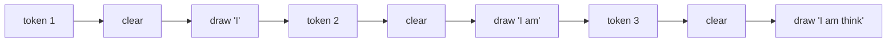
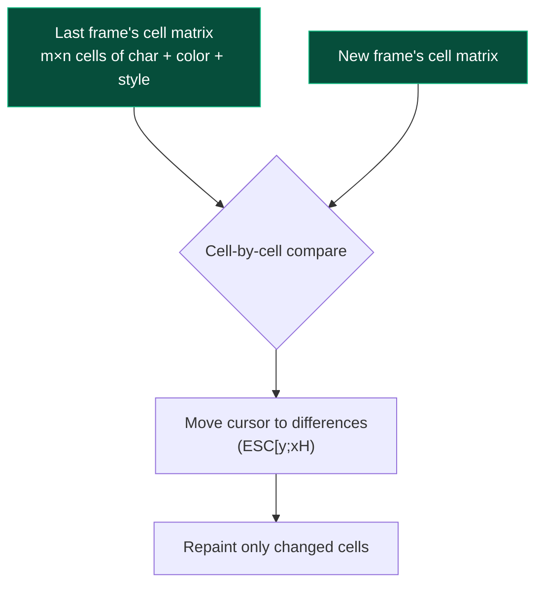
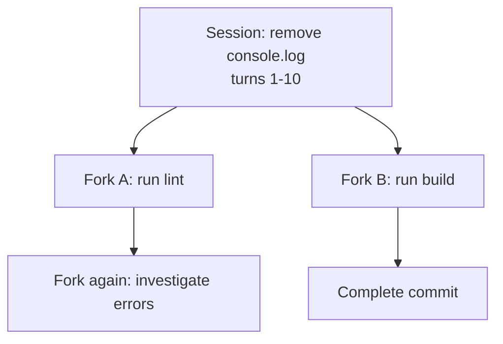

# Chapter 8 · TUI and Sessions

> The book's last chapter. The first 7 covered "how the agent thinks inside" — this one covers "how the agent is seen, remembered, and interrupted."

## 8.1 Three engineering problems that are really one

A working coding agent must solve three things:

1. **Streaming render**: show tokens as the model emits them — **don't wait for all to arrive** (a 5-second wait feels eternal).
2. **Session persistence**: user closes the terminal, reopens, picks up yesterday's conversation — **don't let 50K tokens of context evaporate**.
3. **Cancellable**: user sees the agent going down a wrong path and Ctrl-Cs — **don't keep burning tokens and money**.

These look unrelated, but **at the bottom they're three faces of the same thing**: real-time event-stream processing.

```mermaid
flowchart LR
    classDef stream fill:#1a3a5c,stroke:#3b82f6,color:#fff

    Source[Agent event stream]:::stream
    Source --> R[Streaming render<br/>"on the screen"]
    Source --> P[Persistence<br/>"to disk"]
    Source --> A[Abort listening<br/>"reverse channel"]
```

Chapter 5 §5.8 planted this seed: "The agent only emits events; UI/storage/telemetry subscribe." This chapter is its concrete grounding.

## 8.2 Streaming render: differential screen updates

### 8.2.1 The naive approach is broken

The simplest implementation: "clear and redraw on every new token":



**Problems**:

- **Flicker**: every clear redraws all pixels, visibly flashing
- **Slow**: terminals send ANSI sequences character-by-character; over SSH it's worse
- **Scroll misalignment**: previously rendered content (older messages, tool output) gets redrawn too

### 8.2.2 Differential rendering

The pi-mono-zig TUI module uses this:



**Core idea**: **the screen is a char-cell matrix; each frame only updates changed cells**.

In code:

```zig
// from zig/src/tui/cell_rows.zig
pub const Cell = struct {
    char: u21,           // Unicode codepoint
    fg: Color,
    bg: Color,
    style: Style,        // bold/italic/underline
};

pub const CellRows = struct {
    rows: [][]Cell,      // rows × columns
    pub fn diff(old: CellRows, new: CellRows, output: *AnsiWriter) !void {
        // Compare cell by cell; emit only "move cursor + change this cell" instructions
    }
};
```

Each new model token, **the TUI rebuilds the full cell matrix once**, diffs it, and only the changed cells go to the terminal via ANSI. **The user sees only the changed characters move, not a full redraw.**

### 8.2.3 Streaming messages need special handling

But streaming has a peculiar state — **the message currently being generated is incomplete**. Treating it as a regular message has problems:

- It has no `stop_reason`
- Its `tool_calls` may still be accumulating deltas
- It gets "overwritten" multiple times (each `text_delta` updates it)

Recall [agent dossier §4](/internals/agent#4-agent-loop-的状态机): the agent has a dedicated **`streaming_message` state field**:

```zig
pub const Agent = struct {
    is_streaming: bool,
    streaming_message: ?AgentMessage,    // ← partial message in progress
    // ...
};
```

When the TUI sees `is_streaming = true`:

- Completed messages list (`messages` array) = static display
- `streaming_message` = a separate region, rebuilt on every `message_update` event

This is "**stable region + flowing region**" two-zone rendering — the same UX feel as ChatGPT's web UI.

## 8.3 Session persistence: JSONL append-log

### 8.3.1 Why JSONL not JSON

A whole conversation as one JSON file → **rewrite the entire file on every new message**. With 100 turns, every turn rewrites a 50KB file — **1MB+ of wasted IO**, plus crash safety issues (write half, crash, file is corrupted).

JSONL (one JSON object per line):

```
{"type":"user","content":"hello","timestamp":1714521600}
{"type":"assistant","content":"hi!","tokens":5,"timestamp":1714521610}
{"type":"tool_result","tool_use_id":"x1","content":"...","timestamp":1714521620}
{"type":"assistant","content":"done","stop_reason":"stop","timestamp":1714521630}
```

Each new event = **append one line**. `O(1)` write, crash-safe (worst case: last line incomplete, just drop it).

```mermaid
flowchart LR
    classDef ok fill:#064e3b,stroke:#10b981,color:#fff

    A[Event happens] --> B[Append a JSON line]:::ok
    B --> C[fsync<br/>(optional)]:::ok

    style A fill:#1a3a5c,color:#fff
```

### 8.3.2 Loading a session = replay the events

Closing then reopening the terminal: session loading is **read JSONL line-by-line and reconstruct the messages array**:

```zig
// simplified from zig/src/coding_agent/sessions/session_jsonl.zig
pub fn load(allocator: ..., path: []const u8) !AgentSession {
    var file = try std.fs.openFileAbsolute(path, .{});
    var session = AgentSession.empty(allocator);
    while (try readLine(file)) |line| {
        const entry = try parseEntry(line);
        try session.applyEntry(entry);
    }
    return session;
}
```

**Session file = event log** — this is the simplest form of event sourcing. The full session system lives in `zig/src/coding_agent/sessions/`, including fork, compaction, and HTML export.

### 8.3.3 Custom entries (appendEntry)

Extensions can **stuff their own data into the session** — e.g. a `bookmark.ts` extension writes bookmarks:

```typescript
api.session.appendEntry('my-app.bookmark', { name: 'TODO', message_id: 'm42' });
```

On load, the host doesn't know `my-app.bookmark`'s type — it skips. The extension parses on its own when reading. **This is "the event stream as an open interface"** — forward-compatible with unknown future fields.

## 8.4 Forks and trees: sessions aren't linear

In real use, users do this:

> "Wait, that commit I made — undo. Go back 5 steps and try a different path."

If sessions are linear (a linked list), "rewind + branch" is hard to express. pi-mono-zig models sessions as **trees**:



Each fork is **physically a new file**; logically points to a message id in the parent. The TUI lets you "go back to parent" or "switch to sibling branch."

::: tip Git-style
The session tree's shape matches a git commit tree exactly — **each fork is a commit, each branch is a branch**. This analogy makes users immediately understand it without new concepts.
:::

## 8.5 Cooperative cancellation: Ctrl-C all the way down

Extension of Chapter 5 §5.7. From the user pressing Ctrl-C to the agent actually stopping, the signal traverses 5 layers:

```mermaid
sequenceDiagram
    autonumber
    participant Term as Terminal
    participant TUI
    participant Agent as Agent struct
    participant Loop as runAgentLoop
    participant Tool as edit/bash tool
    participant LLM as ai.stream
    participant HTTP

    Term->>TUI: ^C bytes
    TUI->>TUI: Recognize keyCode = ctrl_c
    TUI->>Agent: agent.abort()
    Agent->>Agent: active_abort_signal.store(true)

    par Layers asynchronously check signal
        Loop->>Loop: Check at next loop boundary
        Tool->>Tool: Tool's inner loop checks
        LLM->>HTTP: Close SSE connection
        HTTP->>LLM: stream end
    end

    Loop->>Agent: stop_reason = .aborted
    Agent->>TUI: agent_end event
    TUI->>Term: Show "Aborted by user"
```

### 8.5.1 Key: every layer must actively check

**Cooperative is the opposite of preemptive** — preemptive means the OS directly kills the thread, leaving dirty state (half-written files, unclosed sockets). pi-mono-zig chose cooperative:

- Agent loop's every loop boundary checks
- Tool execution's every inner loop checks
- HTTP client's every SSE chunk boundary checks
- User's callback functions can check too

**Anywhere no one checks, abort doesn't take effect immediately** — that's the design principle. So the `edit` tool's "read file → string replace → write file" chain checks `if (signal.load()) return error.Aborted;` between every step.

### 8.5.2 What happens after cancellation

`stop_reason = .aborted` shows in the turn_end event. **What was already done is not undone** — files edited stay edited; bash commands that completed stay completed. The session also faithfully records up to the abort moment.

If the user wants to "roll back to before the abort," that's what fork (§8.4) does. **Cancel and rollback are two independent mechanisms** — this orthogonal split avoids piling too many semantics into one mechanism.

## 8.6 The event stream is an echo

By the end of this chapter, Chapter 1's "Agent = LLM + Tools + Loop" has grown into a tall tree. But the root is the same — **all complexity is the same thing seen from different angles**:

```mermaid
flowchart TB
    classDef center fill:#7c2d12,stroke:#ea580c,color:#fff
    classDef leaf fill:#1a3a5c,stroke:#3b82f6,color:#fff

    Center[Agent event stream<br/>(message_update, tool.call, ...)]:::center

    Center --> Render[Streaming render]:::leaf
    Center --> Persist[JSONL persistence]:::leaf
    Center --> Hooks[Extension hooks fire]:::leaf
    Center --> Telemetry[token stats / telemetry]:::leaf
    Center --> Cancel[Abort signal propagation]:::leaf
    Center --> Replay[Load historical session]:::leaf
```

"**The event stream is the agent's central nervous system**" — the most important insight in this book.

## 8.7 Code in the repo

| Concept | File |
| --- | --- |
| Differential rendering | `zig/src/tui/cell_rows.zig` (core diff algorithm) |
| ANSI sequence writer | `zig/src/tui/ansi.zig` |
| TUI main loop | `zig/src/coding_agent/interactive_mode/session_lifecycle.zig` |
| Streaming message state | `zig/src/agent/agent.zig` (`streaming_message`) |
| Persistence | `zig/src/coding_agent/sessions/session_jsonl.zig` |
| Session manager | `zig/src/coding_agent/sessions/session_manager.zig` |
| HTML export | `zig/src/coding_agent/sessions/session_html_export.zig` |
| Cooperative abort | `zig/src/agent/agent.zig` (`abort()`), and inside each provider |

::: info Want to go deeper
- Full TUI module file list: `zig/src/tui/` (~12.5k LOC)
- coding_agent dossier §7.3 sketches the sessions subsystem
- A standalone tui dossier could be written if needed for deeper analysis of differential rendering
:::

## 8.8 Closing words

If you read from Chapter 1 to here, you've walked through:

- **An 8-chapter learning guide** — from "what is an agent" to "streaming render + persistence"
- **5 internal module dossiers** — AI, Agent, Coding Agent, Extension System, Design Study
- **1 C ABI draft + appendix** — the cross-language SDK contract
- **12 frozen design decisions** — D-1 through D-12

If you came to **understand how an AI agent is designed from scratch** — you have a complete answer.

If you want to **contribute code or build an SDK on pi-mono-zig** — you have:
- Conceptual foundation (this book's 8 chapters)
- Architectural blueprints (4 dossiers + design study)
- Interface contract (pi.h + Appendix A)
- Boundary conditions (D-1 through D-12)

If you want to **write your own AI agent from scratch** — every chapter of this book gives you "what to consider, how to weigh tradeoffs, which examples to look at."

::: tip One last suggestion
**Good engineering documentation isn't "write it and done" — it's alive**. Code iterates, decisions get amended, new findings rewrite old judgments. This book and these dossiers are no different — **they're a snapshot at 2026-05-08; future updates must accompany code changes**.

The `[Created: 2026-05-08]` markers exist for exactly this — **so future readers can judge what may have gone stale**.
:::

[**← Back to introduction**](./)

---

::: info Glossary

| Term | One-line definition |
| --- | --- |
| Differential rendering | Screen as a cell matrix; only update changed cells per frame |
| Streaming message | `streaming_message` field, displayed in a separate TUI region |
| JSONL append-log | One JSON per line, O(1) writes, crash-safe |
| Session fork | Sessions are tree-shaped; "go back and try another path" |
| Cooperative cancellation | Each layer actively checks signal, no preemption |
| Event stream = central nervous system | All features (UI/storage/extensions/telemetry) derive from one stream |

:::
