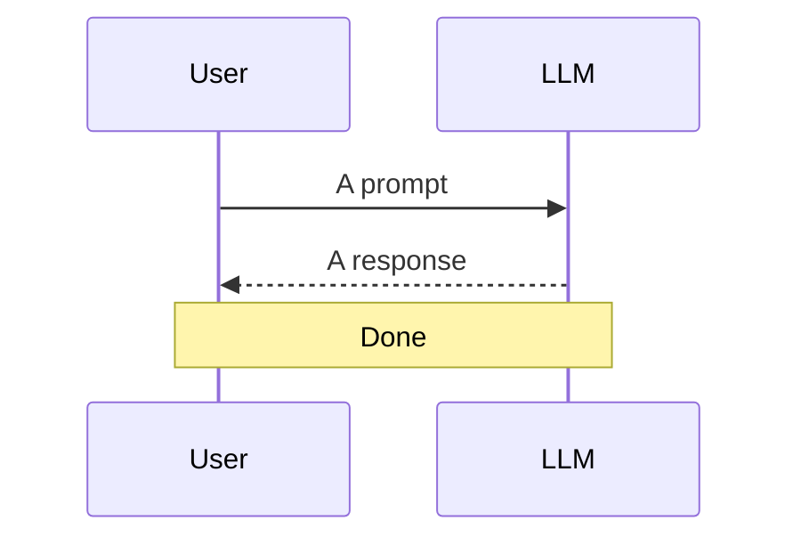
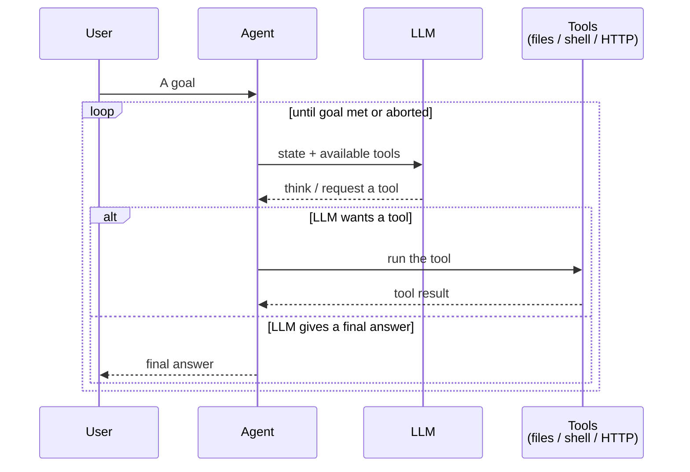
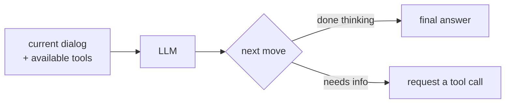
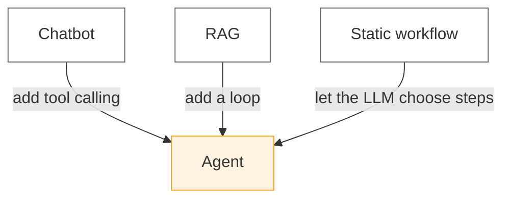

# Chapter 1 · What is an AI Agent

## 1.1 The naive question

You've used ChatGPT, Claude, or some other chat UI. You type, it replies, done. In engineering terms that's a **one-shot inference**.

When people say "AI Agent" they usually mean something else:

> You: "Remove every `console.log` in this project."
>
> Then a stream of actions scrolls past:
> 1. List directory
> 2. Read file
> 3. Edit file
> 4. List directory again
> 5. Run tests
> 6. Report back

No human pressed buttons. No copy-paste between two ChatGPT tabs. **That is the line between an agent and a one-shot call:** an agent feeds its own output back in and keeps going.

## 1.2 One picture says it

::: tip
Every diagram in this book is rendered with [Mermaid](https://mermaid.js.org/) — view source if you want to copy.
:::

### One-shot



### Agent



If you remember one sentence from this chapter:

> **Agent = LLM + Tools + Loop**

## 1.3 Three ingredients, separately

### 1.3.1 LLM: the decision core

In an agent, an LLM does exactly one thing: **given the current state, decide the next move**. It executes nothing. It only emits "what I want to do."



### 1.3.2 Tools: the actuators

Tools are where an agent actually *does* things. The most common in a coding agent:

| Tool | Purpose | In `pi-mono` |
| --- | --- | --- |
| `read` | Read a file | `zig/src/coding_agent/tools/read.zig` |
| `edit` | Modify a file | `zig/src/coding_agent/tools/edit.zig` |
| `bash` | Run a shell command | `zig/src/coding_agent/tools/bash.zig` |
| `grep` | Search the repo | shells out to `rg` |

::: warning
The LLM **does not** touch your disk — it only *requests* a read. The agent framework executes it. That layer of indirection is the foundation of every safety boundary; Chapter 7 explores it in depth.
:::

### 1.3.3 The loop: bringing it to life

A driving loop ties the LLM and tools together. Pseudocode:

```ts
while (!done) {
  const decision = await llm.next(state);
  if (decision.kind === "final") {
    done = true;
    return decision.text;
  }
  const result = await tools.run(decision.tool, decision.args);
  state.append({ tool: decision.tool, result });
}
```

The rest of this book is "expand those ten lines into a real, extensible, production-shaped system."

## 1.4 What is *not* an agent

Pinning down concepts works better with negative space:

- **Chatbot** ≠ agent. No external action.
- **RAG system** ≠ agent (but can be part of one). Retrieval is **single-step**.
- **Workflow** ≠ agent. The steps are **human-authored**; an agent's steps come from the **LLM**.



## 1.5 What's next

In Chapter 2 we dig into the first ingredient — **the shape of an LLM API**:

- It's not just a string; what's a `messages` array?
- What's a token? Why is it the billing unit?
- How does streaming output actually work, line by line?
- What is SSE?

[**Continue to Chapter 2 →**](./) <!-- TODO -->

---

::: info Code reference for this chapter
- TypeScript agent loop: `packages/agent/src/agent.ts`
- Zig agent loop: `zig/src/agent/agent.zig`

Chapter 5 walks through both line by line — for now, just know they exist.
:::
