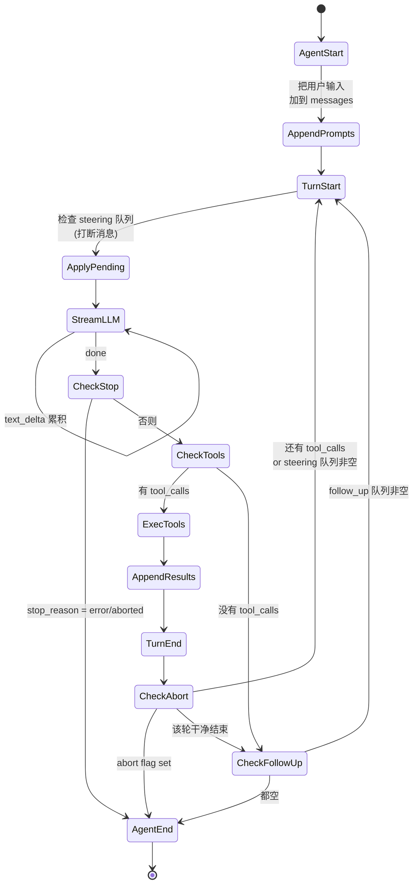
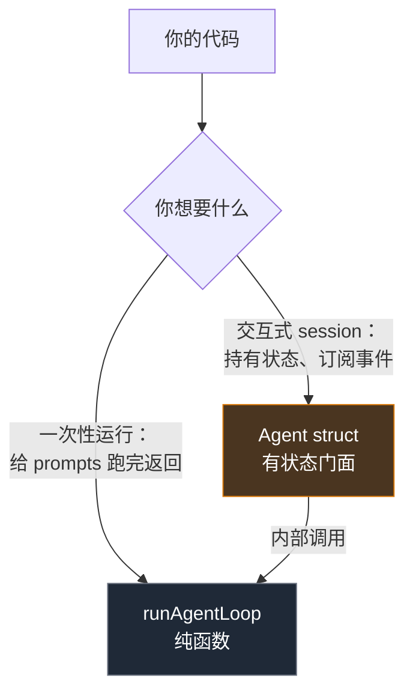
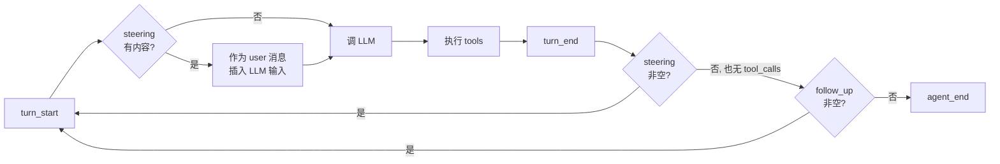
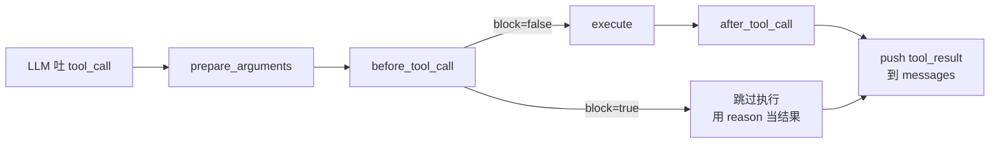
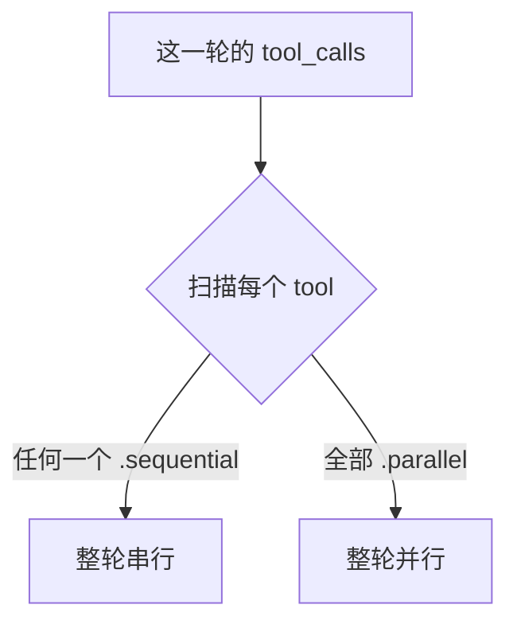
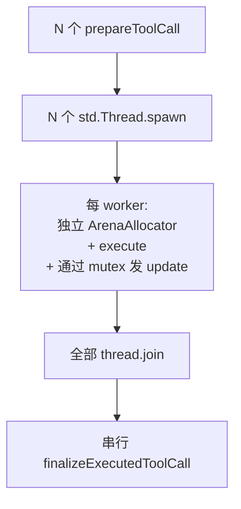
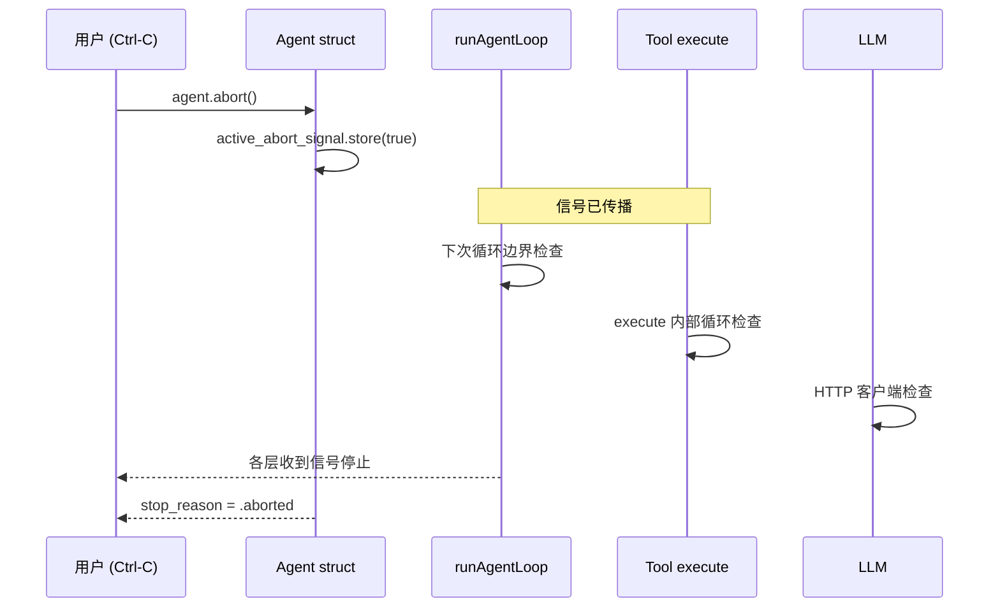
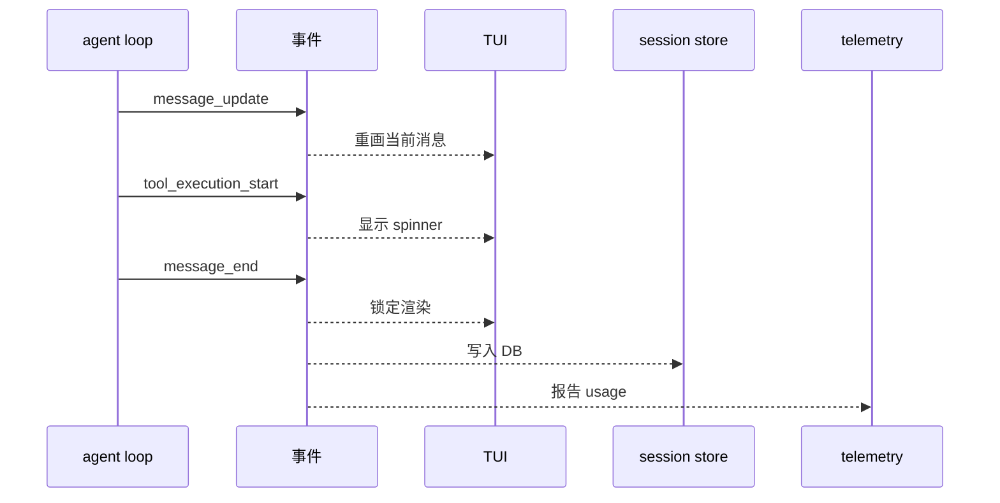

# 第 5 章 · Agent Loop

> 第 1 章我们说"Agent = LLM + 工具 + 循环"。第 2 章把 LLM 拆透了。这一章解剖**那个循环**。

::: warning 章节顺序提示
为了趁记忆新鲜写好这一章，我们暂时跳过第 3 章（Tool Calling）和第 4 章（Provider 抽象）。本章假设你已经知道"LLM 可以请求调用某个工具"这一基本事实——具体的 wire format（function schema、tool_use、tool_result）会在第 3 章补回。

如果你完全没接触过 tool calling，把它当成黑箱看：**LLM 输出里有时会带一段"我想调 `read_file('foo.txt')`"的请求**，仅此而已。
:::

## 5.1 一个朴素的伪代码

把 Agent Loop 写到 10 行足矣：

```zig
while (!done) {
    const assistant = try llm.next(state);          // 1. 问 LLM 下一步
    state.append(assistant);

    if (assistant.tool_calls.len == 0) {            // 2. LLM 不要工具了
        break;                                      //    → 结束
    }
                                                    // 3. LLM 要调工具
    for (assistant.tool_calls) |call| {
        const result = try tools.execute(call);     //    → 执行
        state.append(.{ .tool_result = result });   //    → 把结果塞回
    }
                                                    // 4. 回到步骤 1
}
```

整个 AI Agent 工程的"复杂"，都是在把这 10 行**写正确、可中断、可观测、可扩展**。

## 5.2 状态机视角

把上面的伪代码画成状态机：



::: tip 这一张图就是 Agent
**这张状态机就是 `pi-mono-zig` 的 `runAgentLoop` 函数。**它在 `zig/src/agent/agent_loop.zig` 里被实现成两层嵌套循环——但**逻辑就是这张图**。把图理解了，看代码就只是抄写而已。
:::

## 5.3 双层 API：纯函数 + 有状态门面

`pi-mono-zig` 的 agent 模块给了你两个入口：



### 5.3.1 低层：`runAgentLoop`（纯函数）

```zig
const new_messages = try runAgentLoop(
    allocator,
    io,
    prompts,         // 用户给的新消息
    context,         // 当前对话状态
    config,          // 模型、API key、回调钩子
    emit_context,    // 你的 *anyopaque
    emit_callback,   // fn(ctx, AgentEvent)
    abort_signal,    // ?*atomic.Value(bool)
    stream_fn,       // 可选：自定义 LLM 调用
);
```

**它没有内部状态**——所有东西从参数进，新消息从返回值出。这意味着它**好测试、好理解、好移植**。如果将来要做 C ABI，主要包装的就是它。

### 5.3.2 高层：`Agent` struct（有状态）

```zig
var agent = try Agent.init(allocator, .{
    .system_prompt = "你是一个编码助手",
    .model = my_model,
    .tools = my_tools,
    .io = my_io,
});
defer agent.deinit();

try agent.subscribe(.{ .callback = onEvent });
try agent.promptText("帮我把 console.log 删掉");  // 阻塞，跑完返回
```

`Agent` 持有：对话历史、订阅者列表、abort 信号、三个消息队列。它内部调用 `runAgentLoop`，把事件分发给订阅者，把新消息追加到自己的历史里。

::: info Linux 风格的双层抽象
**核心机制无状态可测试，便利层管理生命周期**——这是 Linux syscall vs glibc、SQLite C API vs ORM 共同遵循的模式。两层都对外，**用户根据场景选**。这是好工程。
:::

## 5.4 三个消息容器

如果 Agent Loop 只有一个消息列表，就只能"用户说一句、agent 回一句"。`pi-mono-zig` 的设计**把消息按"什么时候被消费"分成三种**——这是这个模块最特别的地方。

### 5.4.1 三种语义

| 容器 | 何时被消费 | 中文比喻 |
| --- | --- | --- |
| `messages` | 每次调 LLM 时整体发过去 | "对话历史"——LLM 看到的全部上下文 |
| `steering_queue` | 下一轮循环开始前，作为 user 消息插入 | "打断"——你正在工作时我塞个新指令 |
| `follow_up_queue` | 这次任务完全结束后，开启新一轮 | "队列下一个任务"——做完这个再做那个 |

### 5.4.2 它们在循环里的位置



### 5.4.3 用例对照

**Steering**：用户在 TUI 里看到 agent 正在读错文件，按 Esc 然后输入"等等，去 src 目录而不是 lib"。这条消息进 `steering_queue`，**下一次循环开始就会作为 user 消息塞进 LLM 输入**——agent 立刻看见、立刻调整。

**Follow-up**：你在脚本里排了多个任务："先把 console.log 删掉"+"再把 lint 跑一遍"。第一个任务 agent 完成、`stop_reason = stop`、本来要退出——但 follow_up 队列还有东西，于是开新一轮处理第二个。

```zig
try agent.steer(.{ .user = .{ .content = &.{.{ .text = .{ .text = "去 src 目录" } }} } });
try agent.followUp(.{ .user = .{ .content = &.{.{ .text = .{ .text = "跑一下 lint" } }} } });
```

### 5.4.4 `QueueMode`：一次拿一条 vs 全部

```zig
pub const QueueMode = enum {
    all,              // drain 时拿全部
    one_at_a_time,    // drain 时只拿队首一条
};
```

默认是 `one_at_a_time`——避免"5 条 steering 一次性砸下去模型看晕"。

::: tip 为什么这种设计优雅
LangChain / LangGraph 处理"打断"通常用一个全局的 `interrupt` 标志位，复杂且容易死锁。`pi-mono-zig` 把"打断"和"追加"统一成**同一种机制**（消息队列），区别只在于**消费的时机**——一个轮内、一个轮外。**两个正交概念，一个统一机制**。
:::

## 5.5 工具调用的 4 个钩子

LLM 吐出"我想调 `read_file('foo')`"之后，到这次调用真正完成，要经过 4 个可拦截的位置：



| 钩子 | 输入 | 你能干什么 |
| --- | --- | --- |
| `prepare_arguments` | 原始 args | 校验、补全、转换（比如把相对路径展开成绝对） |
| `before_tool_call` | args + 当前 assistant 消息 | 拦截执行（block=true 跳过，结果用你给的 reason） |
| `execute` | call_id, params, signal, on_update | 真正干活 |
| `after_tool_call` | result, is_error | 重写结果（脱敏、追加元数据） |

### 5.5.1 一个有意思的细节：`execute` 拿到 `signal` 和 `on_update`

```zig
pub const ExecuteToolFn = *const fn (
    allocator: std.mem.Allocator,
    tool_call_id: []const u8,
    params: std.json.Value,
    tool_context: ?*anyopaque,
    signal: ?*const std.atomic.Value(bool),       // ← 中途检查 abort
    on_update_context: ?*anyopaque,
    on_update: ?AgentToolUpdateCallback,           // ← 中途汇报进度
) anyerror!AgentToolResult;
```

这意味着**长任务工具**（跑 build、运行测试）可以：

1. 一边跑一边吐编译错误（通过 `on_update` 发 `tool_execution_update` 事件，TUI 可以实时显示）。
2. 在工作循环里检查 `signal.load(.seq_cst)`，如果用户按了 Ctrl-C 立刻退出。

没有这两条，"agent 跑 5 分钟无响应"的体验就没法做好。

## 5.6 并行 vs 串行 tool 执行

LLM 一轮可能吐出多个 tool_call：「读这个文件、读那个文件、grep 一下」。这三件事互不依赖——并行做 3 倍快。

### 5.6.1 决策规则



每个 `AgentTool` 可以标 `execution_mode`：

```zig
pub const ToolExecutionMode = enum {
    sequential,    // 必须串行（如修改文件）
    parallel,      // 可并行
};
```

**规则极其保守**：只要这一轮里有**任何一个**工具是 `.sequential`，整轮所有工具都串行。这避免"读文件"和"写同一个文件"在并行时打架。代价是性能损失——10 个工具里有 9 个能并行，混进 1 个 sequential 也会拖串行。

::: warning 这是个 trade-off
当前规则简单、安全、好理解。但**性能上有改进空间**——比如分组并行（同一组内的 sequential 工具排队，不同组可以并行）。第 7 章的 `coding_agent` 卷宗会回到这个问题。
:::

### 5.6.2 并行执行怎么做

`pi-mono-zig` 的并行实现**用 OS 线程，不用协程**：



两个关键决策：

1. **每个并行任务一个 ArenaAllocator**：任务结束 arena 整体释放，**线程间不共享内存**——没有 race。
2. **用 `std.Io.Mutex` 串行化所有 emit**：多线程 worker 调 `emit` 时有锁保护，订阅者**不需要担心多线程**。

这是非常 Unix 化的处理：**让用户的 emit 回调假装单线程**——所有锁都在 agent 内部。

### 5.6.3 为什么不用协程

LLM tool 通常是 IO/CPU 重型的真活——读文件、跑 shell、调外部 API。OS 线程在这种场景下比 Zig 的 `std.Io.async` 更合适——**没有 stack 切换的细粒度收益，只有调度复杂度的代价**。

## 5.7 取消（abort）

Agent 有可能：跑 5 分钟没反应、调进死胡同、在烧钱。用户必须能**立刻**叫停。

### 5.7.1 abort 的链路



abort 是**协作式**的——所有可能 block 的位置都要主动检查 `signal.load(.seq_cst)`：

- 每次循环边界（`runLoop` 里）
- LLM 的每个 chunk 边界（`ai` 模块里）
- Tool 执行内部（工具自己实现，框架提供 signal）

::: warning 一个真实坑
**`std.atomic.Value(bool)` 不是普通 bool**。多线程读写必须用原子操作；用普通 bool 在 release build 里会被编译器优化掉。这是 abort flag 必须用原子类型的根本原因。
:::

## 5.8 「事件是唯一输出」

Agent Loop **不打印 stdout、不写日志、不直接画 TUI**。它只发**事件**：

```zig
pub const AgentEventType = enum {
    agent_start,       agent_end,
    turn_start,        turn_end,
    message_start,     message_update,    message_end,
    tool_execution_start, tool_execution_update, tool_execution_end,
};
```

订阅者拿到这些事件，自己决定怎么处理：

| 订阅者 | 用事件做什么 |
| --- | --- |
| TUI | 渲染 streaming 的 message_update、显示 tool 执行 spinner |
| Session 持久化 | 把 message_end 落到 SQLite |
| Telemetry | 把 token 用量上报 |
| 单元测试 | 用 mock 订阅者断言事件序列 |



这是机制 vs 策略最典型的分离：**机制（Agent loop）只发事件；策略（怎么显示、存哪、报谁）由订阅者决定**。Linux 系统调用就是这种设计——syscall 只汇报状态变化，不自带 UI。

## 5.9 这一章对应仓库里的代码

| 概念 | 文件 |
| --- | --- |
| 状态机本体 | `zig/src/agent/agent_loop.zig`（`runLoop`） |
| Agent struct | `zig/src/agent/agent.zig` |
| 三个消息容器 | `zig/src/agent/agent.zig`（`messages`、`steering_queue`、`follow_up_queue`） |
| 4 个 tool 钩子 | `zig/src/agent/types.zig`（`Prepare/Before/Execute/AfterToolCallFn`） |
| 并行执行 | `zig/src/agent/agent_loop.zig`（`executeToolCallsParallel`） |
| 事件类型 | `zig/src/agent/types.zig`（`AgentEventType`、`AgentEvent`） |

::: info 想看更深
完整的内部架构、4 种钩子的精确签名、C ABI 评估、设计气味记录：**[agent 模块卷宗](/internals/agent)**。这一章是它的"教学版翻译"。
:::

## 5.10 接下来

我们已经有了完整的「LLM + 工具 + 循环」三要素的画面。剩下的章节都是**这个核心的特化**：

- 第 3 章 (待补) — Tool Calling 的 wire format（function schema、tool_use、tool_result 的 JSON）
- 第 4 章 (待补) — Provider 抽象（OpenAI / Anthropic / Google 的 tool call 形态差异如何抹平）
- 第 6 章 — Coding Agent（具体的 read / edit / bash 工具集 + 安全边界）
- 第 7 章 — 扩展机制（WASM、子 Agent、能力边界）
- 第 8 章 — TUI 与会话（流式渲染、回放、可中断的工程实践）

[**回到导言** ←](./)

---

::: info 本章关键术语速查

| 术语 | 简短定义 |
| --- | --- |
| Agent Loop | "调 LLM → 执行它要的工具 → 把结果塞回 → 再调 LLM"的循环 |
| turn | 一次"调 LLM + 执行工具"的完整迭代 |
| steering | 在循环间隙插入用户消息（"打断"） |
| follow-up | 当前任务结束后的下一个任务 |
| 协作式 abort | 通过原子标志位，所有可阻塞位置主动检查 |
| 事件订阅 | Agent 只发事件；UI/存储/遥测各自订阅 |
:::
