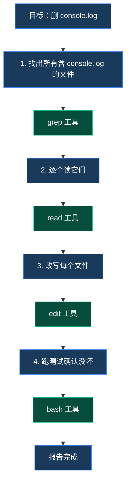

# 第 6 章 · Coding Agent 实战

> 前 5 章我们看了 Agent 的"通用骨架"。这一章把骨架穿上具体的衣服——**如何让 Agent 真的会改代码**。

## 6.1 一个"会改代码"的 Agent 至少需要什么

回到第 1 章那个示例："**帮我把这个项目里所有的 `console.log` 删掉**"——把这件事拆到极小：



最少 4 个工具：**搜索、读、改、跑**。再加上"列目录看有什么"和"原子写入新文件"，一个像样的编码代理至少需要 **6-8 个工具**。pi-mono-zig 提供这 8 个：

| 工具 | 干什么 | 用在前面那个例子的哪一步 |
| --- | --- | --- |
| `grep` | 全仓正则搜索 | 第 1 步 |
| `find` | 通配符列文件 | (没用到，但常配合) |
| `ls` | 列目录元数据 | (没用到，但常配合) |
| `read` | 读文件 | 第 2 步 |
| `edit` | 替换文件中字符串 | 第 3 步 |
| `write` | 整文件重写 | 第 3 步替代方案 |
| `bash` | 执行 shell | 第 4 步 |
| `truncate` | 共享辅助：按行/字节截断 | (内部使用) |

## 6.2 8 个工具速览

::: tip 完整 schema 在源码里
本节给的是"这个工具想干什么"，不是完整的 JSON Schema。完整 schema 可以从代码生成（每个 `tools/*.zig` 都有 `pub fn schema(allocator)`），也可以通过 `pi_tool_schema_json()` 从 C ABI 取。
:::

### `read`（读文件）

```
参数：
  path: string         必填，相对/绝对路径
  offset: integer      可选，起始行（0-based）
  limit: integer       可选，最多读多少行
返回：
  content: string  + 是否截断
默认：截断到 2000 行 / 50KB
图片文件：返回 ImageContent（base64）
```

### `write`（整文件写）

```
参数：
  path: string
  content: string      新文件全部内容
行为：
  原子写（先写 tmp 再 rename）
  通过 file_mutation_queue 串行（同一路径）
```

### `edit`（替换字符串）

```
参数：
  path: string
  old_string: string   要被替换的子串
  new_string: string   替换后的内容
  replace_all: bool    可选；默认 false（只替换第一处）
失败条件：
  - old_string 在文件中不存在
  - replace_all=false 但 old_string 出现多次
```

::: warning edit 比 write 更安全
LLM 给 `edit` 出错只会改不到（因为字符串不存在），不会"一刀重写错"。**所以 LLM 在小改动时几乎都用 edit，不用 write**。这是工具设计影响 LLM 行为的好例子。
:::

### `bash`（执行 shell）

```
参数：
  command: string
  description: string  必填——一句话说明你要干什么
  timeout_ms: integer  默认 120000
行为：
  在 cwd 执行；超时杀进程组
  stdout/stderr 合并截断
  通过 capability shell_run 检查
```

::: tip description 是必填
**强制 LLM 解释自己在干什么**——增加可观测性，让用户在 TUI 上能看到"正在执行：跑单测"，而不是裸命令。这是简单但有效的 prompt engineering。
:::

### `grep`（全仓搜索）

```
参数：
  pattern: string      正则
  path: string         可选，搜索范围
  glob: string         可选，文件名过滤
  output_mode: enum    'content' | 'files_with_matches' | 'count'
实现：
  shell out 给 ripgrep (rg)
```

### `find`（通配符列文件）

```
参数：
  pattern: string      glob
  path: string         可选
实现：
  shell out 给 fd
```

### `ls`（列目录）

```
参数：
  path: string
返回：
  数组，每项含 name / size / mtime / is_dir
实现：
  纯 Zig，不 shell out
```

### `truncate`（共享内部工具）

不是 LLM 可调的工具，是 `read` / `bash` 内部用的截断逻辑：

- 按行 / 按字节截断
- 检测部分行（避免截一半）
- 在尾部加 `[truncated]` 提示

## 6.3 工具描述就是 prompt engineering

回顾第 3 章 §3.2 的强调：**`description` 字段决定 LLM 何时想到用这个工具**。看 pi-mono 实际的 description 写法：

```zig
// 简化自 zig/src/coding_agent/tools/edit.zig
pub const description =
    \\Performs exact string replacements in files.
    \\
    \\Usage:
    \\- You must use your `Read` tool at least once before editing.
    \\  This tool will error if you attempt an edit without reading the file.
    \\- When editing text from Read tool output, ensure you preserve the
    \\  exact indentation (tabs/spaces) as it appears AFTER the line number prefix.
    \\- ALWAYS prefer editing existing files. NEVER write new files unless required.
    \\- The edit will FAIL if `old_string` is not unique in the file.
    \\  Either provide a larger string with more context, or use `replace_all`.
    \\- Use `replace_all` for renaming variables across the file.
;
```

这段描述里**藏了一整套行为规范**：

| 描述里的话 | 实际对应的行为 |
| --- | --- |
| "must use Read first" | LLM 学会先 read 再 edit，避免盲改 |
| "preserve exact indentation" | LLM 复制粘贴时保留缩进 |
| "prefer editing existing" | LLM 不会动不动新建文件 |
| "FAIL if old_string is not unique" | LLM 学会扩大上下文窗口确保唯一 |

**这些规则不需要硬编码进 agent 逻辑**——LLM 读了描述自己就会遵守。**这是 prompt engineering 最高效的形式**：把指令藏在工具说明里。

## 6.4 一次完整的 edit 流程解剖

把所有概念串起来。LLM 想改 `src/main.zig`，从它吐 `tool_use` 块到结果回到它，整条链路是：

```mermaid
sequenceDiagram
    autonumber
    participant LLM
    participant Loop as agent_loop
    participant Hook as tool.call hook<br/>(可选扩展拦截)
    participant Cap as enforcement
    participant Queue as file_mutation_queue
    participant Edit as edit tool
    participant FS as 文件系统

    LLM-->>Loop: tool_use {name:"edit", input:{path, old, new}}
    Loop->>Hook: 触发 tool.call (Phase 1 钩子)
    Hook-->>Loop: 通过 / 拦截 / 改参数
    Loop->>Cap: 检查 principal 有 file_write?
    Cap-->>Loop: yes
    Loop->>Queue: acquire('src/main.zig')
    Queue-->>Loop: guard
    Loop->>Edit: execute(args)
    Edit->>FS: read('src/main.zig')
    FS-->>Edit: 当前内容
    Edit->>Edit: replace(old, new)
    Edit->>FS: atomic write tmp + rename
    FS-->>Edit: ok
    Edit-->>Loop: ExecutionResult { content, is_error: false }
    Loop->>Queue: release('src/main.zig')
    Loop->>Hook: 触发 tool.result (Phase 1 钩子)
    Hook-->>Loop: 通过 / 改写结果
    Loop->>LLM: tool_result {tool_use_id, content, is_error: false}
    LLM-->>LLM: 看到结果，决定下一步
```

**这一条链穿过了本书所有核心概念**：

- 第 3 章的 tool_use → tool_result 协议
- 第 5 章的 agent loop + 4 个钩子位置
- 第 7 章的 tool.call / tool.result 拦截
- 本章的 file_mutation_queue + capability 检查

## 6.5 安全的"三层防御"

一个会跑 shell、能改你硬盘的 Agent，**安全是核心问题**。pi-mono-zig 用三层防御：

```mermaid
flowchart TB
    classDef l1 fill:#1a3a5c,stroke:#3b82f6,color:#fff
    classDef l2 fill:#4a3520,stroke:#d97706,color:#fff
    classDef l3 fill:#7f1d1d,stroke:#dc2626,color:#fff

    L1[第一层：能力检查<br/>(capability)]:::l1
    L1 --> L1d["principal 没有 shell_run grant？<br/>立刻 deny，根本到不了 bash 工具"]

    L2[第二层：扩展拦截<br/>(tool.call hook)]:::l2
    L2 --> L2d["扩展可以审参数：<br/>'rm -rf /' 这样的命令直接 cancel"]

    L3[第三层：工具内部<br/>(tool implementation)]:::l3
    L3 --> L3d["bash 内部还有 timeout / 进程组隔离<br/>edit 内部还有 file_mutation_queue 串行化"]

    L1 --> L2 --> L3
```

**三层是独立的——任意一层失守，下一层还在**。这就是 Linux 用户态 / 内核态 / 文件系统权限的"纵深防御"哲学在 AI Agent 里的应用。

### 6.5.1 一个真实场景：禁掉 shell

SDK 用户想让 agent **只能读代码不能跑命令**：

```c
// pi.h 一行搞定
pi_principal_revoke(p, PI_CAP_SHELL_RUN);
```

之后 LLM 即使想调 bash，框架在第一层就 deny——bash 工具的代码**根本不会被执行**。

### 6.5.2 当前的安全空洞

::: warning 已知问题
[coding_agent 卷宗 §3.3](/internals/coding-agent#3-3-tools-common-zig-的三个共同关注点) 提到：

- `resolvePath` **不检查路径是否仍在 cwd 之下**——绝对路径或 `../../../` 都会被接受
- 内置工具**目前不走 enforcement**（D-3 决议要改，但代码还没改）

这两个空洞意味着今天的 Zig 实现**还不能直接当生产 SDK**。设计决议（D-3）已签，待实现。
:::

## 6.6 加一个新内置工具要做什么

**5 步**（和加 provider 类似的模式）：

1. 新建 `tools/<name>.zig`，导出 `<Name>Tool` struct + `Args` / `ExecutionResult` 类型
2. struct 实现 `init(cwd, io)` / `schema(allocator)` / `execute(allocator, args, signal)`
3. 在 `tools/root.zig` 加 import + 类型别名
4. 在 `coding_agent/extensions/enforcement.zig`（或工具 schema 里）声明它需要哪些 capability
5. 写一个集成测试

::: tip 8 个工具是有原因的
为什么不只 4 个或 16 个？**这是大量真实使用磨出来的最小完备集**：

- read / write / edit 覆盖文件 IO 的"读 / 整写 / 局改"
- grep / find / ls 覆盖"搜内容 / 搜文件名 / 看目录"
- bash 覆盖"任何脚本能干的事"
- truncate 是支撑工具

少了任何一个，LLM 就会想用别的工具凑（比如没 edit 时用 sed），效果差。多了又是冗余（grep 能干 find 大部分事）。**8 是经验值**。
:::

## 6.7 一个有意思的副作用：grep 和 find 不是 Zig 实现的

```zig
// zig/src/coding_agent/tools/grep.zig (简化)
pub fn execute(...) !ExecutionResult {
    var argv = [_][]const u8{ "rg", "--json", pattern, search_path };
    var child = try std.process.Child.init(&argv, allocator);
    // ... 收集 stdout
}
```

`grep` 工具是 **shell out 给 ripgrep (`rg`)**。`find` 工具同理走 `fd`。

为什么不用 Zig 自实现？

| 维度 | Zig 自实现 | shell out 给 rg/fd |
| --- | --- | --- |
| 性能 | 中 | 极快（rg 是 Rust 的极致优化版） |
| 二进制大小 | +几百 KB | 0 |
| 维护负担 | 高（要跟进正则边界情况） | 低（rg 团队替你维护） |
| 部署 | 单文件 | 用户要预装 rg/fd |

**pi-mono-zig 选了第二条**——`zig build` 启动时检查 `rg` 和 `fd` 在不在 PATH 上，没有就早失败。这是"组合现成命令"的 Unix 哲学。

## 6.8 这一章对应仓库里的代码

| 概念 | 文件 |
| --- | --- |
| 8 个工具实现 | `zig/src/coding_agent/tools/*.zig` |
| 通用工具函数 | `zig/src/coding_agent/tools/common.zig` |
| 文件互斥队列 | `zig/src/coding_agent/tools/file_mutation_queue.zig` |
| 截断逻辑 | `zig/src/coding_agent/tools/truncate.zig` |
| 12 个 capability + Principal | `zig/src/coding_agent/extensions/enforcement.zig` |
| 工具调用集成（agent loop 里） | `zig/src/agent/agent_loop.zig` |

::: info 想看更深
- [coding_agent 卷宗](/internals/coding-agent) — 完整的 SDK 核心评估、8 个工具的详细分析、安全模型
- 卷宗 §3 + §4 + §6 是这一章的"系统蓝图版"
:::

## 6.9 接下来

剩下最后一章：

- 第 8 章 — TUI 与会话（流式渲染、session 持久化、回放、可中断）

[**回到导言** ←](./)

---

::: info 本章关键术语速查

| 术语 | 简短定义 |
| --- | --- |
| 8 个内置工具 | read / write / edit / bash / grep / find / ls / truncate |
| 工具描述 = prompt engineering | description 字段直接影响 LLM 行为 |
| file_mutation_queue | 进程级互斥，防止并行写同一文件 |
| 三层防御 | capability + 扩展拦截 + 工具内部 |
| OpenAI 兼容族 | shell out 给 rg/fd 的设计选择 |

:::
