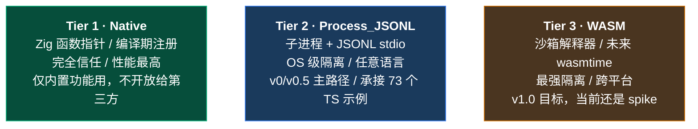
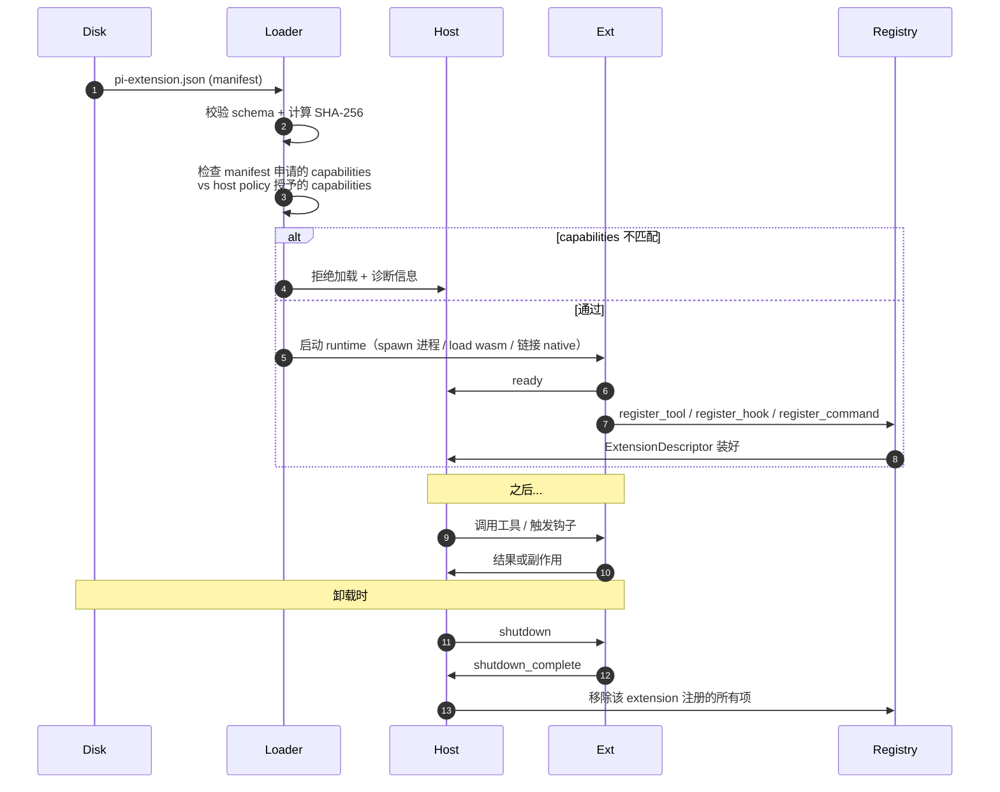
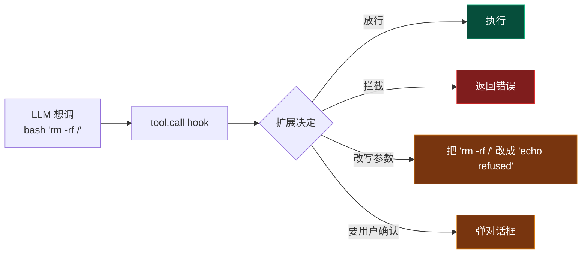
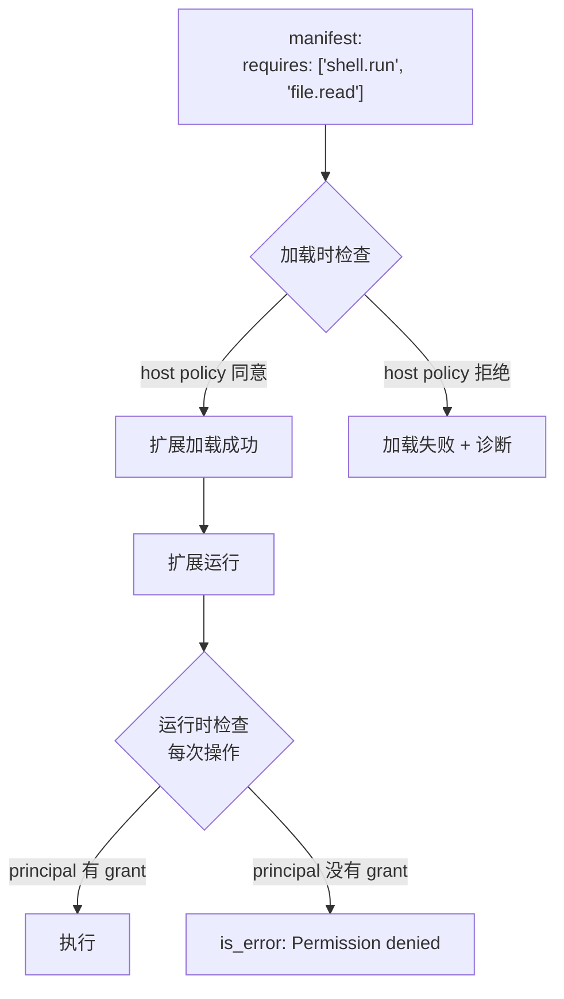

# 第 7 章 · 扩展机制

> 前 6 章我们看了 Agent 的"内核"——LLM、工具、循环、安全。这一章看**如何让别人安全地往里加东西**。

::: tip 这是这本书最重要的一章
为什么？因为**所有上层功能都是扩展**——plan 模式、子 agent 委派、自定义 provider、终端游戏（是的，TS 端真有人写了 snake 游戏作为扩展）。一个不能扩展的 Agent 是死的；一个能扩展的 Agent 是平台。
:::

## 7.1 为什么需要扩展系统

写一个 AI Agent 时，你会忍不住把所有功能都做进核心：自动 commit、追踪 token、限制危险命令、自定义 UI 主题……这条路走到尽头是：


扩展系统的本质就是说："**核心保持小。所有特性都做成插件。用户按需加载。**"——这是 Linux 内核（kmod）、VS Code（extensions）、neovim（plugins）共同遵循的哲学。

## 7.2 扩展能做什么——13 类能力


13 类能力，每一类都是一个真实需求。完整列表请见 **[扩展系统设计研究](/internals/extension-system)** 的 §1。

::: info 73 个真实示例
TS 端 `packages/coding-agent/examples/extensions/` 有 **73 个示例**，覆盖 18 个类别——包括 4 个完整 TUI 游戏（`snake`、`space-invaders`、`tic-tac-toe`、`doom-overlay`）。"扩展系统能跑游戏"是它通用性的最佳证据。
:::

## 7.3 三层扩展模型

不是所有扩展都需要同样级别的隔离。pi-mono-zig 提供**三种 runtime**，按"信任度 vs 性能"光谱排：



### 7.3.1 三层差异速查

| 维度 | Tier 1 (native) | Tier 2 (process_jsonl) | Tier 3 (wasm) |
| --- | --- | --- | --- |
| 隔离 | 无（共内存） | OS 进程 | WASM 沙箱 |
| 启动 | 0ms | 50-200ms | 5-50ms |
| 性能（每次调用） | 纳秒 | 毫秒（IPC） | 毫秒（解释） |
| 语言 | Zig | 任意 | 编译到 wasm 的 |
| 用例 | 内置 plan 模式 | 现有 TS 扩展 / Python 工具 | 跨平台沙箱工具 |

### 7.3.2 共同骨架

虽然三层 runtime 不同，但**它们填同一个数据结构**：

```zig
pub const ExtensionDescriptor = struct {
    id: []const u8,
    runtime_kind: RuntimeKind,
    declared_capabilities: u32,    // 12-bit grant bitmask
    registered_tools: []const ToolDef,
    registered_commands: []const CommandDef,
    registered_hooks: []const HookSubscription,
    // ...
};
```

每种 runtime 解析自己的产物——native 解 Zig 模块、jsonl 解 JSON 注册帧、wasm 解 WIT 接口——填同一个 descriptor。**上层 Agent loop 不关心 runtime 类型，它只看 descriptor**。

::: tip 这就是好抽象的标志
"机制三种，模型一个。"——这是 Linux VFS（virtual filesystem）的设计哲学：上层不管你是 ext4 / NFS / FUSE，都是 `read()` / `write()` 同一组系统调用。
:::

## 7.4 一个扩展的生命周期



5 个关键步骤：

1. **发现**：扫描 `~/.pi/extensions/` + `./.pi/extensions/` + 显式 `--extension` 参数
2. **校验**：解析 manifest，校验 schema，计算 SHA-256（防止"装完后被替换"的供应链攻击）
3. **加载**：根据 runtime kind 启动对应方式
4. **注册**：扩展通过协议告诉 host"我有这些工具/钩子/命令"
5. **运行**：host 在合适时机调扩展

::: warning 加载即合约
**"我申请什么能力" = 加载时谈判**。Manifest 里写 `requires: ['shell.run']`——host policy 不批准就直接拒绝加载。**这避免了"加载完发现没权限再失败"的复杂错误处理**。
:::

## 7.5 35 个生命周期钩子

钩子是扩展和 host 沟通的"事件队列"。pi-mono 把 35 个钩子分成 7 组：

| 组 | 数量 | 代表钩子 | 用途 |
| --- | --- | --- | --- |
| `session.*` | 8 | `session.start`, `session.before_compact` | 会话切换/fork/压缩生命周期 |
| `agent.*` | 5 | `agent.start`, `agent.end`, `agent.model_select` | Agent 整体生命周期 |
| `turn.*` | 5 | `turn.start`, `turn.end`, `message.update` | 单轮对话生命周期 |
| `tool.*` | 7 | `tool.call`, `tool.result`, `tool.execution_*` | 工具执行 |
| `input.*` | 2 | `input.user_text`, `input.user_bash` | 用户输入拦截 |
| `provider.*` | 3 | `provider.before_request`, `context` | LLM 请求/响应 |
| `resources.*` | 1 | `resources.discover` | 启动时贡献资源 |

### 7.5.1 钩子的两种类型

**通知型**（`X.Y`）：handler 知道发生了什么，但**不能改变结果**。

```c
// 比如 turn.end —— 通知一轮结束了，扩展记录下 token 数
int handle(void* ud, pi_hook_event_type_t t, const pi_hook_event_t* e, ...) {
    if (t == PI_HOOK_TURN_END) {
        my_telemetry.record_tokens(...);
    }
    return 0;
}
```

**拦截型**（`X.before_Y`）：handler 可以**取消操作或修改参数**。

```c
// 比如 tool.call —— 在工具执行前拦截
int handle(void* ud, pi_hook_event_type_t t, const pi_hook_event_t* e,
            pi_hook_result_t* out) {
    if (t == PI_HOOK_TOOL_CALL) {
        if (is_dangerous_command(e)) {
            out->cancel = true;
            out->reason = "Blocked by guard policy";
        }
    }
    return 0;
}
```

### 7.5.2 钩子的调用规则

`pi-mono-zig` 沿用 TS 端的语义，**Zig 实现必须严格复刻**：

1. **顺序**：按扩展加载顺序串行调用
2. **异步**：每个 handler 等到完成才走下一个
3. **错误隔离**：一个 handler 抛错不影响其他扩展，仅记录日志
4. **结果链式**：`context` / `tool.call` 等钩子，后一个 handler 看到的是前一个的修改后版本

## 7.6 工具拦截——扩展系统的"杀手级特性"

如果只能保留两个钩子，**`tool.call` 和 `tool.result` 必须留下**。它们让扩展拥有"治理"能力——这是扩展系统从"玩具"变成"产品"的分水岭。

### 7.6.1 拦截能做什么



### 7.6.2 真实示例：危险命令守卫

```typescript
// permission-gate.ts (简化)
export default (api) => {
  api.on('tool.call', async (event) => {
    if (event.tool_name === 'bash' && containsDangerous(event.args)) {
      const ok = await api.ui.confirm({
        title: '检测到危险命令',
        message: `Are you sure you want to run: ${event.args.cmd}?`,
      });
      if (!ok) {
        return { cancel: true, reason: 'User declined' };
      }
    }
  });
};
```

20 行 TypeScript = 一个完整的"危险命令守卫"。Zig 等价物会一样短。**这就是扩展系统的力量**——核心不需要懂"什么命令危险"这种业务逻辑，业务规则被插件化、可叠加、可关闭。

### 7.6.3 拦截链：多个扩展叠加

如果 5 个扩展都订阅了 `tool.call`，它们按加载顺序依次跑——任何一个返回 `cancel: true` 都会短路：


这给了用户**组合式安全模型**——把多个独立扩展叠加起来，等于得到一套定制化的治理策略。

## 7.7 能力边界与扩展加载

回顾 [coding_agent 卷宗](/internals/coding-agent#6-enforcement-12-个-capability-的能力边界)：12 个 capability（`file.read` / `shell.run` / `network.request` / ...）。扩展系统在两个时机检查它们：



**两次检查的意义**：

1. **加载时拒绝**让扩展一开始就知道自己缺什么权限——可以提示用户、可以选择优雅降级。
2. **运行时拒绝**是"纵深防御"——即使扩展通过了加载（manifest 申请的就是 host 给的），运行时如果有 dynamic policy 改变（比如用户说"这一轮全部禁 shell"），还能挡得住。

## 7.8 跨语言扩展生态：process_jsonl 协议

`process_jsonl` 是当前扩展生态的主路径。协议简单到能在 30 行代码内完整描述：

```
host 启动子进程，连接 stdin/stdout 双向 pipe
扩展通过 stdout 发：
  {"method":"ready"}
  {"method":"register_tool","name":"my_tool","label":"...","description":"...","parameters":{...}}
  {"method":"register_command","name":"slash_foo","handler_id":"h1"}
  {"method":"subscribe_hook","hook":"tool.call","handler_id":"h2"}

host 通过 stdin 发：
  {"method":"invoke_tool","name":"my_tool","args":{...},"id":42}
扩展回：
  {"method":"tool_result","id":42,"content":[...],"is_error":false}

host 触发钩子：
  {"method":"hook","handler_id":"h2","event":{"type":"tool.call","args":{...}},"id":43}
扩展回：
  {"method":"hook_result","id":43,"cancel":false}

最后：
  host: {"method":"shutdown"}
  扩展: {"method":"shutdown_complete"}
```

### 7.8.1 为什么是 JSONL 而不是 JSON-RPC 2.0

JSON-RPC 标准化得多，但有 id 跟踪、batch、notification 这些复杂度。**对扩展协议来说过度设计**——一行一个 JSON 已经够了，调试时直接 `cat stdin` 就能看到。

### 7.8.2 性能特征

| 操作 | 延迟 |
| --- | --- |
| 子进程 spawn | 50-200ms |
| 单个 JSONL 帧 read/write | < 1ms |
| 工具调用一次往返（IPC） | 1-5ms |

这意味着**扩展启动慢、调用快**——所以扩展进程是**长驻**的（直到 session 结束才 shutdown），不是每次调用现 spawn。

## 7.9 扩展间通信：事件总线

73 示例里有专门的 `event-bus.ts`——多个扩展之间需要通信。pi-mono 提供一个轻量级 pub/sub：

```javascript
// 扩展 A
api.events.emit('my-app.user-action', { kind: 'click', x: 10 });

// 扩展 B
api.events.on('my-app.user-action', (data) => {
  console.log('B saw click at', data.x);
});
```

::: tip 命名规则
事件名空间用扩展自己的名字（`my-app.X`），避免冲突。这是 Linux signal、Web Components custom events 共用的命名约定。
:::

事件总线是**软耦合**——扩展 A 不知道扩展 B 的存在；如果 B 没装，A 的 emit 不会出错。

## 7.10 这一章对应仓库里的代码

| 概念 | 文件 |
| --- | --- |
| 三种 runtime | `zig/src/coding_agent/extensions/extension_runtime.zig` |
| 扩展注册表 | `zig/src/coding_agent/extensions/extension_registry.zig` |
| process_jsonl 实现 | `zig/src/coding_agent/extensions/extension_host.zig` |
| WASM v0 spike | `zig/src/coding_agent/extensions/wasm/wasm_host_spike.zig` |
| WASM manifest 解析 | `zig/src/coding_agent/extensions/wasm/wasm_manifest.zig` |
| 12 capability 与 enforcement | `zig/src/coding_agent/extensions/enforcement.zig` |
| TS 端 73 个示例 | `packages/coding-agent/examples/extensions/` |

::: info 想看更深
- [coding_agent 模块卷宗 §5](/internals/coding-agent#5-extensions-子系统) — 三种 runtime 的代码细节
- **[扩展系统设计研究](/internals/extension-system)** — TS↔Zig 全面对比 + 三层模型 + 五阶段路线图

设计研究是这一章的"系统蓝图"，本章是它的"教学版翻译"。
:::

## 7.11 接下来

我们已经看到了 Agent 能"被加东西"的完整画面。剩下一章：

- 第 8 章 — TUI 与会话（流式渲染、回放、可中断的工程实践）

第 4 章（Provider 抽象）和第 6 章（Coding Agent 实战）也会回填。

[**回到导言** ←](./)

---

::: info 本章关键术语速查

| 术语 | 简短定义 |
| --- | --- |
| 三层扩展模型 | Native / Process_JSONL / WASM 三种 runtime |
| 生命周期钩子 | 35 个事件订阅点，分 7 组 |
| 拦截型钩子 | `X.before_Y` 命名，可取消或改参数 |
| 通知型钩子 | `X.Y` 命名，仅观察不改变 |
| capability | 12 个权限项，加载时与运行时双重检查 |
| process_jsonl | 子进程 + JSONL stdio 协议，跨语言主路径 |
| 事件总线 | 扩展间软耦合 pub/sub 通信 |

:::
