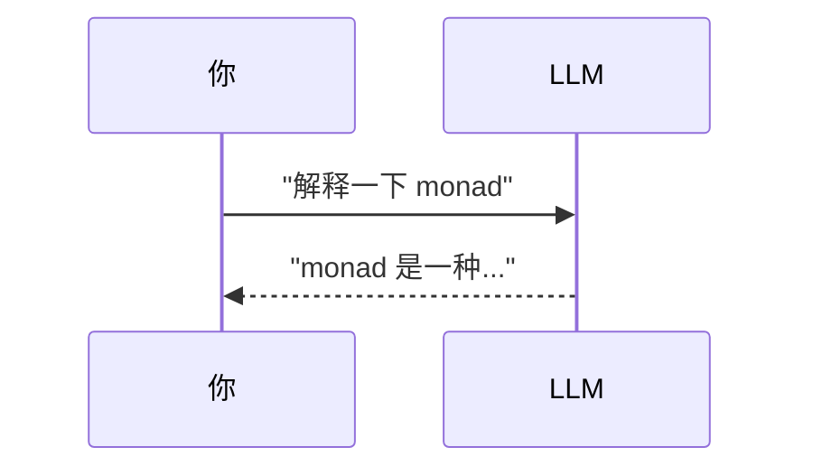
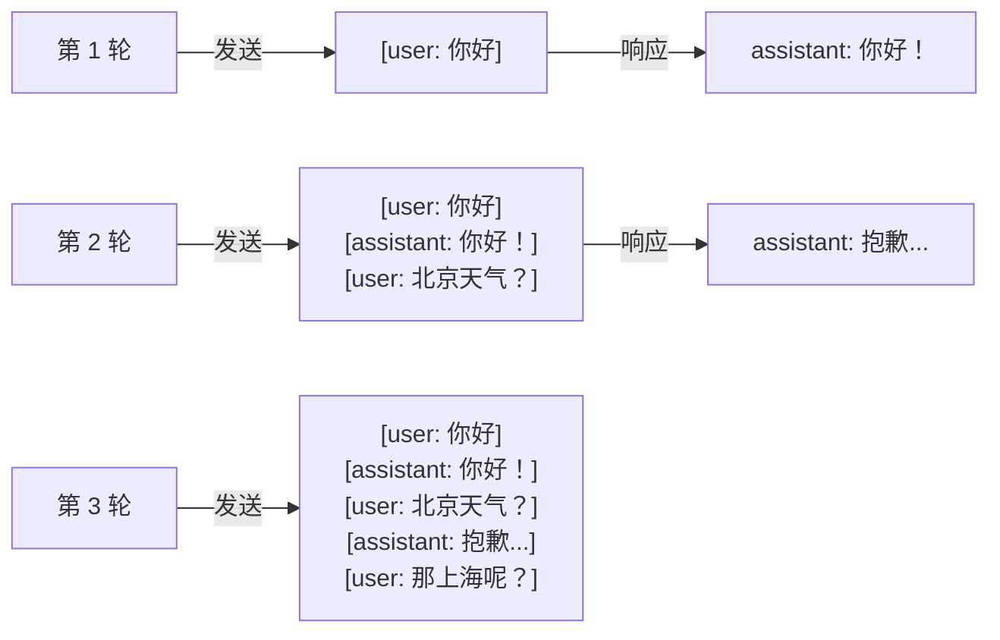
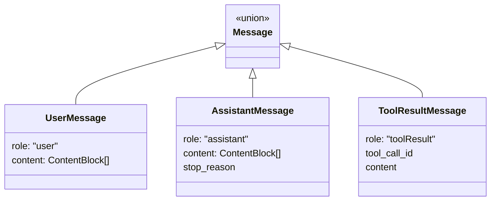
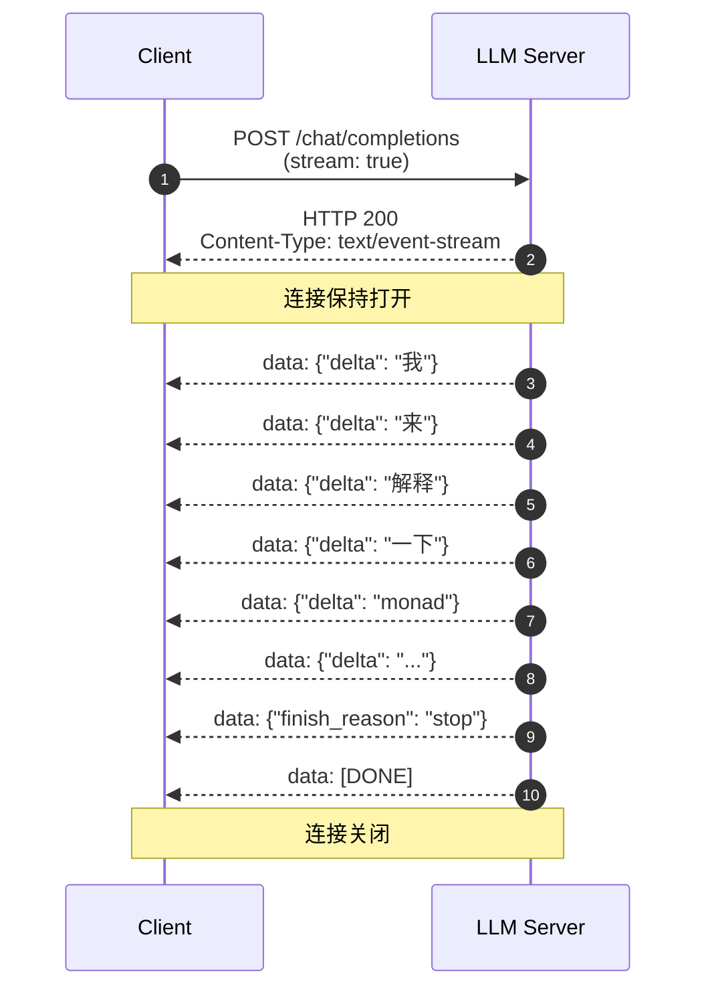
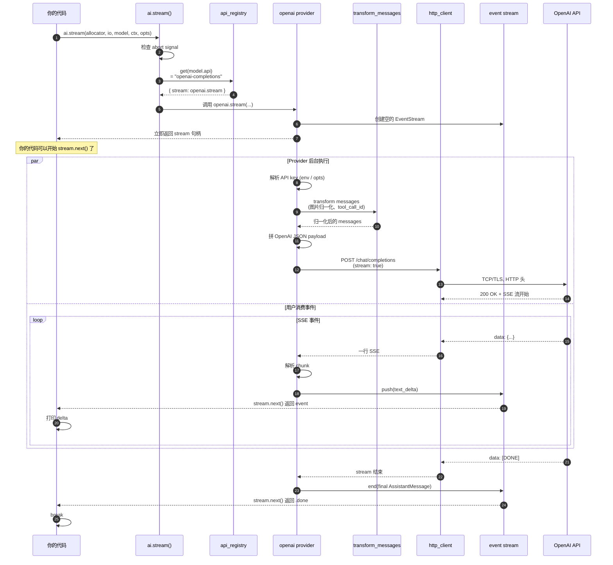

# 第 2 章 · LLM API 的本质

> 一次调用，从你按下回车，到字符在屏幕上流出来，中间到底发生了什么。

第 1 章我们说"Agent = LLM + 工具 + 循环"。这一章我们解剖**最里面那个 L**——LLM 自己。当你写出 `ai.stream(...)` 这一行代码时，背后那条字节流要走过 10 层抽象才到达你眼睛。这 10 层就是 AI Agent 工程的"原语"。

## 2.1 你以为的 LLM API

如果你只是 ChatGPT 的用户，你脑海里大概是这样的：



一个 HTTP POST，一个 JSON 响应，结束。

**这个心智模型有三个洞**，本章逐一补上：

1. 你发的不是"一段文字"，是 **`messages` 数组**——它对应的是"对话的历史"，而不是"这次的问题"。
2. 你拿到的也不是"一个字符串"，是 **流式事件序列**——一边生成一边吐。
3. 中间那条线不是普通的 HTTP，是 **SSE（Server-Sent Events）**——它让一个 HTTP 响应变成"持续不断的小包"。

## 2.2 第一个原语：`messages` 数组

### 2.2.1 LLM 没有"记忆"

这是新人最常踩的坑。当你在 ChatGPT 里聊天，感觉它"记得"之前说过什么。**它不记得**。**每次请求，都是把整段对话历史重新发过去**。



在 `pi-mono-zig` 里，这个数组是 `Context.messages`：

```zig
// zig/src/ai/types.zig
pub const Context = struct {
    system_prompt: ?[]const u8,
    messages: []const Message,
    tools: ?[]const Tool,
};
```

### 2.2.2 一条消息有四种角色



外加一个**第四种**藏在 `Context.system_prompt`：**system 消息**——给模型的"人格设定"，永远在最前面，不计入对话历史。

| 角色 | 谁写的 | 干嘛用的 |
| --- | --- | --- |
| `system` | 你（开发者） | 设定模型行为："你是一个编码助手" |
| `user` | 终端用户 | 实际问的问题 |
| `assistant` | 模型 | 模型的回答（可能含 tool_call） |
| `toolResult` | 你的 Agent 框架 | 工具执行后的结果，回传给模型看 |

**为什么这样设计**？因为 LLM 是无状态的——把整段历史塞进去，模型才能"看见"上下文。每条消息标注"谁说的"是为了让模型分得清"我"和"用户"。

::: tip 第 5 章伏笔
`toolResult` 这个角色就是 Agent Loop 把"工具执行结果"塞回给模型的方式。你现在记着这个名字，第 5 章会回到它。
:::

## 2.3 第二个原语：token

### 2.3.1 token 不是字符，也不是单词

LLM 看到的不是文本，是**整数序列**。它先把你的字符串切成 token，再把每个 token 映射到一个整数 ID。

```
"Hello, world!"
       ↓ tokenize
[15496, 11, 1917, 0]
```

切分规则各家不同（BPE、WordPiece、SentencePiece 等），但有几条经验法则：

| 文本 | 大约 token 数 |
| --- | --- |
| 英文 1 个常用词 | 1 个 token |
| 英文 1 个罕见词或长复合词 | 2-4 个 token |
| 中文 1 个汉字 | 1-3 个 token |
| 1 个 emoji | 1-3 个 token |
| 1 行代码 | 5-20 个 token |

::: warning
**中文比英文费 token**。同样意思，中文消耗大约 2× 英文的 token。这在系统提示词、长文档上下文里会显著影响成本。
:::

### 2.3.2 为什么按 token 计费

模型推理一次的算力消耗，**和 token 数（不是字符数）成正比**。所以服务商按 token 计费——这是物理规律的反映，不是商业惯例。

`pi-mono-zig` 里追踪 token 用量的类型：

```zig
// zig/src/ai/types.zig
pub const Usage = struct {
    input: u32 = 0,           // 你发了多少 token
    output: u32 = 0,          // 模型生成了多少 token
    cache_read: u32 = 0,      // 命中缓存（便宜）
    cache_write: u32 = 0,     // 写入缓存（一次性贵一点）
    total_tokens: u32 = 0,
    cost: UsageCost = .{},
};
```

注意 `cache_read` 和 `cache_write`——这是 Anthropic 等家提供的 **prompt caching** 优化：长 system prompt 第一次写缓存（贵一点），后续请求读缓存（便宜很多）。一个好的 Agent 框架会主动利用这个机制。

### 2.3.3 上下文窗口

模型一次能"看见"的最大 token 数叫**上下文窗口**（context window）。常见值：

| 模型 | 上下文窗口 |
| --- | --- |
| GPT-4 经典 | 8K / 32K |
| GPT-4 Turbo / 4o | 128K |
| Claude 3.5 / 4 | 200K |
| Claude with 1M context | 1M |
| Gemini 1.5 / 2 | 1M+ |

**这是 Agent 工程最常撞的天花板**：长会话 + 大代码库的全文检索结果 + 多次工具调用的累积输出，会快速把上下文填满。第 5 章会讲 Agent Loop 怎么处理"上下文要爆了"这件事。

## 2.4 第三个原语：流式输出（streaming）

### 2.4.1 为什么不是一次返回

技术上 LLM API 完全可以"等生成完，一次性返回完整字符串"。但实际上**所有家都默认提供流式**。三个原因：

1. **延迟体验**：生成 500 token 的回答可能要 5-10 秒。一次性返回 = 用户盯着空白屏 5 秒；流式 = 第一个字 200ms 就出来了。
2. **可中断**：用户看到模型"跑偏了"可以立刻按 Ctrl-C，省钱。
3. **可观测**：你能边生成边把字符存进数据库 / TUI，不用堆在内存里。

### 2.4.2 流式的形状

把它画出来就清楚了：



每个 `data: {...}` 是一个**事件**。这些事件不是普通的 HTTP 响应，而是 SSE 协议的载荷。

## 2.5 第四个原语：SSE（Server-Sent Events）

### 2.5.1 SSE 是什么

SSE 是 HTML5 标准的一部分。它的本质是**一个永远不结束的 HTTP 响应**，body 按一种简单的文本格式分割成事件。

```
HTTP/1.1 200 OK
Content-Type: text/event-stream
Cache-Control: no-cache
Connection: keep-alive

data: {"id":"1","delta":"hello"}

data: {"id":"2","delta":" world"}

event: done
data: {"finish_reason":"stop"}

```

**格式规则极简**：
- 每个事件由若干行组成
- 每行是 `field: value` 形式
- 事件之间用空行分隔
- `data:` 是默认的字段，可重复（多行 data 会被拼接）
- `event:` 可选，给事件起个类型名

### 2.5.2 为什么是 SSE 而不是 WebSocket

LLM API 的数据流是**单向**的（服务器→客户端）。WebSocket 是双向的，杀鸡用牛刀。SSE 优势：

| 特性 | SSE | WebSocket |
| --- | --- | --- |
| 协议 | 普通 HTTP | 升级握手 |
| 方向 | 单向 | 双向 |
| 防火墙穿透 | ✅ 是 HTTP | ⚠️ 要专门放行 |
| 重连 | 自动（标准内置） | 手动实现 |
| 格式 | 文本（易调试） | 二进制可选 |

### 2.5.3 在 pi-mono-zig 里看 SSE 解析

```zig
// zig/src/ai/providers/openai_chat_sse.zig 的简化版
while (try reader.readUntilDelimiterOrEof(buf, '\n')) |line| {
    if (line.len == 0) {
        // 空行 = 一个事件结束
        try emitEvent(current_event);
        current_event = .{};
        continue;
    }
    if (std.mem.startsWith(u8, line, "data: ")) {
        const payload = line[6..];
        if (std.mem.eql(u8, payload, "[DONE]")) {
            return;
        }
        try parseAndAccumulate(&current_event, payload);
    }
    // 其他行（event:、id:）...
}
```

::: info 第一次看 Zig 代码？
- `[]const u8` 是字符串切片（指针 + 长度）。
- `try` 等同于"如果出错就向上抛"，类似 Rust 的 `?`。
- `std.mem.startsWith` 是判断前缀，`std.mem.eql` 是判断相等。
- `[6..]` 是切片切片：从下标 6 开始到结尾。

读 Zig 代码不用怕，关键字比 Rust 少，比 Go 略多。
:::

## 2.6 解剖一次完整调用

::: tip
这一节是本章的高潮。把它看懂，整本书的"AI 是怎么动的"就懂了 60%。
:::

我们追踪一次最简单的调用：

```zig
const stream = try ai.stream(allocator, io, model, .{
    .system_prompt = "你是一个简短的助手。",
    .messages = &.{
        .{ .user = .{ .content = &.{.{ .text = .{ .text = "什么是 monad？" } }} } },
    },
}, .{ .api_key = "sk-..." });
defer stream.deinit();

while (stream.next()) |event| {
    defer event.deinitTransient(allocator);
    switch (event.event_type) {
        .text_delta => std.debug.print("{s}", .{event.delta.?}),
        .done => break,
        else => {},
    }
}
```

### 2.6.1 字节走的完整路径



### 2.6.2 这条路径上的 10 层

| # | 层 | 文件 | 它的职责 |
| --- | --- | --- | --- |
| 1 | 入口 | `stream.zig` | 检查 abort、查注册表 |
| 2 | 路由 | `api_registry.zig` | 字符串 → 函数指针 |
| 3 | Provider 总壳 | `providers/openai.zig` | 准备 + 错误处理 |
| 4 | 错误模板 | `shared/provider_stream.zig` | "setup-or-emit"统一错误路径 |
| 5 | 凭据 | `env_api_keys.zig` | API key 解析 |
| 6 | 消息归一化 | `shared/transform_messages.zig` | 图片、tool_call_id 翻译 |
| 7 | 请求体 | `providers/openai_chat_payload.zig` | JSON 序列化 |
| 8 | HTTP | `http_client.zig` | 发请求、读流 |
| 9 | SSE 解析 | `providers/openai_chat_sse.zig` | 行级 → 事件 |
| 10 | 事件流 | `event_stream.zig` | 互斥队列 + 条件变量 |

::: warning 这不是过度设计
新人看到 10 层会觉得"怎么这么多"。但你试着删掉任何一层：
- 删掉 6（消息归一化）→ 不同 provider 的图片格式不兼容，每个 provider 各自处理重复 14 次。
- 删掉 7（共享 payload 构造）→ 每加一个 OpenAI 兼容 provider（比如 Kimi、DeepSeek）就要重抄 800 行。
- 删掉 4（错误模板）→ "setup 失败"和"运行中失败"走不同代码路径，难维护。
- 删掉 10（事件流）→ provider 直接给用户回调函数，用户和 provider 强耦合，无法换语言绑定。

每一层都在解决一个真实问题。这就是好工程。
:::

### 2.6.3 关键设计点：错误也是事件

注意第 4 层的"setup-or-emit"。这是 `pi-mono-zig` 一个非常 Unix 化的设计：

```mermaid
flowchart LR
    Start[开始 setup] --> Try{尝试}
    Try -->|API key 缺失| Emit1[push error_event<br/>到事件流]
    Try -->|网络失败| Emit2[push error_event<br/>到事件流]
    Try -->|成功| Run[运行流式生成]
    Run -->|生成出错| Emit3[push error_event<br/>到事件流]
    Run -->|生成成功| Done[push done event]

    Emit1 --> User[用户的 next() 拿到 error]
    Emit2 --> User
    Emit3 --> User
    Done --> User
```

**好处**：用户的代码只需要一个 `while (stream.next())` 循环。**所有错误**——参数错、网络错、解析错、生成错——都统一变成 `error_event` 出现在同一个流里。这是 Linux"一切皆文件"哲学在 AI 领域的翻译版本：**一切皆事件**。

## 2.7 看不见但必须有的事

### 2.7.1 取消（abort）

用户按 Ctrl-C，半生成的请求要立刻停止，不能继续烧 token。

```zig
// pi-mono-zig 的 abort 模式
var abort = std.atomic.Value(bool).init(false);

const stream = try ai.stream(allocator, io, model, ctx, .{
    .signal = &abort,  // 把信号传进去
});

// 另一个线程：
abort.store(true, .seq_cst);  // 设个 flag
// stream 内部会在每个 chunk 边界检查这个 flag
```

注意是 **`std.atomic.Value(bool)`** 而不是普通 bool——多线程读写必须用原子操作。

### 2.7.2 重试

LLM API 偶尔会 429（限流）、500（服务端错）、连接超时。生产 Agent 必须重试，但要注意：

- **指数退避**：1s → 2s → 4s → 8s，避免雪崩。
- **总超时**：单次重试可能很久；总等待要有上界。
- **幂等性**：流式生成不是幂等的，重试会**重新生成**——和上次结果不同。这点在 Agent Loop（第 5 章）里很关键。

`StreamOptions.max_retry_delay_ms` 控制单次最大退避。

### 2.7.3 超时

| 超时类型 | 含义 | 默认 |
| --- | --- | --- |
| **连接超时** | TCP/TLS 握手最多等多久 | 通常 30s |
| **首字节超时** | HTTP 头收到后到第一个 SSE 事件 | 通常 60s |
| **流空闲超时** | 两个事件之间最多间隔 | 通常 30-90s |
| **总超时** | 一次完整请求总时长 | 通常 5-10min |

**坑**：thinking 模式的模型（Claude 思考、o1）经常**几十秒不吐 token**，普通的"流空闲超时"会误杀。`pi-mono-zig` 在 thinking 模型上会调高这个值。

## 2.8 这一章对应仓库里的代码

| 概念 | 文件 |
| --- | --- |
| `messages` 数组 | `zig/src/ai/types.zig`（`Message`、`Context`） |
| token 用量 | `zig/src/ai/types.zig`（`Usage`、`UsageCost`） |
| 流式事件 | `zig/src/ai/types.zig`（`AssistantMessageEvent`、`EventType`） |
| SSE 解析 | `zig/src/ai/providers/openai_chat_sse.zig` |
| 完整调用入口 | `zig/src/ai/stream.zig` |
| Provider 抽象 | `zig/src/ai/api_registry.zig` |
| OpenAI 完整实现 | `zig/src/ai/providers/openai.zig` |

::: info 想看更深
完整的内部架构、C ABI 评估、设计气味记录，见 **[ai 模块卷宗](/internals/ai)**。这一章是它的"教学版翻译"。
:::

## 2.9 接下来

我们已经有了第一个 Agent 要素的完整画面：**LLM API 是带 messages 的、流式的、SSE 协议的、可被取消的、错误也是事件的**。

下一章我们补第二个要素：**工具调用**。回答这些问题：

- LLM 怎么"知道"它有哪些工具可用？
- LLM 怎么"决定"调哪个工具、传什么参数？
- 工具调用的结果，怎么塞回给模型？
- 一个不存在的工具被调了怎么办？

[**进入第 3 章：Tool Calling →**](./) <!-- 待补 -->

---

::: info 本章关键术语速查

| 术语 | 简短定义 |
| --- | --- |
| `messages` 数组 | 整段对话历史，每次请求重新发 |
| system prompt | 给模型的人格设定，永远在最前面 |
| token | 模型看到的整数序列单元，按 token 计费 |
| 上下文窗口 | 模型一次能看见的最大 token 数 |
| streaming | 边生成边返回 |
| SSE | 服务器→客户端的纯文本事件流协议 |
| prompt caching | 长 system prompt 缓存到服务端，省成本 |

:::
