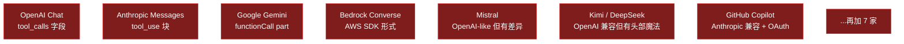
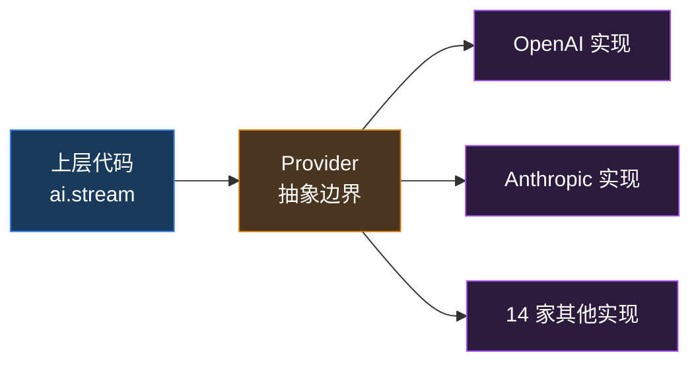
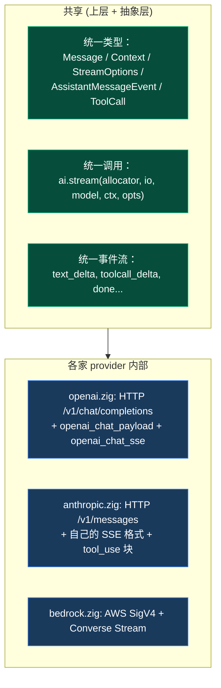
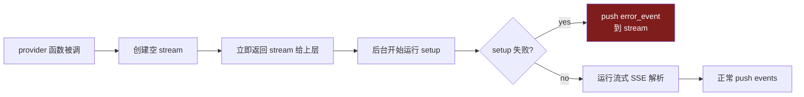
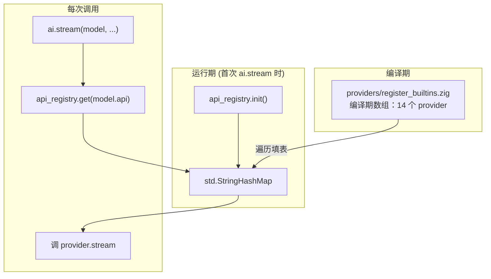

# 第 4 章 · Provider 抽象层

> 第 2 章我们看到 LLM API 的 wire format，第 3 章看到 Tool Calling 三家供应商互不兼容。这一章解决一个具体的工程问题：**14 家 LLM 服务商的 API 各不相同，怎么用一套代码统一调用？**

## 4.1 问题：API 形状各异

光是 OpenAI、Anthropic、Google 三家就有完全不同的 wire format（[第 3 章 §3.6](./tool-calling#36-三家供应商的差异) 已经看过）。再加上 Bedrock、Mistral、Kimi、DeepSeek、xAI、Groq、Cerebras、OpenRouter、Vercel AI Gateway、Cloudflare AI Gateway、Azure OpenAI、Google Vertex、GitHub Copilot……



每家的差异点：

| 维度 | 例子 |
| --- | --- |
| **HTTP 路径** | `/v1/chat/completions` vs `/v1/messages` vs `/models/X:streamGenerateContent` |
| **鉴权方式** | `Authorization: Bearer` / `x-api-key` / AWS Signature v4 / OAuth |
| **请求体形状** | messages 数组 / system + messages / contents.parts |
| **流式分隔** | SSE `data:` / 自定义换行 / chunked binary |
| **stop_reason** | "stop" / "end_turn" / "STOP" / "tool_use" |
| **工具调用格式** | 三种完全不同（见第 3 章） |
| **错误形态** | HTTP 4xx body / JSON error 字段 / 自定义 wrapper |

如果上层每碰一家就要 `if openai then ... else if anthropic ...`，**代码会被 14 个分支撕碎**。

## 4.2 抽象层的目标



理想状态：**上层代码完全不知道有 14 家 provider，只调一个接口**。具体差异全部塞进 provider 实现内部。

但完美抽象不存在——provider 之间有些差异是**本质上不同的语义**（如 thinking 模式、prompt cache），不能简单抹平。所以真实的抽象层是**"管理露出多少差异，而非消除所有差异"**。

## 4.3 pi-mono-zig 的抽象形状

回顾 [ai 卷宗 §5](/internals/ai#5-provider-抽象怎么实现)，抽象的核心是 Linux 内核 `struct file_operations` 风格——**一组函数指针绑成 struct**：

```zig
// zig/src/ai/api_registry.zig 的核心
pub const StreamFunction = *const fn (
    allocator: std.mem.Allocator,
    io: std.Io,
    model: types.Model,
    context: types.Context,
    options: ?types.StreamOptions,
) anyerror!event_stream.AssistantMessageEventStream;

pub const ApiProvider = struct {
    api: types.Api,                // "openai-completions"
    stream: StreamFunction,        // 普通流式
    stream_simple: StreamFunction, // 简化 options 流式
};
```

每家 provider = **一个独立 Zig 文件 + 两个函数指针**。注册到一个全局 `StringHashMap`。

### 4.3.1 抽象边界的"形状"



### 4.3.2 抽象层"露出"了哪些差异

完美抽象不存在。pi-mono-zig 在 `StreamOptions`（types.zig）里**故意露出 30+ provider-specific 字段**：

```zig
pub const StreamOptions = struct {
    // 通用部分
    temperature: ?f32 = null,
    max_tokens: ?u32 = null,
    api_key: ?[]const u8 = null,
    headers: ?std.StringHashMap = null,
    signal: ?*std.atomic.Value(bool) = null,

    // Anthropic 特化
    anthropic_thinking_enabled: bool = false,
    anthropic_thinking_budget: ?u32 = null,
    anthropic_cache_retention: CacheRetention = .unset,

    // OpenAI 特化
    openai_reasoning_effort: ?[]const u8 = null,

    // Google 特化
    google_thinking: ?GoogleThinkingMode = null,

    // Bedrock 特化
    bedrock_region: ?[]const u8 = null,

    // Mistral / Kimi / Azure / ...
    // (~20 more provider-specific fields)
};
```

::: warning 这是"成熟的不完美"
30+ 个 provider-specific 字段是**已知的设计气味**（[ai 卷宗 §7](/internals/ai#7-设计气味) 第 1 项），但当前是**已知的合理妥协**：

- **如果隐藏**：上层无法用到 provider 特性（thinking、prompt cache）
- **如果完全平铺**：每加一个新特性就改 StreamOptions
- **当前折中**：核心字段在 `SimpleStreamOptions`，特化字段在 `StreamOptions`

C ABI（[附录 A](/appendix/c-abi-v0)）选择了第三条路：暴露 `pi_options_set_provider_json(opts, "{\"thinking_enabled\": true}")` ——provider 特化字段以 JSON 形式传递。
:::

## 4.4 14 家 provider 一览

| Provider | 文件 | 行数 | 特点 |
| --- | --- | --- | --- |
| `openai` | `openai.zig` | 2.3k | OpenAI Chat Completions（最早） |
| `openai_responses` | `openai_responses.zig` | 3.7k | OpenAI Responses API（新一代，含 reasoning） |
| `openai_codex_responses` | `openai_codex_responses.zig` | 2.2k | Codex 专用变体 |
| `azure_openai_responses` | `azure_openai_responses.zig` | 1.9k | Azure 托管 + 自己的鉴权 |
| `anthropic` | `anthropic.zig` | 4.0k | 最大的实现，含 thinking + cache |
| `google` | `google.zig` | 1.9k | Generative AI Studio |
| `google_vertex` | `google_vertex.zig` | 2.1k | Vertex AI（IAM 鉴权） |
| `google_gemini_cli` | `google_gemini_cli.zig` | 1.4k | 通过 gcloud CLI 拿凭据 |
| `bedrock` | `bedrock.zig` | 3.7k | AWS Converse Stream + SigV4 |
| `mistral` | `mistral.zig` | 1.8k | OpenAI-like 但 prompt_mode 不同 |
| `kimi` | `kimi.zig` | 1.5k | OpenAI 兼容 + 国产模型 |
| `cloudflare` | `cloudflare.zig` | 0.2k | 仅 routing 到 AI Gateway |
| `faux` | `faux.zig` | 1.4k | **测试假 provider**，本地脚本可用 |
| 共享辅助 | `openai_chat_payload.zig` | 1.1k | OpenAI 兼容族共享请求构造 |
| 共享辅助 | `openai_chat_sse.zig` | 0.9k | OpenAI 兼容族共享 SSE 解析 |

::: tip faux provider 的妙处
`faux` 不调任何真 LLM，根据脚本"假装"在生成。**这是测试 agent loop 的关键**——单元测试不需要 API key、不花钱、可重放。
:::

## 4.5 一个 provider 内部长什么样

以 `openai.zig` 为例，简化后的骨架：

```zig
pub fn stream(
    allocator: std.mem.Allocator,
    io: std.Io,
    model: types.Model,
    context: types.Context,
    options: ?types.StreamOptions,
) !event_stream.AssistantMessageEventStream {
    // 1. 创建空的事件流（立即返回给上层）
    var stream_handle = createAssistantMessageEventStream(allocator, io);

    // 2. 把生产逻辑交给 setup-or-emit 模板
    return runSetupOrEmit(stream_handle, struct {
        fn run(stream: *AssistantMessageEventStream, ...) !void {
            // 2.1 解析 API key
            const api_key = try resolveApiKey(options, "OPENAI_API_KEY");

            // 2.2 归一化 messages（图片、tool_call_id）
            const transformed = try transform_messages.transform(...);

            // 2.3 拼请求体
            const payload = try openai_chat_payload.build(...);

            // 2.4 发 HTTP
            var http_stream = try http_client.requestStreaming(payload, ...);
            defer http_stream.deinit();

            // 2.5 边读边解析 SSE，事件 push 到 stream
            try openai_chat_sse.parseStream(http_stream, stream);
        }
    }.run);
}
```

**整个文件 2300 行**——大部分是各种边界情况的处理（重试、timeouts、reasoning 字段、tool_call 累积）。但骨架就是这 5 步。

### 4.5.1 setup-or-emit 是核心模板

回顾 [ai 卷宗 §1.2](/internals/ai#1-2-内部依赖图)，所有 provider 都通过 `shared/provider_stream.zig::runSetupOrEmit` 包装。这个模板做了一件事：



**所有错误都变成 `error_event` 事件**——上层的 `while (stream.next())` 循环统一处理。这就是第 2 章 §2.6.3 提到的"错误也是事件"的具体落地。

## 4.6 注册与查找



`model.api` 是字符串（如 `"openai-completions"`），`registry.get(api)` 返回 `ApiProvider` struct，里面有两个函数指针。

::: info 这种设计的妙处
**字符串 key 而不是枚举 key**——意味着第三方可以注册新 provider，不用改核心代码。**Provider 不知道注册表存在**——它只导出符合 `StreamFunction` 签名的函数，注册由 `register_builtins.zig` 集中做。这是 Linux 内核 `module_init()` 的设计风格。
:::

## 4.7 加一个新 provider 要做什么

5 步：

1. 新建 `providers/<name>.zig`，导出 `pub fn stream(...)` 和 `pub fn streamSimple(...)`
2. 在 `providers/register_builtins.zig` 加一条 metadata
3. 在 `root.zig` 的 `providers` 命名空间加 import（可选）
4. 写一个 smoke test
5. 更新 `KnownApi` / `KnownProvider` 枚举（仅文档作用）

5 步里**只有第 1 步是真有信息量的工作**。剩下 4 步是机械的注册——这就是好抽象的标志：**加扩展不需要改核心**。

::: tip OpenAI 兼容族的捷径
如果新 provider 是 OpenAI 兼容（DeepSeek、xAI、Groq、Cerebras、OpenRouter 都是），可以**直接复用 `openai_chat_payload.zig` + `openai_chat_sse.zig`**，新 provider 文件只需要 200-500 行（处理鉴权头部和模型名映射）。pi-mono-zig 的 14 个 provider 里有 6 个是这样实现的。
:::

## 4.8 抽象层未来怎么演进

`StreamOptions` 30+ 字段的设计气味是已知问题。[ai 卷宗 §10](/internals/ai#10-待讨论的设计抉择) 第 2 项提到的提案：**引入"扩展槽"机制**：

```zig
pub const StreamOptions = struct {
    // 通用核心字段（10 个左右）
    ...

    // 扩展槽：provider 自己解析
    provider_options: ?*anyopaque = null,
};
```

每个 provider 自己定义 `OpenAIOptions` / `AnthropicOptions` 等具体类型，调用方从 typed builder 里拿到 `*anyopaque`。这避免 `StreamOptions` 不停膨胀，代价是稍微增加 caller 侧的复杂度。

C ABI（pi.h）已经按这个方向走——`pi_options_set_provider_json` 用 JSON 字符串传 provider 特化设置。

## 4.9 这一章对应仓库里的代码

| 概念 | 文件 |
| --- | --- |
| 抽象层入口 | `zig/src/ai/stream.zig`（5 个函数 + dispatcher） |
| Provider 注册表 | `zig/src/ai/api_registry.zig` |
| 内建 provider 列表 | `zig/src/ai/providers/register_builtins.zig` |
| 14 个 provider 实现 | `zig/src/ai/providers/*.zig` |
| OpenAI 兼容族共享 | `zig/src/ai/providers/openai_chat_payload.zig` + `openai_chat_sse.zig` |
| setup-or-emit 模板 | `zig/src/ai/shared/provider_stream.zig` |
| 消息归一化 | `zig/src/ai/shared/transform_messages.zig` |
| 测试假 provider | `zig/src/ai/providers/faux.zig` |

::: info 想看更深
- [ai 模块卷宗](/internals/ai) — 核心：抽象层全貌 + Provider 抽象的代码结构 + C ABI 评估
- 卷宗 §5「Provider 抽象怎么实现」是这一章的"系统视角版本"，本章是"读者视角版本"
:::

## 4.10 接下来

我们已经看完整本书的核心概念：

- 第 1 章 — 什么是 Agent
- 第 2 章 — LLM API 的本质
- 第 3 章 — Tool Calling
- **第 4 章 — Provider 抽象**（你在这里）
- 第 5 章 — Agent Loop
- 第 7 章 — 扩展机制
- 附录 A — C ABI v0.1

剩下两章是**应用化**——把核心概念用到具体场景：

- 第 6 章 — Coding Agent（具体的 8 个工具 + 安全实战）
- 第 8 章 — TUI 与会话（流式渲染 + 回放 + 工程实践）

[**回到导言** ←](./)

---

::: info 本章关键术语速查

| 术语 | 简短定义 |
| --- | --- |
| Provider 抽象 | 把 14 家 LLM API 的差异收进一组函数指针 |
| `StreamFunction` | provider 必须导出的函数签名 |
| `ApiProvider` | api 字符串 + 两个函数指针的 struct |
| setup-or-emit | 把 setup 阶段错误也变成事件的统一模板 |
| OpenAI 兼容族 | DeepSeek/xAI/Groq 等共享 OpenAI 请求/SSE 实现 |
| faux provider | 测试用假实现，不调真 API |

:::
