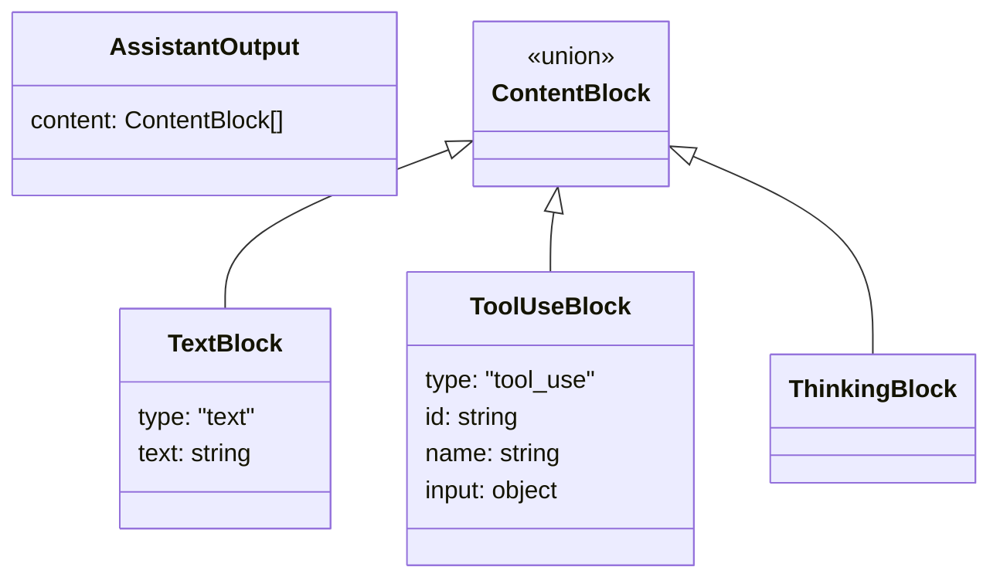
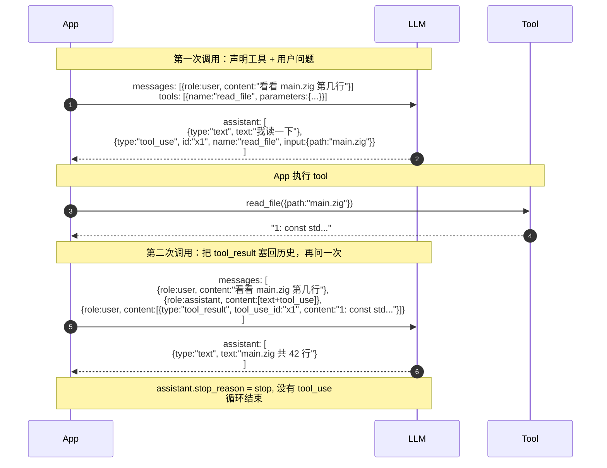
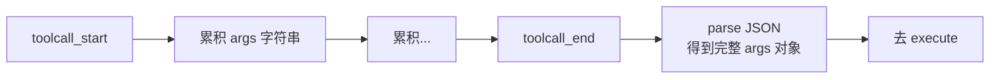

# 第 3 章 · Tool Calling

> 第 2 章我们看了 LLM API 怎么"对话"。第 5 章我们看了 Agent Loop 怎么"循环"。这一章把它们之间的桥架起来——**LLM 怎么"调用"一个工具**。

::: tip 章节顺序
本来这一章应该在第 2 章之后立刻写，但因为我们先把第 5 章写完了（趁记忆新鲜），所以这章是回填。**如果你按照标号顺序读到这里，直接往下；如果你已经读过第 5 章，这章会更好理解——你已经知道循环是什么样了，现在补的是循环里"工具调用"那一格的细节。**
:::

## 3.1 桥的两端

```mermaid
flowchart LR
    L[LLM<br/>"我想读 foo.txt"] -.tool_use.-> A
    A[Agent] -.execute.-> T[Tool<br/>真去读文件]
    T -.result.-> A
    A -.tool_result.-> L

    style L fill:#1a3a5c,color:#fff
    style A fill:#4a3520,color:#fff
    style T fill:#064e3b,color:#fff
```

桥的两端都是"语言"——LLM 一端只懂 JSON，Tool 一端是真正的代码。这一章就是讲**这两端的语言怎么互相翻译**。

整个 tool calling 协议归结到一个三段式：

1. **声明**：你告诉 LLM"你有这些工具，每个长这样"。
2. **请求**：LLM 输出"我想调 X 工具，参数是 Y"——这个东西叫 `tool_use`。
3. **回复**：你执行完，把结果包成 `tool_result`，作为下一轮对话历史的一部分发回去。

## 3.2 第一段：声明工具（Function Schema）

LLM 不会"看代码"。它只能看到一份 JSON 描述。这份描述叫 **function schema**，本质是 [JSON Schema](https://json-schema.org/) 的一个子集。

### 3.2.1 一个最简单的声明

```json
{
  "name": "read_file",
  "description": "Read the contents of a file at the given path.",
  "parameters": {
    "type": "object",
    "properties": {
      "path": {
        "type": "string",
        "description": "Absolute or relative file path"
      },
      "offset": {
        "type": "integer",
        "description": "Line number to start at (0-based)",
        "default": 0
      }
    },
    "required": ["path"]
  }
}
```

这就是 LLM 看到的"一个工具"——三个字段：

| 字段 | 它是什么 | 为什么重要 |
| --- | --- | --- |
| `name` | 工具的标识符 | LLM 用它指代具体工具 |
| `description` | 自然语言说明 | **决定 LLM 何时会想到用这个工具**——写好这句话比代码本身更影响 agent 行为 |
| `parameters` | JSON Schema | 告诉 LLM 参数长什么样、哪些必填 |

::: warning 工具描述是 prompt engineering
描述里的每一个字 LLM 都会读。**"Read a file"和"Read the contents of a file at the given path, returning the text contents up to a default of 2000 lines"**——后者会让 LLM 更主动用、更少出错。这不是文档，是给 LLM 的指令。
:::

### 3.2.2 在 pi-mono-zig 里怎么写

每个工具的 schema 是**代码生成的**，不是 JSON 文件：

```zig
// 简化自 zig/src/coding_agent/tools/read.zig
pub fn schema(allocator: std.mem.Allocator) !std.json.Value {
    var properties = std.json.ObjectMap.init(allocator);
    try properties.put("path", .{ .object = ... });
    try properties.put("offset", .{ .object = ... });

    var schema_obj = std.json.ObjectMap.init(allocator);
    try schema_obj.put("type", .{ .string = "object" });
    try schema_obj.put("properties", .{ .object = properties });
    try schema_obj.put("required", .{ .array = ... });
    return .{ .object = schema_obj };
}
```

::: info 为什么不放 JSON 文件
- 类型一致性：参数定义和 Zig struct 的字段对得上，编译器能检查
- 国际化：description 可以根据用户语言动态生成
- 性能：不需要运行时读 / 解析磁盘文件

代价是改 schema 要改代码，不能"配置化"。这是工具内置 vs 工具配置的常见 trade-off。
:::

## 3.3 第二段：LLM 的 tool_use 请求

LLM 决定要调工具时，输出**不是普通文本**，而是一个特殊的"tool_use 块"。具体形态各家不同，但语义统一：



Anthropic 的实际 JSON 长这样：

```json
{
  "role": "assistant",
  "content": [
    { "type": "text", "text": "Let me read that file for you." },
    {
      "type": "tool_use",
      "id": "toolu_01ABC",
      "name": "read_file",
      "input": { "path": "src/main.zig", "offset": 0 }
    }
  ]
}
```

四个关键字段：

| 字段 | 用途 |
| --- | --- |
| `type: "tool_use"` | 区分这是工具调用，不是普通文本 |
| `id` | 唯一标识符，**回填 tool_result 时必须带回这个 id** |
| `name` | 你声明工具时的 `name` 字段 |
| `input` | 解析过的 JSON 对象，符合你声明的 parameters schema |

## 3.4 第三段：你的 tool_result 回复

执行完工具，你把结果包成"tool_result 块"，**塞进对话历史的下一条消息里**：

```json
{
  "role": "user",
  "content": [
    {
      "type": "tool_result",
      "tool_use_id": "toolu_01ABC",
      "content": "1: const std = @import(\"std\");\n2: ...",
      "is_error": false
    }
  ]
}
```

注意三件事：

1. **role 是 `user`**——虽然你不是真的用户，但从 LLM 的视角"工具回执"等价于"环境给的反馈"，归到 user role。
2. **`tool_use_id` 必须等于刚才 LLM 给的 id**——否则模型不知道这个结果对应哪个调用。
3. **`is_error: true` 是一种特殊状态**——告诉 LLM"这次调用失败了，你看到的是错误信息"。LLM 会决定是重试、换工具、还是放弃。

## 3.5 完整的一轮对话

把三段拼起来，就是一次"agent 帮你读了个文件"的完整 wire trace：



::: tip 这就是 Agent Loop 内部的实际数据流
回顾第 5 章 §5.1 的 10 行伪代码——每次 `state.append(.{.tool_result = result})` 就是把这一段 JSON 拼到 messages 数组里。**整个 Agent Loop 的代码，本质是在每轮重新组装这个 messages 数组。**
:::

## 3.6 三家供应商的差异

OpenAI、Anthropic、Google 的 wire format **不同**，pi-mono-zig 的 `transform_messages` 和 provider 模块（见 [ai 卷宗](/internals/ai)）的工作就是抹平这些差异。

### 3.6.1 一张对照表

| 维度 | Anthropic | OpenAI Chat Completions | Google Gemini |
| --- | --- | --- | --- |
| **assistant 输出形态** | `content: [{type:"tool_use", ...}]` | `tool_calls: [{id, type:"function", function:{name, arguments:string}}]` | `content.parts: [{functionCall:{name, args}}]` |
| **arguments 格式** | 已解析的 object | **JSON 字符串**（要再 parse 一次） | 已解析的 object |
| **tool_result role** | `user` + `content: [{type:"tool_result"}]` | 单独的 `role: "tool"` | `function_response` part |
| **id 字段名** | `id` | `tool_call_id` | 没有显式 id（按位置匹配） |

### 3.6.2 OpenAI 的"双层 JSON"坑

```json
// OpenAI 的 tool call
{
  "id": "call_abc",
  "type": "function",
  "function": {
    "name": "read_file",
    "arguments": "{\"path\":\"main.zig\"}"  // ← 注意这是字符串！
  }
}
```

`arguments` 是 **JSON 字符串**而不是 JSON 对象。这是历史包袱——OpenAI 早期的 function calling 设计成字符串，后来改不动了。

::: warning 这意味着流式时要做两次累积
1. 先把所有 `arguments` 的 delta 字符串拼起来
2. 整个 string 完整后，再 `JSON.parse` 一次

这就是为什么 [agent 卷宗](/internals/agent) 提到的 `PartialToolCallBlock.arguments` 是 `std.ArrayList(u8)` 而不是 `std.json.Value`——它存的是**还没 parse 的字符串**。
:::

## 3.7 流式 tool call：参数也是 deltas

最容易踩的坑：**流式输出时，tool call 的参数也是一边生成一边吐**。你不会一次性拿到 `{"path":"main.zig"}`，而是：

```
SSE 事件序列：
  toolcall_start (id="x1", name="read_file")
  toolcall_delta (delta='{"pa')
  toolcall_delta (delta='th":"m')
  toolcall_delta (delta='ain.zig"}')
  toolcall_end
```

这就是为什么 pi-mono-zig 的 `event_stream` 里有 `text_delta`、`thinking_delta`、`toolcall_delta` 三种 delta 事件——它们都对应着模型在"边想边吐"，只不过吐的内容形态不同。



::: tip Streaming 不只是为了 UX
"为什么不等模型生成完再一次性发"——除了 UX 延迟，**还有一个实际原因**：可中断。如果模型已经吐了 50% 的参数，发现要调用一个危险工具（如 `rm -rf`），用户可以立刻按 Ctrl-C，**省下后 50% 的 token 钱**。这是第 5 章 §5.7 协作式 abort 的应用场景之一。
:::

## 3.8 三个常见坑

### 3.8.1 LLM "幻觉"出不存在的工具

LLM 偶尔会调一个你没声明的工具——也许是它训练数据里见过的 `web_search`、`calculator` 之类。处理方式：

```zig
// agent_loop.zig 里的实际逻辑（简化）
const tool = findTool(tools, tool_call.name) orelse {
    return .{
        .content = makeText("Unknown tool: " ++ tool_call.name),
        .is_error = true,
    };
};
```

返回 `is_error: true` + 错误说明。**LLM 看到这个错误后，通常会改用真实存在的工具**，比如把 `web_search` 改成本地的 `grep`。

### 3.8.2 LLM 出错的参数

```
LLM 想：read_file({"path": null})  ← 参数错
```

JSON Schema 校验在 prepare_arguments 这个钩子里做（见第 5 章 §5.5）。校验失败照样返回 `is_error: true`，让 LLM 自己改。

::: warning 不要在校验失败时 panic
有些早期 agent 框架会 throw exception 终止整个 loop。**正确做法是把错误塞进对话历史**——LLM 看到错误信息会自我修正。这是"错误也是数据"哲学的延伸。
:::

### 3.8.3 同一轮多个 tool_call

LLM 一次输出可以包含多个 tool_use 块——"读 foo.txt 然后 grep TODO"。三种处理方式：

| 模式 | 行为 |
| --- | --- |
| **串行** | 一个个执行，按顺序 push tool_result |
| **并行** | 同时跑（pi-mono 默认；见 agent 卷宗 §6） |
| **混合** | 普通工具并行，标了 `.sequential` 的串行 |

记得每个 tool_result 都要带对应的 `tool_use_id`——LLM 用 id 匹配回调，不靠顺序。

## 3.9 安全边界：tools 与能力

::: tip 这是 pi-mono-zig 的关键设计
不是每个 tool_call 都"应该被允许"。**`bash` 工具能跑任何命令——你想给 LLM 这个权力吗**？
:::

pi-mono-zig 用 [coding_agent 卷宗 §6](/internals/coding-agent#6-enforcement-12-个-capability-的能力边界) 的 12 个 **capability** 控制：

```
file_read    file_write    network_request    shell_run
env_read     model_call    session_read       session_write
ui_notify    tool_use      agent_spawn        agent_delegate
```

每次 tool 执行时，框架检查"这个 principal 有没有需要的 grant"——没有就拒绝。**SDK 用户可以构造一个"只有 file_read"的 principal，把 agent 限制成只读模式**。

```mermaid
flowchart LR
    Call[LLM 想调 bash] --> Check{principal 有<br/>shell_run grant?}
    Check -->|是| Exec[执行]
    Check -->|否| Deny[is_error: true<br/>"Permission denied"]
```

第 7 章会展开整个能力 / enforcement 模型。

## 3.10 这一章对应仓库里的代码

| 概念 | 文件 |
| --- | --- |
| Schema 定义（每个工具自带 `schema()`） | `zig/src/coding_agent/tools/*.zig` |
| Anthropic 的 tool_use wire format | `zig/src/ai/providers/anthropic.zig` |
| OpenAI 的"双层 JSON" args | `zig/src/ai/providers/openai_chat_payload.zig` |
| 流式 tool call 累积 | `zig/src/agent/agent_loop.zig`（`PartialToolCallBlock`） |
| 4 个 tool 钩子（prepare/before/execute/after） | `zig/src/agent/types.zig` |
| 12 个 capability 与 enforcement | `zig/src/coding_agent/extensions/enforcement.zig` |

::: info 想看更深
- [ai 模块卷宗](/internals/ai)——Provider 抽象、SSE 解析
- [agent 模块卷宗](/internals/agent)——4 个钩子的精确签名
- [coding_agent 模块卷宗](/internals/coding-agent)——8 个工具实现 + enforcement 模型
:::

## 3.11 接下来

我们已经完整看到了 LLM ↔ Tool 这座桥的两边。剩下的章节：

- 第 4 章 (待补) — Provider 抽象层（OpenAI / Anthropic / Google 的差异如何抹平成统一 API）
- 第 6 章 — Coding Agent（具体的 8 个工具 + 安全模型实战）
- 第 7 章 — 扩展机制（如何让别人安全地往 agent 里加新工具）
- 第 8 章 — TUI 与会话（流式渲染、回放、可中断）

[**回到导言** ←](./)

---

::: info 本章关键术语速查

| 术语 | 简短定义 |
| --- | --- |
| function schema | JSON Schema 描述工具参数；声明给 LLM 看 |
| tool_use | LLM 输出里"我想调工具 X"的特殊块 |
| tool_result | 你回给 LLM 的"工具执行结果"块 |
| tool_use_id | 关联请求和结果的唯一 id |
| 幻觉工具 | LLM 调用了不存在的工具 |
| capability / grant | 控制"这个 agent 能不能调某类工具"的权限项 |
:::
