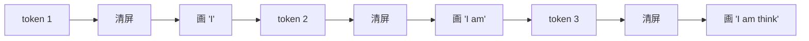
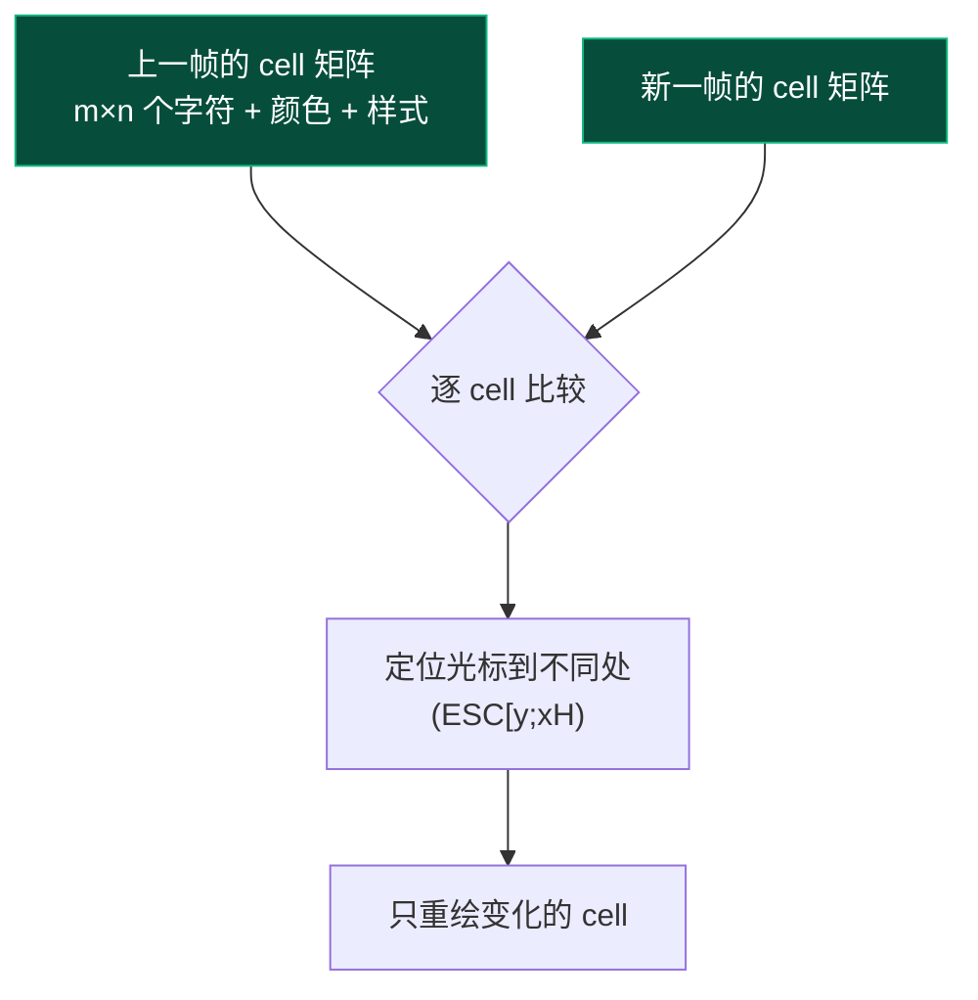
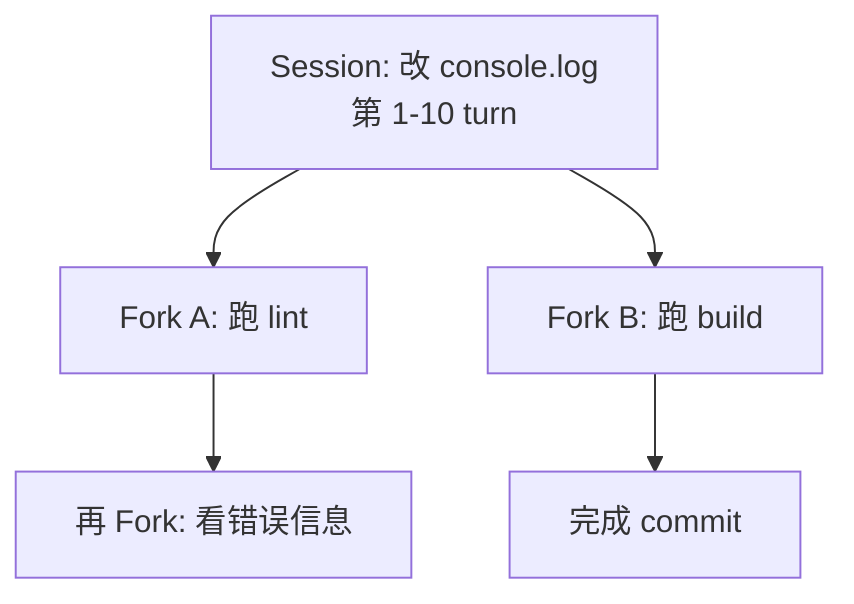

# 第 8 章 · TUI 与会话

> 全书最后一章。前 7 章都在讲"agent 内部如何思考"——这一章讲"agent 如何被人看见、被记住、被打断"。

## 8.1 三个看似独立但实质统一的工程问题

写一个能用的编码代理，必须解决三件事：

1. **流式渲染**：模型一边吐 token 一边显示，**不能等全部生成完**——5 秒等待感觉像永久。
2. **会话持久化**：用户关闭终端再打开，应该能继续昨天的对话——**不能让 5 万 token 的上下文蒸发**。
3. **可中断**：用户看到 agent 走错路要立刻按 Ctrl-C 停下——**不能继续烧 token 烧资金**。

这三个问题表面无关，但**底层都是同一件事的三种形态**：**事件流的实时处理**。

```mermaid
flowchart LR
    classDef stream fill:#1a3a5c,stroke:#3b82f6,color:#fff

    Source[Agent 事件流]:::stream
    Source --> R[流式渲染<br/>"在屏幕上"]
    Source --> P[持久化<br/>"在磁盘上"]
    Source --> A[Abort 监听<br/>"反向通道"]
```

第 5 章 §5.8 已经埋下这个伏笔："Agent 只发事件；UI/存储/遥测各自订阅"。本章是它的具体落地。

## 8.2 流式渲染：屏幕的"差量更新"

### 8.2.1 朴素方案的问题

最简单的实现："每次有新 token 就清屏重画"：



**问题**：

- **闪烁**：每次清屏所有像素都重绘，肉眼看到一闪一闪
- **慢**：终端逐字符发 ANSI 序列，在 SSH 上更明显
- **滚动错位**：之前已经渲染好的内容（之前消息、tool 输出）也被重画

### 8.2.2 差量渲染（differential rendering）

`pi-mono-zig` 的 TUI 模块用的是这个：



**核心思想**：**屏幕是一个 char-cell 矩阵；每次只更新变化的 cell**。

代码上对应：

```zig
// zig/src/tui/cell_rows.zig 的核心
pub const Cell = struct {
    char: u21,           // Unicode codepoint
    fg: Color,
    bg: Color,
    style: Style,        // bold/italic/underline
};

pub const CellRows = struct {
    rows: [][]Cell,      // 行数 × 列数
    pub fn diff(old: CellRows, new: CellRows, output: *AnsiWriter) !void {
        // 逐 cell 对比，只发"光标移动 + 改这一格"的指令
    }
};
```

每次模型吐新 token，**TUI 重新构造一次完整的 cell 矩阵**，diff 后只把变化部分通过 ANSI 送给终端。**人眼看到的只是"那几个字变了"，不是"整屏重画"**。

### 8.2.3 流式 message 的特殊处理

但流式有一个不寻常的状态——**当前正在生成的 message 还没完整**。直接用普通 message 渲染会有问题：

- 它没有 `stop_reason`
- 它的 tool_calls 可能还在 delta 累积中
- 它会被多次"覆盖"（每次 `text_delta` 都更新）

回顾 [agent 卷宗 §4](/internals/agent#4-agent-loop-的状态机)，agent 内部用 **`streaming_message` 状态字段**专门追踪这个：

```zig
pub const Agent = struct {
    is_streaming: bool,
    streaming_message: ?AgentMessage,    // ← 当前正在生成的 partial message
    // ...
};
```

TUI 看到 `is_streaming = true` 时：

- 已完成的 messages 列表（`messages` 数组）= 静态显示
- `streaming_message` = 单独区域，每次 `message_update` 事件就重建这一块的 cell 矩阵

这是"**稳定区域 + 流动区域**"的两段式渲染——实际像 ChatGPT 网页 UI 一样的体验。

## 8.3 会话持久化：JSONL append-log

### 8.3.1 为什么是 JSONL 而不是 JSON

整段对话作为一个 JSON 文件 → **每次新 message 要重写整个文件**。如果对话有 100 turns，每个 turn 都改一次 50KB 文件——**1MB+ IO 浪费**，还有 crash safety 问题（写一半挂了文件就坏了）。

JSONL（每行一个 JSON 对象）：

```
{"type":"user","content":"hello","timestamp":1714521600}
{"type":"assistant","content":"hi!","tokens":5,"timestamp":1714521610}
{"type":"tool_result","tool_use_id":"x1","content":"...","timestamp":1714521620}
{"type":"assistant","content":"done","stop_reason":"stop","timestamp":1714521630}
```

每次新事件 = **append 一行**。`O(1)` 写入，crash 安全（最坏情况是最后一行不完整，可以丢）。

```mermaid
flowchart LR
    classDef ok fill:#064e3b,stroke:#10b981,color:#fff

    A[事件发生] --> B[追加一行 JSON]:::ok
    B --> C[fsync<br/>(可选)]:::ok

    style A fill:#1a3a5c,color:#fff
```

### 8.3.2 加载会话 = 重放事件

关闭再打开终端时，session 加载就是**逐行读 JSONL 把 messages 数组重建出来**：

```zig
// 简化自 zig/src/coding_agent/sessions/session_jsonl.zig
pub fn load(allocator: ..., path: []const u8) !AgentSession {
    var file = try std.fs.openFileAbsolute(path, .{});
    var session = AgentSession.empty(allocator);
    while (try readLine(file)) |line| {
        const entry = try parseEntry(line);
        try session.applyEntry(entry);
    }
    return session;
}
```

**Session 文件 = event log**——这是事件溯源（event sourcing）的最简版本。整套 session 系统在 `zig/src/coding_agent/sessions/`，含 fork、压缩、HTML 导出等延伸。

### 8.3.3 自定义条目（appendEntry）

扩展可以**往 session 里塞自己的数据**——比如 `bookmark.ts` 扩展把书签写进 session：

```typescript
api.session.appendEntry('my-app.bookmark', { name: 'TODO', message_id: 'm42' });
```

加载时 host 不认识 `my-app.bookmark` 类型，直接跳过；扩展自己读时再处理。**这是"事件流即开放接口"的应用**——对未来字段宽容（forward compatible）。

## 8.4 Forks 与 trees：会话不只是线性的

实际使用中，用户经常这样操作：

> "等等，刚才那个 commit 我反悔了。回到 5 步前，让 agent 走另一条路。"

如果 session 是线性的（一根链表），这种"回到过去 + 走另一条路"很难表达。pi-mono-zig 把 session 做成**树**：



每个 fork **物理上是新文件**，逻辑上指向父 session 的某个 message id。在 TUI 上可以"返回父分支"或"切换兄弟分支"。

::: tip 这是 git 风格
Session 树和 git commit 树形态完全一致——**每个 fork 是一个 commit，每个分支是一个 branch**。这种类比让用户立刻就懂了，不需要新概念。
:::

## 8.5 协作式取消：Ctrl-C 一路传到底

这是第 5 章 §5.7 的延伸。Ctrl-C 从用户按下到 agent 真停下，要穿过 5 层：

```mermaid
sequenceDiagram
    autonumber
    participant Term as Terminal
    participant TUI
    participant Agent as Agent struct
    participant Loop as runAgentLoop
    participant Tool as edit/bash tool
    participant LLM as ai.stream
    participant HTTP

    Term->>TUI: ^C 字节流
    TUI->>TUI: 识别 keyCode = ctrl_c
    TUI->>Agent: agent.abort()
    Agent->>Agent: active_abort_signal.store(true)

    par 各层异步检查 signal
        Loop->>Loop: 下次循环边界检查
        Tool->>Tool: 工具内部循环检查
        LLM->>HTTP: 关闭 SSE 连接
        HTTP->>LLM: stream end
    end

    Loop->>Agent: stop_reason = .aborted
    Agent->>TUI: agent_end event
    TUI->>Term: 显示 "Aborted by user"
```

### 8.5.1 关键：每一层都必须主动检查

**协作式（cooperative）的反义是抢占式（preemptive）**——抢占式取消是 OS 直接 kill 线程，会留下脏状态（半写的文件、未关闭的 socket）。pi-mono-zig 选了协作式：

- agent loop 的每个循环边界都查
- tool 执行的每个 inner loop 都查
- HTTP 客户端读 SSE 的每个 chunk 边界都查
- 用户的回调函数也可以查

**没人检查的地方就不会立刻停**——这是设计原则。所以 `edit` 工具内部的"读文件 → 字符串替换 → 写文件"这条链条，在每一步之间都要 `if (signal.load()) return error.Aborted;`。

### 8.5.2 取消之后状态怎么样

`stop_reason = .aborted` 出现在 turn_end 事件里。**已经做了的事不撤销**——edit 改过的文件留着、bash 跑完的命令留着。Session 里也按部就班记录到 abort 那一刻为止。

如果用户要"回滚到 abort 之前"，那是 fork（§8.4）干的事。**取消和回滚是两个独立机制**——这种正交分解避免一个机制承担太多语义。

## 8.6 一切都是事件流的回响

走到这里，本书第 1 章那句"Agent = LLM + 工具 + 循环"已经长成一棵很大的树。但树根没变——**所有的复杂性都是同一件事的不同侧面**：

```mermaid
flowchart TB
    classDef center fill:#7c2d12,stroke:#ea580c,color:#fff
    classDef leaf fill:#1a3a5c,stroke:#3b82f6,color:#fff

    Center[Agent 事件流<br/>(message_update, tool.call, ...)]:::center

    Center --> Render[流式渲染]:::leaf
    Center --> Persist[JSONL 持久化]:::leaf
    Center --> Hooks[扩展钩子触发]:::leaf
    Center --> Telemetry[token 统计 / 遥测]:::leaf
    Center --> Cancel[abort 信号传播]:::leaf
    Center --> Replay[加载历史会话]:::leaf
```

"**事件流是 Agent 的中央神经系统**"——这是这本书最重要的洞察。

## 8.7 这一章对应仓库里的代码

| 概念 | 文件 |
| --- | --- |
| 差量渲染 | `zig/src/tui/cell_rows.zig`（核心 diff 算法） |
| ANSI 序列写出 | `zig/src/tui/ansi.zig` |
| TUI 主循环 | `zig/src/coding_agent/interactive_mode/session_lifecycle.zig` |
| 流式 message 状态 | `zig/src/agent/agent.zig`（`streaming_message`） |
| 持久化 | `zig/src/coding_agent/sessions/session_jsonl.zig` |
| Session 管理 | `zig/src/coding_agent/sessions/session_manager.zig` |
| HTML 导出 | `zig/src/coding_agent/sessions/session_html_export.zig` |
| 协作式 abort | `zig/src/agent/agent.zig`（`abort()`），各 provider 内部 |

::: info 想看更深
- TUI 模块完整文件清单：`zig/src/tui/`（~12.5k 行）
- coding_agent 卷宗 §7.3 简要画像了 sessions 子系统
- 后续如有需要可单独写 tui 卷宗深挖差量渲染算法的实现细节
:::

## 8.8 收尾的话

如果你从第 1 章读到这里，你已经完整走过了：

- **8 章学习指南**——从"什么是 Agent"到"流式渲染 + 持久化"
- **5 份内部模块卷宗**——AI、Agent、Coding Agent、扩展系统、设计研究
- **1 份 C ABI 草案 + 附录**——跨语言 SDK 的契约
- **12 条已固化的设计决议**——D-1 到 D-12

如果你**想理解 AI Agent 怎么从零设计**——你已经有了一份完整答案。

如果你**想贡献代码或基于 pi-mono-zig 做 SDK**——你有了：
- 概念基础（这本书 8 章）
- 架构图纸（4 份卷宗 + 设计研究）
- 接口契约（pi.h + 附录 A）
- 边界条件（D-1 ~ D-12 决议）

如果你**想自己从零写一个 AI Agent**——这本书的每一章都给了你"该考虑什么、该怎么权衡、该看哪个示例"。

::: tip 最后一个建议
**好的工程文档不是"写完就完"，是活的**。代码会迭代，决议会被修正，新的发现会改写旧的判断。这本书和这些卷宗也一样——**它们是 2026-05-08 这个时间点的快照，未来要随代码同步更新**。

你看到 `[创建：2026-05-08]` 这种标注就是为这件事——**让未来的你或后来者能判断哪些信息可能过时了**。
:::

[**回到导言** ←](./)

---

::: info 本章关键术语速查

| 术语 | 简短定义 |
| --- | --- |
| 差量渲染 | 屏幕是 cell 矩阵；每次只更新变化的 cell |
| 流式 message | `streaming_message` 字段，TUI 单独区域显示 |
| JSONL append-log | 每行一个 JSON，`O(1)` 写入，crash 安全 |
| Session fork | 会话是树状的，可以"回到过去走另一条路" |
| 协作式取消 | 每层主动检查 signal，不抢占 |
| 事件流 = 中央神经系统 | 所有功能（UI/存储/扩展/遥测）都从同一个事件流派生 |

:::
