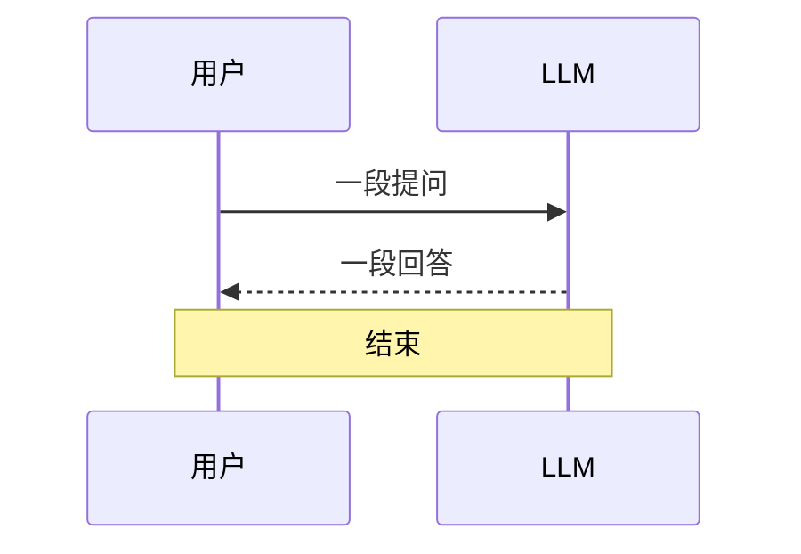
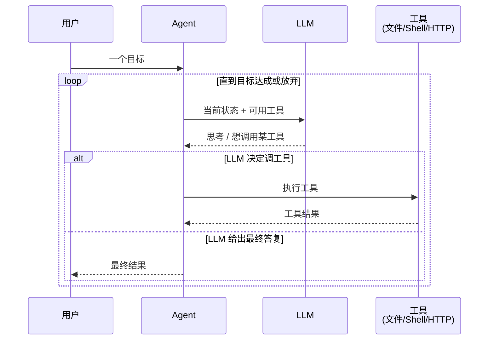
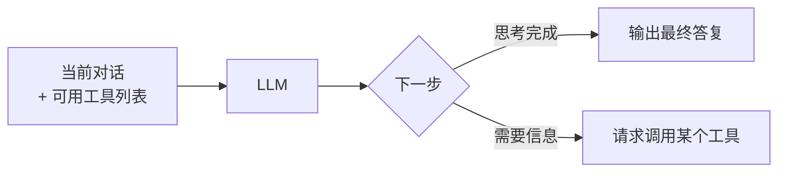
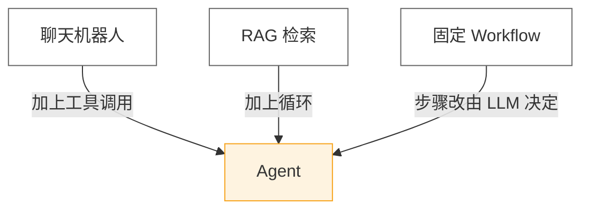

# 第 1 章 · 什么是 AI Agent

## 1.1 一个最朴素的问题

你应该用过 ChatGPT、Claude 或者类似的聊天界面。你打字、它回字，结束。这种交互在工程上叫做**一次性调用**（one-shot inference）。

但当你听到"AI Agent"这个词时，多半遇到过下面这种场景：

> 你说："帮我把这个项目里所有的 `console.log` 删掉。"
>
> 然后你看到屏幕上自己滚出一串动作：
> 1. 列目录
> 2. 读文件
> 3. 修改文件
> 4. 再列目录
> 5. 跑测试
> 6. 报告结果

这中间没有人按按钮，没有人在两个 ChatGPT 标签页之间复制粘贴。**这就是 Agent 与一次性调用的本质区别**：Agent 会自己接着自己的输出继续干活。

## 1.2 一图说清楚区别

::: tip
本书所有的图都是用 [Mermaid](https://mermaid.js.org/) 画的，可以右键查看源码。
:::

### 一次性调用



### Agent



如果你只记一句话，那就是这句：

> **Agent = LLM + 工具 + 循环**

## 1.3 把这三个要素拆开看

### 1.3.1 LLM：决策核心

LLM 在 Agent 里只做一件事——**根据当前状态决定下一步**。它不执行任何动作，它只输出"我打算做什么"。



### 1.3.2 工具：动作的实体

工具是 Agent 真正"动手"的地方。在编码代理里，最常见的工具是：

| 工具 | 作用 | 在 `pi-mono` 里的位置 |
| --- | --- | --- |
| `read` | 读文件 | `zig/src/coding_agent/tools/read.zig` |
| `edit` | 修改文件 | `zig/src/coding_agent/tools/edit.zig` |
| `bash` | 执行 shell | `zig/src/coding_agent/tools/bash.zig` |
| `grep` | 全仓搜索 | 通过 `rg` 实现 |

::: warning
LLM **不会**直接读你的硬盘——它只会"请求读"。真正动手的是 Agent 框架。这层间接是所有安全边界的起点，第 7 章会详细讲。
:::

### 1.3.3 循环：让 Agent 活起来

把 LLM 和工具串起来的，是一个**驱动循环**。它的伪代码极其简单：

```ts
while (!done) {
  const decision = await llm.next(state);
  if (decision.kind === "final") {
    done = true;
    return decision.text;
  }
  const result = await tools.run(decision.tool, decision.args);
  state.append({ tool: decision.tool, result });
}
```

整本书的剩余部分，都是在把这十行伪代码"展开"成一个能跑、能扩展、能跑在生产环境的真实系统。

## 1.4 什么不算 Agent

为了把概念定死，反向定义同样重要：

- **聊天机器人** ≠ Agent。它没有外部动作。
- **RAG 系统** ≠ Agent（但可以是 Agent 的一部分）。检索是**单步**的，不构成循环。
- **Workflow** ≠ Agent。Workflow 的步骤是**人类**写死的，Agent 的步骤由 **LLM** 决定。



## 1.5 接下来

下一章我们会深入第一个组件——**LLM API 的本质**。我们会回答这些问题：

- 你给 LLM 发的不是字符串吗？什么是 `messages`？
- token 是什么？为什么按 token 收费？
- 流式（streaming）输出是怎么做到一边生成一边显示的？
- SSE 又是什么？

[**进入第 2 章 →**](./) <!-- 待补 -->

---

::: info 本章对应代码
- TypeScript Agent Loop：`packages/agent/src/agent.ts`
- Zig Agent Loop：`zig/src/agent/agent.zig`

第 5 章会逐行拆解这两个文件，现在你只需要知道它们存在。
:::
