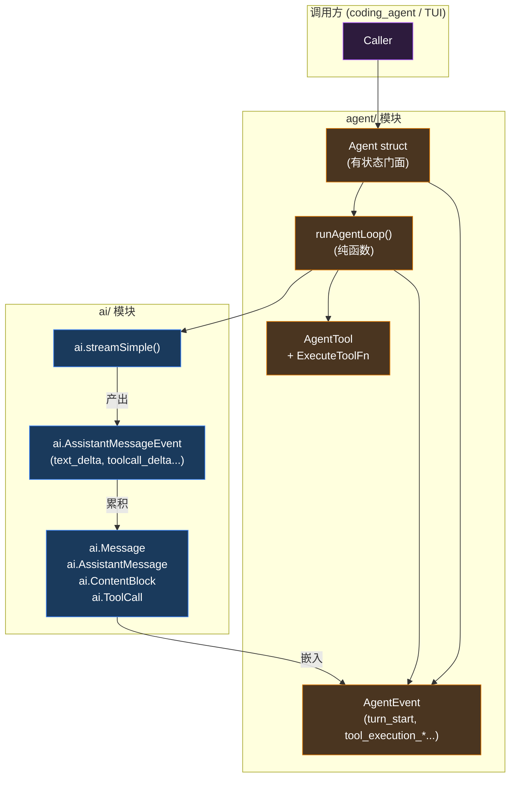
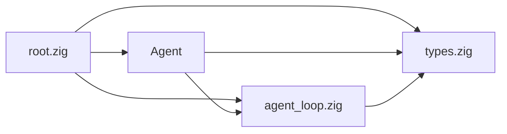
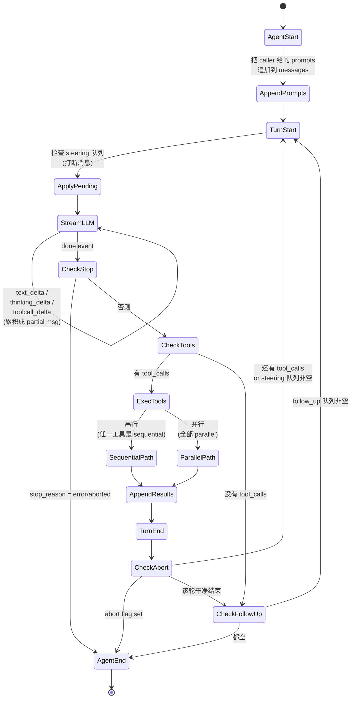
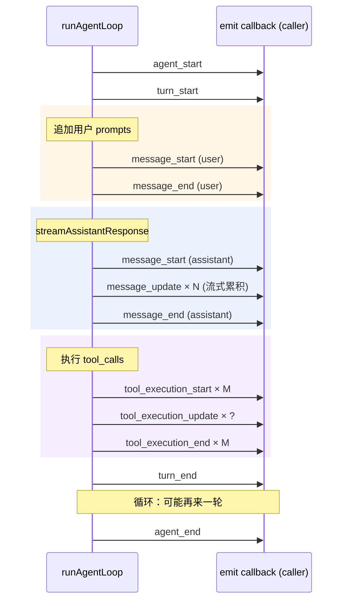
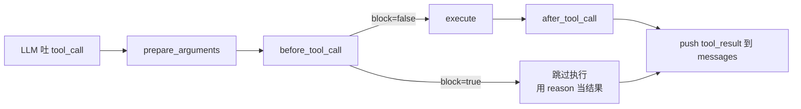
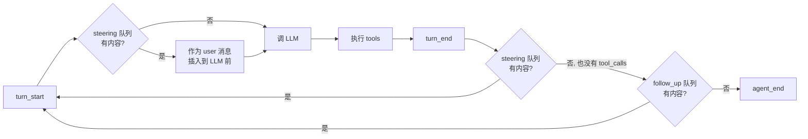

# `agent/` 模块卷宗

> **位置**：`zig/src/agent/`
> **体量**：~5.6k 行 Zig（4 个文件）
> **职责一句话**：把 `ai` 模块提供的"一次对话"原语，组装成"循环、有状态、能调工具、可中断"的 Agent 抽象。
> **对 ai 的依赖**：`agent` 通过 `@import("ai")` 直接拿用所有 `ai` 公开类型，不重新定义。

`ai` 模块是"如何与 LLM 对话"，`agent` 模块是"如何让 LLM 帮你完成一个任务"。两者的边界是：**`ai` 不知道工具是什么，`agent` 知道**。

## 卷宗的读法

| 节 | 内容 | 适合读 |
| --- | --- | --- |
| §1 | 鸟瞰图 + 与 ai 模块的边界 | 第一次接触 |
| §2 | 公共 API 表面 | 想用它 |
| §3 | 三个核心数据结构 | 想理解它的形状 |
| §4 | Agent Loop 的状态机 | 想理解它怎么工作 |
| §5 | 工具调用的生命周期 | 想理解 tool 子系统 |
| §6 | 并行 vs 串行执行 | 想理解性能模型 |
| §7 | 三种消息队列：history / steering / follow_up | 关键设计抉择 |
| §8 | C ABI 友好度评估 | SDK 化 |
| §9 | 设计气味 | 想重构 |
| §10 | 待讨论的设计抉择 | 想拍板 |
| §11 | 下一步行动 | 现在 |

---

## §1 · 鸟瞰图

### 1.1 文件分组

```
zig/src/agent/
├── root.zig             ~35 行   公共表面：重导出
├── types.zig            ~240 行  数据类型 + 函数指针类型
├── agent.zig            ~2000 行 Agent struct（状态、订阅、命令接口）
└── agent_loop.zig       ~3300 行 runAgentLoop（无状态的循环执行器）
```

### 1.2 与 `ai` 模块的边界



::: tip 重要观察
**`agent` 是 `ai` 的"包装层"，但它包装得很薄**——`ai.Message` 直接用作 `AgentMessage`（types.zig:4），`ai.ContentBlock` 直接出现在 `AgentToolResult` 里。这种"零转译"的依赖关系意味着 `agent` 完全继承了 `ai` 的 ABI 友好度——如果 `ai` 的类型不能跨 C ABI，`agent` 也不能。
:::

### 1.3 内部依赖



简单干净——4 个文件、单向依赖、没有反向耦合。**这是这个模块比 `ai` 模块更整洁的地方**。

---

## §2 · 公共 API 表面

`root.zig` 重导出 21 个名字。核心入口只有两类：

### 2.1 高层（有状态）：`Agent` struct

适合"一个交互式 Session"的场景——`Agent` 持有对话历史、订阅者列表、abort 信号、三个消息队列。

```zig
var agent = try Agent.init(allocator, .{
    .system_prompt = "You are a coding assistant.",
    .model = my_model,
    .api_key = "sk-...",
    .tools = my_tools,
    .io = my_io,
});
defer agent.deinit();

try agent.subscribe(.{ .callback = onAgentEvent });
try agent.prompt("帮我把 console.log 删掉");
```

| 方法 | 用途 |
| --- | --- |
| `init / deinit` | 构造析构 |
| `prompt(text)` | 发起一轮（接受字符串、`AgentMessage`、`{text, images}`） |
| `continueRun()` | 不加新消息，让 agent 继续推一轮（用于"它停了，但应该再调一个工具"） |
| `subscribe / unsubscribe` | 监听 `AgentEvent` |
| `abort()` | 中断当前执行 |
| `steer(message)` | 在循环间隙插入消息（"打断"它做别的） |
| `followUp(message)` | 当前轮结束后追加消息 |
| `state()` | 拍快照：当前 streaming 状态 |
| `getMessages / setMessages` | 直接操作历史 |

### 2.2 底层（无状态）：`runAgentLoop`

适合"一次性运行"的场景——给定 prompts 和 context，直接把整个 agent 跑完。

```zig
const new_messages = try runAgentLoop(
    allocator,
    io,
    prompts,         // []const AgentMessage
    context,         // .{system_prompt, messages, tools}
    config,          // .{model, api_key, callbacks, ...}
    emit_context,    // ?*anyopaque
    emit_callback,   // fn(ctx, AgentEvent)
    abort_signal,    // ?*atomic.Value(bool)
    stream_fn,       // ?StreamFn (可注入自定义 LLM 调用)
);
```

::: info 这是好设计
**`runAgentLoop` 完全无状态**——所有状态从参数进、新增消息从返回值出。`Agent` struct 只是它的"有状态便利包装"。这种"双层 API"是 Linux 内核风格：**核心机制无状态可测试，便利层管理生命周期**。
:::

### 2.3 21 个重导出

| 类别 | 名字 |
| --- | --- |
| 主类型 | `Agent`, `AgentOptions`, `AgentState`, `AgentContext` |
| 配置 | `AgentLoopConfig`, `ThinkingLevel`, `ToolExecutionMode`, `QueueMode` |
| 消息 | `AgentMessage`（= `ai.Message`） |
| 工具 | `AgentTool`, `AgentToolResult` |
| 事件 | `AgentEvent`, `AgentEventType`, `AgentSubscriber` |
| 工具函数 | `nowMilliseconds`, `cloneMessage*`, `deinitMessage*` |
| 入口 | `runAgentLoop` |
| 队列 | `PendingMessageQueue`, `PromptAcceptedCallback` |
| 默认值 | `DEFAULT_MODEL` |

---

## §3 · 三个核心数据结构

### 3.1 `AgentMessage` ≡ `ai.Message`

`types.zig:4` 一行：

```zig
pub const AgentMessage = ai.Message;
```

agent 模块**不重新定义消息**。所有的 user / assistant / tool_result 角色直接用 ai 的标签联合。这意味着 §6 卷宗讨论的"`Message` 是 `union(enum)`"问题在 agent 里完全继承下来。

### 3.2 `AgentTool`

工具的运行时定义——**不是 schema 定义，是可执行的工具对象**。

```zig
pub const AgentTool = struct {
    name: []const u8,
    description: []const u8,
    label: []const u8,
    parameters: std.json.Value,        // JSON Schema
    prepare_arguments: ?PrepareArgumentsFn = null,
    execute: ?ExecuteToolFn = null,
    execute_context: ?*anyopaque = null,
    execution_mode: ?ToolExecutionMode = null,
};
```

注意三个**回调字段**：

| 字段 | 时机 | 用途 |
| --- | --- | --- |
| `prepare_arguments` | LLM 给出参数后，执行前 | 校验、补全、转换参数（比如展开相对路径） |
| `execute` | 真正执行工具 | 干活、返回结果 |
| `execution_mode` | 决定该工具能不能并行 | `.sequential` 强制串行（如修改文件的工具） |

### 3.3 `AgentLoopConfig`

`runAgentLoop` 的"接线板"——所有跨边界的钩子都在这里：

```zig
pub const AgentLoopConfig = struct {
    model: ai.Model,
    api_key: ?[]const u8 = null,
    session_id: ?[]const u8 = null,
    reasoning: ?ThinkingLevel = null,
    tool_execution: ToolExecutionMode = .parallel,

    // 6 个回调钩子 —— 全部 (fn ptr, ctx) 二元组
    before_tool_call: ?BeforeToolCallFn = null,
    after_tool_call: ?AfterToolCallFn = null,
    convert_to_llm: ConvertToLlmFn,           // 唯一必填的钩子
    convert_to_llm_context: ?*anyopaque = null,
    transform_context: ?TransformContextFn = null,
    transform_context_context: ?*anyopaque = null,
    stream_context: ?*anyopaque = null,
    get_steering_messages: ?PendingMessagesFn = null,
    get_steering_messages_context: ?*anyopaque = null,
    get_follow_up_messages: ?PendingMessagesFn = null,
    get_follow_up_messages_context: ?*anyopaque = null,
};
```

::: warning C ABI 信号
所有回调都是 **`fn ptr + void* context`** 二元组——这正好是 C ABI 友好的形式。但函数签名里有 `std.mem.Allocator`、`std.json.Value`、`anyerror!T`，这些得改造（§8 详谈）。
:::

---

## §4 · Agent Loop 的状态机

### 4.1 一张图说清楚 `runAgentLoop`



### 4.2 三层循环

实际代码 `agent_loop.zig:runLoop` 是嵌套的两层循环 + 一个外层的 follow_up 检查：

```zig
while (true) {                                // 外层：处理 follow_up
    while (has_more_tool_calls or pending_messages.len > 0) {  // 内层：tool/steering
        if (pending_messages.len > 0) { ... 追加 steering 消息 ... }
        const assistant = try streamAssistantResponse(...);     // 调 LLM
        if (assistant.stop_reason == .error_reason or .aborted) return;

        const tool_calls = try ai.collectAssistantToolCalls(...);
        has_more_tool_calls = tool_calls.len > 0;
        if (has_more_tool_calls) {
            const tool_results = try executeToolCalls(...);
            // append 到 current_messages 和 new_messages
        }
        // emit turn_end

        if (isAbortRequested(signal)) return;
        pending_messages = try getPendingMessages(...);  // 重新拿 steering
    }
    pending_messages = try getPendingMessages(follow_up callback);
    if (pending_messages.len == 0) break;
}
```

::: tip 这就是 Agent
**Agent 的本质就是这个嵌套循环。**LLM 决定"还要不要调工具"——如果要，循环继续；如果不要，退出。再加上 steering（打断）和 follow_up（追加）两条消息注入路径。整个 AI Agent 工程的"复杂"，全在如何把这个循环写得正确、可中断、可观测。
:::

### 4.3 11 种事件的发射时机



`AgentEvent` 是这个模块对外可观测性的全部出口。**不打印日志、不写 stdout——只发事件**。日志、TUI 渲染、session 持久化都是订阅者的事。这是干净的"机制 vs 策略"分离。

---

## §5 · 工具调用的生命周期

一次 tool_call 从 LLM 吐出到结果回填，经过 5 个钩子位：



每个钩子都有"立即返回 / 替换结果"的能力：

| 钩子 | 输入 | 可以做的事 |
| --- | --- | --- |
| `prepare_arguments` | 原始 args | 校验、补全、转换。返回新 args |
| `before_tool_call` | args, assistant_msg, tool_call | 拦截（block=true 跳过执行） |
| `execute` | tool_call_id, params, signal, on_update | 真正干活；通过 `on_update` 回调汇报中间进度 |
| `after_tool_call` | result, is_error | 重写结果（脱敏、追加元数据） |

`agent_loop.zig` 的 `prepareToolCall` / `executePreparedToolCallSequential` / `finalizeExecutedToolCall` 三个函数对应上面这条链。

::: info 一个有意思的设计
`execute` 函数收到的是 `signal` 和 `on_update_context` + `on_update`——**工具执行内部可以中途汇报进度，也可以在长任务中检查 abort**。这让"运行 5 分钟的 build 工具"可以一边吐编译错误一边响应 Ctrl-C。
:::

---

## §6 · 并行 vs 串行执行

### 6.1 决策规则（agent_loop.zig:executeToolCalls）

```zig
var has_sequential_tool = false;
for (tool_calls) |tool_call| {
    if (findTool(tools, tool_call.name)) |tool| {
        if (tool.execution_mode == .sequential) {
            has_sequential_tool = true;
            break;
        }
    }
}
if (config.tool_execution == .sequential or has_sequential_tool) {
    return executeToolCallsSequential(...);
}
return executeToolCallsParallel(...);
```

**只要这一轮里有任何一个工具被标记 `.sequential`，整轮全部串行。** 这是保守的选择——避免"读文件"和"写同一个文件"在并行时打架。

### 6.2 并行执行的实现

```mermaid
flowchart TB
    Start[N 个 tool_calls] --> Prep[N 个 prepareToolCall]
    Prep --> Spawn[N 个 std.Thread.spawn]
    Spawn --> Run[每个 worker:<br/>arena allocator<br/>+ execute()<br/>+ 通过 ParallelToolEmitter 发 update]
    Run --> Join[全部 thread.join]
    Join --> Finalize[串行 finalizeExecutedToolCall]
    Finalize --> Append[append tool_results]
```

注意**两个关键设计**：

1. **每个并行任务一个 ArenaAllocator**（`ParallelToolTask.arena`）——任务结束 arena 整体释放，避免线程间共享内存。
2. **`ParallelToolEmitter.mutex` 串行化所有 update 事件**——多线程 worker 调 `emit` 时有锁保护，订阅者不需要担心 race。

::: warning Zig 0.16 std.Io
这里**没有用** `std.Io.async`，而是**直接 `std.Thread.spawn`**。这是正确选择——tool 执行通常是 CPU/IO 重型任务，OS 线程比绿色协程更合适。但 emit 的锁用的是 `std.Io.Mutex`（不是 `std.Thread.Mutex`），把 io 子系统跨线程共享了，需要确认 std.Io 设计是否允许这样用。
:::

### 6.3 串行执行简单很多

直接 `for tool_calls |tc| { execute(tc); ... }`——没有线程、没有 arena 拆分、没有锁。

---

## §7 · 三种消息队列

这是 `agent` 模块**最有意思的设计**之一。Agent 内部维护**三种**消息容器，对应三种语义：

### 7.1 三个容器

| 容器 | 何时清空 | 用途 |
| --- | --- | --- |
| `messages` (`std.ArrayList`) | `reset()` 或 `setMessages()` | **对话历史**——LLM 看的全部上下文 |
| `steering_queue` (`PendingMessageQueue`) | 每次循环间隙被 drain | **打断消息**——"等等，先做这个" |
| `follow_up_queue` (`PendingMessageQueue`) | 一轮完整结束后 drain | **追加消息**——"agent 你做完后再做这个" |

### 7.2 它们在 loop 里的位置



### 7.3 `QueueMode`：一次拿一条 vs 拿全部

```zig
pub const QueueMode = enum {
    all,              // drain 时拿全部
    one_at_a_time,    // drain 时只拿队首一条
};
```

`one_at_a_time` 是默认（`agent.zig:118`）——每轮循环只插入一条 steering 消息。这避免"一次性把 5 条 steering 全注入，模型看晕"。

::: tip
Steering 和 Follow-up 是**同一种机制的不同位置**——都是"在 loop 间隙插入消息"。区别只在于：steering 是**轮内**插入（中断当前进度），follow_up 是**轮外**插入（新一轮开始）。这种正交分解很优雅。
:::

---

## §8 · C ABI 友好度评估

`agent` 完全继承 `ai` 的所有 C-ABI 痛点（因为类型直接复用）。**额外的痛点**主要是：

### 8.1 新增的痛点

| # | 位置 | 痛点 | 改造方向 |
| --- | --- | --- | --- |
| 1 | `Agent.prompt` (agent.zig:445) | 用了 `comptime` 多态接受字符串/struct/slice | C 端必须分成几个具体函数：`pi_agent_prompt_text(c)`、`pi_agent_prompt_message(c)` |
| 2 | `AgentOptions` 嵌入 `std.Io = std.Io.failing` | Zig std.Io 类型 | 内部拿默认 io，C 端不暴露 |
| 3 | `BeforeToolCallContext` / `AfterToolCallContext` 直接含 `ai.AssistantMessage` | 大型 struct 跨边界 | 改成 opaque handle + getter |
| 4 | `ExecuteToolFn` 返回 `AgentToolResult { content, details }` | content 是 `[]const ContentBlock`，details 是 `?std.json.Value` | C 端用 builder：`pi_tool_result_new()` + `add_text`/`set_details_json_string` |
| 5 | `prepare_arguments` 返回 `std.json.Value` | JSON 值类型 | 用 JSON 字符串，内外做 parse |
| 6 | `AgentEvent` 12 个字段大部分 nullable + 含 ai 类型 | 跨边界开销大 | 拆成多个具体的 event struct，按 type 分发 |
| 7 | `Agent.prompt` 可吃 anytype 中的 `images: []const ai.ImageContent` | 切片 | builder + `pi_agent_prompt_add_image(c, base64, mime)` |

### 8.2 好消息

`agent` 模块本身**没有引入新的复杂依赖**（不像 `ai` 有 14 个 provider）。**回调钩子的 `(fn ptr, void* context)` 模式天然就是 C 风格**。所以 C ABI 化的工作量集中在"序列化 / 反序列化大型 struct"，而不是"重写抽象"。

### 8.3 C 接口骨架（草图）

```c
/* pi_agent.h —— 草图 */
typedef struct pi_agent_s          pi_agent_t;
typedef struct pi_agent_event_s    pi_agent_event_t;
typedef struct pi_agent_tool_s     pi_agent_tool_t;

/* === 创建与销毁 === */
pi_status_t pi_agent_new(pi_session_t*, const pi_agent_options_t*, pi_agent_t** out);
void        pi_agent_free(pi_agent_t*);

/* === 命令 === */
pi_status_t pi_agent_prompt_text(pi_agent_t*, const char* text, size_t len);
pi_status_t pi_agent_prompt_with_image(pi_agent_t*, const char* text, size_t text_len,
                                        const char* image_base64, size_t image_len,
                                        const char* mime);
void        pi_agent_abort(pi_agent_t*);
pi_status_t pi_agent_steer_text(pi_agent_t*, const char* text, size_t len);
pi_status_t pi_agent_follow_up_text(pi_agent_t*, const char* text, size_t len);

/* === 事件订阅 === */
typedef int (*pi_agent_event_fn)(void* user_data, const pi_agent_event_t*);
pi_status_t pi_agent_subscribe(pi_agent_t*, pi_agent_event_fn, void* user_data);

/* === 事件查询 (event 是不透明，用 getter) === */
pi_event_type_t pi_event_type(const pi_agent_event_t*);
const char*     pi_event_tool_name(const pi_agent_event_t*);
const char*     pi_event_text_delta(const pi_agent_event_t*, size_t* out_len);

/* === 工具注册（builder 风格） === */
pi_status_t pi_tool_new(const char* name, const char* description,
                        const char* parameters_json, pi_agent_tool_t** out);
typedef int (*pi_execute_tool_fn)(void* user_data,
                                   const char* call_id,
                                   const char* params_json,
                                   pi_tool_result_t* out_result,
                                   const int* abort_flag);
pi_status_t pi_tool_set_execute(pi_agent_tool_t*, pi_execute_tool_fn, void* user_data);
pi_status_t pi_tool_set_execution_mode(pi_agent_tool_t*, pi_execution_mode_t);
pi_status_t pi_agent_register_tool(pi_agent_t*, pi_agent_tool_t*);
```

---

## §9 · 设计气味

| # | 气味 | 位置 | 改进方向 |
| --- | --- | --- | --- |
| 1 | **`AgentEvent` 12 个 nullable 字段，按 event_type 决定哪些有效** | `types.zig:191-203` | 改成 tagged union `AgentEvent = union(AgentEventType) { ... }`，每个 type 自带固定字段 |
| 2 | **`Agent` struct 32 个字段，几乎都暴露给 caller** | `agent.zig:147-174` | 区分"配置"和"运行时状态"，把后者藏在私有内部 struct |
| 3 | **`@constCast(&self.mutex)` 在 `hasItems`/`len` 里反复出现** | `agent.zig:45-53` | 这是 const-correctness 漏洞——查看类的 const 方法不应改 mutex；考虑去掉 const 或改用读写锁 |
| 4 | **`promptWithAcceptedCallback` 和 `prompt` 入口签名 anytype + comptime if 链** | `agent.zig:445-471` | C ABI 必须拆成多个具体函数；同时 anytype 让阅读者难懂 |
| 5 | **`PendingMessageQueue` 在 `agent.zig` 里实现，但被 `agent_loop` 通过 callback 间接使用** | 全文 | 应该把 queue 提到 `types.zig` 或独立成 `pending_message_queue.zig` |
| 6 | **`std.Io.failing` 作为默认 io** | `agent.zig:121` | 调用方忘传 io 时是 panic 而不是 graceful 失败——是默认 init 失败 vs 显式必填的取舍 |
| 7 | **错误事件的处理在 turn_end 之后才检查 stop_reason** | `agent_loop.zig:409-420` | 应该在 streamAssistantResponse 内部就 short-circuit |

---

## §10 · 待讨论的设计抉择

1. **`AgentEvent` 用 nullable 平铺 vs tagged union**：当前是平铺。改 tagged union 会让代码更安全但 C ABI 转换更复杂。哪个值得？
2. **`prompt` 接口的多态**：Zig 端 anytype 很爽，C 端必须拆。是否现在就把 Zig 端也拆成 `promptText` / `promptMessage` / `promptTextWithImages` 三个具体函数？
3. **三个消息队列的命名**：`steering` 和 `follow_up` 这两个词概念精准但不直观。要不要重命名为 `interrupt_queue` 和 `next_turn_queue`？
4. **`tool_execution = .sequential` 是 caller 全局设置 vs 单个 tool 标记**：当前两种都支持，且"任一 tool 标 sequential 整轮串行"。规则简单但**性能损失大**——10 个工具里有 9 个能并行也会被拖串行。是否改成"分组并行"？
5. **`Agent.prompt` 失败抛错 vs 加事件**：当前 `error.AgentAlreadyProcessing` 通过 Zig error 回到 caller。但其他错误（LLM 调用失败、工具失败）是通过 event 走的。这两条路径不一致，应该统一。
6. **`session_id` 字段的语义**：在 `AgentOptions` 和 `AgentLoopConfig` 都有，但似乎没有强约束。它是给谁看的？

---

## §11 · 下一步行动

按建议的优先级：

1. **写第 5 章书稿"Agent Loop"**——把 §4 的状态机和 §7 的三个队列写成教学版（**这是教学价值最高的一章**）。
2. **跟 §10 的几个设计抉择对齐**——这些是 C ABI 设计前必须先拍板的。
3. **§9 中"`AgentEvent` 改 tagged union"如果决定要做，应该在 C ABI 化之前**。
4. **画 `agent.h` 完整草图**——和 `ai.h` 拼一起就是 v0.1 的 C ABI。

---

::: info 卷宗状态
- 创建：2026-05-08
- 校对：核心代码亲读，所有引用位置经手验证
- 下一步：等设计抉择拍板（§10）
:::
