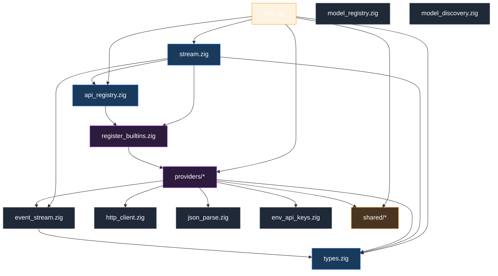
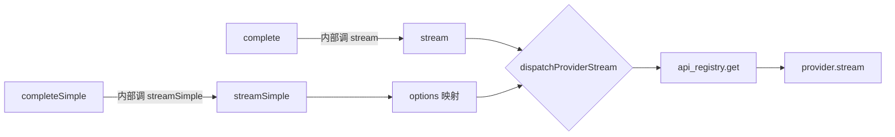
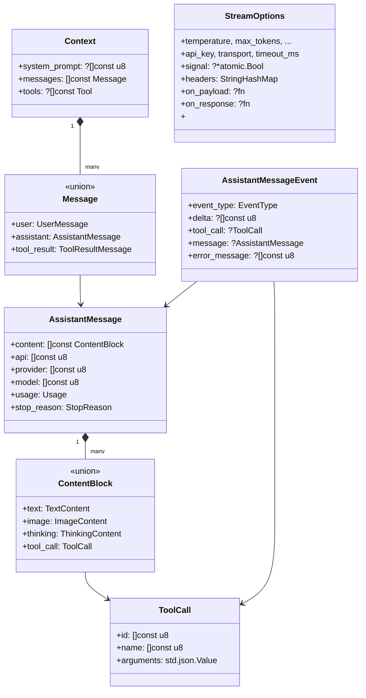
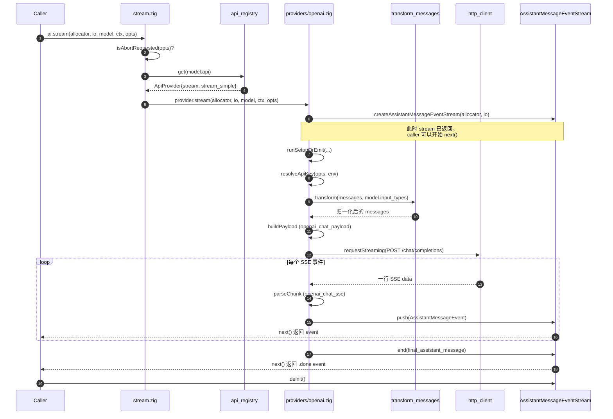
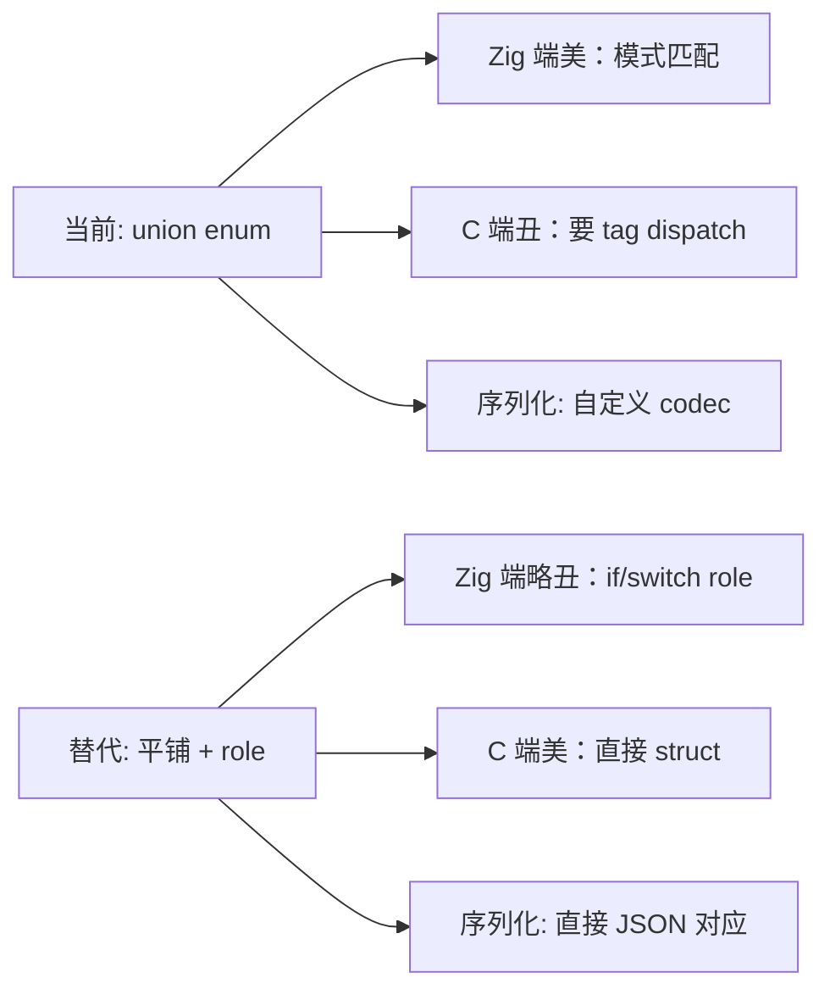

# `ai/` 模块卷宗

> **位置**：`zig/src/ai/`
> **体量**：~44k 行 Zig（其中 14 个 provider 实现占了约 32k 行）
> **职责一句话**：把"和大语言模型对话"这件事抽象成一个稳定接口，屏蔽各家 API 的差异。

## 卷宗的读法

这份文档分九节。如果你只有 5 分钟，看完 §1 + §4 + §6 就能拿到 80% 的认知。剩下的章节是"想动手改它"时的参考资料。

| 节 | 内容 | 适合什么时候读 |
| --- | --- | --- |
| §1 | 鸟瞰图 + 依赖关系 | 第一次接触这个模块 |
| §2 | 公共 API 表面 | 想从外面调它 |
| §3 | 核心数据类型 | 想理解它的"原语" |
| §4 | 一次调用的完整数据流 | 想知道字节怎么走的 |
| §5 | Provider 抽象怎么实现 | 想加新 provider |
| §6 | C ABI 友好度评估 | 想做 SDK 化 |
| §7 | 设计气味 | 想重构 |
| §8 | 待讨论的设计抉择 | 想拍板 |
| §9 | 下一步行动 | 现在 |

---

## §1 · 鸟瞰图

### 1.1 文件按职责分组

```
zig/src/ai/
├── 公共表面
│   └── root.zig                   重导出，唯一被外部 import 的文件
│
├── 核心数据类型
│   └── types.zig                  Message / ContentBlock / StreamOptions / ...
│
├── 顶层调度
│   ├── stream.zig                 stream() / complete() / streamSimple() / completeSimple()
│   └── api_registry.zig           "api 字符串 → 函数指针对" 的全局注册表
│
├── 流式基础设施
│   ├── event_stream.zig           泛型 EventStream(T,R) + AssistantMessageEventStream
│   ├── http_client.zig            HTTP/SSE 客户端
│   └── json_parse.zig             流式 JSON 解析器（容忍部分输入）
│
├── 模型与凭据
│   ├── model_registry.zig         模型元信息表
│   ├── model_discovery.zig        从 JSON / env 加载模型
│   └── env_api_keys.zig           环境变量 → API key 解析
│
├── 跨 provider 共享逻辑
│   └── shared/
│       ├── transform_messages.zig  消息归一化（图片 / tool_call_id 翻译）
│       ├── provider_error.zig      错误格式化与脱敏
│       ├── provider_stream.zig     setup-or-emit 模板、header 工具
│       ├── provider_json.zig       JSON 工具
│       ├── simple_options.zig      SimpleStreamOptions → StreamOptions
│       ├── abort_signal.zig        原子 abort 检查
│       └── overflow.zig            token 计数溢出检查
│
├── OAuth
│   └── oauth/{pkce,types}.zig
│
└── providers/                      14 家 API 的具体实现
    ├── openai.zig / openai_responses.zig / openai_codex_responses.zig
    ├── azure_openai_responses.zig
    ├── anthropic.zig
    ├── google.zig / google_vertex.zig / google_gemini_cli.zig
    ├── bedrock.zig                 (AWS Bedrock Converse Stream)
    ├── mistral.zig / kimi.zig
    ├── cloudflare.zig              (Cloudflare AI Gateway 路由层)
    ├── faux.zig                    (测试用假 provider)
    ├── register_builtins.zig       内建 provider 列表
    ├── openai_chat_payload.zig     OpenAI 兼容族共享的请求体构造
    ├── openai_chat_sse.zig         OpenAI 兼容族共享的 SSE 解析
    └── github_copilot_headers.zig  Copilot 特殊鉴权头
```

### 1.2 内部依赖图

::: tip
这张图刻意只画**模块级**依赖，不画文件级。每条箭头是"A 依赖 B"。
:::



::: warning 设计观察
图里有一处**反向耦合**：`api_registry.zig` 依赖 `providers/register_builtins.zig`。注册表本应不知道具体 provider 的存在。这是 §7 会点名的设计气味之一。
:::

---

## §2 · 公共 API 表面

`root.zig` 是这个模块**唯一**对外的入口。所有的 `import "ai"` 看到的都是它。

### 2.1 五个入口函数

| 函数 | 同步 / 异步 | 用途 |
| --- | --- | --- |
| `stream(allocator, io, model, context, options)` | 异步流 | 主流式接口，返回事件流 |
| `complete(allocator, io, model, context, options)` | 阻塞 | `stream()` 的便利封装，消费完后返回完整 message |
| `streamSimple(...)` | 异步流 | 简化 options（thinking/reasoning 自动映射） |
| `completeSimple(...)` | 阻塞 | 同上 + 阻塞 |
| `getEnvApiKey(allocator, provider)` | 同步 | 从环境变量解析 API key |

四个对话函数全部走同一个内部 dispatcher：



### 2.2 重导出的核心类型

`root.zig:56-77` 把 16 个类型从 `types` 提到顶层。这构成了**调用方真正接触的类型边界**：

```zig
// 模型与配置
pub const Model = types.Model;
pub const ModelCost = types.ModelCost;
pub const StreamOptions = types.StreamOptions;
pub const Usage = types.Usage;
pub const StopReason = types.StopReason;

// 对话基本单位
pub const Message = types.Message;
pub const Context = types.Context;
pub const ContentBlock = types.ContentBlock;
pub const TextContent = types.TextContent;
pub const ImageContent = types.ImageContent;
pub const ThinkingContent = types.ThinkingContent;
pub const Tool = types.Tool;
pub const ToolCall = types.ToolCall;

// 流式输出
pub const AssistantMessage = types.AssistantMessage;
pub const AssistantMessageEvent = types.AssistantMessageEvent;
pub const EventType = types.EventType;
```

::: info 暴露口诀
**"五函数 + 十六类型"**——这就是 `ai` 模块的整个公共表面。任何 SDK 化方案都从这 21 个名字开始。
:::

---

## §3 · 核心数据类型

### 3.1 类型关系图



### 3.2 几个值得注意的设计选择

**`Message` 是 `union(enum)`**（`types.zig:313`）。这是经典抉择：标签联合 vs 平铺类型 + role 字段。当前选择标签联合，好处是模式匹配清晰，坏处是序列化和 C ABI 不友好（§6.4 会回到这个问题）。

**`ContentBlock` 也是 `union(enum)`**，把 text / image / thinking / tool_call 统一成一个序列。这是 Anthropic Messages API 的影响——OpenAI 的设计是把 text 放在 message.content 字段，tool_calls 放在另一个字段。**这个抽象选择决定了 OpenAI 系列 provider 必须做"展平 ↔ 装回"的双向翻译**。

**`StreamOptions` 是巨型扁平 struct**（types.zig:418-499 区，50+ 字段）。其中包含 `bedrock_region`、`anthropic_thinking_enabled`、`openai_reasoning_effort`、`google_thinking`、`mistral_prompt_mode` 等强 provider-specific 字段。这是当前最严重的设计气味（§7 会展开）。

**`api: Api` 与 `provider: Provider` 是字符串切片**：

```zig
pub const Api = []const u8;
pub const Provider = []const u8;
```

`KnownApi` 和 `KnownProvider` 枚举（types.zig:8-59）只是"已知值参考表"，实际注册和查找都用字符串。这给了第三方扩展空间，代价是丢了类型安全。

---

## §4 · 一次调用的完整数据流

::: tip
这是整份卷宗最重要的一节。把这张图看懂，整个 `ai` 模块就懂了一半。
:::

### 4.1 用户视角

```zig
const stream = try ai.stream(allocator, io, model, context, .{
    .api_key = "sk-...",
    .temperature = 0.7,
});
defer stream.deinit();

while (stream.next()) |event| {
    defer event.deinitTransient(allocator);
    switch (event.event_type) {
        .text_delta => std.debug.print("{s}", .{event.delta.?}),
        .done => break,
        else => {},
    }
}
```

### 4.2 内部时序



### 4.3 走到底要经过几层

| 层 | 文件 | 它的职责 |
| --- | --- | --- |
| 1. **入口** | `stream.zig` | 检查 abort、查注册表 |
| 2. **路由** | `api_registry.zig` | 字符串 → 函数指针 |
| 3. **provider 总壳** | `providers/openai.zig` | 准备 + 失败处理 |
| 4. **共享模板** | `shared/provider_stream.zig` | `runSetupOrEmit` 包错误 |
| 5. **凭据** | `env_api_keys.zig` | API key 解析 |
| 6. **消息归一化** | `shared/transform_messages.zig` | 图片、tool_call_id 翻译 |
| 7. **请求体** | `providers/openai_chat_payload.zig` | JSON 序列化 |
| 8. **HTTP** | `http_client.zig` | 发请求、读流 |
| 9. **SSE 解析** | `providers/openai_chat_sse.zig` | 行级 → 事件 |
| 10. **事件流** | `event_stream.zig` | 互斥队列 + 条件变量 |

::: warning 关键观察
**第 4 层的 `runSetupOrEmit` 是 setup 与 emit 的边界**。setup 阶段的失败（例如 API key 缺失）通过 stream 推一个 `error_event` 出去；setup 之后的失败也走同一条路径。这种"错误也是事件"的统一处理是 Linux 风格设计的体现，值得在书里专门讲。
:::

---

## §5 · Provider 抽象怎么实现

### 5.1 抽象的形状：函数指针对

```zig
// api_registry.zig:6-18
pub const StreamFunction = *const fn (
    allocator: std.mem.Allocator,
    io: std.Io,
    model: types.Model,
    context: types.Context,
    options: ?types.StreamOptions,
) anyerror!event_stream.AssistantMessageEventStream;

pub const ApiProvider = struct {
    api: types.Api,
    stream: StreamFunction,
    stream_simple: StreamFunction,
};
```

每个 provider 是一个**独立的 Zig 文件**，导出两个符合 `StreamFunction` 签名的函数（`stream` 和 `streamSimple`）。`ApiProvider` 把它们打包，注册表把字符串映射到这个 struct。

::: info 这是 OO 接口吗
**不是**。Zig 没有 trait/interface 关键字。这里用的是 Linux 内核 `struct file_operations` 模式：**一组函数指针绑成 struct**。和 `vtable` 等价但显式。
:::

### 5.2 注册流程

```mermaid
flowchart TB
    subgraph "编译期"
        A["providers/register_builtins.zig<br/>编译期数组：14 个 provider"]
    end

    subgraph "运行期"
        B["api_registry.init()<br/>(懒初始化)"]
        C["std.StringHashMap(ApiProvider)"]
        D["api_registry.get(api_string)"]
    end

    A -->|首次 stream() 时| B
    B -->|遍历数组 put 进去| C
    D -->|HashMap.get| C
```

注册的核心代码（`api_registry.zig:69-77`）：

```zig
fn registerBuiltIns() void {
    for (register_builtins.builtInProviders()) |provider| {
        registry.put(provider.api, .{
            .api = provider.api,
            .stream = provider.stream,
            .stream_simple = provider.stream_simple,
        }) catch @panic("failed to register built-in AI provider");
    }
}
```

::: warning 一处反向依赖
`api_registry.zig` 直接 import 了 `providers/register_builtins.zig`。这意味着**注册表知道有哪些 provider 存在**，违反了"注册表应该是 provider-agnostic"的原则。修正方法在 §7 会讨论。
:::

### 5.3 添加一个新 provider 要做什么

| 步骤 | 文件 |
| --- | --- |
| 1 | 新建 `providers/<name>.zig`，导出 `pub fn stream(...)` 和 `pub fn streamSimple(...)` |
| 2 | 在 `providers/register_builtins.zig` 加一条 metadata |
| 3 | 在 `root.zig` 的 `providers` 命名空间加 import（可选，不加也能用） |
| 4 | 写一个 `provider_smoke_test.zig` 风格的测试 |
| 5 | 更新 `KnownApi` / `KnownProvider` 枚举（仅文档作用） |

5 个步骤里只有第 1 步是真有信息量的，剩下 4 步是机械的。**这正是好抽象的标志**——加扩展不需要改核心。

---

## §6 · C ABI 友好度评估

> 目标：把 `ai` 模块的核心暴露成 `extern "C"` 函数，让 Go / Rust / Python / Swift 等语言可以通过 FFI 调用。

### 6.1 总评

**当前的公共 API 没有任何一个能直接 `export` 出去**——签名里全是 Zig 专用类型。但**好消息**是底层数据结构基本都是 POD（Plain Old Data）能对应 C struct 的形态，问题主要在**接口形态**而非**数据形态**。

按改造工作量从大到小排：

```mermaid
flowchart LR
    classDef hard fill:#7f1d1d,stroke:#dc2626
    classDef med fill:#78350f,stroke:#d97706
    classDef easy fill:#064e3b,stroke:#10b981

    A["error union !T<br/>error 必须改成 i32 错误码"]:::hard
    B["std.json.Value<br/>必须包成不透明 handle"]:::hard
    C["std.mem.Allocator<br/>调用方不会构造 vtable"]:::hard
    D["?T optional<br/>可以变 nullable ptr 或 has_x flag"]:::med
    E["[]const u8 切片<br/>变 ptr+len 对"]:::med
    F["union(enum)<br/>展平成 tag + data 或 tagged C union"]:::med
    G["std.StringHashMap<br/>不透明 handle + 增删查 C 函数"]:::easy
    H["enum (StopReason / EventType)<br/>用 i32，定好 wire format"]:::easy
```



### 6.2 痛点清单（按文件位置）

| # | 位置 | 痛点 | 改造方向 |
| --- | --- | --- | --- |
| 1 | `stream.zig:14-22` | 返回 `!AssistantMessageEventStream` | C 入口返回 `int` 错误码，输出参数填 `pi_stream_t*` |
| 2 | `event_stream.zig:6` | `EventStream(T,R)` comptime 泛型 | C 端只暴露已实例化的 `AssistantMessageEventStream` |
| 3 | `event_stream.zig:14-15` | `std.Io.Mutex` / `Condition` | 内部细节，C 看不到，OK |
| 4 | `types.zig:213` | `ToolCall.arguments: std.json.Value` | 暴露为 `const char* json` 字符串，或 opaque handle |
| 5 | `types.zig:313` | `Message` 是 `union(enum)` | 拆成 `pi_message_kind_t` + 各自 getter |
| 6 | `types.zig:217` | `ContentBlock` 是 `union(enum)` | 同上 |
| 7 | `types.zig:418-499` | `StreamOptions` 50+ 字段 | builder 模式：`pi_stream_options_new()` + `set_*` 系列 |
| 8 | `types.zig:425` | `headers: std.StringHashMap` | opaque 对象 + `pi_headers_set(h, k, v)` |
| 9 | `types.zig:432-434` | 函数指针回调 | `extern fn` 回调 + `void* user_data` |
| 10 | 所有 `[]const u8` 字段 | Zig 切片 | C 这边一律 `const char*` + `size_t` |
| 11 | 任何函数参数里的 `std.mem.Allocator` | Zig 分配器 | 内部默认 page_allocator；C 可选传入自定义 alloc/free |

### 6.3 提议的 C 接口骨架（草图）

::: info
这一段是**草图**，不是定稿。目的是让你看到"如果真要做，大概长什么样"。
:::

```c
/* pi_ai.h —— 草图 */
#ifndef PI_AI_H
#define PI_AI_H

#include <stddef.h>
#include <stdint.h>

#ifdef __cplusplus
extern "C" {
#endif

/* === 不透明句柄 === */
typedef struct pi_session_s         pi_session_t;
typedef struct pi_stream_s          pi_stream_t;
typedef struct pi_message_s         pi_message_t;
typedef struct pi_options_s         pi_options_t;

/* === 错误码 === */
typedef enum {
    PI_OK = 0,
    PI_ERR_OOM = 1,
    PI_ERR_INVALID_ARG = 2,
    PI_ERR_PROVIDER_NOT_FOUND = 3,
    PI_ERR_API_KEY_MISSING = 4,
    PI_ERR_HTTP = 5,
    PI_ERR_PARSE = 6,
    PI_ERR_ABORTED = 7,
    /* ... */
} pi_status_t;

/* === 事件类型 === */
typedef enum {
    PI_EVENT_START          = 0,
    PI_EVENT_TEXT_DELTA     = 1,
    PI_EVENT_THINKING_DELTA = 2,
    PI_EVENT_TOOLCALL_START = 3,
    PI_EVENT_DONE           = 100,
    PI_EVENT_ERROR          = 200,
} pi_event_type_t;

/* === 一个事件（C 兼容 view，不持有内存） === */
typedef struct {
    pi_event_type_t  type;
    const char*      delta;       /* nullable */
    size_t           delta_len;
    const char*      tool_name;   /* nullable */
    /* ... */
} pi_event_t;

/* === 主流程 === */
pi_status_t pi_session_new(pi_session_t** out);
void        pi_session_free(pi_session_t*);

pi_status_t pi_options_new(pi_options_t** out);
pi_status_t pi_options_set_api_key(pi_options_t*, const char* key, size_t len);
pi_status_t pi_options_set_temperature(pi_options_t*, double t);
pi_status_t pi_options_set_header(pi_options_t*, const char* k, const char* v);
void        pi_options_free(pi_options_t*);

pi_status_t pi_stream_start(
    pi_session_t*       session,
    const char*         api,        /* "openai-completions" */
    const char*         model,      /* "gpt-4o" */
    const char*         system,     /* nullable */
    const pi_message_t* messages,
    size_t              messages_len,
    const pi_options_t* options,
    pi_stream_t**       out
);

/* 阻塞读下一个事件 */
pi_status_t pi_stream_next(pi_stream_t*, pi_event_t* out_event);

/* 取消正在进行的请求 */
void        pi_stream_abort(pi_stream_t*);

/* 取最终结果（done 后才有意义） */
pi_status_t pi_stream_final(pi_stream_t*, /* TBD */ void* out);

void        pi_stream_free(pi_stream_t*);

#ifdef __cplusplus
}
#endif
#endif /* PI_AI_H */
```

### 6.4 一个需要现在就拍板的设计抉择

`Message` 是 `union(enum)` 还是"role 字段 + 平铺"？这两种风格分别对应：



**建议**：内部保留 `union(enum)`，C ABI 上对外暴露成"role 字段 + 平铺"。两者通过 codec 函数桥接。这种"内部精致 + 边界粗糙"的双形态是 SQLite 等成熟 C 库的常见做法。

---

## §7 · 设计气味

::: warning
这一节是**给未来的自己**的批评。诚实记录，不粉饰。
:::

| # | 气味 | 文件位置 | 应该怎么改 |
| --- | --- | --- | --- |
| 1 | **`StreamOptions` provider-specific 字段污染** | `types.zig:418-499` | 拆出 `ProviderExtensionOptions`（可以是 opaque + provider 内部 cast） |
| 2 | **`api_registry` 反向依赖 `providers/register_builtins`** | `api_registry.zig:5,69-77` | 注册移到 stream.zig 顶层或外部初始化 |
| 3 | **`pushMissingApiKeyError` 在多个 provider 重复** | openai/anthropic/kimi 等 | 合并到 `shared/provider_error.zig` |
| 4 | **`Model.compat: ?std.json.Value`** | `types.zig:409` 附近 | 该用 tagged union 表达"已知 compat 形状" |
| 5 | **`transform_messages` 调用不一致** | anthropic 部分路径未走 | 在 `provider_stream.runSetupOrEmit` 里统一调用 |
| 6 | **`KnownApi` / `KnownProvider` 枚举与字符串注册表脱节** | `types.zig:8-59` | 要么删掉枚举，要么用枚举当 key |
| 7 | **HTTP 请求构造在每个 provider 重抄** | 14 个 provider 文件 | 抽 `RequestBuilder` 给所有 OpenAI 兼容族用 |

::: tip
这 7 条不必都改——它们是**地图**，等到具体重构时回来挑一两条做。建议 §6 的 C ABI 化先于这些重构，因为做 C ABI 的过程会顺手把 §1、§4、§5、§7 都改掉。
:::

---

## §8 · 待讨论的设计抉择

留给你拍板（或者我们下次讨论）：

1. **`Message` 的形态**：保留 `union(enum)`（Zig-friendly）还是改 `role` 字段（C-friendly + JSON-friendly）？或保持双形态在边界 codec？
2. **provider-specific options**：继续平铺到 `StreamOptions`，还是引入"扩展槽"机制（如 `provider_options: ?*anyopaque`）？
3. **运行时 vs 编译期注册**：当前是运行时 HashMap。能否改成编译期表，省掉运行时分配？代价是无法用第三方 provider 插件。
4. **`std.Io` 依赖**：`event_stream` 用了 Zig 0.16 新的 `std.Io.Mutex`。这把模块绑死在 0.16+。是否值得用更原始的 `std.Thread.Mutex` 换更宽的 Zig 版本兼容？
5. **`anyerror` 在 provider 签名里**：`StreamFunction` 用 `anyerror!T`，丢失了错误集合信息。是否改成显式错误集合 `ProviderError!T`？

---

## §9 · 下一步行动

下一次合作建议按这个顺序：

1. **用一章书把 §4 的数据流讲透**——这是教学价值最高的部分。
2. **把 §3 的核心类型定下「v1 wire format」**——决定哪些字段是稳定 ABI、哪些是私有。
3. **挑 §7 里影响最大的一两条做小重构**——清掉气味，给 C ABI 化铺路。
4. **画 C ABI v0.1 的完整头文件**——把 §6.3 的草图做完。

---

::: info 卷宗状态
- 创建：2026-05-08
- 校对：仅 spot-check，未做完整行级核对
- 后续：随重构同步更新
:::
