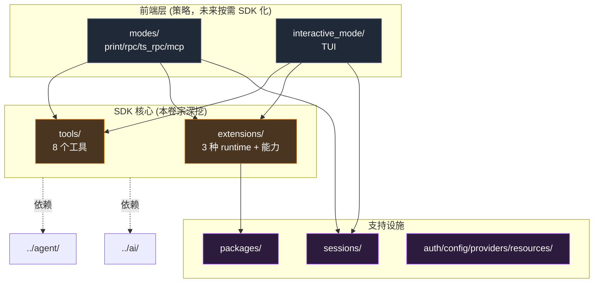
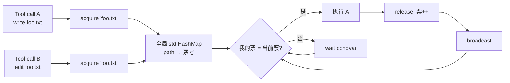
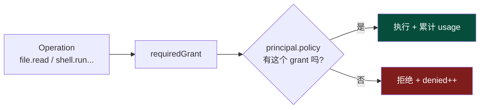

# `coding_agent/` 模块卷宗

> **位置**：`zig/src/coding_agent/`
> **体量**：~94k 行 Zig（12 个子目录）
> **职责一句话**：把 `agent` 模块通用的循环机制特化成"懂代码、会动文件、能跑 shell、可被扩展"的真正编码代理。

::: tip 本卷宗的范围
`coding_agent` 是六个独立子系统的集合体。**这份卷宗只深挖与未来 SDK 核心相关的两块——`tools/` 和 `extensions/`**——它们决定了"这个 agent 能干什么"和"如何让别人安全地往里加东西"。其他四个子系统（sessions / modes / interactive_mode / packages）会在 §7 用一段话画像，未来若决定单独 SDK 化再写专门卷宗。
:::

## 卷宗的读法

| 节 | 内容 | 适合读 |
| --- | --- | --- |
| §1 | 鸟瞰图 + 6 个子系统的边界 | 第一次接触 |
| §2 | 公共 API 表面 | 想用它 |
| §3 | tools/ 协议与 8 个具体工具 | 想理解"agent 能干什么" |
| §4 | file_mutation_queue：并行写文件的安全网 | 想理解并发约束 |
| §5 | extensions/ 三种运行时 | 想理解扩展机制 |
| §6 | enforcement：12 个 capability 的能力边界 | 想理解安全模型 |
| §7 | 其他 4 个子系统画像 | 想看全貌 |
| §8 | C ABI 评估 | SDK 化 |
| §9 | 设计气味 | 想重构 |
| §10 | 待讨论的设计抉择 | 想拍板 |

---

## §1 · 鸟瞰图

### 1.1 六个子系统

```
zig/src/coding_agent/
├── tools/                  ~5k 行   8 个具体工具 + 通用工具协议 + 文件互斥队列
├── extensions/             ~13k 行  3 种运行时（native / wasm / process_jsonl）+ 能力边界
├── sessions/               ~10k 行  会话持久化（JSONL append-log + 搜索 + HTML 导出）
├── modes/                  ~13k 行  4 种运行模式（print / rpc / ts_rpc / mcp_stdio）
├── interactive_mode/       ~17k 行  TUI 渲染 + 键盘 + 斜杠命令 + 弹层
├── packages/               ~5.5k 行 扩展包管理 CLI（install/remove/update）
├── auth/ config/ providers/ resources/ shared/  ~10k 行 配套基础设施
└── tests/                  集成测试与 fixtures
```

### 1.2 边界与依赖



::: warning 关键观察
**`tools/` 和 `extensions/` 不互相依赖**——它们是平行的两套机制：tools 是"内置工具，编译期写死"，extensions 是"外部插件，运行时加载"。**两者通过 `agent` 模块的 `AgentTool` 接口统一注册**，agent 不知道也不关心一个 tool 是 native 内置的还是 WASM 插件来的。这是非常干净的"机制 vs 实现"分离。
:::

---

## §2 · 公共 API 表面

`root.zig` 重导出 ~50 个名字，**远多于 ai (21) 和 agent (21)**。这反映 `coding_agent` 不只是一个模块，而是一组**应用级**特性的集合。

按用途分组：

| 类别 | 主要导出 |
| --- | --- |
| **入口函数** | `runInteractiveMode`、`runPrintMode`、`runRpcMode`、`runTsRpcMode` |
| **会话** | `SessionManager`、`AgentSession`、`searchSessionsUnder`、`buildSystemPrompt` |
| **扩展** | `extension_runtime`、`extension_registry`、`enforcement`、`wasm_manifest` |
| **工具** | `tools.{Read,Write,Edit,Bash,Grep,Find,Ls}Tool` 各 4 个类型（Args/Details/ExecutionResult/Tool） |
| **配套** | `package_manager`、`provider_config`、`oauth_callback_listener` |

::: info SDK 化暗示
`tools.*Tool` 这一组是**未来 C ABI 必含的**——8 个工具 × 4 个类型 = 32 个名字。其他类别要不要进 SDK 看用例，但工具是绕不开的。
:::

---

## §3 · tools/ 子系统

### 3.1 工具协议：每个工具是一个独立 struct

```zig
// 以 read.zig 为例
pub const ReadTool = struct {
    cwd: []const u8,
    io: std.Io,

    pub fn init(cwd: []const u8, io: std.Io) ReadTool { ... }
    pub fn schema(allocator: std.mem.Allocator) !std.json.Value { ... }
    pub fn execute(
        self: ReadTool,
        allocator: std.mem.Allocator,
        args: ReadArgs,
        signal: ?*const std.atomic.Value(bool),
    ) !ReadExecutionResult { ... }
};
```

**没有共同基类、没有 trait、没有运行时注册**——8 个工具各自是独立 struct，调用方 inline 实例化。这是非常 Zig 的做法（不需要的多态就不引入），但**对外暴露需要做包装**（C ABI 不能直接 export 8 个不同形状的 struct）。

### 3.2 8 个工具的速查表

| 工具 | 用途 | 关键约束 |
| --- | --- | --- |
| **`read.zig`** | 读文件，可指定 offset/limit | 默认截断到 2000 行 / 50KB，图片返回 `ImageContent` |
| **`write.zig`** | 原子写入路径 | 写前过 `file_mutation_queue`（§4） |
| **`edit.zig`** | 多行子串替换 | 校验 offset/range；同样过互斥队列 |
| **`bash.zig`** | 在 cwd 执行 shell | 超时杀进程组；stdout/stderr 合并截断 |
| **`grep.zig`** | 正则搜文件 | 实际 shell out 给 `rg`（外部依赖） |
| **`find.zig`** | 通配符递归列目录 | 实际 shell out 给 `fd`（外部依赖） |
| **`ls.zig`** | 列目录元信息 | 纯 Zig 实现，给出 size/perms/mtime |
| **`truncate.zig`** | 共享工具：按行/字节截断 | `read` 和 `bash` 都用它 |

::: info 为什么 grep / find 不自己实现
`zig build` 会主动检查 `rg` 和 `fd` 在不在 PATH 上（README 提到了）。**复用经过工业级考验的工具比重写更靠谱**——这是 Unix 哲学"组合现成命令"的体现。代价是 SDK 化时这两个二进制要么打包，要么文档化要求宿主预装。
:::

### 3.3 `tools/common.zig` 的三个共同关注点

| 函数 | 解决什么 |
| --- | --- |
| `resolvePath(allocator, cwd, user_path)` | 把相对路径转成绝对路径（基于 cwd） |
| `writeFileAbsolute(...)` | 原子写入（写到 tmp 然后 rename） |
| `deinitContentBlocks` / `makeTextContent` | 与 ai 模块的 ContentBlock 互操作 |

::: warning 一个安全空洞
`resolvePath` **不检查结果是否仍在 cwd 之下**。绝对路径或 `../../../etc/passwd` 都会被原样接受。**真正的沙箱在 enforcement.zig（§6），不在 tools 这一层**。这意味着如果把 tools 拿出来当 SDK 用，宿主必须自己加一层路径校验。
:::

---

## §4 · `file_mutation_queue.zig`：并行写的安全网

### 4.1 问题

回忆第 5 章 / agent 卷宗 §6——agent loop 默认**并行执行 tool_call**。如果同一轮里 LLM 同时要 `edit foo.txt` 和 `write foo.txt`，并行就会数据丢失。

### 4.2 机制



每次写 / 改文件：

1. `acquire(io, absolute_path)` → 拿一张排队票
2. 全局 mutex 保护的 HashMap，路径作 key
3. 拿到票后 spin 在 condition variable 上，直到"当前服务票号 = 我的票号"
4. 拿到后返回 `FileMutationGuard`
5. 写完 release，票号 +1，broadcast 唤醒等待者
6. 没人等了就把这条 entry 删掉

### 4.3 设计抉择与代价

::: warning 这个机制是全局的
当前 mutex 和 HashMap 都是**进程级 global**，不是 per-cwd / per-session。两个并发会话写**不同 cwd 下同名的 `package.json`** 也会被串行化。**正确实现应该是 cwd 也作为 key 的一部分**（§9 会再说）。
:::

::: info 为什么不用 OS-level flock
- flock 跨平台行为不一致（Linux/macOS/Windows 各异）
- flock 不支持"我已经在等待"的语义，只能 try/wait
- 进程内多线程并不需要文件锁的强度

所以用进程内 condvar + 票号是合理的工程选择——前提是你只关心"同一个进程"的数据竞争。
:::

---

## §5 · extensions/ 子系统

### 5.1 三种 runtime

```zig
// extension_runtime.zig::RuntimeKind
pub const RuntimeKind = enum {
    native,         // Zig 函数指针（编译期链接）
    wasm,           // WebAssembly 模块（运行时加载）
    process_jsonl,  // 子进程 + JSONL stdio（最常用，TS 扩展走这条）
    remote,         // 占位，未实现
};
```

```mermaid
flowchart TB
    classDef native fill:#064e3b,stroke:#10b981,color:#fff
    classDef wasm fill:#1a3a5c,stroke:#3b82f6,color:#fff
    classDef proc fill:#7c2d12,stroke:#ea580c,color:#fff

    Disc[extension 发现<br/>(读 manifest)] --> Kind{runtime kind}

    Kind -->|native| Native[native_runtime.zig<br/>Zig fn ptr 直调]:::native
    Kind -->|wasm| Wasm[wasm/wasm_host_spike.zig<br/>自实现 WASM 解释器]:::wasm
    Kind -->|process_jsonl| Proc[extension_host.zig<br/>spawn 子进程<br/>stdin/stdout JSONL]:::proc

    Native --> Reg[extension_registry<br/>统一注册]
    Wasm --> Reg
    Proc --> Reg
```

### 5.2 三种 runtime 的对比

| 维度 | native | wasm | process_jsonl |
| --- | --- | --- | --- |
| **隔离** | 无（共内存） | 强（沙箱 ABI） | 中（OS 进程） |
| **性能** | 最快 | 中 | 慢（IPC） |
| **语言** | 只能 Zig | 任何编译到 wasm 的 | 任何能写 JSONL 的 |
| **当前用途** | 内置工具集成测试 | 实验中（"spike"） | TS 扩展（主力） |
| **容错** | 异常拖垮 host | 沙箱崩了不影响 | 子进程崩了不影响 |

### 5.3 process_jsonl 协议

这是当前**最实际使用**的扩展机制。每行一个 JSON 对象：

```
> ready
< {"method":"register_tool", "name":"my_tool", "label":"...", "description":"...", "parameters":{...}}
< {"method":"register_command", "name":"slash_foo", ...}
> {"method":"invoke_tool", "name":"my_tool", "args":{...}, "id":42}
< {"method":"tool_result", "id":42, "content":[...], "is_error":false}
< {"method":"shutdown_complete"}
```

注册是**单向声明**（扩展告诉宿主它有什么），调用是**双向 RPC**（宿主调扩展 / 扩展回报结果）。

### 5.4 WASM runtime 是自实现

`wasm/wasm_host_spike.zig`（~1.1k 行）**不是 wasmtime/wasmer 的绑定**，而是从零写的最小 WASM 解释器。当前限制：

- 1MB 内存上限 / instance
- 字符串 marshalling 上限 64KB
- 只支持固定 ABI: `metadata()` / `schema()` / `execute(json-input-str)`
- 文件名带 `_spike` 暗示"原型阶段"

::: warning 这是技术债
自实现 WASM 解释器**风险极高**——维护成本、性能差距、安全漏洞、对新 WASM 特性的支持。**长期看应该集成 wasmtime（Rust 写的工业级 runtime，C ABI 友好）**。但短期对快速实验有价值。`zig/docs/wasm-component-model-decision.md` 有更多决策背景。
:::

---

## §6 · enforcement：12 个 capability 的能力边界

### 6.1 模型



### 6.2 12 个 Operation

```zig
// enforcement.zig:45
pub const Operation = enum {
    file_read,       file_write,
    network_request,
    shell_run,
    env_read,
    model_call,      // 调 LLM 也算受控操作
    session_read,    session_write,
    ui_notify,
    tool_use,
    agent_spawn,     // 启动子 agent
    agent_delegate,  // 把任务委派给子 agent
};
```

这些 underscore 标识符是 Zig 内部 enum case 名，不是 manifest/policy vocabulary。每一个映射到一个 canonical **`Grant`**：

`file.read`, `file.write`, `network.request`, `shell.run`, `env.read`, `model.call`, `session.read`, `session.write`, `ui.notify`, `tool.use`, `agent.spawn`, `agent.delegate`。

`Grant` 实际上是 `wasm_manifest.Capability` 的别名（`enforcement.zig:4`）：

```zig
pub const Grant = wasm_manifest.Capability;
```

::: info 巧妙的复用
**WASM manifest 的 capability 模型直接被借用作为运行时的 capability 模型**——manifest 声明扩展"想要什么"，enforcement 检查"被允许什么"。一份模型，两个用途。这避免了"manifest 概念集"和"运行时概念集"分裂的常见错误。
:::

### 6.3 ResourceLimits

除了 capability（能不能做），还限制**多少**：

```zig
pub const ResourceLimits = struct {
    max_children: ?u64 = null,    // 最多启多少子 agent
    depth: ?u64 = null,            // 子 agent 嵌套深度
    turns: ?u64 = null,            // 最多多少轮
    timeout_ms: ?u64 = null,
    output_bytes: ?u64 = null,
    output_lines: ?u64 = null,
    tool_scopes: []const []const u8 = &.{},  // 可见的工具白名单
};
```

### 6.4 Principal：谁在做这件事

```zig
pub const Principal = struct {
    runtime_kind: []const u8,
    extension_id: []const u8,
    policy_lookup_key: ?[]const u8 = null,
    package_root: ?[]const u8 = null,
    invocation_id: ?[]const u8 = null,
    session_id: ?[]const u8 = null,
};
```

每次操作请求都附带一个 `Principal`，enforcement 用它去查 policy。**注意**：Principal 包含 `package_root` 和 `policy_lookup_key`——这呼应 README 提到的**"package trust"**机制：扩展的 SHA-256 摘要绑定到它的 policy，防止"装好后被替换"的供应链攻击。

::: warning 一个空洞
**内置 tools (read/write/bash) 没有 Principal**——它们直接在 agent 上下文里执行，不经过 enforcement。**这意味着内置工具有 "ambient authority"——不受 capability 限制**。这是 §10 要拍板的设计抉择之一。
:::

---

## §7 · 其他 4 个子系统画像

### 7.1 sessions/（~10k 行）

**会话持久化与搜索**。`AgentSession` = JSONL append-log + 压缩生命周期 + 重试语义。`SessionManager` 把多个 session 文件索引成树（fork/resume 关系），支持按字段全文搜。HTML 导出供分享。

::: info SDK 相关度
**中等**。如果 SDK 用户想"嵌入式记忆"，这套是现成的；但很多场景宿主已有自己的存储，所以做成"可选模块"更合适。
:::

### 7.2 modes/（~13k 行）

**4 种运行模式 = 4 种前端协议**：

| 模式 | 协议 | 用途 |
| --- | --- | --- |
| `print` | 直出 stdout | 一次性脚本调用 |
| `rpc` | JSON-RPC 2.0 | 编辑器集成 |
| `ts_rpc` | TS 专用 wire format | TypeScript 客户端（@earendil-works/pi-coding-agent） |
| `mcp_stdio` | MCP 协议 | Claude Desktop / Cursor 等 MCP 客户端 |

::: info SDK 相关度
**低**。这是"agent 怎么暴露给前端"的策略层。SDK 用户会自己决定 transport，不需要这些。
:::

### 7.3 interactive_mode/（~17k 行）

**TUI 主体**。`session_lifecycle.zig` 是事件循环，`rendering.zig` 管屏幕，`command_router.zig` 派发键盘，`extension_ui_bridge.zig` 把扩展的 UI 元素接入。剪贴板、图片粘贴、OAuth 登录流都在这里。

::: info SDK 相关度
**低**。TUI 本身就是一种特化前端。但里面"流式渲染部分消息 + 工具 spinner"这套架构，会作为第 8 章的素材。
:::

### 7.4 packages/（~5.5k 行）

**扩展包管理 CLI**。`install/remove/update/list` 镜像了 TS 版的行为。本地路径直接写 settings.json，npm/git 安装走 shell out（带测试 override）。自更新支持 npm/bun/pnpm 三种安装器探测。

::: info SDK 相关度
**低**。是"扩展生态系统"的运营层，不是 SDK 核心。

---

## §8 · C ABI 友好度评估

### 8.1 总评：tools 易，extensions 难

| 子系统 | C ABI 难度 | 主要痛点 |
| --- | --- | --- |
| **tools/** | 🟢 中 | 8 个工具的 Args/Result 类型要 codec；file_mutation_queue 内部不暴露 |
| **extensions/** | 🔴 高 | 3 种 runtime 各有"宿主侧"和"扩展侧"边界；WASM 自实现尤其麻烦 |

### 8.2 tools/ 的痛点

| # | 位置 | 痛点 | 方向 |
| --- | --- | --- | --- |
| 1 | 8 个工具各有不同形状的 `Args` struct | 跨 ABI 要 8 套 codec | C 端用统一 `pi_tool_invoke(tool_name, args_json) → result_json` 包一层 |
| 2 | `ExecutionResult` 含 `[]const ContentBlock` | 切片 + ai 类型 | builder 风格：`pi_tool_result_*` 系列 getter |
| 3 | 工具实例化要传 `cwd` 和 `std.Io` | Zig 类型 | C 端用 `pi_workspace_t*` opaque handle 包住 |
| 4 | `signal: ?*const std.atomic.Value(bool)` | Zig 原子类型 | C 端用 `volatile int*` 或 opaque token |

### 8.3 extensions/ 的痛点

| # | 位置 | 痛点 | 方向 |
| --- | --- | --- | --- |
| 1 | 3 种 runtime 类型签名各异 | 难以统一 | 暴露统一 `pi_extension_t*` opaque + `runtime_kind` 字段 |
| 2 | `Principal` / `Policy` / `Grant` 都是 Zig struct | 跨 ABI 要 codec | builder 模式 |
| 3 | `Operation.requiredGrant()` 内部逻辑 | 编译期方法 | C 端等价用 `pi_op_required_grant(op) → grant` 函数 |
| 4 | `Accounting` 累加器跨边界 | 状态共享 | C 端用 callback 报告 usage_delta，宿主自己累加 |
| 5 | WASM 自实现 | 自实现 ABI 不稳定 | 长期换 wasmtime；短期把 spike 隐藏在内部 |

### 8.4 提议的 C 接口骨架

```c
/* pi_tools.h —— 草图 */
typedef struct pi_workspace_s     pi_workspace_t;   /* 包 cwd + io */
typedef struct pi_tool_result_s   pi_tool_result_t;

pi_status_t pi_workspace_new(const char* cwd, pi_workspace_t** out);
void        pi_workspace_free(pi_workspace_t*);

/* 统一调用入口 */
pi_status_t pi_tool_invoke(
    pi_workspace_t*    ws,
    const char*        tool_name,    /* "read" / "write" / "bash" / ... */
    const char*        args_json,    /* tool 的 args 结构体 */
    const int*         abort_flag,   /* nullable */
    pi_tool_result_t** out_result
);

/* 结果 getter */
size_t      pi_tool_result_content_count(const pi_tool_result_t*);
pi_status_t pi_tool_result_content_at(const pi_tool_result_t*, size_t i,
                                       pi_content_block_t* out);
int         pi_tool_result_is_error(const pi_tool_result_t*);
void        pi_tool_result_free(pi_tool_result_t*);
```

```c
/* pi_extensions.h —— 草图 */
typedef struct pi_extension_s   pi_extension_t;
typedef struct pi_policy_s      pi_policy_t;

pi_status_t pi_extension_load(const char* manifest_path, pi_policy_t* policy,
                                pi_extension_t** out);
void        pi_extension_unload(pi_extension_t*);

/* 调用扩展的某个 tool */
pi_status_t pi_extension_invoke_tool(pi_extension_t*, const char* tool_name,
                                      const char* args_json,
                                      pi_tool_result_t** out);
```

---

## §9 · 设计气味

| # | 气味 | 文件 | 怎么改 |
| --- | --- | --- | --- |
| 1 | **`file_mutation_queue` 是进程级 global，不带 cwd 维度** | `tools/file_mutation_queue.zig` | key 改成 `(cwd, path)`；不同 session 互不干扰 |
| 2 | **内置 tools 没有 Principal，绕过 enforcement** | tools 全部 + `enforcement.zig` | 内置 tool 也走 enforcement，给一个"内置 principal" |
| 3 | **`resolvePath` 不检查越界** | `tools/common.zig` | 加 `assertUnderRoot` 选项；至少在 SDK 模式下默认开 |
| 4 | **WASM runtime 自实现** | `extensions/wasm/wasm_host_spike.zig` | 中长期换 wasmtime |
| 5 | **8 个工具各自独立 struct，无共同协议** | `tools/*.zig` | 抽象出 `Tool` interface（即使只是 fn 指针 + 名字 + schema），方便统一调用与扩展 |
| 6 | **`Operation` 与 tool 名字脱钩** | `enforcement.zig` + `tools/` | 每个内置 tool 应该声明它需要哪些 Operation |
| 7 | **modes/ 4 种 wire format 互不复用** | `modes/*.zig` | 抽 RPC 抽象，4 种 wire 共用一个 dispatcher |

---

## §10 · 待讨论的设计抉择

最高优先级的 5 个：

1. **内置 tools 是否走 enforcement**？当前不走（ambient authority），这意味着 SDK 模式下宿主无法限制内置工具的能力。**建议：给一个"trusted built-in" principal，默认所有 12 个 grant，但允许宿主收紧**。
2. **`tools/` 是否应该抽象出 Tool 接口**？当前 8 个独立 struct 在 Zig 内部很爽（无虚函数开销），但 C ABI 一定要统一调用入口。是否现在就抽？
3. **`file_mutation_queue` 加 cwd 维度**？低风险改动，建议尽快做。
4. **WASM runtime**：保持自实现，还是切 wasmtime？这是大决策，影响构建依赖（要不要拉 Rust toolchain）和二进制大小。
5. **`extension_protocol` 是否升级为 JSON-RPC 2.0**？当前是自定义 JSONL，缺少 id/error 的标准化。升级有兼容性代价。

---

## §11 · 下一步行动建议

按建议的优先级：

1. **回填第 3 章「Tool Calling」书稿**——本卷宗 §3 + §4 + §6 是天然素材。
2. **开始 D（C ABI v0.1 头文件）**——三个模块（ai / agent / coding_agent）的草图都有了，可以拼成完整 `pi.h`。
3. **§10 第 1 项必须先决**——它影响 enforcement 的语义和 C ABI 边界。
4. **`tui/` 和 `cli/` 卷宗按需再写**——它们是策略层，不影响 SDK 核心。

---

::: info 卷宗状态
- 创建：2026-05-08
- 校对：核心架构事实（tools registration、enforcement Operation 集合）经手验证；其他依据 Explore agent 报告
- 范围：tools + extensions 深挖；其他 4 子系统略写
:::
