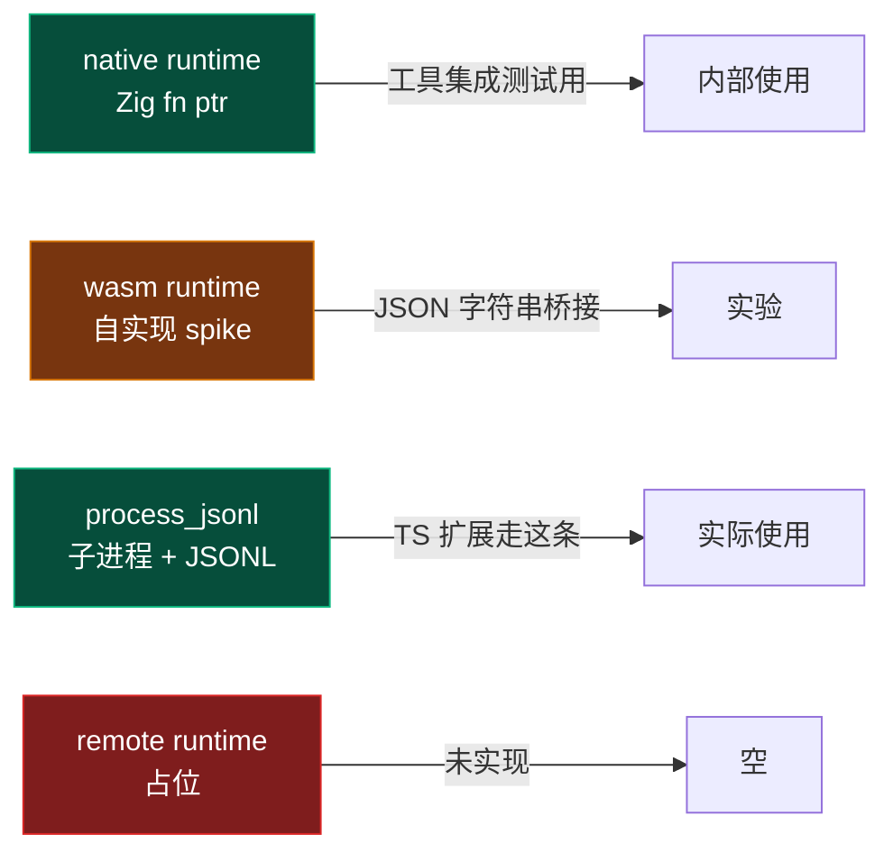
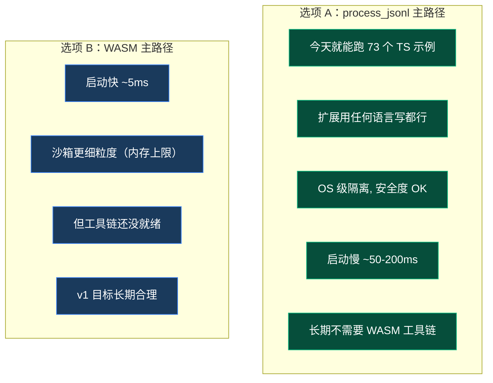
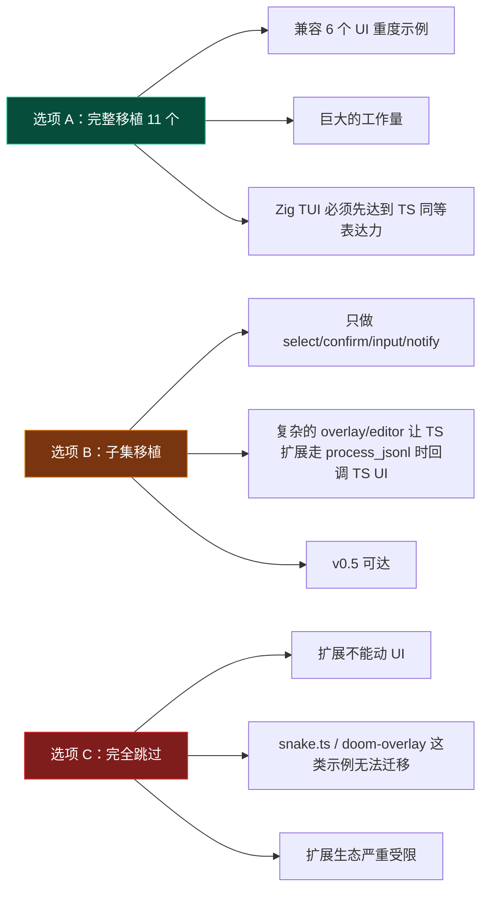
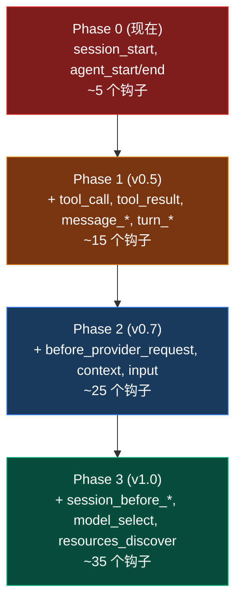
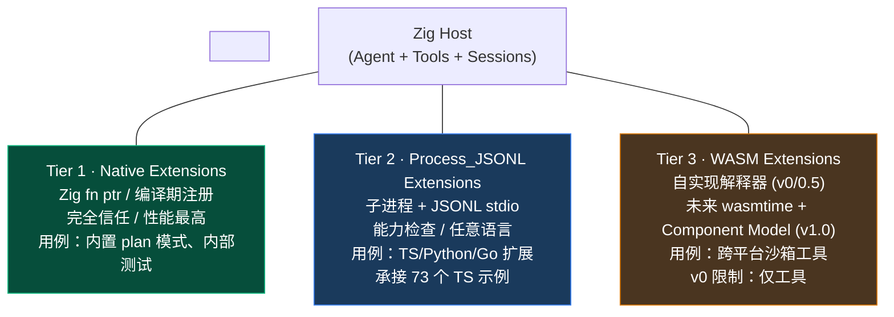
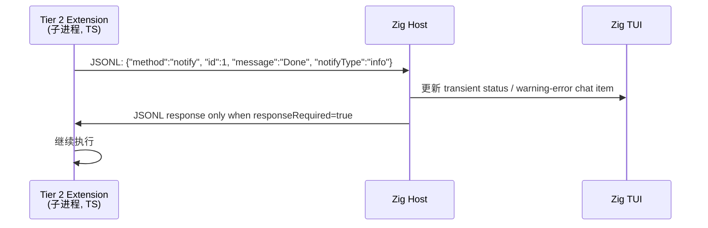
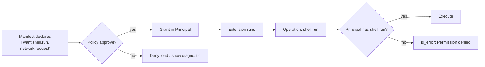

# 扩展系统设计研究

> 这份文档不是普通的模块卷宗——它是**前瞻设计文档**。
>
> 一半描述：TS 端的扩展系统已经成熟（73 个示例、35+ 钩子、11 个 UI 方法），是必须继承的规格。
> 一半决议：Zig 端的扩展系统应该长什么样、按什么顺序构建、哪些设计决议已经落地到 Phase 1。
>
> **整本书的"骨架完成"以这份文档为准。**所有未来的上层功能（plan 模式、子 agent、自定义 provider、TUI 游戏插件）都建立在这套机制上。

## §0 · 这份文档要解决的问题

用户原话：

> "核心是这个扩展的设计，即如何去实现它。类似于 TS 版具有的扩展能力，而我们是用 Zig 实现的，所以这一部分我们需要好好研究。后续在扩展的基础上，我们还要在做更多上层功能的开发，所以这个东西需要仔细研究出来。"

翻译成工程问题：

1. **现状盘点**：TS 端扩展系统是什么形状？它支持什么？73 个示例覆盖哪些场景？
2. **差距识别**：Zig 端目前实现了多少？还差什么？
3. **设计提案**：Zig 端应该如何在保持身份（native 性能 + C ABI 友好）的同时，承接 TS 端那个庞大的扩展生态？
4. **路线图**：从 v0.1 草案到 v1.0 冻结，分几步？每一步的产出是什么？

---

## §1 · 继承一份成熟的规格：TS 端的扩展表面

### 1.1 TS 扩展能做什么——按能力分类

| 类别 | 代表能力 | 对应的 TS API |
| --- | --- | --- |
| **工具注册** | 注册 LLM 可调的工具 | `registerTool(def)` |
| **工具拦截** | 在执行前/后修改/拦截 | `on('tool_call')`, `on('tool_result')` |
| **生命周期钩子** | 35+ 事件钩子 | `on(eventName, handler)` |
| **UI 交互** | 11 种弹层/对话/编辑器 | `ctx.ui.{select, confirm, input, custom, ...}()` |
| **斜杠命令** | 自定义 `/command` | `registerCommand(name, handler)` |
| **键盘绑定** | 注册快捷键 | `registerShortcut(key, handler)` |
| **CLI 标志** | 自定义命令行 flag | `registerFlag(name, type)` |
| **Provider 扩展** | 添加 LLM provider | `registerProvider(name, config)` |
| **子 Agent 委派** | 创建有界子 agent | `createSubAgentExtension()` |
| **跨扩展通信** | 事件总线 | `pi.events.emit/on()` |
| **会话状态** | 持久化自定义数据 | `appendEntry(type, data)` |
| **消息渲染** | 自定义消息类型显示 | `registerMessageRenderer(type, fn)` |

**总计**：8 个 API 注册点 + 35+ 事件钩子 + 11 个 UI 方法 = **约 54 个独立扩展点**。

### 1.2 35+ 生命周期钩子的全貌

```mermaid
flowchart TB
    classDef session fill:#1a3a5c,stroke:#3b82f6,color:#fff
    classDef agent fill:#4a3520,stroke:#d97706,color:#fff
    classDef tool fill:#064e3b,stroke:#10b981,color:#fff
    classDef provider fill:#2d1b3d,stroke:#a855f7,color:#fff
    classDef ui fill:#7c2d12,stroke:#ea580c,color:#fff

    SS[session_start<br/>session_before_switch<br/>session_before_fork<br/>session_before_compact<br/>session_compact<br/>session_shutdown<br/>session_before_tree<br/>session_tree]:::session

    AG[before_agent_start<br/>agent_start<br/>agent_end<br/>turn_start<br/>turn_end<br/>message_start<br/>message_update<br/>message_end<br/>model_select<br/>thinking_level_select]:::agent

    TL[tool_call<br/>tool_result<br/>tool_execution_start<br/>tool_execution_update<br/>tool_execution_end<br/>user_bash<br/>input]:::tool

    PR[before_provider_request<br/>after_provider_response<br/>context]:::provider

    UI[resources_discover<br/>(UI events through ctx.ui)]:::ui
```

钩子按"语义阶段"分四组：

| 组 | 数量 | 用途 |
| --- | --- | --- |
| Session lifecycle | 8 | 会话切换、fork、compact、tree 操作 |
| Agent / Message | 10 | Agent 与 LLM 对话生命周期 |
| Tool execution | 7 | 工具执行的所有阶段 + 输入拦截 |
| Provider / Context | 3 | LLM 请求/响应/消息上下文修改 |
| Resources | 1 | 启动时贡献 skill/prompt/theme |

**钩子调用语义**（关键，Zig 必须复刻）：

- **顺序**：按扩展注册顺序串行调用
- **异步**：每个 handler 被 await 完成才走下一个
- **错误隔离**：handler 异常不影响其他扩展，仅记录日志
- **结果链式**：某些钩子（`context`、`tool_call`）后续 handler 看到前一 handler 的修改
- **可取消**：某些"before_X"钩子可以返回 `{ cancel: true }` 短路操作

### 1.3 73 个示例的"广度证据"

73 个示例聚成 18 个类别，证明**扩展不是玩具**——它实际承担了产品级功能：

| 类别 | 数量 | 关键代表 |
| --- | --- | --- |
| 工具注册 / 覆盖 | 7 | `dynamic-tools`, `tool-override` |
| 工具拦截 / 守卫 | 6 | `permission-gate`, `confirm-destructive`, `protected-paths` |
| Provider 扩展 | 3 | `custom-provider-anthropic`, `custom-provider-gitlab-duo` |
| 子 Agent 委派 | 1 | `subagent/` |
| UI 弹层 / 编辑器 | 7 | `modal-editor`, `rainbow-editor`, `custom-header` |
| 消息渲染 | 4 | `message-renderer`, `structured-output` |
| 会话状态 / 导航 | 4 | `bookmark`, `git-checkpoint` |
| 系统提示 / 上下文 | 3 | `prompt-customizer`, `claude-rules` |
| 跨扩展通信 | 2 | `event-bus` |
| 模式覆盖 | 3 | `plan-mode/`, `minimal-mode` |
| 输入/输出变换 | 5 | `input-transform`, `provider-payload` |
| 状态显示 / 通知 | 4 | `status-line`, `model-status` |
| 命令 / CLI | 5 | `commands`, `qna`, `handoff` |
| 终端交互 | 4 | `interactive-shell`, `border-status-editor` |
| 流程守卫 | 3 | `dirty-repo-guard`, `auto-commit-on-exit` |
| **完整 TUI 游戏** | 4 | `snake`, `space-invaders`, `tic-tac-toe`, `doom-overlay/` |
| 测试 / 配套 | 6 | `rpc-demo`, `preset`, `with-deps/` |
| 单一用途 | 7 | `pirate`, `ssh`, `mac-system-theme` |

::: tip 一个值得回味的事实
**有 4 个示例是完整的 TUI 游戏**——`snake.ts`、`space-invaders.ts`、`tic-tac-toe.ts`、`doom-overlay/`。这证明扩展接口足够通用，可以承载**任意复杂的 TUI 应用**。这是好的扩展系统的标志：用户能"在它上面做你完全没想过的事"。
:::

---

## §2 · Zig 端：现在到了哪里

### 2.1 已实现 vs 缺失（按 TS 表面对照）

| TS 能力 | Zig 状态 | 详情 |
| --- | --- | --- |
| 工具注册 | ✅ 已实现 | `ExtensionRegistry.registerTool` 三种 runtime 都支持 |
| 工具的三个 export（metadata/schema/execute） | ✅ 已实现 | WASM v0 contract 验证通过 |
| 35 个事件钩子 | 🟡 Phase 1 下层已对齐 | 生产 native/session 路径已转发核心 lifecycle、message、tool、model、thinking、resource 事件；更高层产品事件仍后续分阶段 |
| 11 个 UI 方法 | 🟡 下层 bridge 已覆盖 | Phase 1 覆盖 `ctx.ui.notify` / `ctx.ui.setStatus` 的 JSONL/RPC 桥；select/confirm/input/custom 等完整产品 UI 不属于本阶段 |
| 自定义斜杠命令 | ❌ 缺失 | 计划在 MCP 风格 commands 里 |
| 键盘绑定 | 🟡 Phase 1 下层已接入 | 已注册且启用的 extension shortcuts 进入 Zig interactive input dispatch；产品级快捷键管理 UI 后续再做 |
| 自定义 CLI 标志 | 🟡 部分 | 有枚举式 ExtensionFlags，但不是动态的 |
| Provider 注册 | 🟡 部分 | 内部注册表存在；扩展 API 没暴露 |
| 子 Agent 委派 | 🟡 部分 | agent.spawn 框架存在；扩展 hook 没接 |
| 跨扩展事件总线 | ❌ 缺失 | 不属于 Phase 1 下层 parity |
| 工具自定义渲染 | ❌ 缺失 | TS 有 renderCall/renderResult |
| 消息渲染钩子 | ❌ 缺失 | 完全没有 |
| 会话持久化（appendEntry） | ✅ 已实现 | `SessionManager.appendCustomEntry` |
| 默认拒绝的能力检查 | ✅ 已实现 | 12 个 capability + Principal |
| WASM v0 工具 | ✅ 已实现 | 自实现解释器（spike），fixture 验证通过 |

**整体覆盖率：约 35%**——核心机制（注册表、能力、WASM 加载）有了，但**事件系统的覆盖度严重不足，UI 完全空白**。

### 2.2 三种 runtime 的当前形态



::: warning 实际状况
**`process_jsonl` 是当前唯一被实际使用的扩展运行时**——TS 写的扩展通过子进程跑。`native` 和 `wasm` 都是为未来准备的。这意味着如果要在 Zig 重写中保留 TS 扩展的 73 个示例，**短期路径只有 process_jsonl**。
:::

---

## §3 · 已锁的 5 条 RFC 决议

仓库 `zig/docs/wasm-extension-*.md` 和 `wasm-component-model-decision.md` 已经做了基础架构层的拍板：

| # | 决议 | 来源 | 含义 |
| --- | --- | --- | --- |
| **R-1** | 不用 Extism / 不用 Component Model（v0 阶段） | `wasm-component-model-decision.md` | 工具链不就位（jco / componentize-js / wasmtime 都不在 project-local），暂时用 JSON 字符串自实现 |
| **R-2** | 保留 Bun TS 扩展通路 | `wasm-extension-architecture-rfc.md` | 兼容性边界——TS 扩展不会被强制重写 |
| **R-3** | WASM v0 仅工具，无 UI / 命令 / provider | `wasm-extension-final-closure.md` | v0 的 wasm 只能注册工具，其他扩展点不开放 |
| **R-4** | 默认拒绝的 12 个 canonical grants | `wasm-extension-architecture-rfc.md` + 当前 schema/types | host 强制；manifest 只能"申请"，最终决定权在 host |
| **R-5** | v1 目标产物 = WASM Component + WIT | `wasm-component-model-decision.md` | 长期方向，v0 的 JSON 字符串只是过渡 |

::: info canonical grants 已经是 12 个
当前规范性 grant 词汇是：

`file.read`, `file.write`, `network.request`, `shell.run`, `env.read`, `model.call`, `session.read`, `session.write`, `ui.notify`, `tool.use`, `agent.spawn`, `agent.delegate`。

早期 RFC 里出现的 `network`、`shell`、`env`、`model`、`session` 等短名只保留为历史背景；manifest、policy、schema、diagnostic 都使用上面 12 个精确字符串。
:::

---

## §4 · D-7 到 D-12 的当前决议

R-1 ~ R-5 是基础决议；D-7 ~ D-12 是 Phase 1 下层 parity 的当前决议，已经作为已定边界记录。

### D-7 · 扩展机制的"主路径"是 process_jsonl 还是 WASM？



**当前决议：双轨并行，process_jsonl 是现阶段承接 TS 生态的主路径；WASM / WASM Component 是本地工具与未来 v1 authoring 方向。**

理由：

1. TS 端 73 个示例**必须能在 v0.5 跑**，否则迁移期生态会撕裂。WASM v0 限制（仅工具、无 UI）盖不住 TS 用例。
2. WASM 工具链投资（jco / componentize-js / wasmtime 集成）大；今天就投不划算，等 1-2 个真实 binding 落地再投。
3. process_jsonl 的实现已经在用，不需要新工作量。

### D-8 · UI 扩展表面到底要不要"完整移植"？

TS 有 11 个 UI 方法（dialog / overlay / editor / header / footer / 等）。这些深度依赖 TS TUI 库。Zig 有自己的 TUI（在 `zig/src/tui/`）。



**当前决议：Phase 1 只做下层 UI bridge parity，不做完整产品 UI 移植。**

具体：

- Phase 1 覆盖 `ctx.ui.notify` 和 `ctx.ui.setStatus` 的 request/response、status/footer 状态、severity、`responseRequired` 语义。
- select/confirm/input/custom/editor/widget/header/footer 等完整 TS 产品 UI 仍属后续产品层工作，不作为 Phase 1 validator。
- Web Simulator、Workflow/Wiki/QA/Review presets、marketplace、publisher/signing、remote package/runtime URL 均明确 deferred。

### D-9 · 35 个钩子要不要全实现？还是分阶段？



**当前决议**：分阶段递进；Phase 1 已覆盖下层 parity 所需的生产事件转发和已有 mutating hooks，后续再扩到完整产品表面。

### D-10 · 钩子签名

**当前决议**：保留统一事件订阅/分发面。不同 runtime 可以有自己的 adapter，但 wire/API 层使用一个事件 `type` 字段分发，payload 字段保持 TS 兼容。

### D-11 · 命名规则

**当前决议**：underscore 是 canonical API / wire spelling。规范事件名包括 `session_start`, `session_shutdown`, `resources_discover`, `before_agent_start`, `agent_start`, `agent_end`, `turn_start`, `turn_end`, `message_start`, `message_update`, `message_end`, `tool_call`, `tool_result`, `tool_execution_start`, `tool_execution_update`, `tool_execution_end`, `model_select`, `thinking_level_select`, `input`。

点号形式（如历史文案里的 `session.start`, `tool.call`）只可作为历史/概念分组标签出现，不能作为 manifest、JSONL、subscriber、schema 或测试中的规范 wire 名。

### D-12 · Tier 1 native 是否开放给第三方

**当前决议**：直接 native dynamic-library path authoring 不是 Phase 1 产品表面。Native runtime substrate 和 per-platform artifact selection 可用于受信任/本地 package authoring 与测试，但 marketplace、publisher/signing、remote distribution 以及“任意第三方直接给 dynamic library path”均 deferred。

---

## §5 · 推荐设计：三层扩展模型

把上面三个问题的答案合起来，扩展系统应该是这样：



### 5.1 三层的差异

| 维度 | Tier 1 (native) | Tier 2 (process_jsonl) | Tier 3 (wasm) |
| --- | --- | --- | --- |
| 安全度 | 无沙箱（编译期受控） | OS 进程隔离 | WASM 沙箱 |
| 性能 | 最快（纳秒） | 中（毫秒，IPC） | 中（毫秒，解释器） |
| 启动延迟 | 0 | 50-200ms（spawn） | 5-50ms（load） |
| 语言 | 只能 Zig | 任意 | 编译到 WASM 的 |
| 何时用 | 内置功能 / 性能关键 | 现有 TS 生态 / 多语言 | 跨平台 / 强沙箱需求 |
| 接口稳定性 | 编译期 | JSONL 协议 | WIT 契约 |

### 5.2 三层共用的"骨架"

不管哪一层，扩展都要回答**同样 4 个问题**：

```
1. 我是谁？               → ExtensionId, runtime_kind, package_root
2. 我想要什么权限？        → declared_capabilities (12 grants 的子集)
3. 我能干什么？            → registered_tools / hooks / commands / ...
4. 我什么时候被调用？      → 35 个生命周期钩子的订阅
```

这 4 个答案统一塞进一个 `ExtensionDescriptor` 数据结构，**三层 runtime 解析自己的产物（fn ptr / JSON / WASM 模块）填充这同一个 struct**。这样上层（Agent loop / Tool dispatcher）不用关心 runtime 类型——它只看 `ExtensionDescriptor`。

---

## §6 · 钩子分类与命名标准

35 个钩子按语义分组，但规范 API / wire 名称统一使用 underscore：

```
session_start, session_shutdown, session_before_compact, session_before_fork,
session_before_switch, session_before_tree, session_compact, session_tree
before_agent_start, agent_start, agent_end, model_select, thinking_level_select
turn_start, turn_end, message_start, message_update, message_end
tool_call, tool_result, tool_execution_start, tool_execution_update, tool_execution_end
input, user_bash, before_provider_request, after_provider_response, context
resources_discover
```

::: tip 命名规则
- **underscore 名称是规范 API / wire 名称**，例如 `tool_call`、`tool_result`、`session_start`。
- **点号名称只作概念分组/历史标签**，例如把 `tool_call` 归在 “tool.*” 组。
- **`*_before_*` / `before_*`** = 可取消或可修改的 pre-hook，返回 `{ cancel: true, reason }` 或兼容结果短路/修改
- **其他生命周期事件** = 通知性钩子，返回值忽略，除 `message_end` 等已定义 mutating hook 外不修改主流程
- **数据修改钩子** = 接受 mutable 引用，handler 修改后续 handler 见到的是新版
:::

### 6.1 钩子签名（C ABI 视角）

每个钩子最终落到 C ABI 上是这个统一形态：

```c
typedef int (*pi_hook_fn)(
    void*                 user_data,
    pi_hook_event_type_t  type,
    const pi_hook_event_t* event,    /* opaque, type-specific getters */
    pi_hook_result_t*      out_result /* nullable; for cancellable hooks */
);

pi_status_t pi_extension_subscribe(
    pi_extension_t*  ext,
    pi_hook_event_type_t type,
    pi_hook_fn       fn,
    void*            user_data
);
```

**一个回调函数处理所有事件类型**——通过 `type` 分发，通过 type-specific getter 拿数据。这避免在 C ABI 上炸出 35 个不同形状的回调签名。

---

## §7 · UI 扩展模型（下层 bridge 与产品 UI 分界）



**关键设计**：Phase 1 只验证下层 UI bridge。Zig host 接收 `extension_ui_request`，支持：

- `method: "notify"`，字段 `message`、`notifyType`，支持 `info` / `warning` / `error`
- `method: "setStatus"`，字段 `statusKey`、`statusText`，可设置或清理 keyed footer status
- `responseRequired: false` 时不发 response；`true` 时应用状态后发且只发一个与 `id` 对应的空成功 response

这不是完整产品 UI 移植。select/confirm/input/editor/custom overlay、Web Simulator、Workflow/Wiki/QA/Review presets、marketplace/signing/remote UI 都是后续产品层或分发层表面，不是 Phase 1 下层 parity 的完成判据。

---

## §8 · 能力边界（与 §6 of coding_agent 卷宗对齐）

扩展请求能力，host 决定是否授予：



**两次检查**：
1. **加载时**：manifest 的 canonical grant 请求与 host policy 的 `approved_grants` 求交，差集若非空则拒绝加载
2. **运行时**：每次工具/操作执行检查 Principal 是否有需要的 grant

**与 D-3 决议一致**：内置工具也走这套——内置 Principal 默认全 12 grant，host 可收紧。

规范 grant 集合固定为：

`file.read`, `file.write`, `network.request`, `shell.run`, `env.read`, `model.call`, `session.read`, `session.write`, `ui.notify`, `tool.use`, `agent.spawn`, `agent.delegate`。

---

## §9 · 五阶段路线图

| Phase | 版本 | 内容 | 完成判据 |
| --- | --- | --- | --- |
| **Phase 0** | 当前 | WASM v0 fixture 验证通过；process_jsonl 已经能跑 TS 扩展 | ✅ 已完成 |
| **Phase 1** | v0.2 | 生产 native/session event forwarding、`tool_call` / `tool_result` / message / turn / session / model / thinking / resource 事件、shortcut dispatch、`notify` / `setStatus` bridge | ✅ 下层 parity 已完成 |
| **Phase 2** | v0.5 | 更完整的 dialog/select/input/editor/custom UI 和产品级 extension UI 体验 | ⬜ deferred |
| **Phase 3** | v0.7 | 自定义斜杠命令产品表面、动态 Provider 注册产品化、事件总线 | ⬜ deferred |
| **Phase 4** | v1.0 | 35 个钩子全覆盖；wasmtime 集成 + WIT Component Model | ⬜ 大块工作（5-8 周） |

::: tip 关键里程碑
**Phase 1（v0.2）是真正的"扩展系统能用了"分水岭**——`tool_call` + `tool_result` 钩子让 `permission-gate`、`tool-override`、`confirm-destructive` 这一组拦截类扩展能跑，这是产品级的安全/治理基线；underscore 名称是规范 spelling。
:::

---

## §10 · D-7 到 D-12 当前状态

Phase 1 已按下列决议实现和验证：

| # | 当前状态 | Phase 1 结论 | 非 Phase 1 / deferred |
| --- | --- | --- | --- |
| **D-7** | 决定 | `process_jsonl` 承接 TS 生态；WASM/native substrate 并行用于本地 package/authoring | Remote runtime / hosted registry |
| **D-8** | 决定 | `ctx.ui.notify` / `ctx.ui.setStatus` 下层 bridge parity | Web Simulator、完整产品 UI、Workflow/Wiki/QA/Review presets |
| **D-9** | 决定 | 分阶段；Phase 1 覆盖核心 session/agent/message/tool/model/thinking/resource 事件 | 35+ 产品事件全覆盖 |
| **D-10** | 决定 | 一个事件分发表面 + `type` 分发；payload 保持 TS wire 兼容 | 多套互相不兼容 callback ABI |
| **D-11** | 决定 | `session_start` / `tool_call` 等 underscore 是 canonical API/wire 名称 | 点号 spelling 只作历史/概念标签 |
| **D-12** | 决定 | Native substrate 保留在受信任/本地 package 范围 | 第三方 direct dynamic-library path authoring、marketplace、publisher/signing、remote distribution |

---

## §11 · 下一步建议

按工作流排：

1. **保持 docs 与实现同步**——D-7 ~ D-12 已作为当前状态记录，不再作为未定前置事项。
2. **持续回填 RFC 文档**——所有规范性 capability 都使用 12 个 canonical grants。
3. **保持事件命名一致**——所有 API/wire/test 例子使用 underscore event names。
4. **后续产品层另立范围**——完整 UI、Web Simulator、marketplace、signing、remote distribution 不混入 Phase 1。
5. **验证 docs refresh**——用 source/doc inspection 和需要时的 `npm run check`，不增加浏览器、产品 runtime、marketplace、remote、credentialed gates。

---

## §12 · 这份文档与其他文档的关系

```mermaid
flowchart LR
    classDef rfc fill:#1a3a5c,stroke:#3b82f6,color:#fff
    classDef internals fill:#4a3520,stroke:#d97706,color:#fff
    classDef chapter fill:#064e3b,stroke:#10b981,color:#fff
    classDef this fill:#7c2d12,stroke:#ea580c,color:#fff

    R1[wasm-extension-*.md<br/>(已有 RFC)]:::rfc
    R2[wasm-component-model-decision.md]:::rfc
    I1[coding_agent 卷宗 §5]:::internals
    THIS[本文档<br/>extension-system.md]:::this
    C7[第 7 章 扩展机制<br/>(待写)]:::chapter

    R1 -->|被本文档引用| THIS
    R2 -->|被本文档引用| THIS
    I1 -->|被本文档引用| THIS
    THIS -->|提供概念基础| C7
    THIS -->|D-7~D-12 当前状态| Future[Phase 1 下层 parity]
```

---

::: info 文档状态
- 创建：2026-05-08
- 类别：前瞻设计研究（不是单纯的现状描述）
- 关联：所有 7 份 wasm-* RFC + coding_agent 卷宗 §5 + 设计决议 D-1~D-6
- 下一步：随实现继续同步 docs；产品 UI / marketplace / signing / remote surfaces 另行立项
:::
